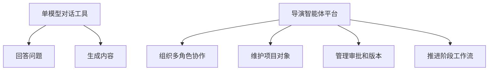
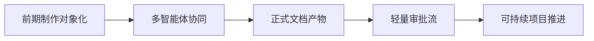

# 01. 总览：什么是 Movie Director Agent

## 这篇文档回答什么问题

本篇先回答三个最基础的问题：

1. 我们要做的到底是不是“会聊电影的 AI”。
2. 为什么要从 Hermes Agent 这类通用多智能体系统出发，而不是另起一套视频生成工具。
3. 这套系统的最小可落地目标、边界和价值是什么。

一句话定义：

**Movie Director Agent 不是单点创作工具，而是一套围绕电影项目运行的导演型智能体平台。**

它要能持续理解项目目标，协调多个专业角色，管理文档、版本、预算、排期、镜头与评审，并在不同制作阶段推动项目向前。

---

## 为什么不是“一个大模型 + 一个对话框”

传统电影制作不是单线程任务，而是一个高度组织化的系统工程：

- 有长期目标：从开发、筹备、拍摄、后期到交付
- 有多角色协作：导演、制片、编剧、摄影、美术、选角、副导演、剪辑、声音、视效
- 有严格对象：剧本、场景、角色、镜头、预算、排期、call sheet、版本、评审意见、交付包
- 有治理要求：谁能改、谁审批、什么算锁定、什么需要升级

这意味着真正有价值的系统，必须同时具备三类能力：

- 创作能力：能提出镜头、节奏、风格、对白、视觉方案
- 生产能力：能管理任务、资源、依赖、成本、风险和进度
- 治理能力：能做版本控制、审批流、决策留痕和知识沉淀

如果只有对话和生成，就很难承接正式制作。

---

## 为什么从 Hermes Agent 出发

Hermes Agent 已经不是一个单纯的聊天壳，它有几个非常关键的基础底座：

- `run_agent.py` 中的 `AIAgent` 负责主循环、工具调用和多轮收敛
- `model_tools.py` + `tools/registry.py` 提供统一的工具发现、分发和可用性检查
- `tools/delegate_tool.py` 提供受控的子智能体委派机制
- `agent/memory_manager.py`、`tools/memory_tool.py`、`tools/session_search_tool.py` 提供跨轮记忆和会话检索
- `agent/skill_commands.py` 和 `tools/skills_tool.py` 提供技能注入与可组合工作法
- `tools/file_tools.py`、`tools/terminal_tool.py`、工作目录语义让系统可以生成并维护真实产物
- `gateway/session.py` 说明 Hermes 已经具备会话上下文与跨平台入口能力

这让 Hermes 天然适合被改造成“项目型智能体平台”。

也就是说，我们不是从零做电影 AI，而是在一个已经具备：

- 主控智能体
- 子智能体
- 工具系统
- 记忆系统
- 会话系统
- 文件与工作区系统

的底座上，做行业化升级。

---

## 目标系统的基本定位

Movie Director Agent 平台应当承担四层职责。

### 1. 项目主控层

由“导演主智能体”持续维护项目意图、风格目标、阶段状态和优先级。

### 2. 专业协作层

由多个子智能体承担编剧分析、分镜、预算、排期、选角、勘景、摄影语言、后期协调等职责。

### 3. 对象与流程层

把剧本、场景、镜头、预算、排期、审批、交付等都建成正式对象，并用状态机推进。

### 4. 执行与治理层

通过工具、工作区、artifact、版本、审核和日志，让每个结果都可追踪、可审阅、可复用。

---

## 核心收益

如果做对，这套系统带来的不是“多生成一点内容”，而是以下收益：

- 把零散创作行为升级成项目级工作流
- 让导演意图在多个部门之间持续对齐
- 让前期筹备、拍摄执行、后期审片形成同一套状态面板
- 让 AI 输出从临时文本，变成可治理、可交付的正式产物
- 让 Hermes Agent 从通用工作流系统，进入电影制作操作系统方向

---

## 不应该一开始就追求什么

为了避免方向失焦，第一阶段不建议把目标设成：

- 直接自动生成整部高质量电影
- 一步到位覆盖所有剧组岗位
- 一开始就重建完整 DCC / NLE / VFX 工具链
- 用单一大模型替代所有创作和管理角色

第一阶段应该优先做的是：

- 让导演主智能体拥有稳定的项目视图
- 让前期制作对象体系先跑起来
- 让多智能体协作和审批流可用
- 让核心文档产物真正可沉淀

---

## 最小落地路径

从落地难度和收益比看，最合理的起步顺序是：

1. 先做前期制作和项目管理，而不是直接做视频生成闭环。
2. 先让剧本、breakdown、预算、排期、镜头计划这些文本和结构化对象跑起来。
3. 再逐步接入静态分镜、风格参考、资产包、日拍计划、dailies 评审。
4. 最后再向拍摄现场执行、后期版本与发行交付扩展。

---

## 这套文档后续怎么读

如果你是第一次进入这套方案，建议按以下顺序继续：

1. [02-current-project-mapping.md](./02-current-project-mapping.md)
2. [03-target-architecture.md](./03-target-architecture.md)
3. [04-production-phases.md](./04-production-phases.md)
4. [05-agent-system.md](./05-agent-system.md)
5. [06-data-models.md](./06-data-models.md)
6. [07-tools-memory-skills.md](./07-tools-memory-skills.md)
7. [08-roadmap.md](./08-roadmap.md)

---

## 一句话总结

**Movie Director Agent 的目标不是生成一段“像电影”的内容，而是让 Hermes Agent 具备管理一部电影项目的能力，并把创作、生产、治理三件事放进同一个多智能体系统。**

---

## 相关文档

- [02-current-project-mapping.md](./02-current-project-mapping.md)
- [03-target-architecture.md](./03-target-architecture.md)
- [04-production-phases.md](./04-production-phases.md)
- [05-agent-system.md](./05-agent-system.md)
- [61-project-object-system-overview.md](./61-project-object-system-overview.md)
- [99-hermes-agent-ai-film-operating-system-overview.md](./99-hermes-agent-ai-film-operating-system-overview.md)
