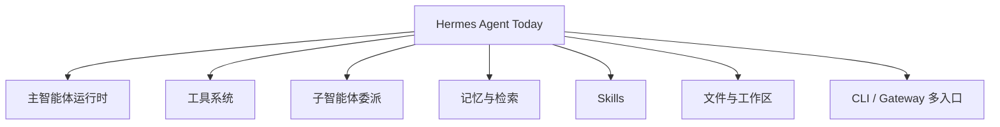
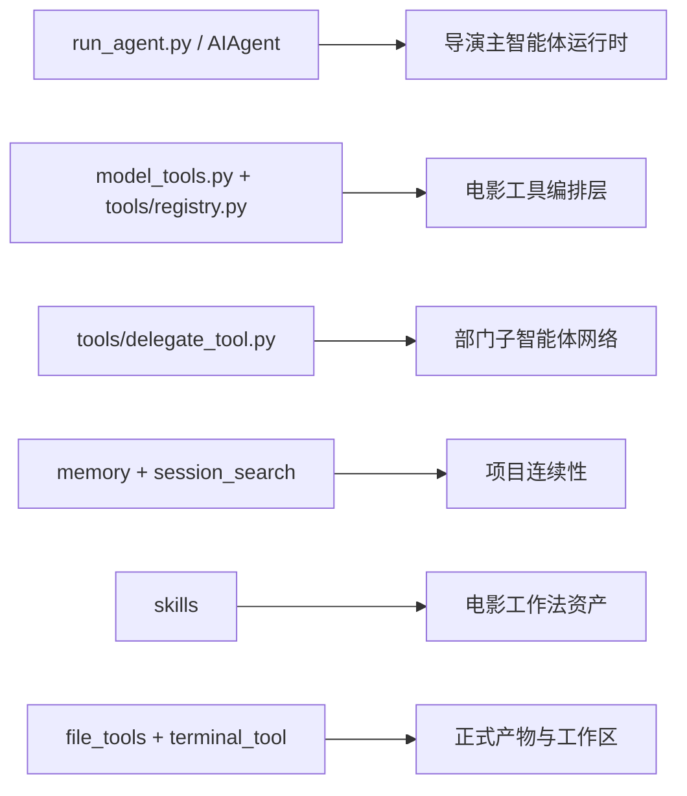
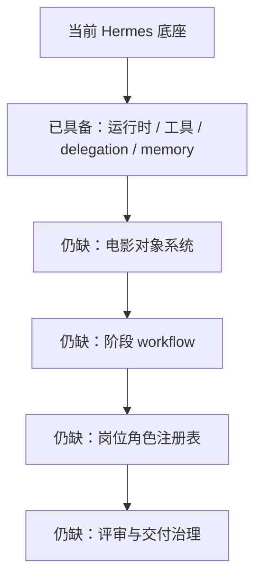

# 02. 当前项目映射：Hermes Agent 已经有什么

## 这篇文档回答什么问题

在设计电影导演智能体之前，先看清楚当前仓库已经具备什么能力、哪些可以直接复用、哪些还只是底座而不是完整方案。

本篇的目标不是逐行解读源码，而是建立一个“能力对照表”：

- Hermes 现在是什么
- 它离电影项目平台还差什么
- 哪些模块可以作为改造入口

---

## 一、Hermes 当前更像什么

从代码结构看，Hermes Agent 当前更像一套通用多智能体工作流系统，而不是单功能聊天助手。

它已经具备以下主干：

- 主智能体运行时
- 工具注册与工具集编排
- 子智能体委派
- 记忆与会话检索
- 技能注入
- 文件与终端执行
- CLI / Gateway 多入口

这说明它天然适合承接行业化场景。

---

## 二、核心模块与电影平台的映射

## 1. 主循环与导演主智能体

`run_agent.py` 中的 `AIAgent` 是当前系统最重要的运行时入口。

它负责：

- 接收用户输入
- 拼装 system prompt 和 messages
- 选择可用工具
- 处理工具调用结果
- 持续迭代直到产出最终回答

对电影场景而言，它可以直接演进成：

- 导演主智能体的运行时
- 电影项目线程的控制器
- 各阶段工作流的统一调度入口

也就是说，导演主智能体未必需要另起一套执行框架，很多能力可以直接建立在 `AIAgent` 上。

## 2. 工具注册与部门能力扩展

`model_tools.py` 和 `tools/registry.py` 提供了统一的工具发现、过滤和分发机制。

现在 Hermes 的工具已经覆盖：

- Web 检索
- 终端与进程
- 文件读写与 patch
- 图像分析与图像生成
- Browser 自动化
- Session 搜索
- Memory
- Todo
- Delegation

映射到电影场景后，这一层可以自然扩展为：

- 剧本解析工具
- breakdown 生成工具
- 预算测算工具
- 排期编排工具
- shot list 生成工具
- 分镜资产生成与管理工具
- dailies 评审与发布包工具

重要的是，Hermes 已经解决了“工具如何被模型调用”这个共性问题。

## 3. 委派机制与专业子智能体

`tools/delegate_tool.py` 已经提供了受限的子智能体架构：

- 子智能体有独立上下文
- 子智能体可使用受限工具集
- 子智能体执行结束后只把摘要返回给父智能体
- 系统还对递归委派、共享 memory、交互型工具做了限制

这与电影制作的组织方式高度契合。

因为电影本来就是一个“主控 + 多部门专业单元”的结构：

- 导演主智能体负责总体判断
- 编剧分析智能体只负责剧本与人物
- 预算智能体只负责成本和资源测算
- 排期智能体只负责拍摄顺序和约束
- 选角智能体只负责演员候选与匹配

所以 Hermes 现有 delegation 机制不是旁枝能力，而是电影化改造的关键抓手。

## 4. 记忆、会话搜索与项目连续性

`agent/memory_manager.py`、`tools/memory_tool.py`、`tools/session_search_tool.py` 共同构成了当前的“长期连续性”底座。

它们解决的是：

- 如何把有价值信息写入记忆
- 如何在新一轮对话前预取上下文
- 如何跨 session 搜索历史讨论和结果

对电影项目来说，这非常重要，因为一个项目会跨越：

- 数周到数月的筹备
- 多轮剧本修改
- 多版本预算和排期
- 多次审片和返工

如果没有可控的项目记忆，导演智能体就会不断失忆。

## 5. Skills 与“专业工作法”

`agent/skill_commands.py` 和 `tools/skills_tool.py` 说明 Hermes 已经支持把一套结构化方法论作为 skill 注入。

这意味着我们未来可以把以下内容技能化：

- 剧本分析框架
- 角色人物弧线检查表
- 分镜设计规范
- 预算测算模板
- 拍摄现场日报模板
- 审片意见标准化格式

这样做的价值是：把“专业方法”从 prompt 临时发挥，升级成可管理的资产。

## 6. 工作区、文件和产物体系

`tools/file_tools.py`、`tools/terminal_tool.py` 以及当前工作目录语义，已经让 Hermes 具备操作真实文件系统的能力。

这对电影场景极其关键，因为电影项目不是只有聊天记录，还需要正式产物：

- 剧本版本
- breakdown 表
- 镜头计划
- moodboard
- review note
- 发布包说明

没有文件和 artifact 体系，就无法支撑真正的项目推进。

## 7. 会话上下文与多入口

`gateway/session.py` 说明 Hermes 已经在不同平台入口上维护会话来源、用户上下文和 session 元信息。

这为未来的电影项目协作预留了空间，例如：

- 导演在 CLI 中推进方案
- 制片在企业消息平台上查看预算摘要
- 部门负责人在群组线程里收到待审批事项

---

## 三、Hermes 已具备的优势

把当前仓库映射到电影导演智能体，会发现 Hermes 已经具备五个最难得的优势：

### 1. 不是单 agent，而是可以原生多 agent

很多“电影 AI”方案卡在这里只有一个万能助手，但 Hermes 已经可以做主控和子任务分发。

### 2. 不是只会生成，而是能执行流程

工具系统让它可以读写文件、检索资料、执行命令、处理状态。

### 3. 不是只看当前轮，而是能跨轮持续

记忆和 session 搜索让它具备项目纵向连续性。

### 4. 不是固定能力，而是可插拔扩展

工具、toolset、skill、插件、profile 这些机制都说明它适合行业扩展。

### 5. 不是单界面，而是能进不同协作入口

CLI、gateway、不同平台适配，让它有机会成为一个真实协作系统，而不仅是个人玩具。

---

## 四、当前缺的是什么

虽然底座很好，但它距离电影项目平台还有明显差距。

## 1. 缺少电影领域对象系统

现在 Hermes 主要以消息、工具调用和文件为中心，还没有正式的电影领域对象，例如：

- MovieProject
- ScriptVersion
- Scene
- Character
- BreakdownItem
- Budget
- Schedule
- ShotPlan
- ReviewRound
- ReleasePackage

没有对象系统，就很难让状态、审批和版本真正稳定。

## 2. 缺少阶段化工作流

当前运行时主要围绕“用户问一句，系统干一轮”。电影制作则要求：

- 阶段推进
- 里程碑切换
- 阻塞条件判断
- 审批门禁

这需要在线程级状态之上再建项目级 workflow。

## 3. 缺少面向部门的角色边界

虽然可以委派子智能体，但目前还没有“电影岗位模型”：

- 哪些角色常驻
- 哪些角色只在阶段内激活
- 哪些角色能决策，哪些只能建议

这需要在 delegation 之上，补一层行业角色注册表。

## 4. 缺少审片和交付治理

电影行业非常依赖正式版本流和审核流，而 Hermes 当前的治理还更偏通用开发助手。

未来需要补齐：

- review round
- approval state
- release candidate
- archive snapshot

## 5. 缺少行业模板和技能包

现在的 skill 更偏通用，而电影场景需要大量行业模板与表单结构。

---

## 五、最适合的改造入口

结合当前结构，最合理的电影化改造入口是：

1. 在 `AIAgent` 之上增加 movie 项目态，而不是重写 agent loop。
2. 在现有 registry / toolset 体系上增加 movie tools，而不是新造工具调度框架。
3. 在 `delegate_task` 之上增加电影角色注册表，而不是重做多智能体协议。
4. 在 memory / session_search 之上增加 movie memory 策略，而不是新造第二套记忆系统。
5. 在文件与 artifact 语义上叠加电影对象和目录规范，而不是只依赖聊天输出。

---

## 六、结论

当前 Hermes Agent 已经具备电影导演智能体平台最关键的底座能力：

- 主控运行时
- 多智能体委派
- 工具扩展机制
- 记忆与会话连续性
- 技能化方法注入
- 文件和工作区执行能力

它现在缺的不是“再多一个模型”，而是：

- 电影领域对象
- 电影流程状态机
- 电影角色体系
- 电影治理与交付机制

这也是后续文档的重点。

---

## 相关文档

- [03-target-architecture.md](./03-target-architecture.md)
- [10-source-mapping-agent-runtime.md](./10-source-mapping-agent-runtime.md)
- [11-source-mapping-subagents.md](./11-source-mapping-subagents.md)
- [12-source-mapping-state-and-config.md](./12-source-mapping-state-and-config.md)
- [71-lead-agent-transformation-plan.md](./71-lead-agent-transformation-plan.md)
