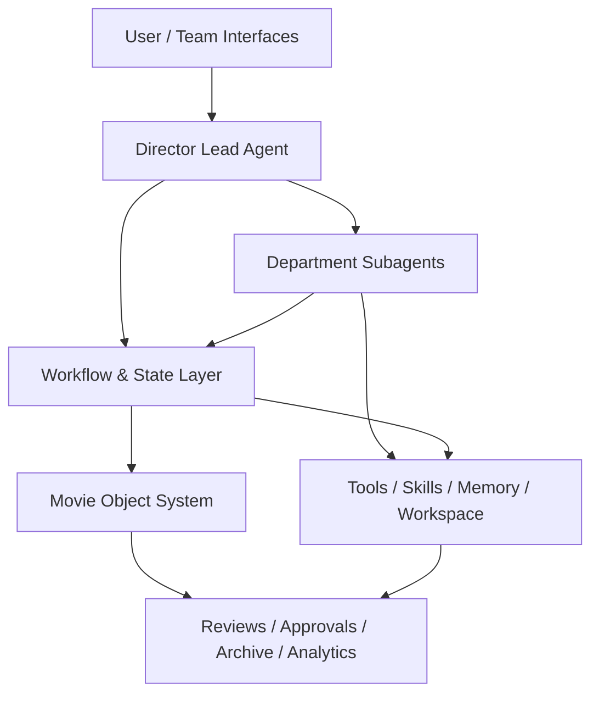
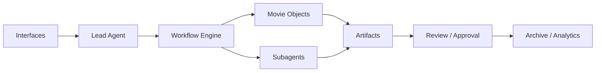
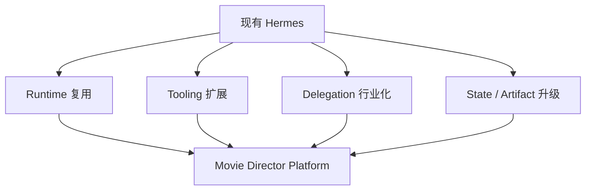

# 03. 目标架构：从通用多智能体到底演进成什么

## 这篇文档回答什么问题

前一篇讲的是 Hermes 现在有什么，这一篇讲目标形态：电影导演智能体平台最终应该由哪些层组成、层与层之间如何协同。

---

## 一、目标架构的设计原则

这套系统的目标不是“把所有能力塞进一个 agent”，而是建立一个分层清晰的平台。

设计原则建议如下：

- 主控与专业职责分离
- 项目对象先于自由对话
- 阶段状态先于临时任务
- 产物可追踪先于一次性回答
- 审批与升级流先于全自动执行
- 逐步扩展先于大一统重写

---

## 二、总体分层

可以把目标架构理解成六层。

## 1. 交互入口层

这一层包括 CLI、消息平台、未来的项目看板或 Web 工作台。

它的职责是：

- 接收请求
- 展示当前项目阶段和待办
- 分发审批项和 review 任务

Hermes 当前的 CLI 与 gateway 可以直接作为第一阶段入口。

## 2. 导演主智能体层

这是整个平台的“大脑”。

它负责：

- 持续理解项目目标
- 维护风格与创作意图
- 决定什么时候委派给专业角色
- 决定何时进入审批、冻结、返工或升级

这一层对应的核心运行时可以继续基于 `run_agent.py` 的 `AIAgent`。

## 3. 部门子智能体层

这是导演主智能体的专业执行网络。

它们不是彼此平级乱聊，而是围绕项目对象工作，例如：

- 编剧分析
- 镜头与分镜
- 预算与资源
- 排期与副导演调度
- 摄影与视觉语言
- 后期版本与交付

这一层最自然的实现入口是 `tools/delegate_tool.py` 的委派机制。

## 4. 工作流与状态层

这是电影平台真正区别于普通聊天代理的地方。

这一层负责：

- 当前处于哪个制作阶段
- 每个阶段需要哪些输入和输出
- 哪些对象已锁定
- 哪些风险未关闭
- 哪些事项必须审批后才能继续

可以把它理解成“项目控制面板”。

## 5. 电影对象系统层

这一层沉淀正式对象，而不是只依赖消息历史。

核心对象至少包括：

- 项目
- 剧本与版本
- 场景、角色、道具、地点
- 预算、资源、排期
- 镜头计划与分镜
- 评审、审批、发布包

对象层是后续 workflow、memory、review、analytics 的共同基础。

## 6. 执行与治理层

这一层包括：

- tools
- skills
- memory
- workspace
- artifacts
- review logs
- approvals
- archive snapshots

它让每个结论不只是语言，而是可落地的执行记录和正式产物。

---

## 三、一个更贴近电影项目的工作方式

目标架构不是让所有 agent 同时自由发挥，而是让系统按电影生产方式工作。

示意流程如下：

这意味着：

- 主智能体不是直接产出所有内容，而是组织内容生产
- 子智能体不是只回答问题，而是围绕对象创建和更新产物
- 审批不是附属物，而是阶段切换的前提条件

---

## 四、目标架构中的关键能力簇

## 1. 项目主控能力

需要回答：

- 电影项目当前目标是什么
- 当前阶段是什么
- 当前最关键阻塞是什么
- 需要哪些部门并行推进

## 2. 领域建模能力

需要回答：

- 一段剧本如何被拆成 scene / character / location / prop / effect / resource
- 一个镜头计划如何和预算、场景、拍摄日绑定
- 一个 review note 如何映射回对象修订

## 3. 协同编排能力

需要回答：

- 什么时候应该委派给哪个角色
- 哪些任务可以并行
- 哪些变更会影响其他对象

## 4. 治理与版本能力

需要回答：

- 什么算草稿
- 什么算锁定
- 谁能批准
- 如何回滚
- 如何做发布快照

## 5. 观测与评估能力

需要回答：

- 成本是否在控制内
- 进度是否偏离
- 返工率高不高
- 哪类任务最消耗 token / 人力 / 时间

---

## 五、与现有 Hermes 的衔接方式

目标架构不建议采取“推倒重写”策略，而建议做四类增量演进。

### 1. Runtime 复用

继续复用 `AIAgent` 主循环，只在 system prompt、状态装载、工具集和委派策略上增强。

### 2. Tooling 扩展

继续复用 `model_tools.py`、`toolsets.py`、`tools/registry.py`，新增 movie toolset 和领域工具。

### 3. Delegation 行业化

继续复用 `delegate_task`，但在上层加入电影角色注册表、任务契约和阶段激活规则。

### 4. State / Artifact 系统升级

在现有 memory、session、file workspace 基础上，引入 movie project state 与 artifact taxonomy。

---

## 六、第一阶段推荐架构边界

如果按 MVP 思路推进，第一阶段推荐只做以下闭环：

- 导演主智能体
- 4 到 6 个关键子智能体
- 前期制作对象系统
- 轻量工作流状态机
- 文档产物和审批流

不建议一开始就覆盖：

- 拍摄现场 IoT / 设备联动
- 完整 DCC 软件深度集成
- 全自动视频大模型流水线
- 复杂商业发行系统

---

## 七、结论

目标架构的本质，是在 Hermes Agent 之上补齐三块当前最缺的层：

- 电影对象层
- 阶段工作流层
- 治理与交付层

当这三层补上后，Hermes 才会从“通用多智能体工作流系统”真正演进成“电影导演智能体平台”。

---

## 相关文档

- [05-agent-system.md](./05-agent-system.md)
- [13-system-blueprint.md](./13-system-blueprint.md)
- [61-project-object-system-overview.md](./61-project-object-system-overview.md)
- [67-workflow-state-machine-design.md](./67-workflow-state-machine-design.md)
- [71-lead-agent-transformation-plan.md](./71-lead-agent-transformation-plan.md)
- [105-hermes-agent-future-reference-architecture.md](./105-hermes-agent-future-reference-architecture.md)
