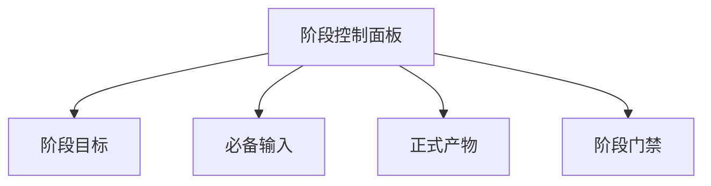
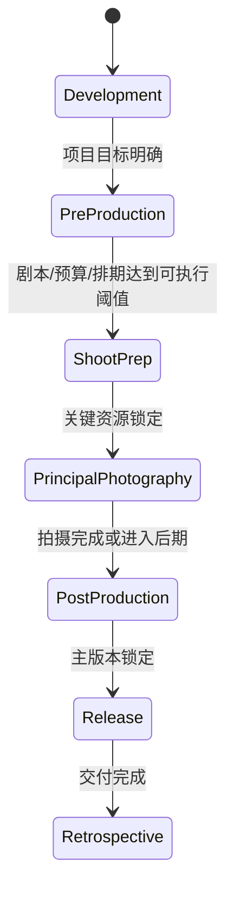
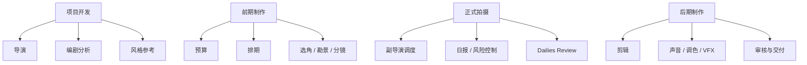

# 04. 电影制作阶段设计：系统如何跟着项目推进

## 这篇文档回答什么问题

电影平台最容易做错的一点，是把所有能力都做成平铺工具集合，却没有阶段意识。

但电影制作本质上是阶段驱动的。不同阶段：

- 目标不同
- 参与角色不同
- 输入输出不同
- 风险不同
- 审批机制不同

所以本篇要回答的是：平台应该如何按电影生产阶段组织工作流。

---

## 一、推荐的阶段划分

建议第一版将项目分为六个大阶段：

1. 项目开发
2. 前期制作
3. 拍摄准备
4. 正式拍摄
5. 后期制作
6. 发行与复盘

这样的粒度兼顾了业务真实度和系统可实现性。

---

## 二、各阶段的核心目标

## 1. 项目开发

目标：

- 明确题材、受众、预算级别、风格方向
- 形成剧本开发路线
- 建立项目基本约束

关键产物：

- 项目简介
- logline / premise
- 版本中的故事大纲
- 风格参考包
- 风险初判

系统重点：

- 导演主智能体和编剧分析智能体协作
- 建立项目对象最初版本
- 记录创作意图，不急着做细节执行

## 2. 前期制作

目标：

- 锁定剧本方向
- 完成 breakdown
- 完成预算初版和排期初版
- 明确选角、地点、服化道、视效、镜头策略

关键产物：

- 剧本锁稿候选版本
- breakdown sheet
- budget v1
- schedule v1
- casting shortlist
- location shortlist
- shot list / storyboard 草稿

系统重点：

- 多子智能体并行工作
- 风格、预算、资源之间做约束对齐
- 开始引入审批门禁

## 3. 拍摄准备

目标：

- 把前期方案转成可执行拍摄计划
- 锁定优先级、资源配置和拍摄日节奏
- 让部门在同一执行面板上工作

关键产物：

- 拍摄计划锁定版
- call sheet 模板
- 日拍目标
- 部门准备清单
- 风险和 fallback 方案

系统重点：

- 副导演 / 制片向的调度系统开始变重要
- 所有对象需要具备“是否已锁定”的状态

## 4. 正式拍摄

目标：

- 每天按计划完成镜头
- 处理天气、演员、场地、设备等现场变化
- 维持成本、效率和创作质量的平衡

关键产物：

- call sheet
- daily progress
- cost variance
- dailies review note
- reshoot / pickup 候选

系统重点：

- 从“方案生成”切换到“执行控制”
- 强依赖状态更新、风险升级和现场协调

## 5. 后期制作

目标：

- 管理剪辑、声音、调色、VFX 等版本流
- 控制评审节奏和返工优先级
- 收敛成正式发布版本

关键产物：

- cut versions
- review round notes
- ADR / music / sound 清单
- color / VFX delivery 状态
- final release package

系统重点：

- 版本与审批成为主线
- review note 需要能映射回对象与任务

## 6. 发行与复盘

目标：

- 形成交付包和宣发资产
- 汇总项目经验
- 沉淀可复用知识

关键产物：

- 发布包
- 市场物料
- 项目复盘
- 知识库条目

系统重点：

- 从“执行”转向“沉淀”
- 为下一部项目积累风格、流程和模板资产

---

## 三、每个阶段都需要的四类控制信息

不管项目走到哪一阶段，系统都应该维护四类核心状态：

- 当前阶段目标
- 当前阶段的必备输入
- 当前阶段的正式产物
- 进入下一阶段的门禁条件

建议将其沉淀到线程级或项目级 state 中。

---

## 四、阶段切换不是聊天，而是状态机

电影平台里的“进入下一阶段”不应该只是用户说一句“现在开始拍摄吧”。

更合理的机制是：

1. 系统检查当前阶段必备对象是否齐全。
2. 系统检查是否存在未关闭阻塞。
3. 系统检查需要审批的对象是否已批准。
4. 满足条件后，更新项目阶段并激活新的角色与工具。

一个简化状态机可以是：

---

## 五、不同阶段激活不同角色

阶段化设计还有一个重要意义：控制 agent 和 tool 的激活范围。

例如：

- 项目开发：重点激活导演、编剧分析、风格参考
- 前期制作：重点激活预算、排期、选角、勘景、分镜
- 正式拍摄：重点激活副导演调度、日报、dailies review、风险控制
- 后期制作：重点激活剪辑、声音、调色、VFX、审核与交付

这样可以减少上下文噪音，也让角色职责更清晰。

---

## 六、对 Hermes 的实现启发

阶段化工作流对 Hermes 的直接要求包括：

- 给 `AIAgent` 增加 movie project state 装载逻辑
- 在 toolset 选择时引入阶段过滤
- 在 delegation 之前引入“当前阶段允许角色”的规则
- 在 artifact 输出后更新项目对象状态
- 在 review / approval 通过前阻止关键阶段切换

也就是说，阶段系统不是额外附属品，而是未来 movie 扩展的主干之一。

---

## 七、结论

电影导演智能体平台必须以阶段为组织单位。

只有当系统理解：

- 我们现在处于哪个阶段
- 这一阶段应该产出什么
- 哪些角色应该被激活
- 哪些门槛达成后才能往下走

它才真正具备“管理电影项目”的能力，而不只是“围绕电影话题提供帮助”。

---

## 相关文档

- [21-traditional-filmmaking-overview.md](./21-traditional-filmmaking-overview.md)
- [61-project-object-system-overview.md](./61-project-object-system-overview.md)
- [62-movie-thread-state-design.md](./62-movie-thread-state-design.md)
- [67-workflow-state-machine-design.md](./67-workflow-state-machine-design.md)
- [81-mvp-scope-definition.md](./81-mvp-scope-definition.md)
