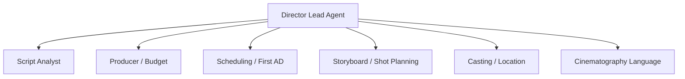
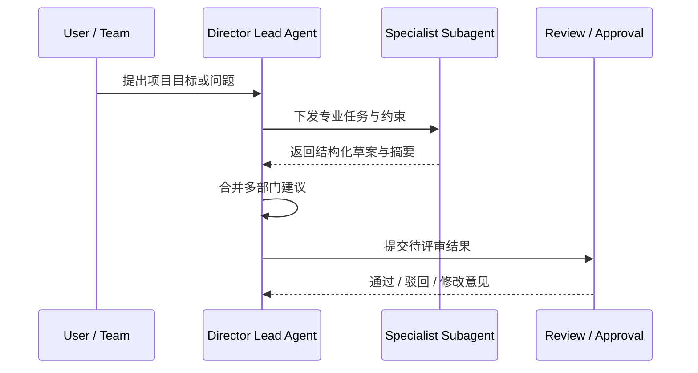
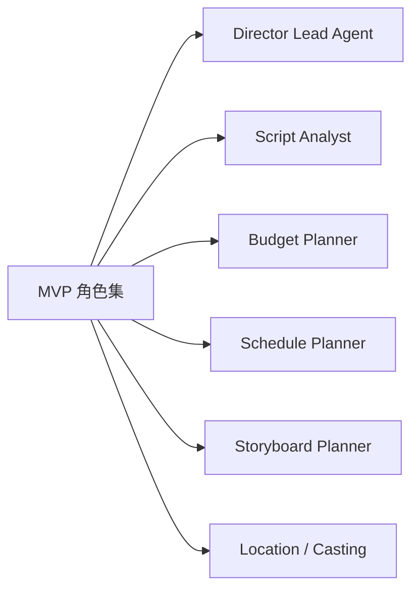

# 05. 智能体体系：导演主智能体与专业子智能体如何分工

## 这篇文档回答什么问题

电影项目不是一个 agent 单打独斗能稳定做好的事情。

本篇聚焦三件事：

1. 导演主智能体的职责是什么
2. 需要哪些专业子智能体
3. 它们如何通过 Hermes 的委派机制形成协作网络

---

## 一、为什么必须做角色化分工

电影制作天然是部门协作系统。导演负责总体创作与决策，但不会亲自完成所有预算、排期、勘景、剪辑版本管理。

如果把这些职责全部塞给一个 agent，会出现几个问题：

- 上下文过载
- 角色混乱
- 产出标准不稳定
- 决策和建议难以区分

因此，更合理的方式是：

- 一个主控导演智能体
- 多个专业子智能体
- 明确建议权、执行权、审批权边界

---

## 二、导演主智能体的职责

导演主智能体不是“什么都自己做”，而是负责：

- 维护项目总体意图
- 理解用户和团队的最高优先级
- 决定调用哪些角色
- 整合不同部门建议
- 判断是否需要审批、升级或返工
- 维护当前阶段的推进节奏

它在系统中扮演的是：

- 创作总负责人
- 项目调度中心
- 冲突裁决者
- 上下文守门人

这一层最自然地建立在 `AIAgent` 之上。

---

## 三、建议的第一批专业子智能体

第一阶段不需要覆盖所有岗位，建议先落最关键的一组。

## 1. Producer / Line Producer Agent

职责：

- 预算框架
- 资源配置
- 成本风险提示
- 可执行性校验

适合输入：

- 剧本版本
- breakdown
- 资源假设
- 制作规模目标

适合输出：

- budget 草稿
- 成本风险摘要
- 资源冲突提示

## 2. Script Analyst Agent

职责：

- 分析故事结构、角色弧线、主题一致性
- 标注场景目标、冲突、情绪变化
- 给 breakdown 和 shot planning 提供语义基础

## 3. Scheduling / First AD Agent

职责：

- 从 breakdown、资源和场景约束生成拍摄计划
- 识别演员档期、场地、天气、日夜戏等冲突
- 维护日拍优先级

## 4. Storyboard / Shot Planning Agent

职责：

- 把场景转成镜头组
- 输出镜头意图、景别、机位运动、节奏建议
- 给静态分镜和视觉参考生成提供结构化输入

## 5. Casting Agent

职责：

- 角色需求整理
- 演员候选与匹配度分析
- 角色组合与档期约束提示

## 6. Location Agent

职责：

- 场景需求与实景适配分析
- 地点锁定建议
- 场地限制和成本影响提示

## 7. Cinematography Language Agent

职责：

- 镜头语言和视觉风格统一
- 光线、镜头焦段、机位策略建议
- 与导演意图和后期需求做一致性校验

---

## 四、后续可扩展角色

当基础系统稳定后，可以再扩展：

- Art / Costume / Props Agent
- On-set AD Dispatch Agent
- Dailies Review Agent
- Editorial Agent
- Sound / ADR Agent
- Color Agent
- VFX Coordination Agent
- Release / Delivery Agent

这些角色不一定长期常驻，可以按阶段激活。

---

## 五、角色之间如何协同

建议采用“导演主控 + 子智能体提交建议”的模式，而不是子智能体之间直接无限对话。

基本流程可以是：

1. 导演主智能体定义任务与约束。
2. 通过 delegation 调用专业子智能体。
3. 子智能体围绕特定对象输出结构化结果。
4. 导演主智能体汇总冲突、做最终判断。
5. 必要时进入 review / approval。

这样做的好处是：

- 责任边界清晰
- 不容易出现多 agent 自我放大
- 更适合和正式项目状态对接

---

## 六、对 Hermes 委派机制的具体映射

`tools/delegate_tool.py` 当前的设计已经与这一模式高度契合：

- 子智能体有隔离上下文，适合承担专业任务
- 子智能体可限制工具集，适合角色化授权
- 父智能体只接收摘要，适合由导演主智能体做整合

在电影场景里，可以进一步增加以下约束：

- 每个角色默认 toolset
- 每个角色可读写的对象范围
- 每个阶段允许激活的角色列表
- 角色产出的标准化 schema

也就是说，我们不只是“多委派几个子任务”，而是把 delegation 变成正式角色系统。

---

## 七、角色边界设计原则

为了让角色体系稳定，建议遵守以下原则：

### 1. 主智能体保留最终判断权

部门智能体主要提供分析、草案和建议，不轻易直接修改高优先级锁定对象。

### 2. 子智能体围绕对象工作

每个角色都应围绕正式对象输入输出，而不是只输出一段散文式建议。

### 3. 角色不求大而全

第一阶段宁可角色少，但边界清晰、质量稳定。

### 4. 阶段决定角色活跃度

不是所有角色都要长期常驻。这样可以控制上下文成本和调度复杂度。

---

## 八、建议的最小角色集

如果只做 MVP，建议第一批角色是：

1. Director Lead Agent
2. Script Analyst Agent
3. Producer / Budget Agent
4. Scheduling / First AD Agent
5. Storyboard / Shot Planning Agent
6. Location or Casting Agent

这已经足以支撑“前期制作闭环”的第一版平台。

---

## 九、结论

电影导演智能体系统的核心，不是“agent 越多越好”，而是：

- 导演主智能体负责全局与决策
- 专业子智能体负责部门视角与结构化产出
- 所有角色围绕正式对象和阶段状态协作

Hermes 现有的 `delegate_task` 已经给了我们实现这件事的关键基础，下一步要做的是把它行业化、角色化、对象化。

---

## 相关文档

- [52-director-lead-agent-design.md](./52-director-lead-agent-design.md)
- [53-producer-subagent-design.md](./53-producer-subagent-design.md)
- [54-script-analyst-subagent-design.md](./54-script-analyst-subagent-design.md)
- [61-project-object-system-overview.md](./61-project-object-system-overview.md)
- [67-workflow-state-machine-design.md](./67-workflow-state-machine-design.md)
- [73-subagent-registry-cinema-extension.md](./73-subagent-registry-cinema-extension.md)
