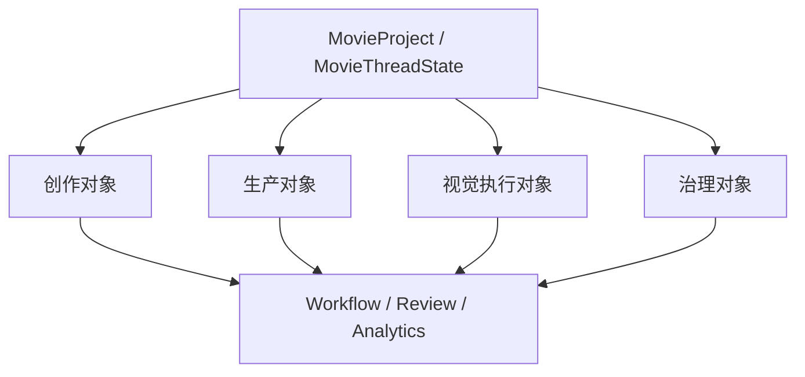
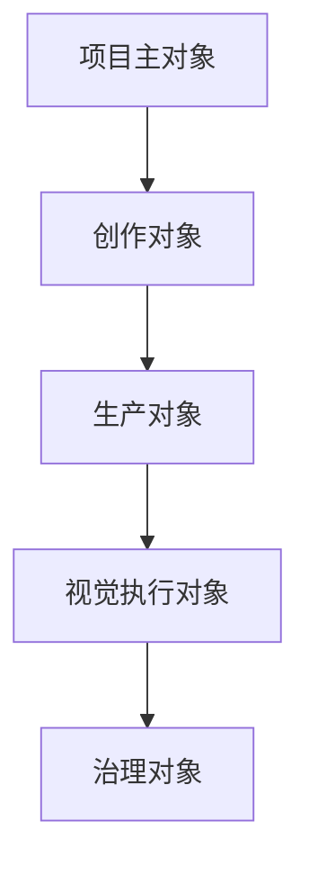
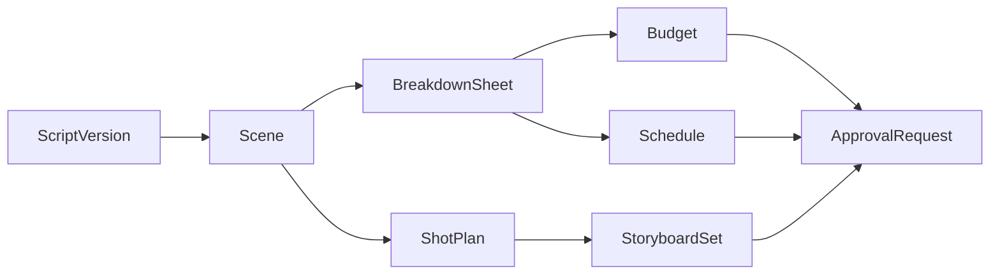
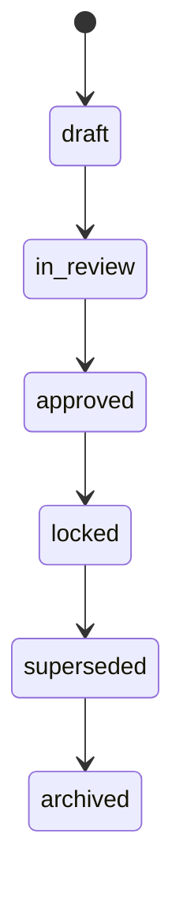

# 06. 数据模型：电影项目为什么必须先建立对象系统

## 这篇文档回答什么问题

如果没有正式对象系统，电影平台就会退化成“很多聊天记录 + 一堆散落文件”。

这会带来三个问题：

- 不知道哪个版本是当前正式版本
- 不知道哪些建议已经进入执行
- 不知道阶段、审批、风险到底挂在哪个对象上

因此，Movie Director Agent 平台必须先有对象系统。

---

## 一、对象系统的目标

对象系统不是为了“数据库设计而设计”，而是为了支撑以下能力：

- 项目长期连续性
- 多角色协同
- 阶段状态机
- 版本与审批
- artifact 追踪
- 复盘和知识沉淀

换句话说，对象系统是 workflow、memory、review、analytics 的共同底座。

---

## 二、建议的对象分层

建议把电影对象分成五层。

## 1. 项目主对象

核心对象：

- `MovieProject`
- `MovieThreadState`

它们负责承接：

- 项目名称、目标、题材、受众
- 当前阶段
- 当前锁定版本
- 活跃风险
- 活跃角色
- 当前里程碑与阻塞

这一层相当于项目控制面板。

## 2. 创作对象

核心对象：

- `ScriptDocument`
- `ScriptVersion`
- `Scene`
- `Character`
- `ThemeNote`
- `StyleReference`

它们描述“这部片要讲什么、怎么讲、风格是什么”。

## 3. 生产对象

核心对象：

- `BreakdownSheet`
- `Budget`
- `Schedule`
- `ResourcePlan`
- `CastingPackage`
- `LocationPackage`

它们描述“这部片如何被执行”。

## 4. 视觉执行对象

核心对象：

- `ShotPlan`
- `Shot`
- `StoryboardSet`
- `Moodboard`
- `PromptPack`

它们描述“创作意图如何转成镜头和视觉方案”。

## 5. 治理对象

核心对象：

- `ReviewRound`
- `ApprovalRequest`
- `DecisionLog`
- `ReleasePackage`
- `ArchiveSnapshot`

它们描述“项目如何被审阅、批准、发布和归档”。

---

## 三、最小核心对象建议

如果只做第一阶段，建议先把下面这些对象正式化。

## 1. MovieProject

建议字段：

- `project_id`
- `title`
- `logline`
- `status`
- `phase`
- `target_budget_band`
- `target_release_window`
- `creative_intent_summary`
- `active_script_version_id`
- `active_schedule_id`
- `active_budget_id`

## 2. MovieThreadState

建议字段：

- `project_id`
- `current_phase`
- `phase_goals`
- `active_risks`
- `blocked_items`
- `pending_approvals`
- `active_agents`
- `working_set_object_ids`
- `latest_decisions`

这个对象尤其重要，因为它最适合作为 Hermes 线程态和电影项目态之间的桥梁。

## 3. ScriptVersion

建议字段：

- `script_version_id`
- `version_label`
- `status`，如 `draft` / `candidate_lock` / `locked`
- `source_path`
- `change_summary`
- `scene_ids`
- `review_status`

## 4. Scene

建议字段：

- `scene_id`
- `script_version_id`
- `slugline`
- `location_type`
- `day_night`
- `summary`
- `characters`
- `props`
- `special_requirements`
- `estimated_page_length`

`Scene` 是后续 breakdown、预算、排期、镜头设计的交汇点。

## 5. Character

建议字段：

- `character_id`
- `name`
- `description`
- `arc_summary`
- `casting_priority`
- `constraints`

## 6. BreakdownSheet

建议字段：

- `breakdown_id`
- `script_version_id`
- `scene_items`
- `resource_tags`
- `complexity_score`
- `owner`
- `status`

## 7. Budget

建议字段：

- `budget_id`
- `version_label`
- `topline_total`
- `department_lines`
- `assumptions`
- `risks`
- `status`

## 8. Schedule

建议字段：

- `schedule_id`
- `version_label`
- `shoot_days`
- `scene_order`
- `resource_constraints`
- `weather_or_location_risks`
- `status`

## 9. ShotPlan

建议字段：

- `shotplan_id`
- `scene_id`
- `creative_goal`
- `shots`
- `style_notes`
- `estimated_setup_complexity`
- `status`

## 10. ReviewRound / ApprovalRequest

建议字段：

- `review_id`
- `target_object_type`
- `target_object_id`
- `reviewers`
- `findings`
- `decision`
- `required_actions`

---

## 四、对象之间的关键关系

这些对象不是平铺的，它们存在强依赖链。

一个简化链路可以是：

这条链路说明：

- 上游对象一变，下游对象需要重新评估
- 审批不只是针对文本，而是针对对象版本

---

## 五、对象状态与版本建议

建议所有关键对象都具备统一状态语义，例如：

- `draft`
- `in_review`
- `approved`
- `locked`
- `superseded`
- `archived`

同时建议区分：

- 工作中版本
- 当前正式版本
- 已被替代版本

这样才能支撑真正的项目治理。

---

## 六、对象系统与 Hermes 的结合点

Hermes 当前已经有 session、memory、file、tool 和 delegation 机制，但缺少电影对象层。

最适合的结合方式是：

- 用 `MovieThreadState` 承接线程级项目状态
- 用工作区文件保存对象快照或源文档
- 用 memory 记录决策摘要、风险、偏好和阶段结论
- 用 tools 读写对象或基于对象生成 artifact
- 用 review / approval 机制推动对象状态切换

也就是说，对象系统不是替代 Hermes，而是让 Hermes 有“电影项目的骨架”。

---

## 七、第一阶段可接受的实现方式

第一阶段不一定要一次性建完整数据库。

可以接受的落地方式包括：

- 用结构化 JSON / YAML / Markdown frontmatter 先保存对象
- 用目录规范组织 artifact
- 用轻量 state loader 在 agent 启动时加载项目主对象

等对象稳定后，再逐步演进到更正式的存储模型。

---

## 八、结论

Movie Director Agent 平台必须优先建立对象系统，因为：

- 没有对象就没有稳定 workflow
- 没有对象就没有正式版本
- 没有对象就没有可治理的 review / approval

其中最值得优先落地的，是：

- `MovieProject`
- `MovieThreadState`
- `ScriptVersion`
- `Scene`
- `BreakdownSheet`
- `Budget`
- `Schedule`
- `ShotPlan`
- `ReviewRound`

这批对象足够支撑前期制作和后续扩展。

---

## 相关文档

- [61-project-object-system-overview.md](./61-project-object-system-overview.md)
- [62-movie-thread-state-design.md](./62-movie-thread-state-design.md)
- [63-script-scene-character-object-system.md](./63-script-scene-character-object-system.md)
- [64-budget-schedule-resource-object-system.md](./64-budget-schedule-resource-object-system.md)
- [66-review-approval-release-package-object-system.md](./66-review-approval-release-package-object-system.md)
