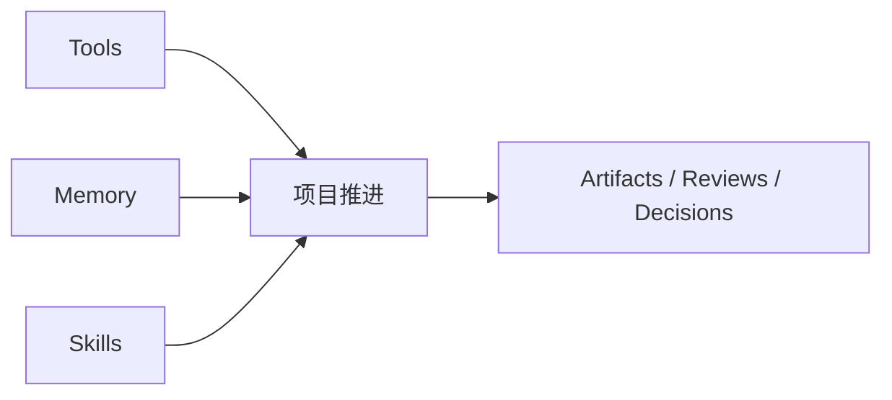
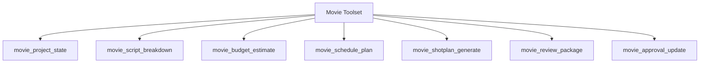
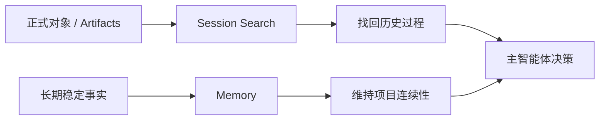
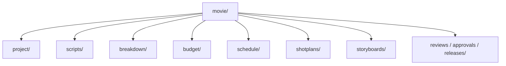

# 07. 工具、记忆与技能：如何把电影工作法装进 Hermes

## 这篇文档回答什么问题

当对象系统有了，下一步就是：导演智能体到底靠什么工作。

Hermes 当前最强的不是某一个模型，而是它已经有：

- 工具系统
- 记忆系统
- 技能系统
- 文件与工作区系统

本篇讨论如何把这些能力电影化。

---

## 一、为什么这一层很关键

如果没有 tools、memory、skills 的组合，系统很容易出现两个极端：

- 只有对象，没有执行力
- 只有 prompt，没有长期稳定方法

真正能落地的平台，需要这三者协同：

- Tools 负责做事
- Memory 负责连续性
- Skills 负责方法论复用



---

## 二、Movie Tools 应该长什么样

Hermes 当前已经通过 `model_tools.py`、`toolsets.py`、`tools/registry.py` 建立了标准工具扩展方式。

因此，movie 方向最合理的做法是新增 movie toolset，而不是再造一套调用框架。



### 建议的第一批 movie tools

## 1. `movie_project_state`

负责读取和更新项目主状态，例如：

- 当前阶段
- 活跃对象
- 活跃风险
- pending approvals

## 2. `movie_script_breakdown`

负责从剧本版本生成场景、角色、道具、特效、场地等 breakdown 草稿。

## 3. `movie_budget_estimate`

负责根据 breakdown、场景复杂度和资源假设输出预算草稿或成本变动分析。

## 4. `movie_schedule_plan`

负责根据场景、演员、地点和资源约束给出拍摄排期草稿。

## 5. `movie_shotplan_generate`

负责把场景转换成镜头组、镜头目标和拍摄复杂度。

## 6. `movie_review_package`

负责把某个对象或一组对象打包成 review 输入，包括摘要、版本差异和待评问题。

## 7. `movie_approval_update`

负责更新审批状态、记录审批意见和触发状态切换。

---

## 三、Movie Memory 应该记什么

不是所有内容都值得写入 memory。电影项目里，真正值得长期记住的通常是：

- 导演风格偏好
- 关键创作意图
- 已达成的项目级决策
- 长期存在的资源或现实约束
- 上一轮 review 的重要结论

而不一定要记住的内容包括：

- 临时草稿中的所有细节
- 尚未确认的开放式头脑风暴
- 可从对象文件重新计算的信息

### 推荐的记忆分层

## 1. 项目记忆

例如：

- 这部片的核心主题和禁区
- 风格基调与参考导演
- 预算上限和关键资源约束

## 2. 阶段记忆

例如：

- 本阶段目标
- 未关闭风险
- 最近一次评审结论

## 3. 个人偏好记忆

例如：

- 用户偏好的呈现格式
- 喜欢先出结构还是先出细稿

Hermes 当前的 `agent/memory_manager.py` 和 `tools/memory_tool.py` 已经能承接这类设计，但需要 movie 场景下的写入规则与优先级策略。

---

## 四、Session Search 在电影场景中的价值

`tools/session_search_tool.py` 在电影场景非常有价值，因为很多关键信息并不总在当前窗口。

它特别适合找回：

- 某次关于角色动机的讨论
- 某个预算版本的争议点
- 某次审片中提出但尚未关闭的问题
- 某个地点为何被否决

因此，movie 平台不应只依赖 memory，还应该把 session_search 作为“找回历史决策过程”的能力。



---

## 五、Movie Skills 应该承载什么

如果说 tools 负责执行，那么 skills 更适合承载：

- 固定工作法
- 标准模板
- 角色协作规范
- 输出格式约定

### 推荐的第一批 movie skills

## 1. 剧本分析 skill

固定输出：

- 主题
- 角色目标
- 场景冲突
- 潜台词
- 风险点

## 2. breakdown skill

固定输出：

- 场景资源需求
- 特殊制作需求
- 影响预算和排期的关键标记

## 3. 镜头设计 skill

固定输出：

- 镜头目标
- 景别和运动
- 情绪和节奏
- 执行复杂度

## 4. 审片记录 skill

固定输出：

- 问题分类
- 严重级别
- 建议责任部门
- 是否影响发布

这些都可以通过 Hermes 已有的 skills 机制注入，而不需要重写 runtime。

---

## 六、工作区与 artifact 组织建议

电影平台最终一定要沉淀大量文件产物，所以建议尽早建立目录语义，例如：

```text
movie/
  project/
  scripts/
  breakdown/
  budget/
  schedule/
  shotplans/
  storyboards/
  reviews/
  approvals/
  releases/
```

这样 tools 和 agents 都能围绕稳定目录工作。

Hermes 现有的文件工具和终端工具已经足以支撑第一阶段的 artifact 流。



---

## 七、与当前 Hermes 模块的具体映射

可以按下面方式做增量扩展：

- `toolsets.py`：新增 `movie` 或细分 `movie_preproduction` toolset
- `tools/`：新增 movie 领域工具文件并通过 `registry.register()` 注册
- `agent/skill_commands.py` + `tools/skills_tool.py`：增加电影 skill 包
- `agent/memory_manager.py`：补充 movie 记忆策略和项目态预取规则
- `tools/file_tools.py` / workspace：沉淀电影对象与 artifact 文件

---

## 八、第一阶段建议

第一阶段不要一口气做很多复杂工具。

更推荐的是：

1. 先做能读写项目状态的工具。
2. 再做剧本拆解、预算草稿、排期草稿、镜头计划四个核心工具。
3. 同时补三到五个高价值 skill。
4. 让 memory 只记少量高价值项目事实。

这样更容易形成稳定闭环。

---

## 九、结论

Movie Director Agent 的能力沉淀，不应只靠 prompt。

更稳的路径是：

- 用 tools 执行正式操作
- 用 memory 维持项目连续性
- 用 skills 固化专业工作法

而 Hermes 现有架构已经把这三件事的底座都准备好了，movie 方向要做的是行业化封装，而不是重新发明机制。

---

## 相关文档

- [69-memory-and-knowledge-capture-design.md](./69-memory-and-knowledge-capture-design.md)
- [72-task-tool-and-delegation-extension.md](./72-task-tool-and-delegation-extension.md)
- [75-movie-tools-design.md](./75-movie-tools-design.md)
- [76-movie-skills-design.md](./76-movie-skills-design.md)
- [80-observability-logging-and-evaluation.md](./80-observability-logging-and-evaluation.md)
