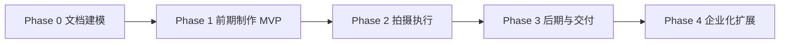
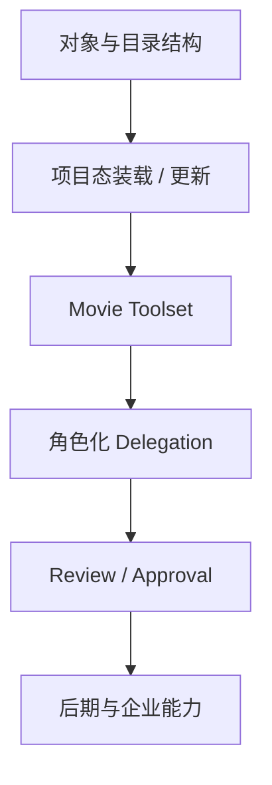

# 08. 路线图：如何分阶段把 Hermes 变成电影导演智能体平台

## 这篇文档回答什么问题

前面几篇说明了目标，但真正能不能落地，取决于路线图是否克制。

本篇的重点是：

- 什么该先做
- 什么不要一开始就做
- 每一阶段应该交付什么

---

## 一、路线图总原则

建议遵循以下原则：

- 先对象，再流程，再复杂自动化
- 先前期制作，再现场执行，再后期交付
- 先结构化产物，再接入更复杂的媒体生成能力
- 先让系统能管理项目，再让系统生成更多内容

换句话说，先做“可控的项目机器”，再做“更强的创作机器”。

---

## 二、Phase 0：文档与领域建模

目标：

- 把电影领域设计讲清楚
- 确认角色、对象、阶段、治理边界
- 给后续代码实现建立统一术语

交付物：

- 当前 `docs/movie` 目录中的基础设计文档
- 最小对象清单
- 最小角色清单
- 最小 workflow 状态图

成功标准：

- 产品、架构、研发能对系统范围达成一致
- 不再把目标理解成“做一个会聊电影的 bot”

---

## 三、Phase 1：前期制作 MVP

这是最值得优先做的阶段。

目标：

- 建立项目主状态
- 跑通剧本到 breakdown、预算、排期、镜头计划的闭环
- 跑通主智能体委派专业子智能体
- 跑通正式文档产物与轻量审批

建议交付：

- `MovieProject` / `MovieThreadState`
- script / scene / breakdown / budget / schedule / shotplan 基础对象
- 导演主智能体
- 4 到 6 个专业子智能体
- 4 到 6 个 movie tools
- 轻量 artifact 目录规范
- review / approval 基础流程

建议优先修改的区域：

- `run_agent.py`
- `model_tools.py`
- `toolsets.py`
- `tools/delegate_tool.py`
- `tools/`
- `agent/`

成功标准：

- 用户能围绕一个电影项目持续多轮推进
- 系统能维护当前阶段和活跃对象
- 系统能稳定输出正式产物，而不仅是聊天内容

---

## 四、Phase 2：拍摄执行与现场控制

目标：

- 把前期方案转成现场执行能力
- 引入 call sheet、daily progress、成本偏差、dailies review
- 形成现场调度和升级机制

建议交付：

- call sheet 对象与模板
- 日拍计划对象
- 现场风险升级流
- 进度与成本偏差跟踪
- dailies review 流程

成功标准：

- 系统能辅助每天的拍摄组织
- 导演主智能体可以看到进度、成本、风险的统一面板

---

## 五、Phase 3：后期制作与发布治理

目标：

- 管理版本流、评审流和交付流
- 支撑剪辑、声音、调色、VFX 协作
- 建立发布包与归档体系

建议交付：

- cut / review / approval / release package 对象
- 版本比较与评审记录机制
- 交付清单和归档快照
- 项目复盘与知识回写

成功标准：

- 系统能对“哪个版本可发布”给出明确状态
- 评审意见可回溯到对象和责任环节

---

## 六、Phase 4：高级集成与企业化

目标：

- 接入更多媒体生成与审片能力
- 接入更正式的权限、审计、指标体系
- 扩展为团队级或企业级平台

建议交付：

- 更丰富的 movie toolset
- 更细粒度权限与审计
- 运营指标和 ROI 面板
- 与外部系统的集成层

---

## 七、推荐的代码落地顺序

为了降低风险，推荐按以下顺序进入代码实现。

1. 定义 movie 对象与目录结构。
2. 增加项目态加载与最小 state 更新能力。
3. 增加 movie toolset 与核心工具。
4. 增加电影角色注册与角色化 delegation。
5. 增加 review / approval 状态切换。
6. 最后再扩展更复杂的后期与企业能力。

---

## 八、几个常见误区

### 1. 一开始就想自动生成整部片

这样通常会把项目管理、版本、治理等真正难也真正有价值的部分跳过去。

### 2. 一开始就设计特别重的全量数据库

第一阶段更适合先把对象与状态语义跑通，再决定最终存储形态。

### 3. 先做大量角色，却没有对象和审批

角色越多，如果没有共同对象和工作流，系统越容易散。

### 4. 只做视觉生成，不做项目状态

这会让平台更像一套创意工具集合，而不是导演智能体平台。

---

## 九、MVP 的明确边界

建议第一版 MVP 只承诺以下能力：

- 管理一个电影项目的前期制作过程
- 对关键对象进行版本化管理
- 通过主智能体 + 子智能体协同生成正式文档产物
- 提供轻量 review / approval 流程

不承诺：

- 直接替代完整制片系统
- 一步到位接管现场所有执行
- 完整自动化后期生产

---

## 十、结论

最稳的路线不是“先做最炫的生成”，而是：

1. 先做项目对象和阶段状态。
2. 再做主智能体与专业子智能体协同。
3. 再做正式产物、评审与审批。
4. 最后扩展到拍摄现场、后期和企业化能力。

如果沿着这条路线推进，Hermes Agent 就有机会从通用多智能体底座，逐步长成真正可落地的电影导演智能体平台。

---

## 相关文档

- [19-solution-2-mvp-implementation-path.md](./19-solution-2-mvp-implementation-path.md)
- [24-hermes-agent-transformation-roadmap.md](./24-hermes-agent-transformation-roadmap.md)
- [81-mvp-scope-definition.md](./81-mvp-scope-definition.md)
- [103-hermes-agent-movie-integration-strategy-summary.md](./103-hermes-agent-movie-integration-strategy-summary.md)
- [110-hermes-agent-roadmap-for-video-agent-era.md](./110-hermes-agent-roadmap-for-video-agent-era.md)
