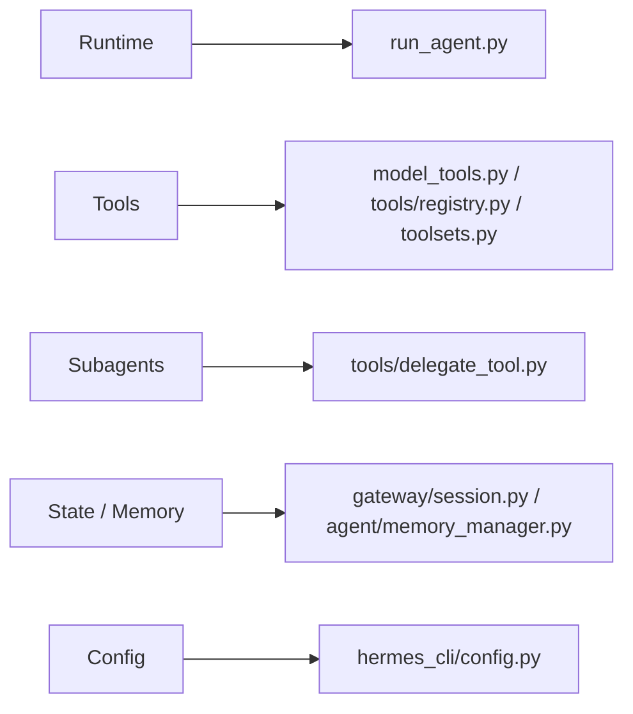
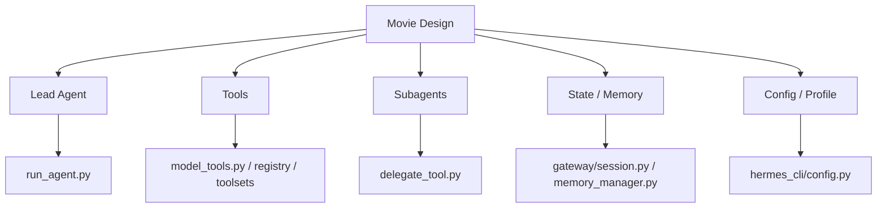
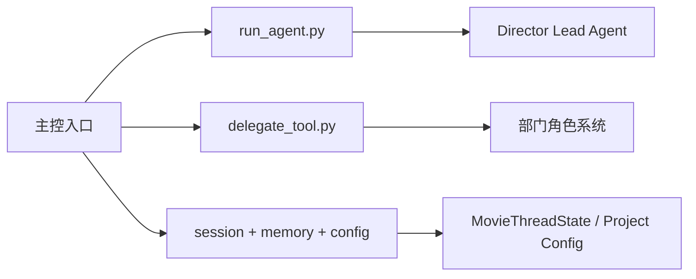

# 09. 源码映射总览：电影方案在当前仓库里应该落到哪里

## 这篇文档回答什么问题

前面的文档讲的是系统方案，这一篇开始回答实现问题：

- 电影导演智能体方案，在当前 Hermes 仓库里该从哪些文件入口下手
- 哪些模块已经能承接 movie 扩展
- 哪些能力当前没有直接对应物，需要新增

---

## 一、先建立一个总判断

当前仓库不是空白底座，它已经具备一套清晰的分层：

- `run_agent.py`：主智能体运行时
- `model_tools.py`：工具编排和分发入口
- `tools/registry.py`：工具注册中心
- `toolsets.py`：工具集和场景组合
- `tools/delegate_tool.py`：子智能体委派
- `agent/`：prompt、memory、context compression、display 等内部能力
- `gateway/`：多平台入口与会话上下文
- `hermes_cli/config.py`：配置与环境变量体系

因此，movie 方案的落点不是一个新目录就能独立完成，而是要跨越 runtime、tools、state、config 四条主线。

---

## 二、建议的源码映射总表

| 电影方案能力 | 当前最相关入口 | 说明 |
|------|------|------|
| 导演主智能体 | `run_agent.py` | `AIAgent` 已是主控循环，最适合承接导演主智能体 |
| 电影工具系统 | `model_tools.py`、`tools/registry.py`、`toolsets.py` | 现有工具发现、过滤、分发机制可直接扩展 movie tools |
| 专业子智能体 | `tools/delegate_tool.py` | 已有 child agent 模式，适合角色化委派 |
| 项目记忆 | `agent/memory_manager.py`、`tools/memory_tool.py` | 可扩展成 movie 项目记忆与决策记忆 |
| 历史检索 | `tools/session_search_tool.py` | 可承接跨版本、跨评审历史找回 |
| 技能工作法 | `agent/skill_commands.py`、`tools/skills_tool.py` | 可沉淀编剧分析、breakdown、审片模板等 skill |
| 项目工作区与产物 | `tools/file_tools.py`、`tools/terminal_tool.py` | 可承接剧本、预算、排期、review 等文件产物 |
| 会话上下文 | `gateway/session.py` | 当前有 `SessionContext`，未来可叠加 movie project context |
| 配置与 profile | `hermes_cli/config.py`、`hermes_constants.py` | 适合增加 movie 配置开关、默认角色集和目录策略 |

---

## 三、最值得优先看的文件

如果后续是“开始改代码”，优先阅读顺序建议如下：

1. `run_agent.py`
2. `model_tools.py`
3. `tools/registry.py`
4. `toolsets.py`
5. `tools/delegate_tool.py`
6. `agent/memory_manager.py`
7. `agent/prompt_builder.py`
8. `gateway/session.py`
9. `hermes_cli/config.py`

这是因为 movie 方向的绝大多数改动，都会从这几处展开。

---

## 四、哪些概念在当前仓库中已有对应物

README 中多次提到：

- Lead Agent
- task / Subagent
- ThreadState
- AgentConfig
- factory

在当前仓库里，这些概念并不是都以同名类直接存在，但可以找到比较明确的等价承接点。

## 1. Lead Agent 的当前对应物

最接近的是 `run_agent.py` 中的 `AIAgent`。

它已经负责：

- system prompt 组装
- 工具集装载
- 工具调用循环
- memory / context compression 协调

所以 movie 里的 Director Lead Agent 首选在这里扩展。

## 2. task / Subagent 的当前对应物

最接近的是 `tools/delegate_tool.py` 中的 `delegate_task()` 及其 child-agent 构建逻辑。

这层已经具备“父智能体发任务，子智能体隔离上下文执行”的能力。

## 3. ThreadState 的当前对应物

当前仓库没有一个现成的 `MovieThreadState` 或统一 `ThreadState` 数据类可直接承接电影项目态。

但已有几个可拼接的基础：

- `gateway/session.py` 的 `SessionContext`
- `agent/memory_manager.py` 的记忆装载
- `run_agent.py` 内部的会话与 messages 生命周期
- 文件系统中的 artifact 与状态文件

因此，`MovieThreadState` 更适合作为新增对象层，而不是硬找现有同名类。

## 4. AgentConfig 的当前对应物

当前最接近的是：

- `hermes_cli/config.py` 的 `DEFAULT_CONFIG`
- 各运行入口在初始化 `AIAgent` 时传入的参数
- toolset、provider、delegation、memory 等配置树

未来若做 movie 专属 agent 配置，可以先在现有 config 树上扩。

## 5. factory 的当前对应物

当前仓库里没有独立成型的 movie factory，但已有多个“构造点”：

- tool discovery
- session / gateway 中的 agent factory
- runtime 初始化时的工具和 prompt 装载

未来的 movie factory 更像是在这些构造点之上再包一层领域初始化。

---

## 五、哪些能力应优先做“增量扩展”

根据当前结构，最合理的扩展方式不是新建一套平行框架，而是：

### 1. 在 `run_agent.py` 里增加 movie 项目态装载

例如：

- 当前项目
- 当前阶段
- 当前活跃对象
- 当前角色和风险

### 2. 在 `toolsets.py` 与 `tools/` 中新增 movie toolset

让电影工具与现有工具同样参与标准筛选和分发。

### 3. 在 `tools/delegate_tool.py` 上层叠加角色化委派

用角色注册表、阶段激活规则和对象权限，升级当前通用 delegation。

### 4. 在 `agent/memory_manager.py` 周围增加 movie 记忆策略

控制哪些电影项目事实应该长期保留，哪些不该写入 memory。

### 5. 在工作区层引入 movie 目录和 artifact 规范

这样 agent 的输出会真正沉淀成项目资产。

---

## 六、哪些能力更适合新增模块

虽然很多能力应增量扩展，但以下能力更适合新增模块，而不是硬塞进旧文件：

- `MovieProject` / `MovieThreadState` 对象定义
- 电影角色注册表
- 电影阶段状态机
- 电影审批与评审对象
- 电影 artifact 目录与序列化逻辑

这些内容如果都堆在 `run_agent.py` 或 `delegate_tool.py` 里，会很快变得难以维护。

---

## 七、结论

movie 方案在当前仓库中的实现主线可以总结成三句话：

- 主控入口看 `run_agent.py`
- 多角色委派看 `tools/delegate_tool.py`
- 状态、配置和长期连续性看 `gateway/session.py`、`agent/memory_manager.py`、`hermes_cli/config.py`

后续每一篇源码映射文档，都会围绕这几条线继续展开。

---

## 相关文档

- [02-current-project-mapping.md](./02-current-project-mapping.md)
- [10-source-mapping-agent-runtime.md](./10-source-mapping-agent-runtime.md)
- [11-source-mapping-subagents.md](./11-source-mapping-subagents.md)
- [12-source-mapping-state-and-config.md](./12-source-mapping-state-and-config.md)
- [71-lead-agent-transformation-plan.md](./71-lead-agent-transformation-plan.md)
