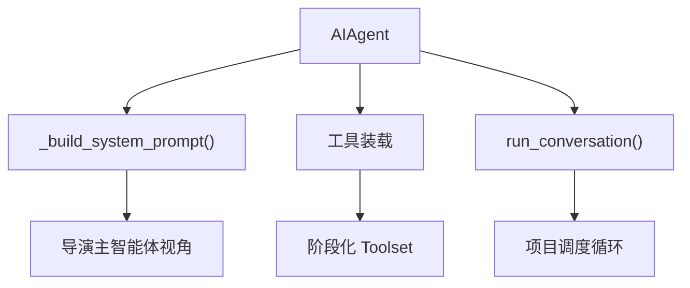
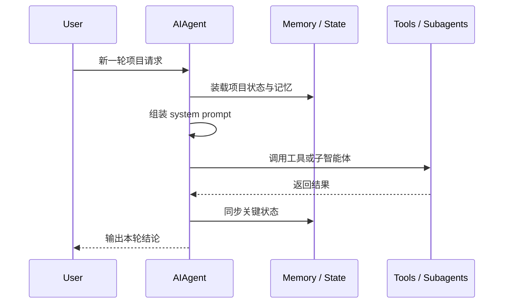

# 10. 源码映射：导演主智能体运行时应该落到哪里

## 这篇文档回答什么问题

如果要把 Hermes 的主智能体演进成 Director Lead Agent，最先需要理解的就是 runtime。

本篇聚焦：

- `AIAgent` 当前负责什么
- 电影项目态最适合在哪些钩子上接入
- 哪些改造应放在 runtime，哪些不应放在 runtime

---

## 一、最核心入口：`run_agent.py`

从仓库结构看，电影导演主智能体最重要的承接点就是 `run_agent.py` 里的 `AIAgent`。

我们已经能从源码中看到几个关键入口：

- `class AIAgent` 是主类
- 初始化阶段会装载工具定义
- `_build_system_prompt()` 负责组装系统提示
- `run_conversation()` 负责一整轮工具调用与收敛

这说明电影主智能体的很多能力，天然应该建立在 `AIAgent` 的 session 生命周期之上。

---

## 二、当前 runtime 已经做了什么

## 1. system prompt 组装

`_build_system_prompt()` 当前会把多层内容拼到一起，包括：

- identity
- skills guidance
- context files
- memory block
- 平台提示

这对 movie 场景很重要，因为导演主智能体恰恰需要一个稳定、长期、分层的系统提示结构。

未来可在这里接入：

- movie 项目摘要
- 当前阶段目标
- 当前项目约束
- 当前激活角色
- 当前锁定对象列表

## 2. 工具集装载

`AIAgent` 初始化时会通过 `get_tool_definitions()` 获取当前会话可用工具。

这意味着导演主智能体不需要自己单独维护一套电影工具列表，只要：

- 新增 movie toolset
- 在当前阶段启用对应工具

即可进入 runtime。

## 3. 对话循环与工具调用

`run_conversation()` 是当前主循环入口。它负责：

- 接收用户消息
- 维护 messages
- 处理记忆预取
- 执行工具调用
- 在达到完成条件前持续迭代

这正是电影主智能体需要的“项目调度循环”。

## 4. 上下文压缩与长期会话

`run_agent.py` 已经接了 `ContextCompressor`，说明 Hermes 具备长对话下的上下文管理能力。

电影项目天然是长周期任务，这一点非常关键。

---

## 三、Director Lead Agent 应该加在哪里

电影化改造时，不建议把 Director Lead Agent 做成与 `AIAgent` 平行的新总入口。

更稳妥的做法是：在 `AIAgent` 上叠加电影项目层。

### 推荐新增或增强的 runtime 责任

## 1. 电影项目态装载

在 turn 开始前装载：

- 当前项目基本信息
- 当前阶段
- 当前活动对象
- 当前风险和阻塞
- 当前待审批项

这层内容不应完全依赖 memory，而应来自更正式的 movie state。

## 2. 阶段化 prompt 拼装

在 `_build_system_prompt()` 或 turn 级 prompt 注入位置增加：

- 本阶段目标
- 本阶段禁做事项
- 本阶段默认调用角色

## 3. 阶段化工具筛选

不是所有 movie tools 在每个阶段都应该暴露给主智能体。

例如：

- 项目开发期不必暴露 dailies 工具
- 后期阶段不应默认暴露前期勘景工具

这更适合在 runtime 初始化工具集时控制。

## 4. 角色激活规则

主智能体是否调用哪些子智能体，也应受当前项目阶段影响。

---

## 四、不建议放进 runtime 的内容

虽然 runtime 是主入口，但不是所有电影能力都应塞进去。

以下能力更不适合直接写在 `run_agent.py`：

- 具体电影对象结构定义
- 各子智能体的专业输出 schema
- 复杂预算和排期算法
- 具体 artifact 序列化细节

runtime 应保持“编排层”角色，而不是吞掉整个 movie 领域逻辑。

---

## 五、runtime 与 `agent/prompt_builder.py` 的关系

`run_agent.py` 当前依赖 `agent/prompt_builder.py` 组装大量 prompt 片段。

因此，电影场景的 prompt 扩展更适合拆成两层：

- `run_agent.py` 决定什么时候装载电影项目信息
- `agent/prompt_builder.py` 提供电影场景可复用的 prompt 片段构造函数

这样比把整段电影 prompt 直接堆在 `run_agent.py` 里更可维护。

---

## 六、runtime 与 `model_tools.py` 的边界

runtime 负责：

- 决定这轮允许哪些工具
- 调用工具
- 处理工具结果回到消息流

`model_tools.py` 负责：

- 根据 toolset 解析可用工具
- 把函数调用路由到 registry
- 做统一的参数整理和分发

movie 改造时，runtime 不应直接绕过 `model_tools.py` 自己做另一套电影工具路由。

---

## 七、一个推荐的 Director Lead Agent 接入思路

可以把接入思路简化成三步。

1. 在 turn 开始前装载 `MovieThreadState`。
2. 把阶段摘要、项目约束、活跃对象注入到 prompt。
3. 根据阶段决定 toolset 与 delegation 策略。

这样就能让现有 `AIAgent` 带上“导演主智能体视角”，而不必推倒原有 runtime。

---

## 八、结论

如果要实现 Director Lead Agent，最重要的不是新造一个 agent loop，而是把电影项目态接到现有 `AIAgent` 的几个关键钩子上：

- system prompt 组装
- turn 开始前的状态装载
- 工具集筛选
- 子智能体调用策略

这也是当前仓库里最小风险、最高复用的实现路线。

---

## 相关文档

- [02-current-project-mapping.md](./02-current-project-mapping.md)
- [12-source-mapping-state-and-config.md](./12-source-mapping-state-and-config.md)
- [52-director-lead-agent-design.md](./52-director-lead-agent-design.md)
- [71-lead-agent-transformation-plan.md](./71-lead-agent-transformation-plan.md)
- [72-task-tool-and-delegation-extension.md](./72-task-tool-and-delegation-extension.md)
