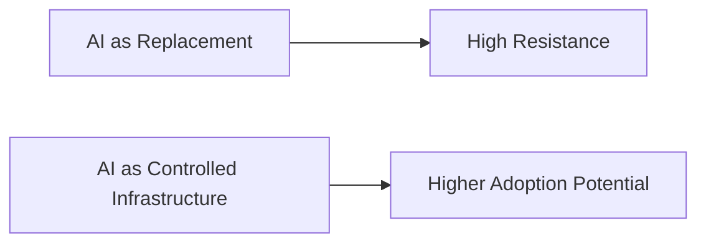
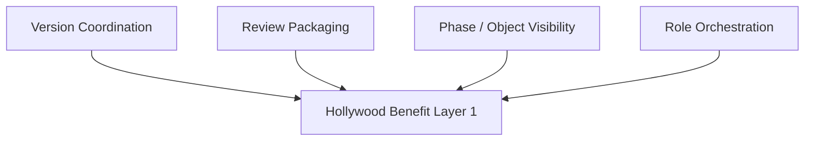
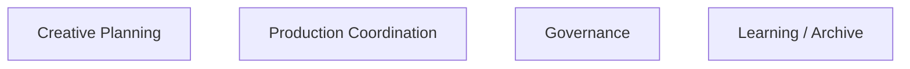
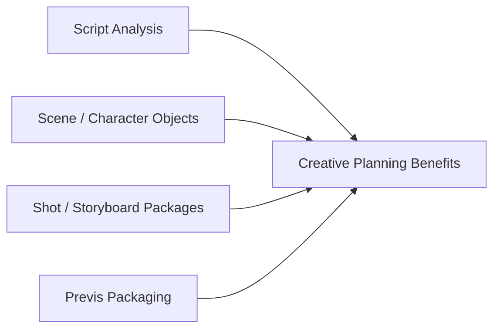
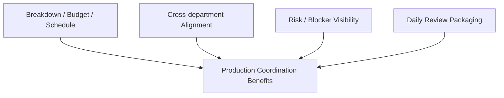
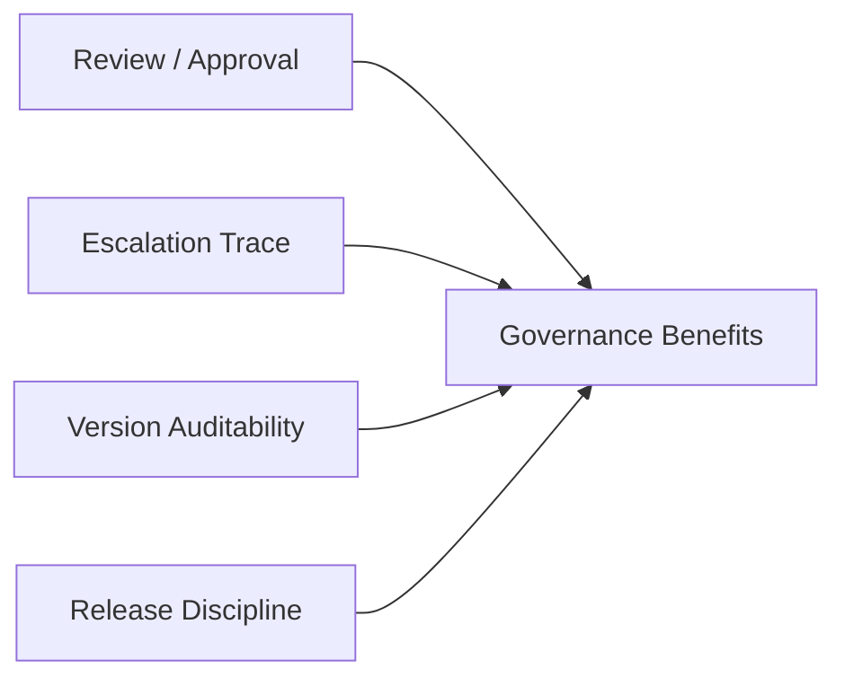
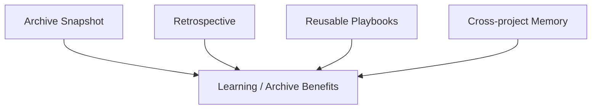
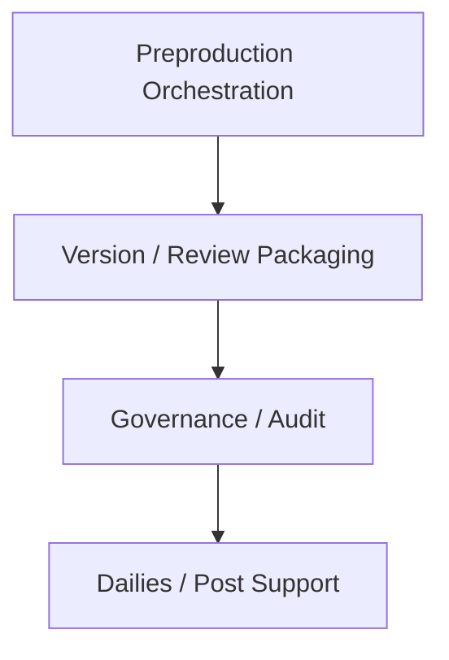
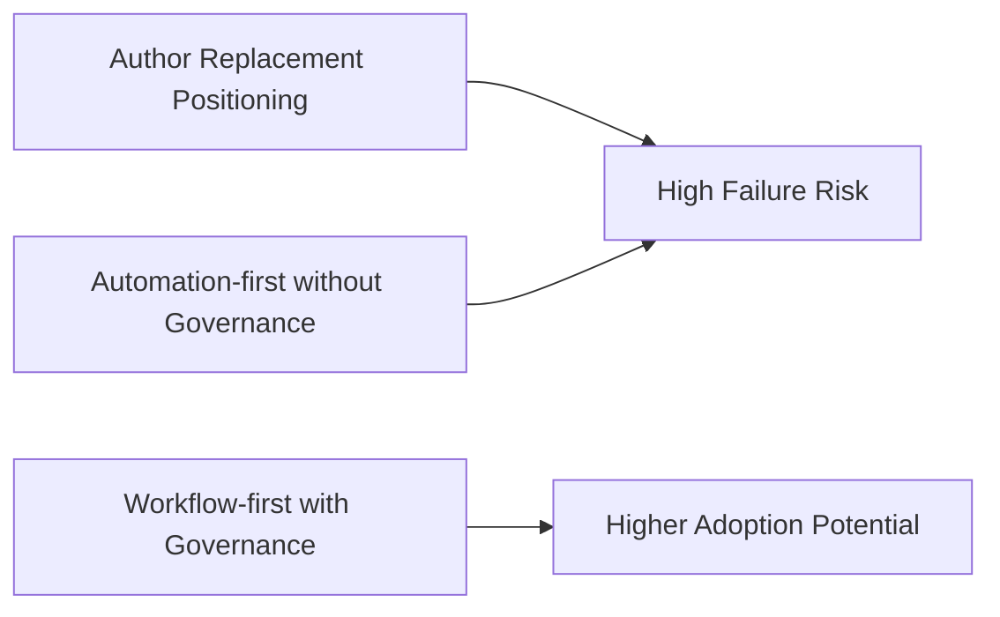

# 100. Hermes Agent 在好莱坞的价值地图

## 这篇文档回答什么问题

如果把 Hermes movie mode 放进好莱坞语境，最重要的问题不是“它能不能生成好内容”，而是：

- 它在好莱坞流程里最能解决什么问题
- 哪些价值会被真正买单
- 哪些定位会遇到强阻力

本篇重点回答：

1. Hermes 在好莱坞式工作流中的价值点分布。
2. 哪些模块最容易先落地。
3. 为什么 workflow-first 比 generation-first 更适合好莱坞 adoption。

---

## 一、好莱坞最容易接受的不是“作者替代”，而是“受控基础设施”

好莱坞当前最现实的 adoption 路线，是把 AI 定位为 creator-in-the-loop 的生产基础设施，而不是替代主要创作者。这个判断与近年的行业报道和创作者公开态度是一致的。 citeturn4news12turn2search7

这直接决定了 Hermes 在好莱坞的最佳位置。

---

## 二、Hermes 在好莱坞的价值不该从“生成”开始，而该从“协调”开始

Hermes 最值得强调的第一层价值是：

- 版本协调
- review packaging
- phase / object visibility
- multi-role orchestration

这些都是强流程环境里最容易体现价值的点。

---

## 三、价值地图可以分成四层

建议把 Hermes 在好莱坞的价值分成四层：

- creative planning value
- production coordination value
- governance value
- learning / archive value

---

## 四、Creative Planning 层的价值

在前期制作里，Hermes 的主要价值是：

- 剧本结构拆解
- scene / character organization
- storyboard / shot package coordination
- previs package generation support

这比直接承诺“自动生成最终电影镜头”更符合好莱坞的采纳逻辑。

---

## 五、Production Coordination 层的价值

这往往是 Hermes 在好莱坞最容易被低估、但也最容易真正产生经济价值的层。

因为复杂制作里，协同成本往往比单次内容生成成本更大。

---

## 六、Governance 层的价值

好莱坞环境里，治理往往不是附属，而是 adoption 的前置条件。

Hermes 在这层的价值，恰恰是单模型工具很难补齐的。

---

## 七、Learning / Archive 层的价值

好莱坞项目型工作一个常见痛点是：很多经验无法稳定跨项目复用。

这会让 Hermes 更像 studio-level operating memory。

---

## 八、好莱坞语境下的高价值模块优先级

建议优先级如下：

1. preproduction orchestration
2. version / review packaging
3. governance / audit
4. dailies / post support

---

## 九、哪些定位最容易失败

在好莱坞语境下，以下定位风险最高：

- “替代导演 / 编剧 / 演员”
- “全自动完成影片”
- “跳过治理只追求内容生成”

---

## 十、结论

Hermes 在好莱坞最有价值的位置，不是“内容生成王者”，而是：

- preproduction 和 version control 的 orchestration layer
- review / approval / archive 的 governance layer
- studio 级可复用工作流与记忆层

如果这样定位，它更容易进入真实 production environment，也更符合好莱坞对 AI 的现实接受路径。

---

## 相关文档

- [92-hollywood-ai-film-production-trends-2026.md](./92-hollywood-ai-film-production-trends-2026.md)
- [94-director-case-christopher-nolan.md](./94-director-case-christopher-nolan.md)
- [95-director-case-james-cameron.md](./95-director-case-james-cameron.md)
- [99-hermes-agent-ai-film-operating-system-overview.md](./99-hermes-agent-ai-film-operating-system-overview.md)
- [102-hermes-agent-roi-governance-and-adoption-roadmap-2026.md](./102-hermes-agent-roi-governance-and-adoption-roadmap-2026.md)
