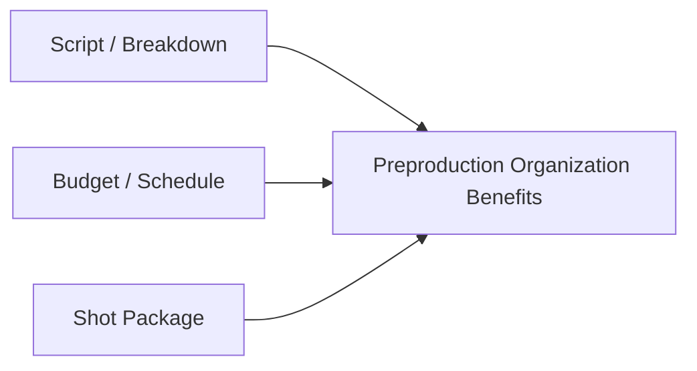
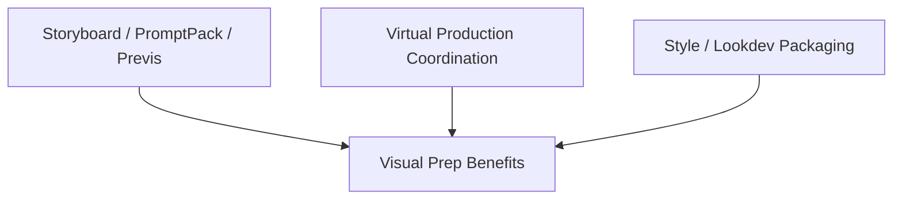
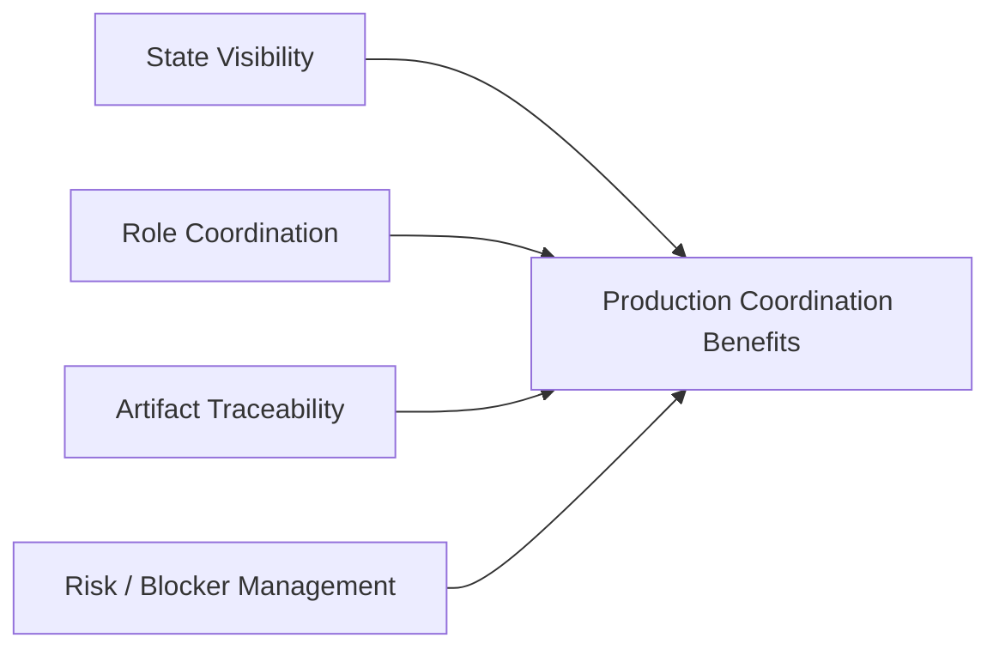
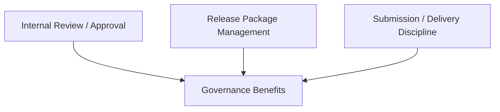
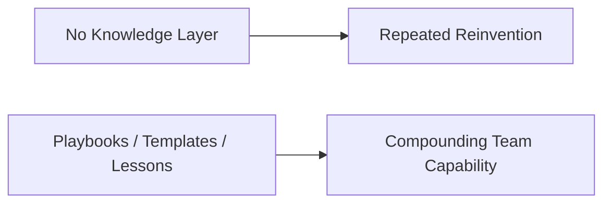
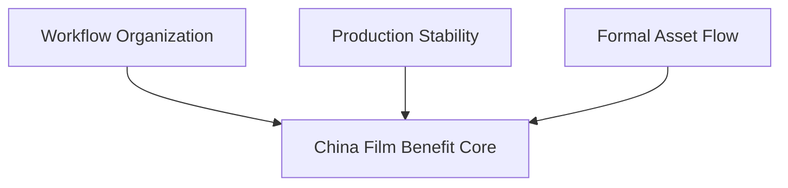
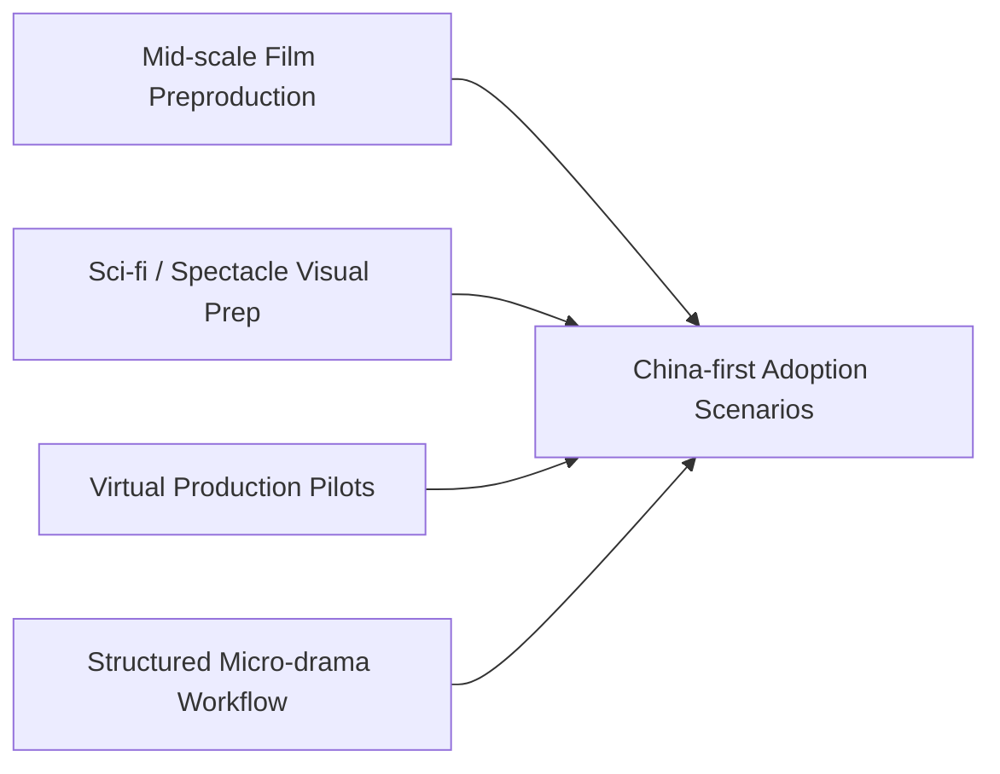

# 101. Hermes Agent 在中国电影的价值地图

## 这篇文档回答什么问题

如果把 Hermes movie mode 放进中国电影与泛影视语境，价值地图会和好莱坞有相似之处，但也有明显不同：

- 更强的产业化与效率诉求
- 更强的全链路想象
- 对虚拟制作、短剧、AIGC 试验的接受度更高

本篇重点回答：

1. Hermes 在中国电影语境下最容易体现价值的点是什么。
2. 为什么它在中国更容易从“组织层”切入。
3. 哪些能力在中国市场里特别值得优先强调。

---

## 一、中国语境里的价值起点，更容易是“产业效率”和“流程组织”

截至 2026 年 4 月，中国 AI 产业的整体工业化速度和标准化推进都很快，这使得影视行业更容易把 AI 放进：

- 生产效率
- 工作流组织
- 资产与内容工业链

这让 Hermes 的 workflow-first 路线在中国语境下尤其有利。

---

## 二、Hermes 在中国电影的价值可分五层

建议把价值地图分成五层：

- 前期制作组织层
- 虚拟制作与视觉前置层
- production coordination 层
- 治理与送审 / 交付层
- 跨项目知识复用层

---

## 三、前期制作组织层的价值最大也最先落地

Hermes 在中国电影语境下最先容易体现价值的，是：

- 剧本分析
- breakdown 组织
- budget / schedule 方案对比
- shot package 协同

这正好与中国市场更重视效率和可执行性的现实相匹配。

---

## 四、虚拟制作与视觉前置层的价值非常突出

中国公开讨论中，AI 与虚拟制作、视觉前置和 AIGC 试验结合得很快。

这意味着 Herms 不只是能服务传统电影，也有机会服务：

- 科幻片
- 虚拟制作项目
- 更快节奏的泛影视内容开发

---

## 五、Production Coordination 层是中国市场特别高价值的一层

很多中国项目并不缺创意工具，而缺稳定的：

- 项目控制面
- 多部门对象协作
- 风险和阻塞可见性

这类价值在快速项目环境里尤其重要。

---

## 六、治理与送审 / 交付层在中国语境下也很关键

中国电影和泛影视项目除了内部治理，还常常更早面对：

- 送审
- 对外发布边界
- 不同平台和版本的正式交付

这让 `ReviewRound`、`ApprovalRequest`、`ReleasePackage` 等对象在中国语境下同样具有高价值。

---

## 七、知识复用层的价值在中国尤其容易被低估

中国很多内容团队节奏快、项目密度高，如果没有知识层，组织会一直重复“边做边摸索”。

Hermes 的 memory / playbook / template 体系，在这里非常容易产生长期回报。

---

## 八、最值得优先强调的价值主张

在中国市场，最值得强调的不是：

- “某个模型有多强”

而是：

- “能不能把流程组织起来”
- “能不能让高频项目更稳定”
- “能不能把前期制作做成正式资产流”

---

## 九、最适合的切入场景

建议优先场景包括：

- 中小规模长片前期制作
- 科幻 / 奇观型项目的视觉前置
- 虚拟制作试点
- 高节奏泛影视 / 微短剧的 structured workflow 管理

---

## 十、结论

Hermes 在中国电影的价值地图，最适合从“组织层”和“生产层”展开，而不是从“单点生成能力”展开。

它最有价值的方向包括：

- 前期制作组织化
- 虚拟制作与视觉前置包装
- 多角色 production coordination
- 治理、交付与知识复用

这使它非常适合被定位成中国电影与泛影视行业的 AI 生产操作层。

---

## 相关文档

- [93-china-film-ai-production-trends-2026.md](./93-china-film-ai-production-trends-2026.md)
- [97-director-case-zhang-yimou.md](./97-director-case-zhang-yimou.md)
- [98-director-case-guo-fan.md](./98-director-case-guo-fan.md)
- [99-hermes-agent-ai-film-operating-system-overview.md](./99-hermes-agent-ai-film-operating-system-overview.md)
- [102-hermes-agent-roi-governance-and-adoption-roadmap-2026.md](./102-hermes-agent-roi-governance-and-adoption-roadmap-2026.md)
