# 102. 2026 ROI、治理与采用路线图

## 这篇文档回答什么问题

到了这一篇，我们要把前面关于：

- 模型趋势
- 行业变化
- 导演案例
- 试点与企业化

收束成最后一个问题：

**截至 2026 年，Hermes movie mode 应该怎样同时讲清 ROI、治理和 adoption 路线。**

本篇重点回答：

1. 2026 年最可信的 adoption 叙事是什么。
2. ROI 应如何和治理一起讲，而不是各说各话。
3. 一个面向 2026 的推广路线图应该怎样分阶段推进。

---

## 一、2026 年最可信的 adoption 叙事，不是“完全自动化”，而是“更可控的协作基础设施”

无论是好莱坞 creator-in-the-loop 的趋势，还是中国电影与 AIGC / 虚拟制作的产业化加速，都在指向一个共同方向：

- 真正容易被采纳的，不是全自动作者替代
- 而是更可控、更可治理的 workflow infrastructure

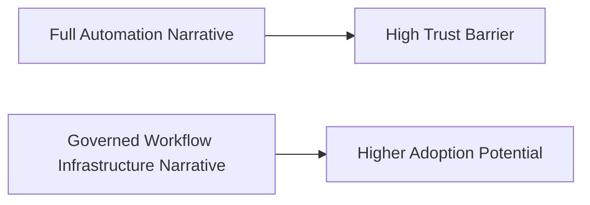

这应该成为 Hermes 在 2026 年最核心的 market positioning。

---

## 二、为什么 ROI、治理和 adoption 必须一起讲

很多 AI 项目失败的一个原因，是：

- ROI 只讲效率
- 治理只讲合规
- adoption 只讲愿景

三者没有合在一起。

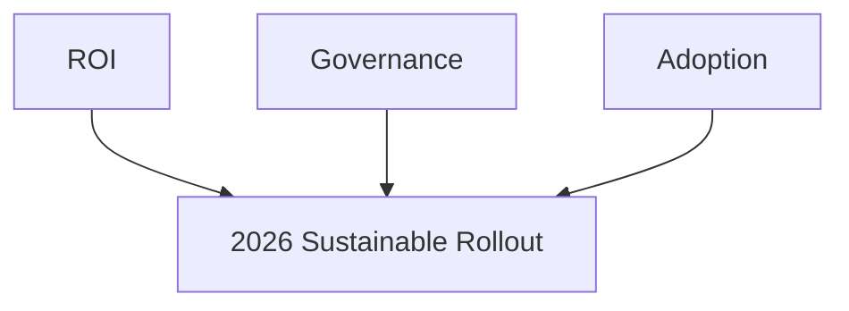

对电影平台来说，三者本来就应是一体的。

---

## 三、2026 的 ROI 该怎么讲

最可信的 ROI 口径，不应只讲“省了多少工时”，而应同时覆盖：

- 时间收益
- 质量收益
- 治理收益
- 知识复用收益

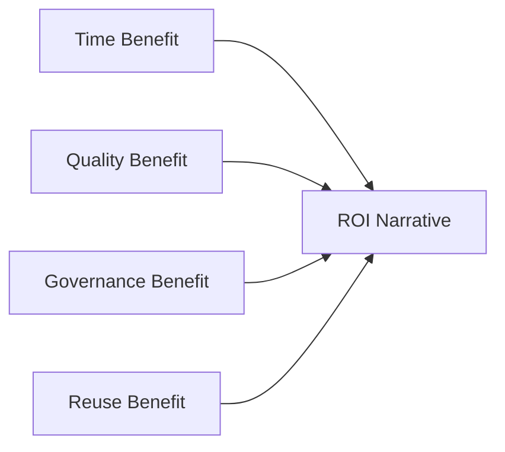

这样才更贴近电影生产的真实价值结构。

---

## 四、2026 的治理该怎么讲

治理不应该被包装成 adoption 的阻力，而应被包装成 adoption 的前提。

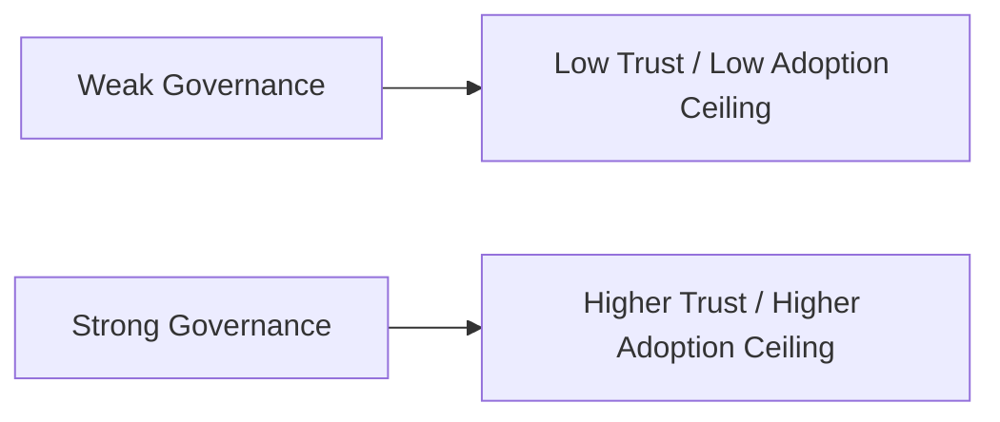

这对电影行业尤其重要，因为电影项目天然涉及：

- 高价值资产
- 多版本协作
- 审批与 release 边界

---

## 五、2026 的 adoption 路线最可信的起点

最可信的 adoption 起点依然应是：

- 前期制作
- visual prep
- version / review packaging

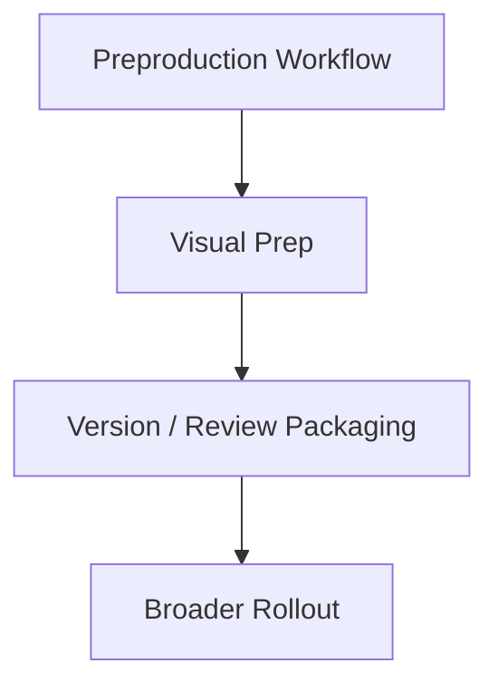

因为这是：

- 风险最低
- 价值最容易度量
- 团队最容易接受

的区域。

---

## 六、2026 的 adoption 推荐阶段

建议继续沿用五阶段 adoption 路线，但把 2026 的重点说得更明确：

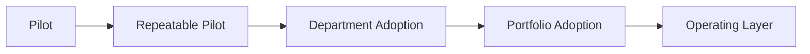

### 2026 口径解释

- `Pilot`：证明前期制作闭环
- `Repeatable Pilot`：证明不同项目下可复制
- `Department Adoption`：形成标准工作法
- `Portfolio Adoption`：形成统一指标与治理口径
- `Operating Layer`：成为稳定 production OS

---

## 七、为什么 2026 更需要“可复制试点”，而不是“大规模先铺开”

到 2026 年，模型能力看起来已经足够强，这反而更容易诱发组织误判，以为可以直接全面铺开。

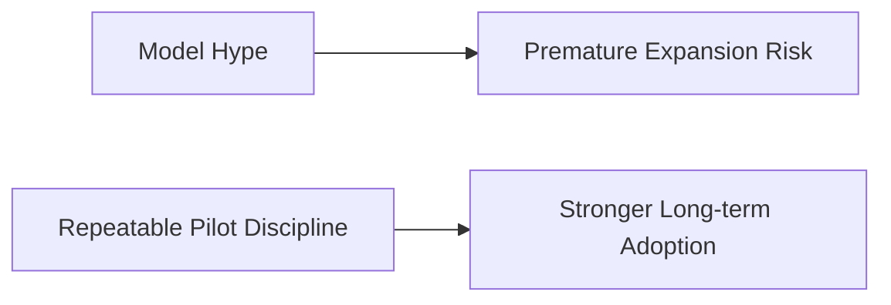

因此 2026 年最重要的不是“抓住热点”，而是“证明可复制性”。

---

## 八、2026 的治理重点应该放在哪里

建议至少把治理重点放在：

- object-level permissions
- version-linked review
- approval / escalation trace
- release / archive discipline

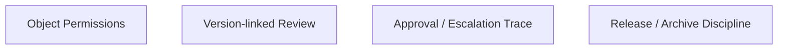

这四层如果缺失，企业级 adoption 会很快碰到上限。

---

## 九、2026 的 ROI dashboard 应如何设计

建议 dashboard 直接围绕 adoption narrative 来组织，而不是孤立指标堆砌。

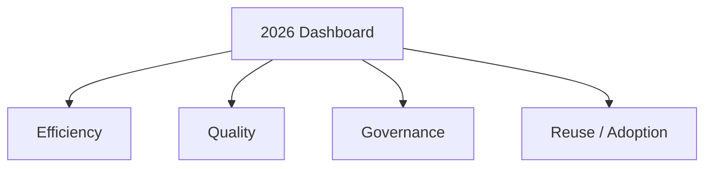

### 这样做的意义

- 管理层看到值不值
- 项目团队看到稳不稳
- 平台团队看到下一步该优先补什么

---

## 十、Hermes 在 2026 最有力的采用话术

最有力的话术不应是：

- “我们有最强的视频模型”

而应是：

- “我们能把越来越强的模型组织进受控的电影生产工作流”

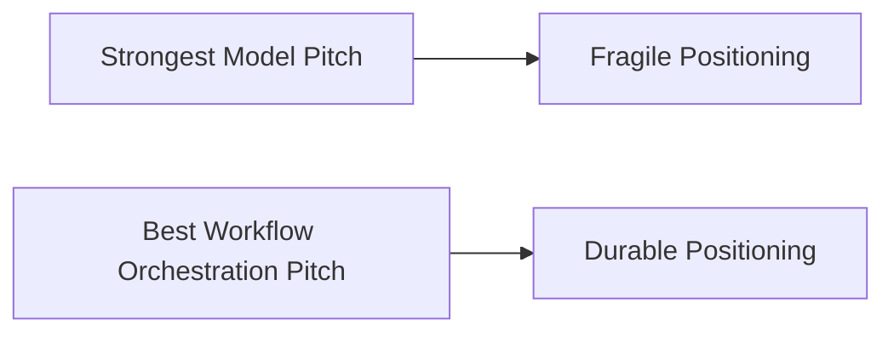

这也是最符合 Hermes 基因的叙事。

---

## 十一、2026 路线图总览

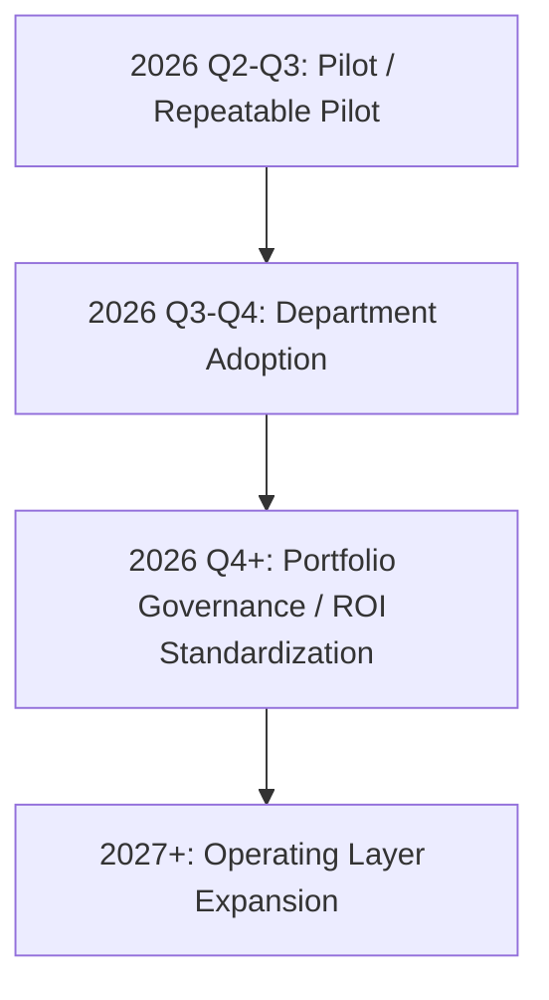

### 解释

- 2026 上半年和中期重点仍应是试点复制
- 2026 下半年才适合扩大到部门级
- 统一治理、ROI 和 operating layer 是更后面的工作

---

## 十二、结论

截至 2026 年，Hermes movie mode 最可信也最可持续的路线图可以概括成一句话：

**用可治理的 workflow infrastructure 证明 ROI，用可复制的试点证明 adoption，用正式的对象、版本和审计证明平台值得长期投入。**

这条路线既符合模型世界的发展方向，也符合电影行业对信任、责任和可持续生产的真实需求。

---

## 相关文档

- [85-pilot-project-implementation-manual.md](./85-pilot-project-implementation-manual.md)
- [89-metrics-and-roi.md](./89-metrics-and-roi.md)
- [90-enterprise-rollout-roadmap.md](./90-enterprise-rollout-roadmap.md)
- [100-hermes-agent-benefit-map-for-hollywood.md](./100-hermes-agent-benefit-map-for-hollywood.md)
- [101-hermes-agent-benefit-map-for-china-film.md](./101-hermes-agent-benefit-map-for-china-film.md)
