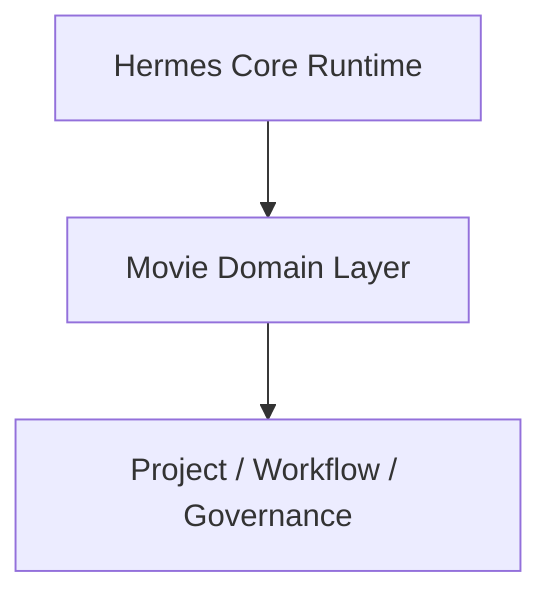
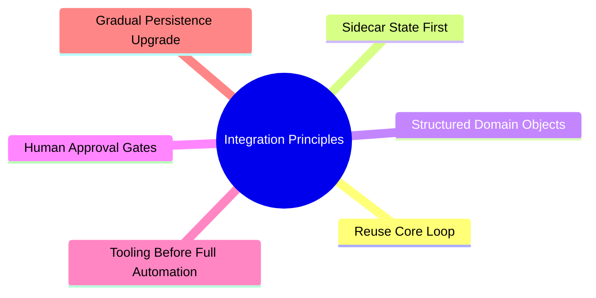
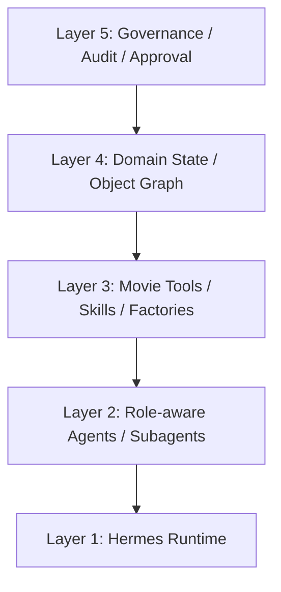
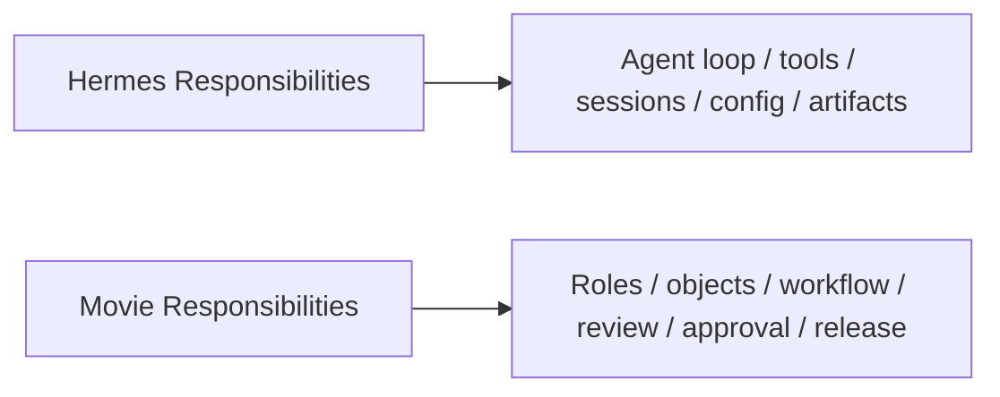
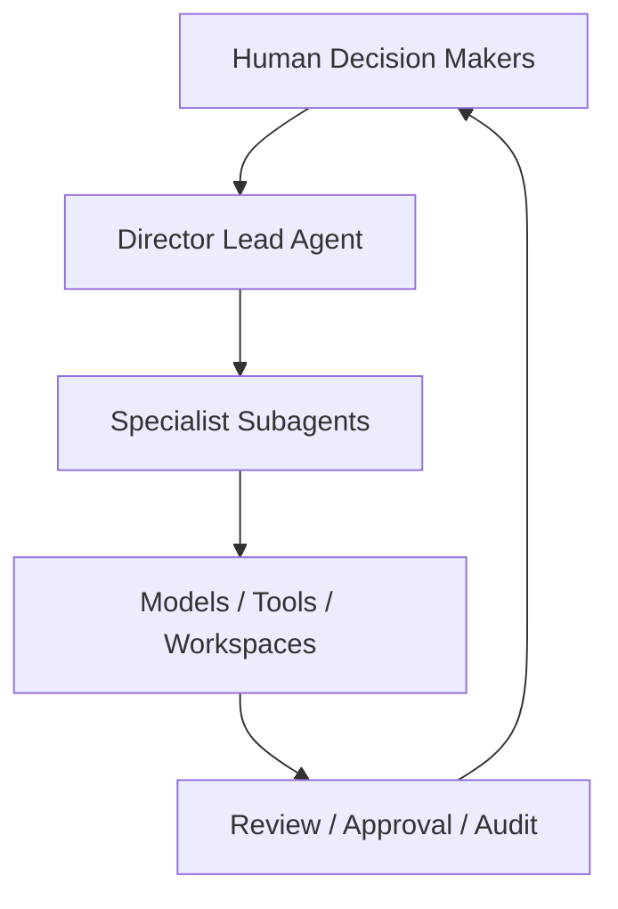
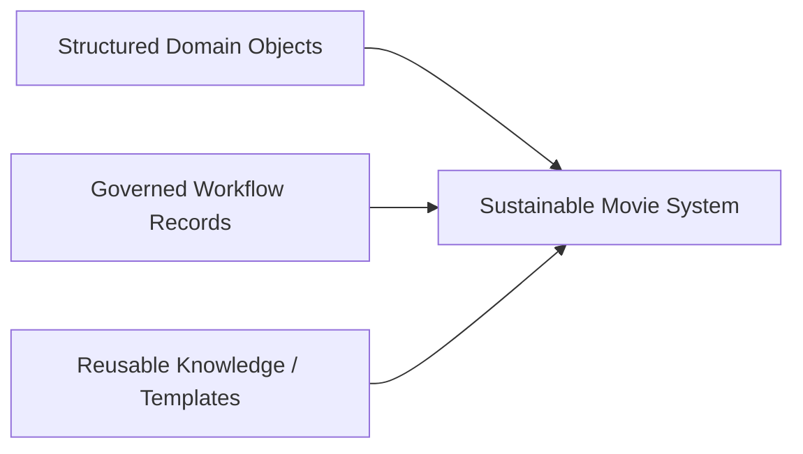

# 103. Hermes Agent 电影集成策略总结

## 这篇文档回答什么问题

到了这一篇，我们需要把前面 1 到 102 篇的内容真正收束成一个实施判断：

**Hermes Agent 到底应该怎样和 movie domain 集成，才能既不推翻现有系统，又能长出电影级能力。**

本篇重点回答：

1. 最值得坚持的集成原则是什么。
2. Hermes 与 movie domain 的正确耦合方式是什么。
3. 最稳妥的推进顺序应该怎样安排。

---

## 一、movie integration 不是“另起炉灶”，而是“在 Hermes 上叠一层电影操作面”

最重要的判断是：

- 不要重写 `AIAgent` 主循环
- 不要另造一套工具注册系统
- 不要另造一套 session / config / artifact 基础设施

而应把 movie mode 看作 Hermes 之上的一层 domain operating layer。

这能最大化复用 Hermes 已经成熟的：

- tool registry
- delegate / subagent
- session persistence
- workspace artifact flow
- observability

---

## 二、集成的核心原则

集成原则应尽量少，但必须很硬。

可以把它展开成六条：

1. **复用主循环**：先增强，而不是替换。
2. **先 sidecar，后深度嵌入**：`MovieThreadState` 初期最好独立于通用 session 结构。
3. **对象先行**：先把 script、scene、schedule、review round 等对象建清楚。
4. **工具先行**：先让 agent 能组织流程，再追求大规模自动生成。
5. **审批不可省略**：电影项目天然需要 review / approval。
6. **渐进持久化**：等对象和流程稳定后，再考虑更强的数据库映射。

---

## 三、正确的集成层次

movie mode 最好不是单点能力，而是五层叠加。

其中：

- Layer 1 由现有 Hermes 提供
- Layer 2 把导演、制片、剧本分析、排期等角色接入
- Layer 3 把 movie toolsets / skills / factories 接入
- Layer 4 用对象系统和状态机稳定 workflow
- Layer 5 负责 approval、audit、release 与 archive

---

## 四、Hermes 与 movie domain 的边界应该怎么划

边界划不好，系统会很快变乱。

一个简单判断是：

- 只要是“通用多智能体基础设施”，尽量留在 Hermes
- 只要是“电影制作语义与治理规则”，尽量放在 movie layer

这样可以避免：

- movie 侵入 Hermes 太深
- Hermes 被过度电影化
- 后续做别的行业时难以复用

---

## 五、最推荐的推进顺序

最稳的顺序不是从最炫的生成能力开始，而是从最有组织价值的地方开始。

为什么这样排：

- 对象先清楚，后面才不会失控
- 前期制作离线性更强，更适合试点
- review / approval 是 adoption 的信任基础
- 生成能力接在流程后面，价值更稳

---

## 六、最不推荐的推进顺序

反过来，下面这条路最危险：

问题在于：

- 生成结果没有对象归属
- 版本没有审批边界
- 多角色协作没有稳定接口
- 很难进入真实项目

这会让系统看起来“很能生成”，但无法长期生产。

---

## 七、movie integration 的推荐 operating model

一个更现实的 operating model 是“人类主导，agent 编排，模型生成，制度收口”。

这说明：

- Lead agent 不替代导演或制片
- Specialist agents 不直接越过治理边界
- 模型结果必须被 review 与 approval 收口

---

## 八、最关键的三类交付成果

movie mode 的成功，不应只看“生成了什么”，还应看是否稳定产出三类东西：

也就是：

- 有对象
- 有过程
- 有沉淀

只有三者都成立，movie integration 才算真的落地。

---

## 九、总结判断

Hermes Agent 的电影化集成，最佳路径不是“把 Hermes 改造成一个视频模型壳子”，而是：

**让 Hermes 保持通用多智能体底座，再在其上叠一层面向电影生产的角色、对象、状态、治理与交付系统。**

这条路的优点是：

- 技术风险更低
- 与现有源码更连续
- 更容易做真实项目试点
- 也更容易从电影再扩展到别的重协作行业

---

## 相关文档

- [24-hermes-agent-transformation-roadmap.md](./24-hermes-agent-transformation-roadmap.md)
- [71-lead-agent-transformation-plan.md](./71-lead-agent-transformation-plan.md)
- [77-movie-factory-design.md](./77-movie-factory-design.md)
- [81-mvp-scope-definition.md](./81-mvp-scope-definition.md)
- [99-hermes-agent-ai-film-operating-system-overview.md](./99-hermes-agent-ai-film-operating-system-overview.md)
- [105-hermes-agent-future-reference-architecture.md](./105-hermes-agent-future-reference-architecture.md)
