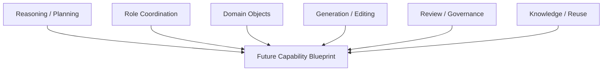
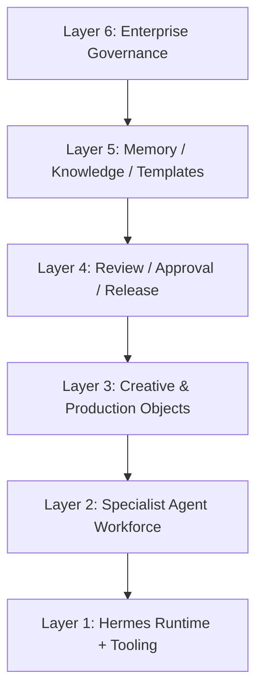
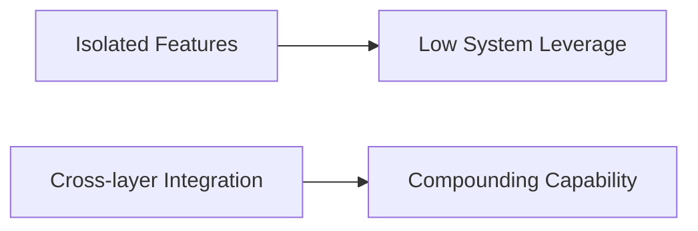
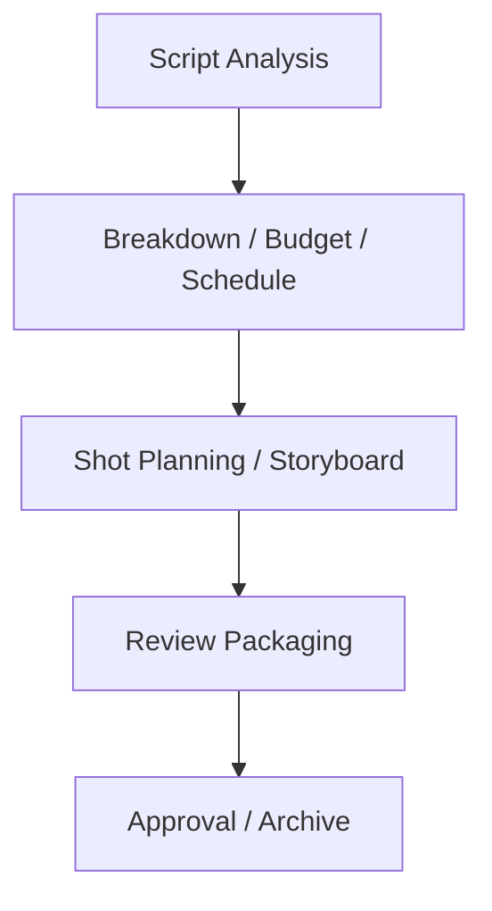
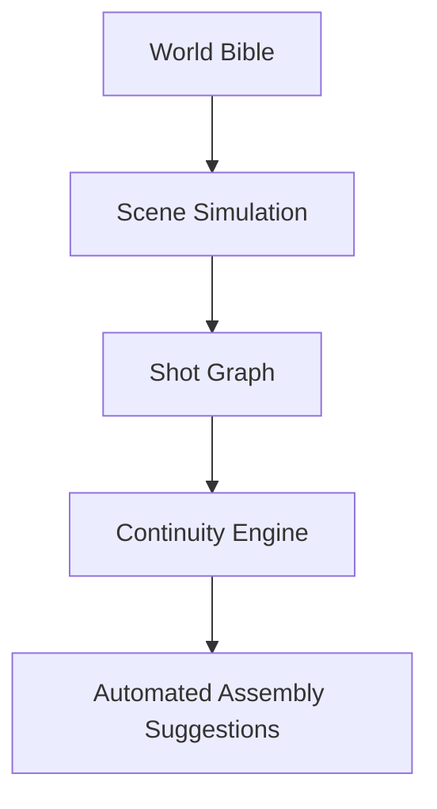
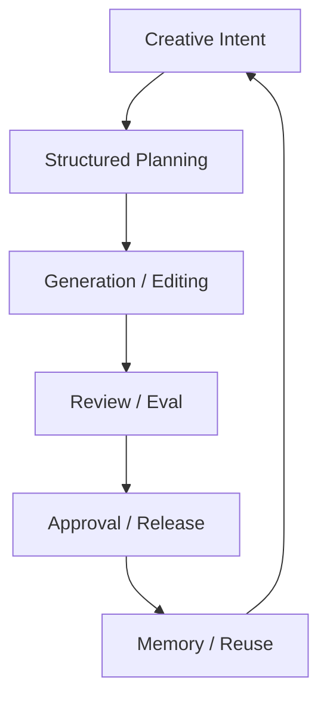
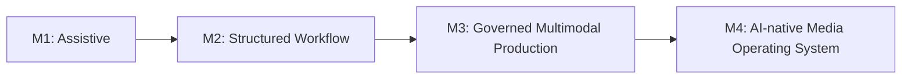
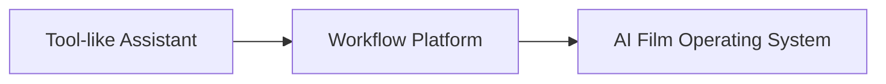

# 104. Hermes Agent 未来能力蓝图

## 这篇文档回答什么问题

前面我们已经说明了 Hermes 为什么适合变成电影操作系统。接下来要进一步回答：

**如果把时间线往后拉，Hermes movie mode 最终应该具备哪些能力层。**

本篇重点回答：

1. 未来能力蓝图应该怎样分层。
2. 哪些能力是短期能做的，哪些是中长期能力。
3. 这些能力之间如何形成闭环。

---

## 一、未来蓝图不是“更多模型”，而是“更完整的生产控制能力”

未来能力蓝图不应只围绕模型参数或画质提升，而应围绕电影生产控制面完整展开。

---

## 二、能力蓝图的六层结构

可以把未来能力拆成六层。

每层的作用分别是：

- Layer 1：运行时、工具、会话、文件流
- Layer 2：导演、制片、排期、分镜等角色劳动力
- Layer 3：script、scene、budget、shot plan、release package 等对象
- Layer 4：review、approval、escalation、archive
- Layer 5：模板、经验、项目复盘、风格包
- Layer 6：权限、审计、指标、组织 rollout

---

## 三、未来最关键的不是“单点强”，而是“跨层打通”

如果六层彼此割裂，系统依旧只是很多功能的堆叠。

Hermes 的机会在于把：

- 角色
- 对象
- 工具
- 状态
- 治理

接成一条连续链。

---

## 四、短期能力蓝图

短期最值得优先拿下的能力，仍然应集中在前期制作与 review 基础设施。

这一阶段的特点是：

- 生成压力相对小
- 可验证性较强
- adoption friction 较低
- 更容易证明组织价值

---

## 五、中期能力蓝图

中期要进入“多模态执行与版本治理”。

中期的重点不是单纯生成更多素材，而是：

- 让素材带对象归属
- 让版本带 review 记录
- 让 release 有批准边界

---

## 六、长期能力蓝图

长期能力会进入更像“世界状态驱动的电影生产”。

也就是说，系统不再只是零散生图或生视频，而是更接近：

- 角色与世界一致
- 场景与镜头一致
- 风格与版本一致

---

## 七、能力之间的闭环

未来蓝图最重要的是形成闭环，而不是一条直线。

这意味着每次项目推进，都能反向强化：

- 未来模板
- 未来工作流
- 未来 agent 行为

---

## 八、能力蓝图中的人机关系

未来蓝图不应把人类放出系统之外，而应把人类放进控制回路中。

这里的关键不是“人类监督 AI”，而是：

- 人类定义方向与边界
- agent 负责组织流程
- 模型负责生成与变体
- 治理层负责收口

---

## 九、未来能力成熟度路径

可以把成熟度简单分成四档。

这比“已经全自动了吗”更适合作为平台判断标准。

---

## 十、总结判断

Hermes movie mode 的未来蓝图，本质上不是一个更强的生成器，而是一个逐步长出：

- 编排力
- 对象力
- 治理力
- 复用力

的电影生产控制系统。

这才是最值得追求的长期能力形态。

---

## 相关文档

- [103-hermes-agent-movie-integration-strategy-summary.md](./103-hermes-agent-movie-integration-strategy-summary.md)
- [105-hermes-agent-future-reference-architecture.md](./105-hermes-agent-future-reference-architecture.md)
- [106-video-foundation-models-future-evolution.md](./106-video-foundation-models-future-evolution.md)
- [107-agents-future-evolution.md](./107-agents-future-evolution.md)
- [110-hermes-agent-roadmap-for-video-agent-era.md](./110-hermes-agent-roadmap-for-video-agent-era.md)
