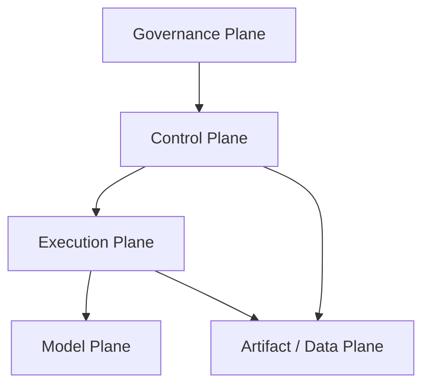
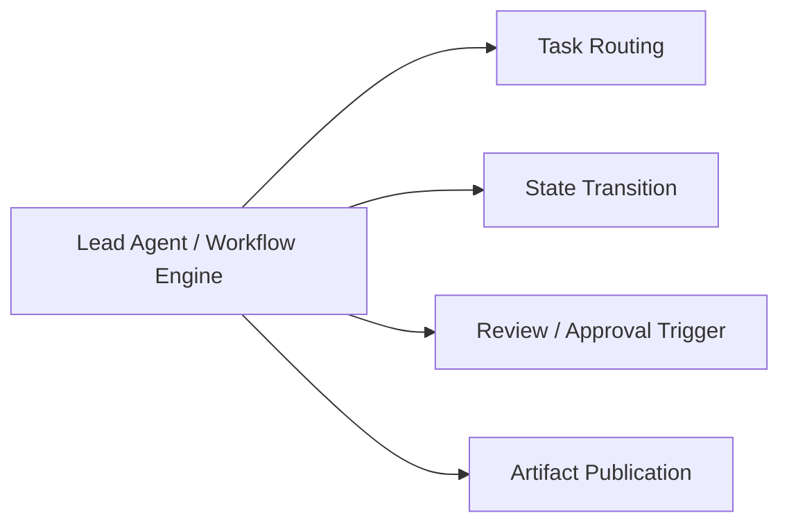
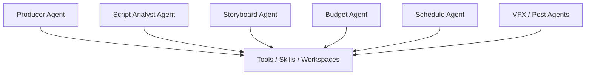
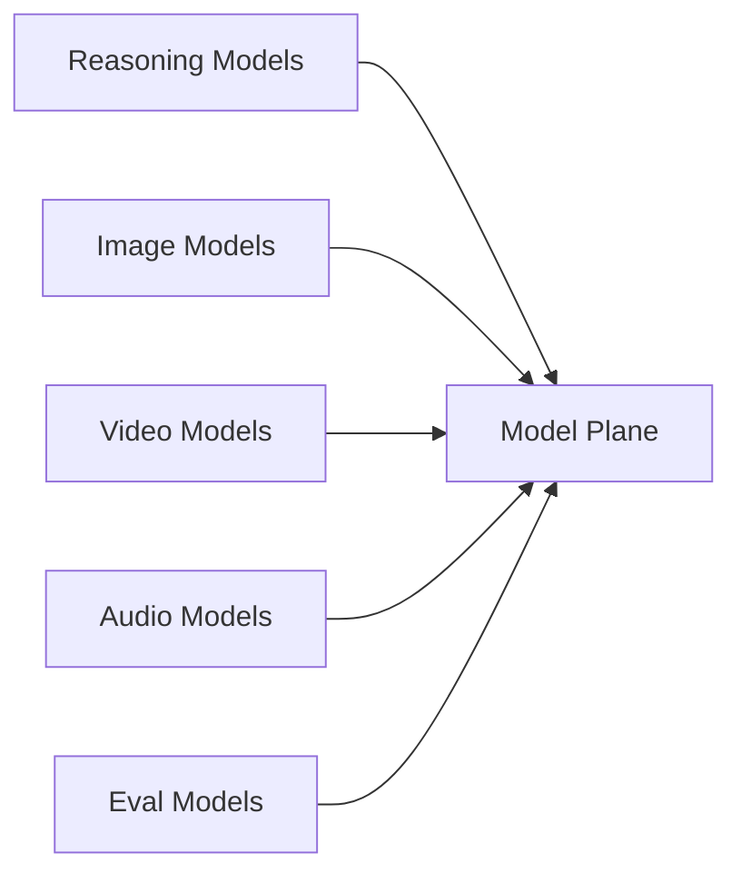
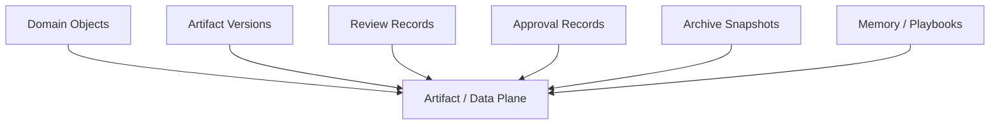
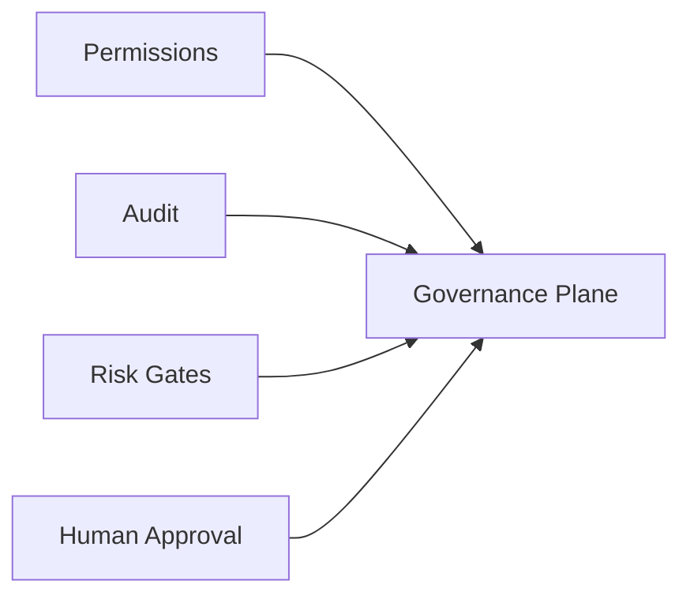
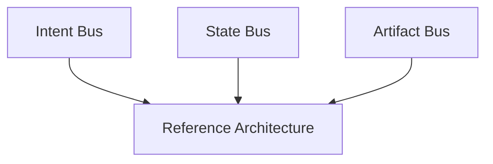
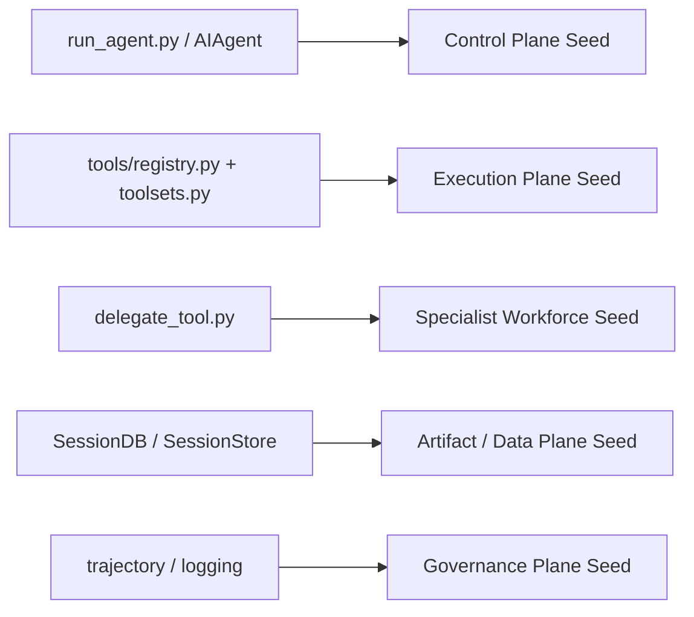
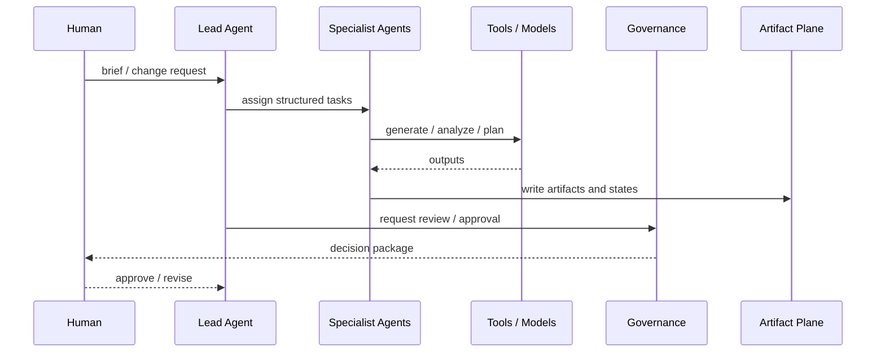
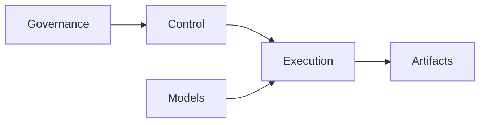

# 105. Hermes Agent 未来参考架构

## 这篇文档回答什么问题

能力蓝图回答了“要长成什么样”，这一篇则回答：

**如果把未来能力落成一个相对稳定的参考架构，Hermes movie mode 应该如何分层。**

本篇重点回答：

1. 未来参考架构的主要平面是什么。
2. 数据、控制与治理如何贯穿这些平面。
3. Hermes 现有代码能落在哪些位置上。

---

## 一、未来参考架构需要至少五个平面

最稳妥的参考架构，不应只分“前端 / 后端”，而应分出五个平面。

五个平面的含义是：

- Governance Plane：权限、审批、审计、评估
- Control Plane：Lead agent、workflow orchestration、dispatch
- Execution Plane：specialist agents、tools、skills、factories
- Model Plane：LLM、image、video、audio、evaluation models
- Artifact / Data Plane：对象、版本、文件、归档、记忆

---

## 二、Control Plane 是未来系统的中心

对电影操作系统来说，核心不应是模型，而应是 control plane。

在 Hermes 语境里，这一层大体对应：

- `AIAgent`
- conversation loop
- task orchestration
- delegate mechanism

但未来会更强结构化。

---

## 三、Execution Plane 负责“把计划变成可执行动作”

Execution Plane 是一组专业工种，而不是一个万能 agent。

这一层负责：

- 接对象
- 产草案
- 跑工具
- 回写状态

---

## 四、Model Plane 在未来会变成“多模型能力网”

未来的 Model Plane 不应被理解成一个模型接口，而是一张能力网。

Lead agent 和 specialist agents 不应直接绑死某一个厂商，而应通过 capability routing 使用模型网。

---

## 五、Artifact / Data Plane 是未来可持续性的地基

没有稳定的数据与产物平面，再强的 agent 也只能是会话型工具。

这一层会把系统从“瞬时生成”带到“长期生产”。

---

## 六、Governance Plane 不是外围能力，而是第一层约束

未来一旦进入视频生成和 agent 执行时代，governance 就不能只在最后补。

尤其在电影领域，Governance Plane 要直接约束：

- 谁能触发什么模型
- 谁能发布什么版本
- 哪些资产必须审批
- 哪些行为必须留痕

---

## 七、未来参考架构中的总线

如果把平面看成静态分层，还不够。还要看穿过它们的三条总线。

三条总线分别承接：

- Intent Bus：brief、creative note、approval decision
- State Bus：workflow state、task state、object state
- Artifact Bus：文件、版本、发布件、归档件

---

## 八、与现有 Hermes 的映射

未来参考架构并不是从零开始。

也就是说，Hermes 已经有雏形，只是这些雏形目前更偏通用协作，还没有完全电影化。

---

## 九、未来运行时视图

未来一次标准运行，大致会像这样：

---

## 十、总结判断

Hermes movie mode 的未来参考架构，最好的理解方式是：

**以 control plane 为中心，以 execution plane 为执行面，以 artifact / data plane 为地基，以 governance plane 为约束，以 model plane 为能力供给网。**

这能让 Hermes 从“通用 agent runtime”继续长成“可治理、可扩展、可长期生产的 AI 媒体操作系统”。

---

## 相关文档

- [103-hermes-agent-movie-integration-strategy-summary.md](./103-hermes-agent-movie-integration-strategy-summary.md)
- [104-hermes-agent-future-capability-blueprint.md](./104-hermes-agent-future-capability-blueprint.md)
- [108-video-models-and-agents-convergence.md](./108-video-models-and-agents-convergence.md)
- [110-hermes-agent-roadmap-for-video-agent-era.md](./110-hermes-agent-roadmap-for-video-agent-era.md)
- [111-video-agents-risk-evals-and-governance.md](./111-video-agents-risk-evals-and-governance.md)
