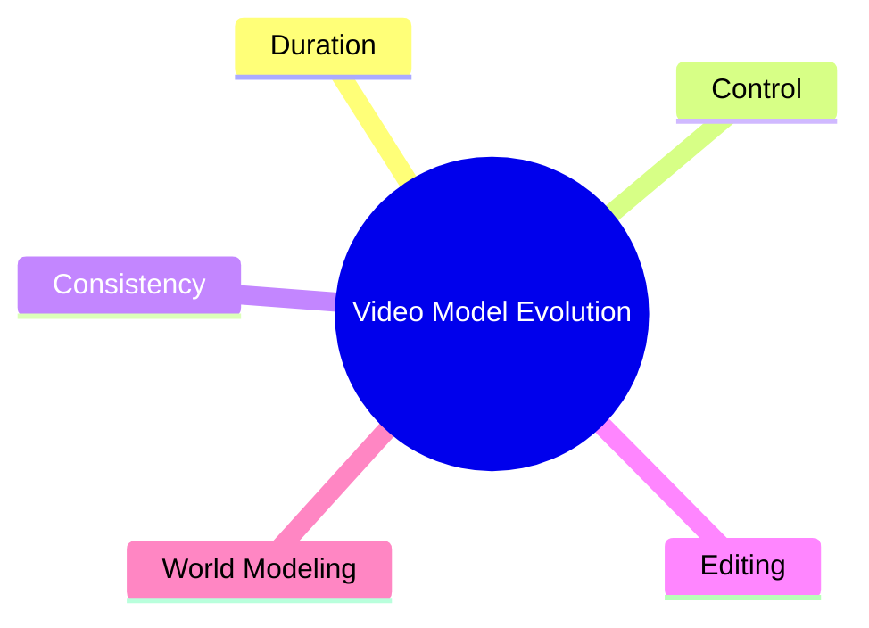
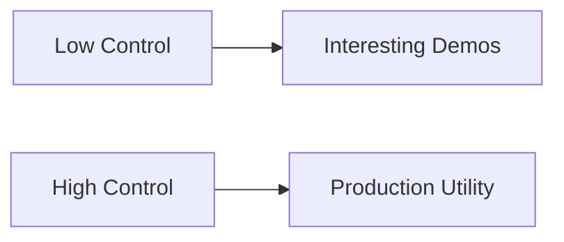
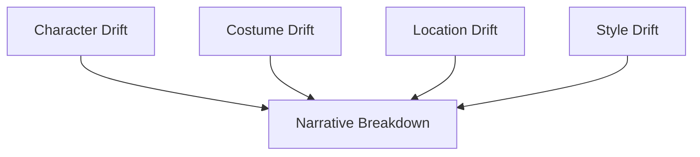
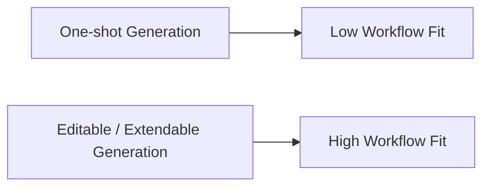
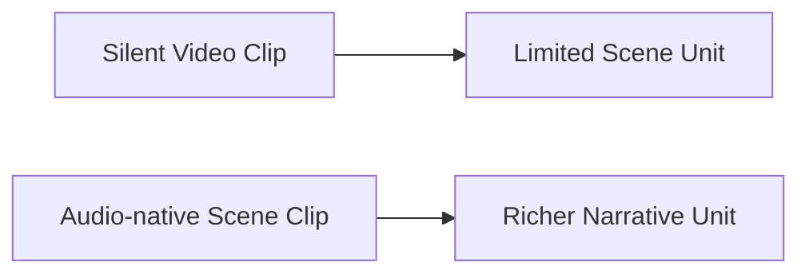
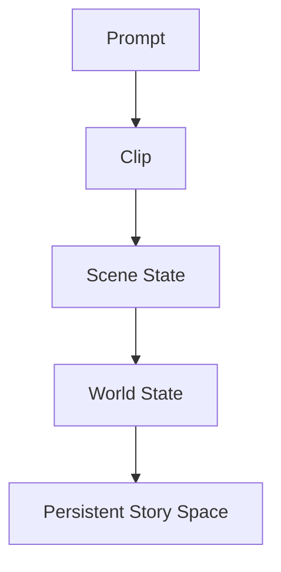
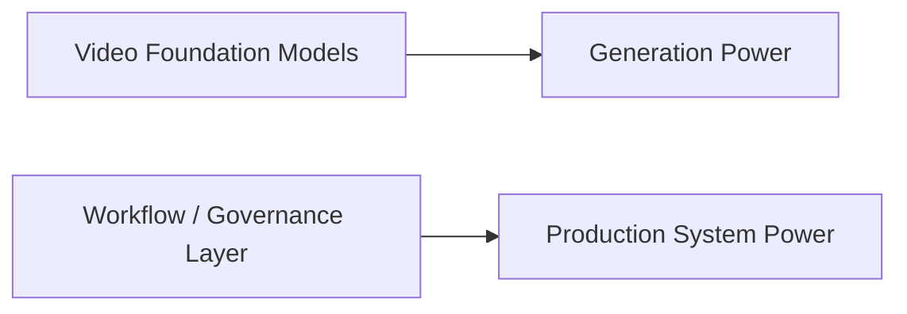
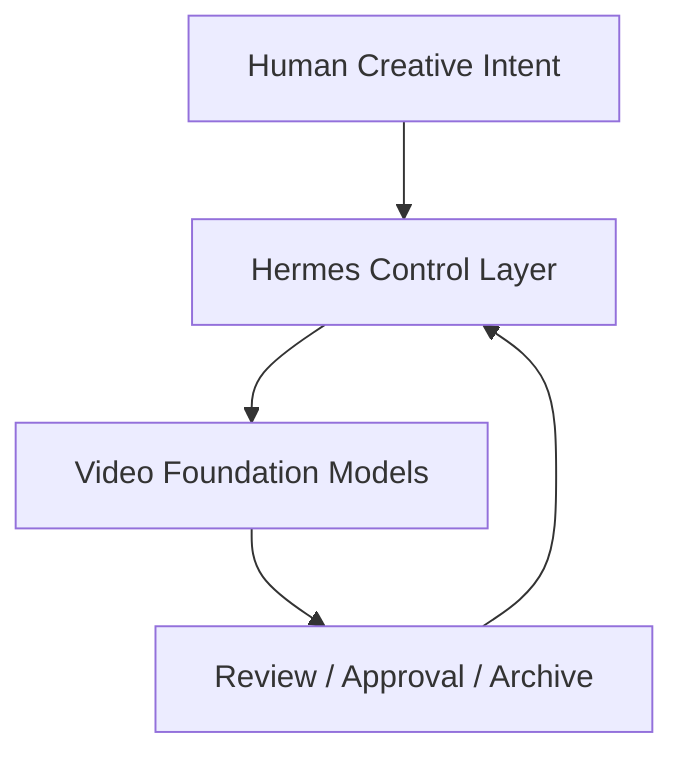
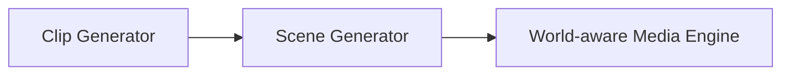

# 106. 视频基础模型的未来演进

## 这篇文档回答什么问题

到了这一篇，我们要从电影平台视角看视频基础模型。

本篇重点回答：

1. 视频基础模型未来最可能沿哪些方向演进。
2. 这些演进对电影生产意味着什么。
3. Hermes 应该把自己放在什么位置上。

---

## 一、视频基础模型的演进，不只是“更长更清晰”

从近年的公开产品方向看，视频模型已经不再只追求单段短视频生成，而是在向：

- 更强控制
- 更稳一致性
- 更自然音频
- 更强编辑能力
- 更像世界模拟

推进。

---

## 二、未来演进的五个主轴

可以把视频模型的未来能力压缩成五个主轴。

分别意味着：

- Duration：时长更长，镜头连接更稳
- Control：镜头、构图、动作、角色控制更细
- Consistency：人物、服装、场景、风格更稳定
- Editing：可修改、可延展、可局部重做
- World Modeling：越来越像可操作的场景空间，而不是一次性结果

---

## 三、控制能力会成为电影价值的关键分水岭

对电影生产来说，最有价值的不是“能生成”，而是“能按意图生成”。

控制能力未来会越来越体现在：

- camera language
- blocking
- lens / lighting intent
- character identity lock
- style package adherence

---

## 四、一致性能力会决定能否进入连续叙事

连续叙事最怕的是对象漂移。

未来视频模型是否能真正进入电影工作流，很大程度上取决于它们能否显著降低这些漂移。

---

## 五、编辑能力会比一次性生成更重要

电影制作不是一次性出结果，而是持续修改。

对平台来说，更重要的未来能力包括：

- extend
- remix
- inpaint / outpaint for motion
- shot revision
- continuity repair

---

## 六、音频原生化会改变视频对象定义

公开产品方向已经显示，视频与音频正在越来越深地耦合。

这意味着未来的 `SceneArtifact` 不再只是视觉结果，而可能天然包含：

- motion
- dialogue
- ambience
- sound effects

---

## 七、世界建模会把视频模型从“素材生成器”推向“场景引擎”

如果把时间继续往后看，视频模型会越来越接近“世界状态生成与演化”。

这对电影平台的意义极大，因为它意味着系统可以围绕：

- world bible
- scene graph
- shot graph
- continuity state

进行组织，而不只是围绕 prompt 文本。

---

## 八、视频模型未来不会独自形成电影系统

即便模型更强，也不等于它们自己就会成为电影操作系统。

原因很简单：

- 模型负责生成能力
- 电影系统还需要对象、版本、review、approval、archive

这正是 Hermes 的位置。

---

## 九、Hermes 在未来视频模型时代的位置

Hermes 不应和视频基础模型竞争，而应作为上层控制与治理系统与之协作。

换句话说：

- 模型负责世界的可生成性
- Hermes 负责生产的可组织性

---

## 十、总结判断

视频基础模型未来最重要的演进方向，不是单点画质，而是：

- 更强控制
- 更稳一致性
- 更深编辑性
- 更强音视频融合
- 更接近世界状态表达

对 Hermes 而言，最关键的不是追逐模型本身，而是提前把承接这些模型的对象、工作流与治理层搭好。

---

## 相关文档

- [91-2026-model-landscape-and-film-ai-stack.md](./91-2026-model-landscape-and-film-ai-stack.md)
- [104-hermes-agent-future-capability-blueprint.md](./104-hermes-agent-future-capability-blueprint.md)
- [107-agents-future-evolution.md](./107-agents-future-evolution.md)
- [108-video-models-and-agents-convergence.md](./108-video-models-and-agents-convergence.md)
- [109-ai-native-media-production-pipeline-future.md](./109-ai-native-media-production-pipeline-future.md)
