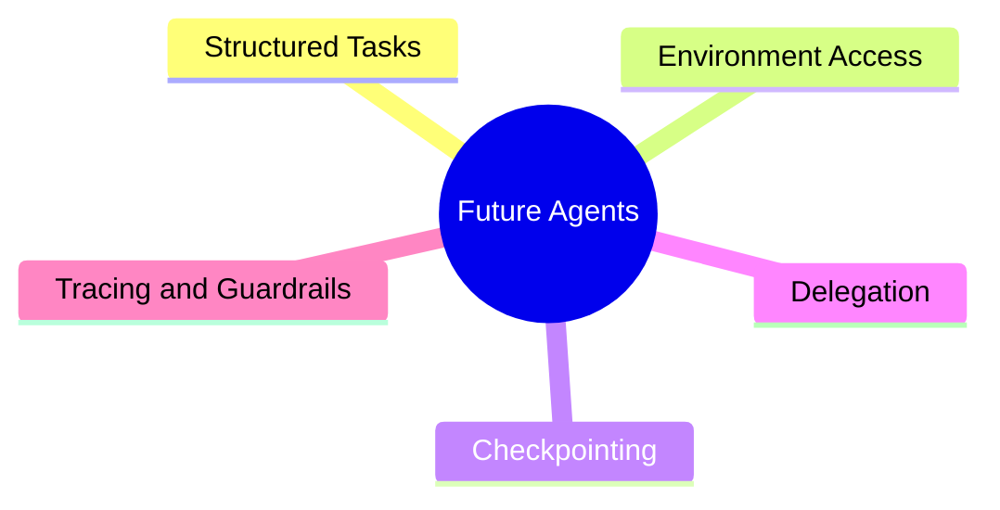
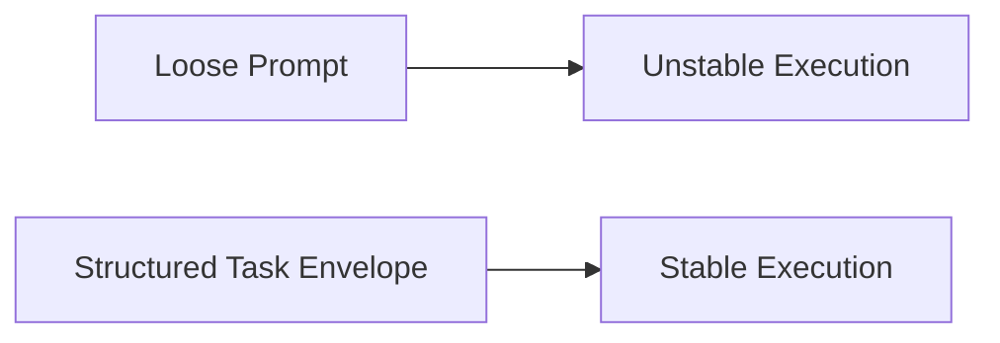
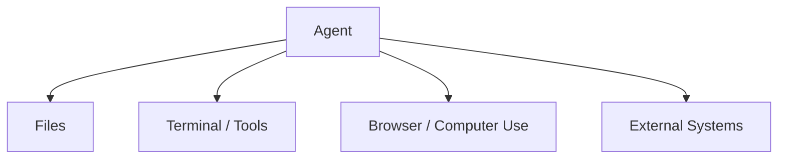
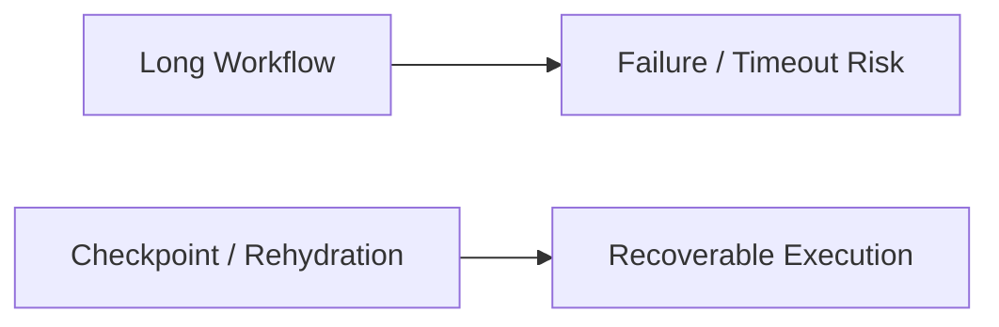
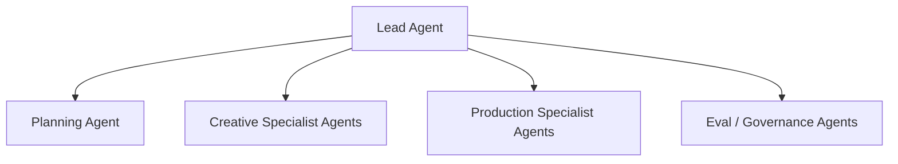
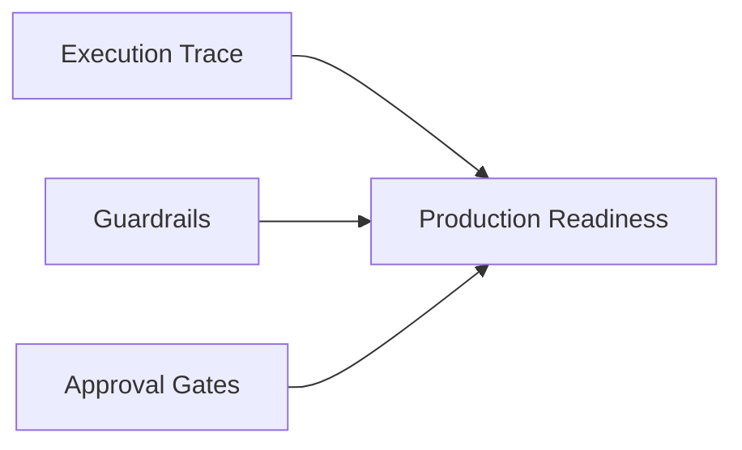
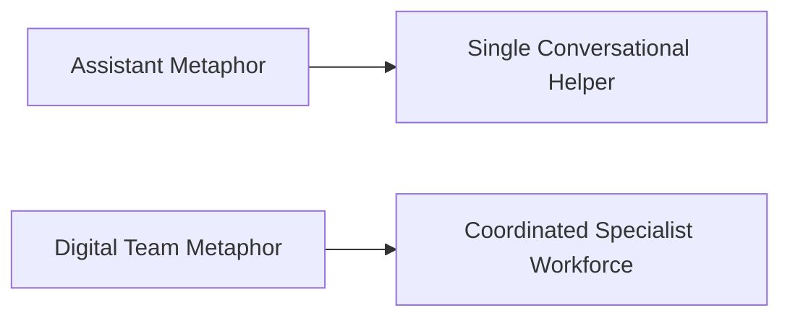
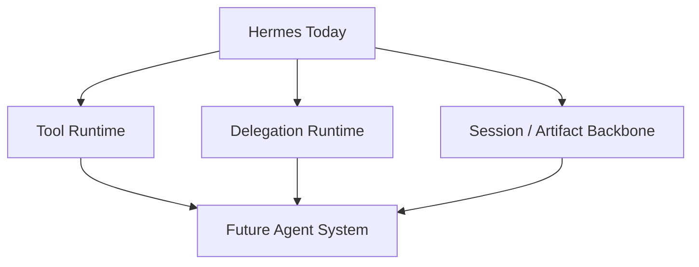

# 107. Agents 的未来演进

## 这篇文档回答什么问题

如果说上一篇讨论的是视频模型，那这一篇讨论的是 agent 本身。

本篇重点回答：

1. agent 正在从什么形态演进到什么形态。
2. 未来 agent 系统最重要的新特征是什么。
3. 这些变化为什么会让 Hermes 更适合成为电影平台。

---

## 一、agent 的演进，不再只是“会调工具的聊天机器人”

从公开产品与开发框架方向看，agent 正在从简单对话代理，走向：

- 长时任务执行
- 环境内工作
- 工具与文件协同
- 状态恢复
- tracing 与 guardrails

的系统。

---

## 二、未来 agent 的五个核心特征

可以把未来 agent 能力压缩成五个关键词。

这五个特征合起来，才会让 agent 真正进入复杂生产场景。

---

## 三、结构化任务会取代松散提示

未来 agent 更像“执行结构化任务”的系统，而不是只接受一段随意 prompt。

这和 movie mode 非常一致，因为电影工作流天然就需要：

- task type
- input object
- owner
- due state
- approval target

---

## 四、环境接入会变成常态

未来的 agent 越来越多地不只处理文本，而是直接在环境中工作。官方产品方向已经在工具、文件和 computer use 上明显推进。

这意味着未来电影 agent 可以直接进入：

- workspace
- asset 目录
- review 系统
- production tracking 系统

---

## 五、checkpoint 与恢复会让长流程真正可用

电影工作流很多任务都不是一轮完成的。

公开的 agent 平台方向已经开始强调 snapshotting、rehydration 和长时任务连续性。

对 movie mode 来说，这会让：

- 多轮评审
- 多日制作
- 大量版本迭代

更适合交给 agent 编排。

---

## 六、delegation 会从“可选技巧”变成“默认架构”

未来 agent 很难长期依赖一个万能主体。

这也是为什么 Hermes 当前的 delegation 机制很有战略意义。

---

## 七、tracing 与 guardrails 会成为生产级 agent 的标配

没有 tracing 的 agent，难以调试；没有 guardrails 的 agent，难以进入高价值场景。

电影行业尤其需要：

- 谁做了什么
- 依据什么对象
- 触发了什么模型
- 为什么版本被发布

---

## 八、未来 agent 会越来越像“数字团队”，而不是“单个助手”

这会改变产品设计语言：

- 从 chat turns 转向 workflow runs
- 从单回复转向 artifact packages
- 从个人助手转向组织协作系统

---

## 九、Hermes 为什么处在合适的位置

Hermes 天然不是一个只会回答问题的 chat wrapper，而已经具备：

- tool orchestration
- delegation
- session persistence
- config / platform integration
- trajectory / logging

这意味着它离未来的多智能体生产系统，比很多只做对话层的产品更近。

---

## 十、总结判断

未来的 agent，不会只是“更会聊天”，而会更像：

- 会接结构化任务
- 会进入环境
- 会长时执行
- 会分工协作
- 会被治理与追踪

这正好与电影操作系统需要的方向高度一致。

---

## 相关文档

- [99-hermes-agent-ai-film-operating-system-overview.md](./99-hermes-agent-ai-film-operating-system-overview.md)
- [104-hermes-agent-future-capability-blueprint.md](./104-hermes-agent-future-capability-blueprint.md)
- [106-video-foundation-models-future-evolution.md](./106-video-foundation-models-future-evolution.md)
- [108-video-models-and-agents-convergence.md](./108-video-models-and-agents-convergence.md)
- [111-video-agents-risk-evals-and-governance.md](./111-video-agents-risk-evals-and-governance.md)
