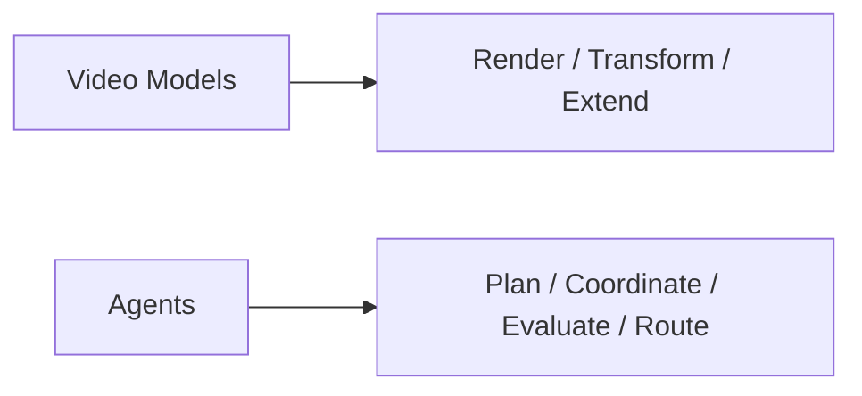
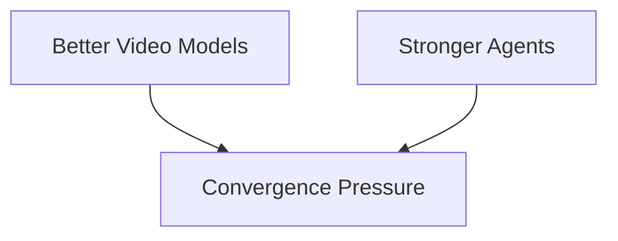
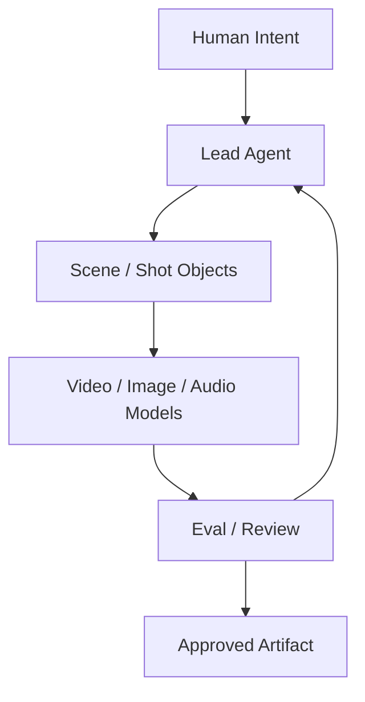
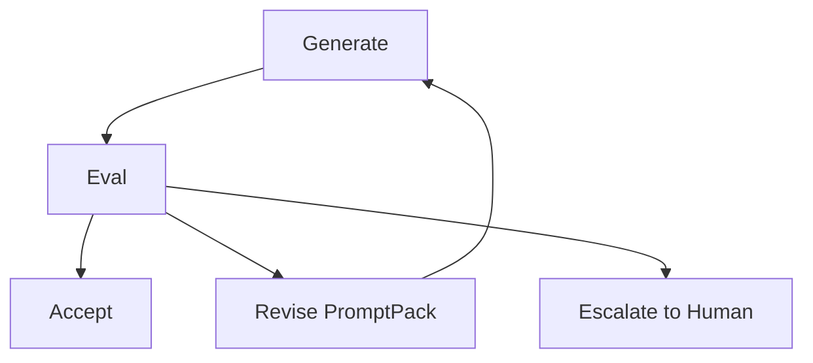
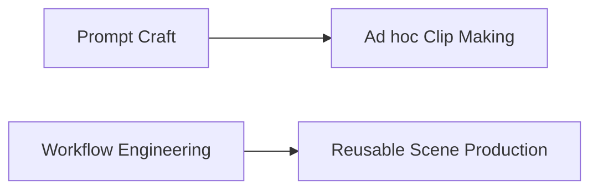
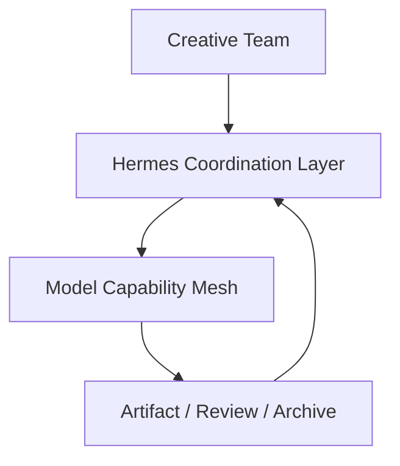
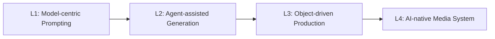
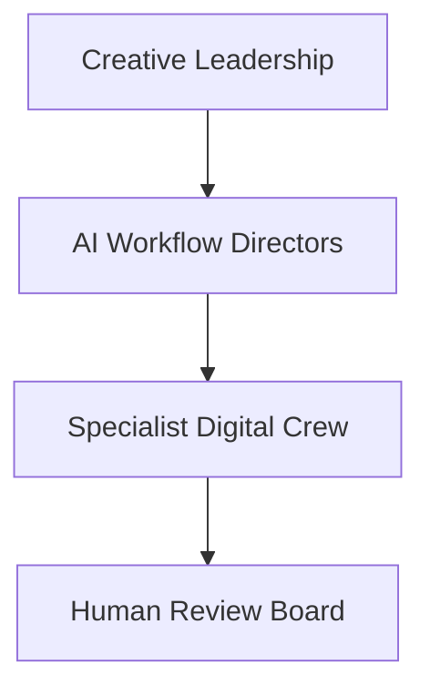
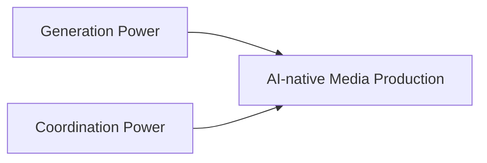

# 108. 视频模型与 Agents 的融合

## 这篇文档回答什么问题

现在要把前两篇真正接起来：

**视频模型越来越强，agent 也越来越强，它们最终会如何融合。**

本篇重点回答：

1. 视频模型与 agent 为什么天然会走向融合。
2. 融合后的系统会长成什么样。
3. Hermes 应该占据融合系统中的哪一层。

---

## 一、视频模型与 agent 的能力边界天然互补

视频模型擅长生成，agent 擅长组织。

二者天然互补，而不是互相替代。

---

## 二、为什么未来一定会融合

一边是视频模型越来越需要：

- 更清晰的意图
- 更稳定的上下文
- 更强的后处理与评估

另一边是 agent 越来越能够：

- 持有状态
- 管理对象
- 调用模型
- 比较版本

因此融合几乎是必然结果。

---

## 三、融合后的基本形态

融合系统里，agent 不直接等于模型，而是作为控制层调用模型。

这个结构会比“直接让用户不断改 prompt”稳定得多。

---

## 四、融合系统中的对象中介层

真正的融合，不应只靠 prompt 连接，而应靠对象连接。

有了对象中介层，系统才有可能：

- 稳定复现
- 管理版本
- 进行 review
- 做跨模型比较

---

## 五、融合系统中的评估回路

视频模型与 agent 融合后，评估不再是可选项，而是核心回路。

因为视频结果很贵、很重、很难完全靠人工逐项比较，所以 eval layer 会越来越重要。

---

## 六、融合会把“镜头制作”从 prompt craft 拉向 workflow engineering

过去很多视频生成实践更像 prompt craft。

融合之后，更重要的会是：

- 输入对象定义
- 模型选择策略
- 版本比较策略
- 审核发布策略

---

## 七、Hermes 在融合系统中的位置

Hermes 最适合的角色，不是自己变成视频模型，而是成为模型之上的编排与治理层。

换句话说：

- 模型负责生成能力
- Hermes 负责多角色、多对象、多版本协作

---

## 八、未来融合系统的成熟度

可以把成熟度简单分成四档。

Hermes 的真正机会在 L3 和 L4。

---

## 九、融合之后的组织影响

视频模型与 agent 融合后，组织分工也会变化。

这会催生新的岗位与协作方式：

- AI workflow director
- model operations owner
- artifact librarian
- eval / governance owner

---

## 十、总结判断

视频模型与 agent 的融合，本质上是：

**生成能力与组织能力的结合。**

Hermes 之所以值得做，不是因为它自己产视频，而是因为它有机会成为这两种力量之间的中枢。

---

## 相关文档

- [105-hermes-agent-future-reference-architecture.md](./105-hermes-agent-future-reference-architecture.md)
- [106-video-foundation-models-future-evolution.md](./106-video-foundation-models-future-evolution.md)
- [107-agents-future-evolution.md](./107-agents-future-evolution.md)
- [109-ai-native-media-production-pipeline-future.md](./109-ai-native-media-production-pipeline-future.md)
- [110-hermes-agent-roadmap-for-video-agent-era.md](./110-hermes-agent-roadmap-for-video-agent-era.md)
