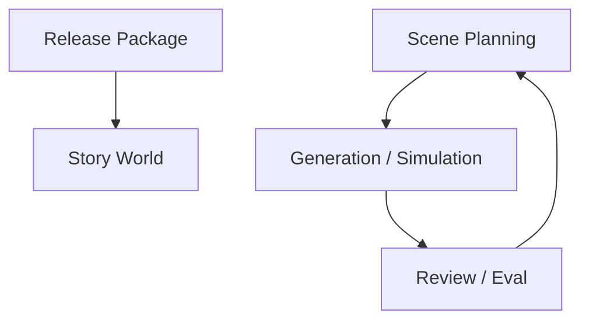
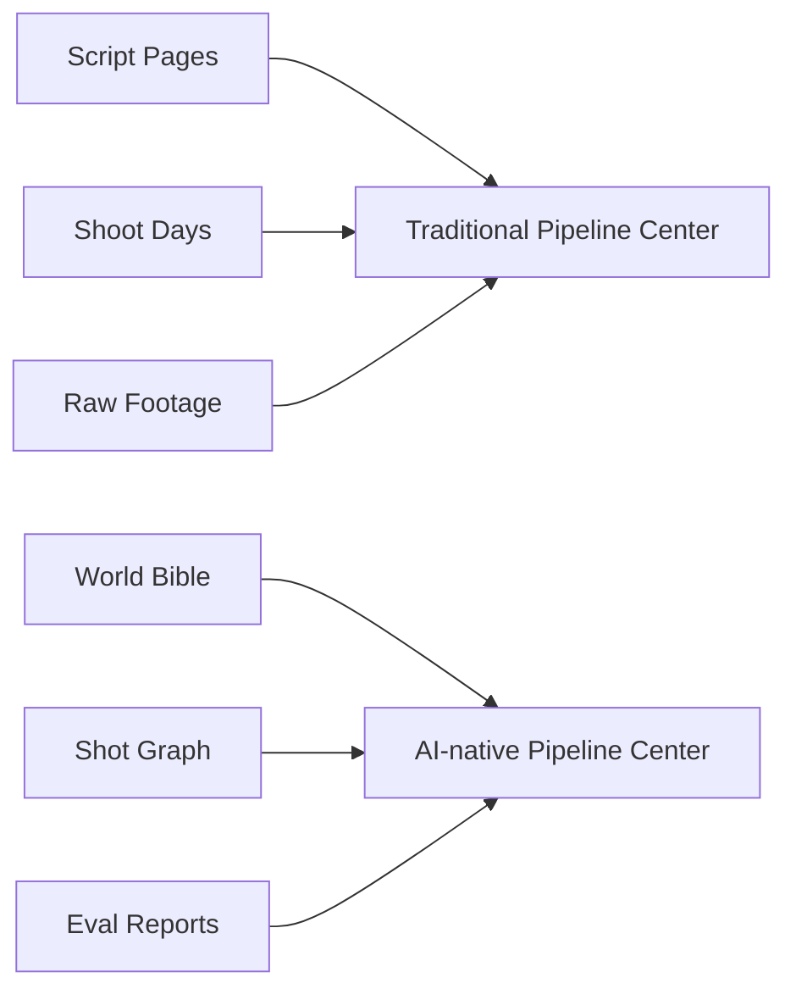
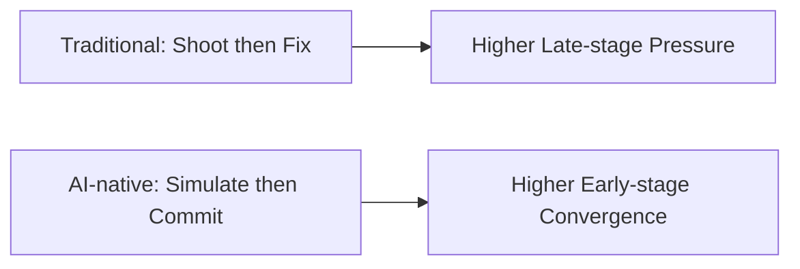
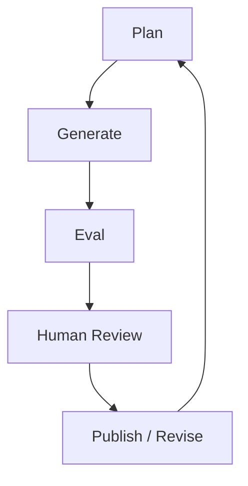
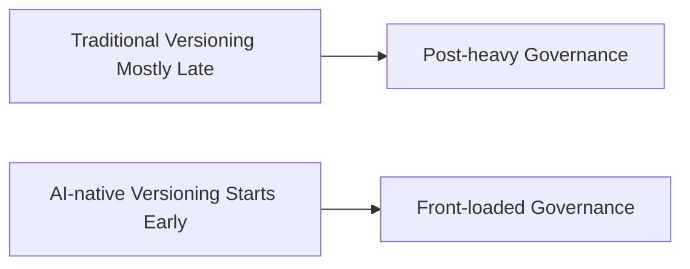
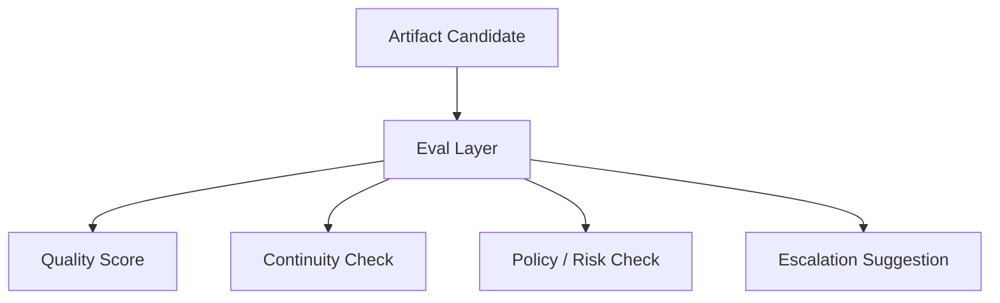
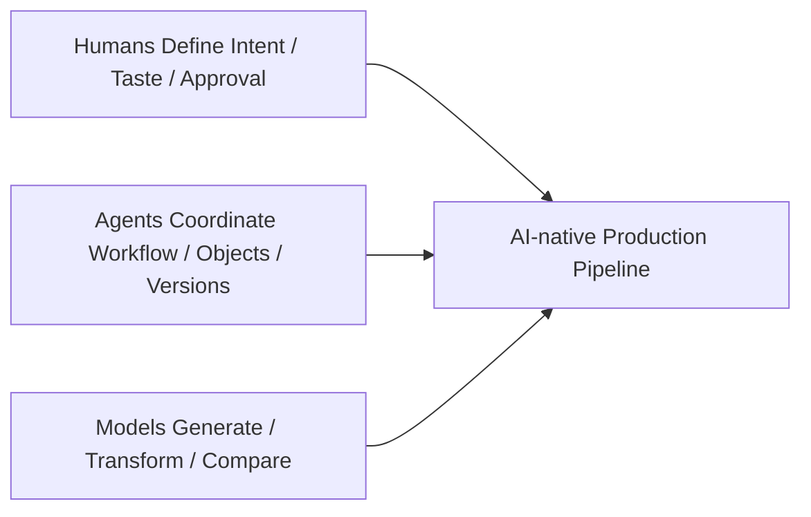
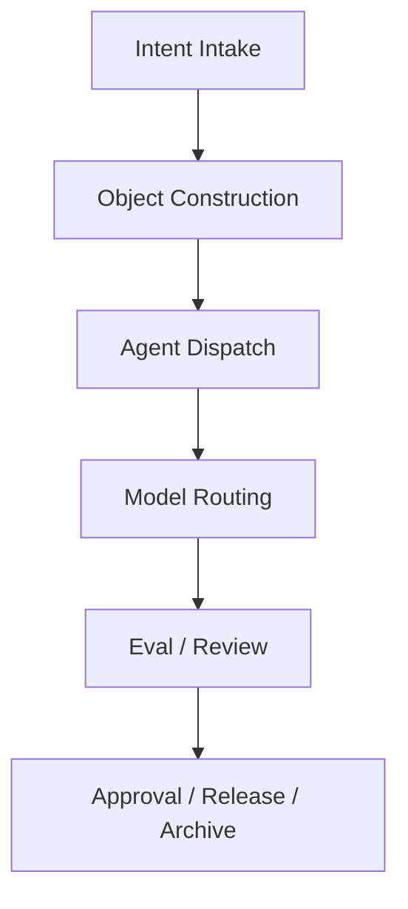
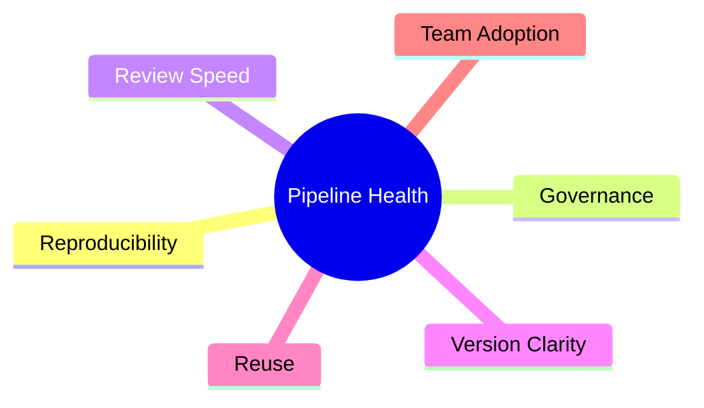

# 109. AI Native 媒体生产管线的未来

## 这篇文档回答什么问题

前面讨论的是模型、agent 和融合关系，这一篇进一步讨论：

**如果媒体生产真正变成 AI native，它的生产管线会和传统电影流程有什么不同。**

本篇重点回答：

1. AI native pipeline 的核心特征是什么。
2. 它会如何重构传统线性流程。
3. Hermes 应该如何承接这种未来管线。

---

## 一、AI native pipeline 不再是严格单向线性流程

传统电影流程更像强阶段性的串行链。

而 AI native pipeline 会更像持续可回写的图状系统。

---

## 二、未来管线的中心对象会发生变化

传统流程围绕剧本页、拍摄日、镜头素材、剪辑时间线组织。

AI native 流程会更围绕：

- world bible
- scene graph
- shot graph
- prompt pack
- eval report
- release package

---

## 三、预制与生成会部分替代“先拍后修”

未来很多内容会在正式执行前被大量预制与模拟。

这会让前期制作的重要性继续上升。

---

## 四、review 会从阶段性动作变成常驻系统

AI native pipeline 里，review 不再只是某几个关键会。

review 会变成贯穿全程的日常机制。

---

## 五、版本治理会比传统后期更早出现

传统电影里的强版本治理往往集中在后期。

AI native 管线里，从剧本分析、shot plan、分镜、参考风格包开始，就已经需要强版本治理。

---

## 六、未来管线会天然需要 eval layer

如果没有 eval layer，AI native pipeline 会迅速失控。

eval layer 会越来越像数字质检部。

---

## 七、未来管线中的人机分工

AI native 不等于无人工，而是重新分工。

这样理解，比“AI 自动拍电影”更贴近现实。

---

## 八、Hermes 如何承接 AI native pipeline

Hermes 最适合承接的不是底层渲染，而是上层生产控制。

这正好对应前面已经设计过的：

- 对象系统
- 子智能体系统
- workflow 状态机
- artifact 与 archive 系统

---

## 九、未来媒体管线的判断标准

未来不应再只问“生成质量高不高”，而要问：

这六项更能判断一个 AI native pipeline 是否真的可生产。

---

## 十、总结判断

AI native 媒体生产管线的未来，本质上不是把传统流程删掉，而是把它从：

- 阶段性串行链

变成：

- 对象驱动
- 持续评估
- 持续审查
- 持续回写

的生产图。

Hermes 若要进入这个未来，最重要的是把 workflow、object、eval、governance 这些中层能力做扎实。

---

## 相关文档

- [67-workflow-state-machine-design.md](./67-workflow-state-machine-design.md)
- [106-video-foundation-models-future-evolution.md](./106-video-foundation-models-future-evolution.md)
- [108-video-models-and-agents-convergence.md](./108-video-models-and-agents-convergence.md)
- [110-hermes-agent-roadmap-for-video-agent-era.md](./110-hermes-agent-roadmap-for-video-agent-era.md)
- [111-video-agents-risk-evals-and-governance.md](./111-video-agents-risk-evals-and-governance.md)
