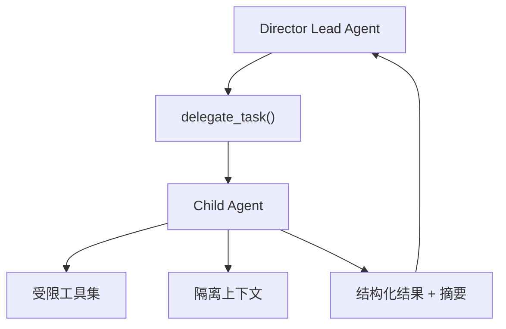
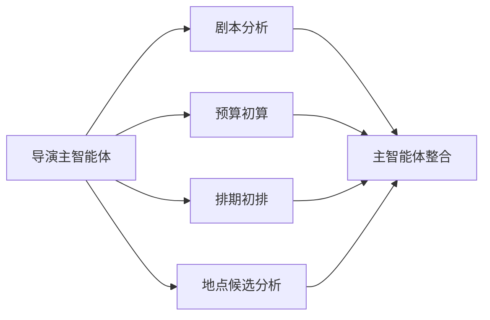
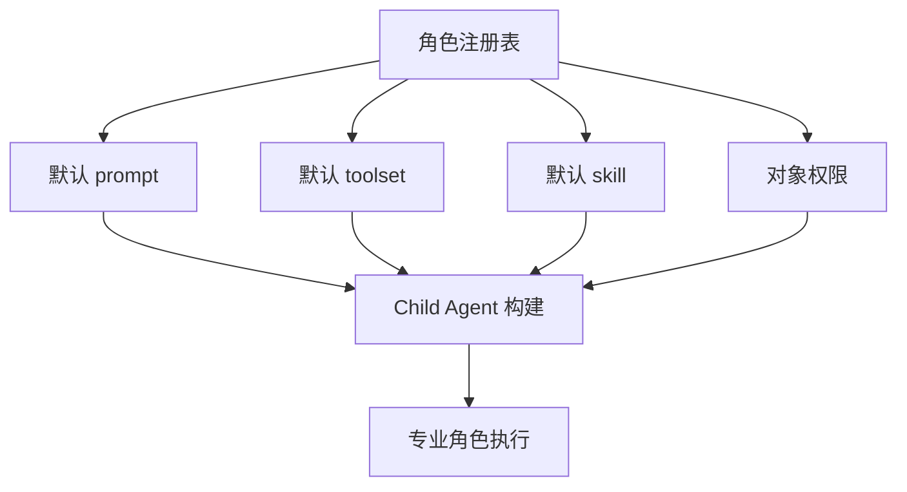

# 11. 源码映射：专业子智能体体系应该如何接到现有委派机制上

## 这篇文档回答什么问题

电影导演智能体方案里，多角色协作是核心能力之一。

本篇要回答：

- 当前 Hermes 的 subagent 机制是怎样工作的
- 它适不适合承接电影岗位化角色
- 如何从通用委派升级成“导演主智能体 + 部门子智能体”

---

## 一、当前最关键入口：`tools/delegate_tool.py`

从源码结构看，当前 Hermes 的子智能体体系主要集中在 `tools/delegate_tool.py`。

它已经明确提供了几个电影场景特别需要的能力：

- 子智能体上下文隔离
- 子智能体工具集限制
- 子智能体独立 task_id
- 父智能体拿到摘要结果，而不是完整中间推理

这与电影项目中“导演听取部门建议、但不把所有细节对话都拉进主线程”的组织方式非常接近。

---

## 二、当前委派机制的关键特征

从源码可以看到几个关键点。

## 1. 存在明确的受限工具规则

`DELEGATE_BLOCKED_TOOLS` 已经禁止子智能体调用：

- `delegate_task`
- `clarify`
- `memory`
- `send_message`
- `execute_code`

这说明当前委派机制的设计哲学是：

- 子智能体要聚焦任务
- 子智能体不应无限扩权
- 子智能体不应擅自改动共享长期状态

这个原则非常适合电影角色化系统。

## 2. 子智能体有默认工具集

当前 `DEFAULT_TOOLSETS` 是：

- `terminal`
- `file`
- `web`

这已经说明子智能体不是纯语言推理，而是带执行能力的专业工作单元。

未来做电影角色系统时，可以进一步按角色覆盖默认工具集。

## 3. 子智能体有专门的 child system prompt

`_build_child_system_prompt()` 当前会把：

- 任务目标
- 任务上下文
- 工作区路径
- 输出摘要要求

拼成专用系统提示。

这意味着电影子智能体非常适合复用这一模式，只需把“专业角色约束”继续补进去。

## 4. 可以批量并行执行

当前委派机制支持批量任务和并行 child agent，这对电影前期非常有价值。

例如可以并行：

- 剧本分析
- 预算初算
- 排期初排
- 地点候选分析

---

## 三、为什么当前委派机制适合电影岗位化

电影项目中的很多角色，本质上就是“围绕特定对象和约束给出专业建议”。

这与当前 child agent 模式天然贴合。

例如：

- Script Analyst Agent：只围绕剧本、人物、主题工作
- Budget Agent：只围绕 breakdown 和资源工作
- Scheduling Agent：只围绕场景、日程、演员约束工作
- Storyboard Agent：只围绕场景视觉和 shot planning 工作

它们都非常适合用当前的受限上下文 + 受限工具集 + 摘要返回模式实现。

---

## 四、当前机制离电影角色系统还差什么

尽管底座很好，但如果直接使用现有 `delegate_task()`，仍然缺少几层电影化能力。

## 1. 缺少正式角色注册表

现在的委派更多是“给一个任务描述”，而不是“调用一个明确角色”。

未来应该新增角色注册信息，例如：

- 角色名称
- 角色职责
- 默认工具集
- 默认 skill 包
- 可读写对象范围
- 适用阶段

## 2. 缺少对象输入输出契约

现在 child agent 主要返回摘要，但电影角色最好还要返回结构化结果，例如：

- `BudgetDraft`
- `ScheduleDraft`
- `ShotPlanDraft`

这样主智能体更容易合并与治理。

## 3. 缺少阶段激活规则

当前委派机制并不知道当前项目处于前期、拍摄还是后期。

未来需要在 delegation 上层加一层判断：

- 本阶段允许哪些角色被调用
- 哪些角色应该默认开启
- 哪些角色必须审批后才能修改关键对象

## 4. 缺少角色级权限

电影角色之间不应拥有完全对等的写权限。

例如：

- 预算 agent 可以建议预算修改
- 但不应直接锁定剧本版本

---

## 五、建议的电影角色化委派模型

可以在现有 `delegate_task` 之上叠加一层更清晰的角色模型。

建议逻辑如下：

1. Director Lead Agent 判断需要哪个角色。
2. 角色注册表提供该角色的默认 prompt、toolset、skill 和对象权限。
3. 系统把角色信息注入 child system prompt。
4. 子智能体围绕目标对象输出结构化结果和摘要。
5. 主智能体决定是否采纳、合并、升级或进入审批。

这样既复用当前底座，又能实现岗位化协作。

---

## 六、最适合优先落地的角色接法

第一阶段最适合先接入以下角色：

- `script_analyst`
- `budget_planner`
- `schedule_planner`
- `storyboard_planner`
- `location_scout`

每个角色先定义四件事即可：

- 角色描述
- 默认工具集
- 默认 skill
- 输出 schema

这样比一开始做十几个角色更稳。

---

## 七、和主智能体的协作边界

一个很重要的原则是：子智能体负责专业分析和草案生成，主智能体保留整合权与最终判断权。

在当前 Hermes 结构下，这个边界也最自然：

- `run_agent.py` 的主循环继续掌握主线程
- `tools/delegate_tool.py` 只负责执行被委派的专业任务

这保证电影项目不会变成多 agent 之间彼此拉扯、无人负责的系统。

---

## 八、结论

当前 Hermes 的 `delegate_task` 已经提供了电影岗位化系统最关键的底座：

- 隔离上下文
- 受控工具集
- 独立执行
- 摘要回传

movie 方向真正要新增的，不是另一套 subagent 引擎，而是：

- 角色注册表
- 角色默认能力包
- 对象输入输出契约
- 阶段激活与权限规则

这就是从通用 delegation 升级到电影角色系统的主路径。

---

## 相关文档

- [05-agent-system.md](./05-agent-system.md)
- [10-source-mapping-agent-runtime.md](./10-source-mapping-agent-runtime.md)
- [52-director-lead-agent-design.md](./52-director-lead-agent-design.md)
- [72-task-tool-and-delegation-extension.md](./72-task-tool-and-delegation-extension.md)
- [73-subagent-registry-cinema-extension.md](./73-subagent-registry-cinema-extension.md)
