# 110. Hermes Agent 面向 Video Agent 时代的路线图

## 这篇文档回答什么问题

前面几篇讲的是未来方向，这一篇要把它们收束成行动路径：

**如果未来进入 video agent 时代，Hermes 应该怎样分阶段演进。**

本篇重点回答：

1. Hermes 当前处在什么位置。
2. 未来最合理的阶段路线是什么。
3. 每一阶段最关键的交付成果是什么。

---

## 一、Hermes 当前的位置

Hermes 当前已经具备一个很关键的起点：

- 通用 agent runtime
- tool orchestration
- delegation
- session / artifact backbone
- config / platform integration

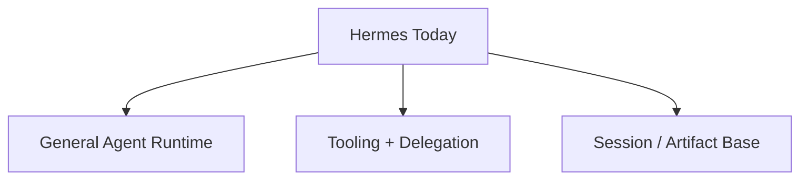

这说明它并不是从零开始，而是已经站在 video agent 时代的门口。

---

## 二、Video Agent 时代真正需要补的是什么

缺的主要不是“再接一个模型”，而是几个中层能力。

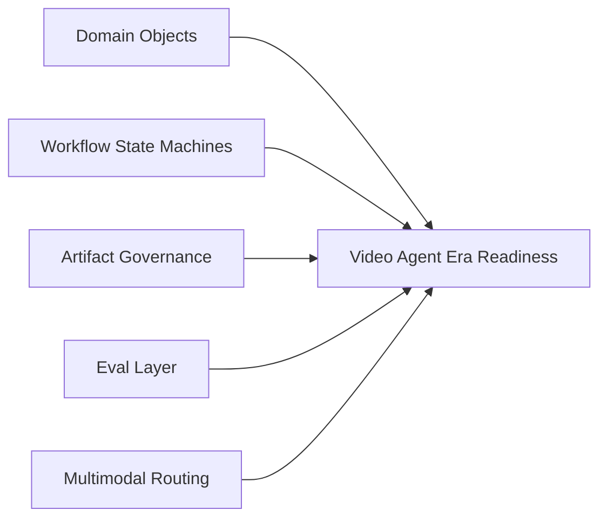

---

## 三、阶段路线图总览

最推荐的路线不是跳跃式，而是五段式。

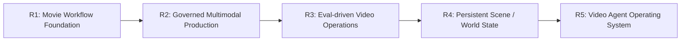

---

## 四、R1：Movie Workflow Foundation

第一阶段的重点仍然是把电影工作流层真正稳定下来。

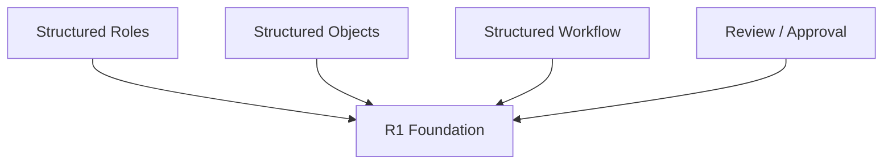

这一阶段的主要交付是：

- director lead agent
- movie subagent registry
- `MovieThreadState`
- review / approval 基础设施

---

## 五、R2：Governed Multimodal Production

第二阶段进入多模态能力接入，但仍然以治理为先。

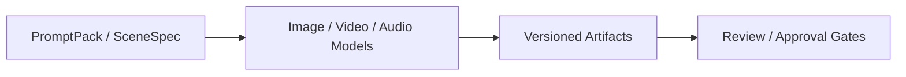

这一阶段的关键不是“能不能生视频”，而是：

- 能否有对象归属
- 能否有版本清晰度
- 能否有审核边界

---

## 六、R3：Eval-driven Video Operations

第三阶段要真正把 eval 引入主链路。

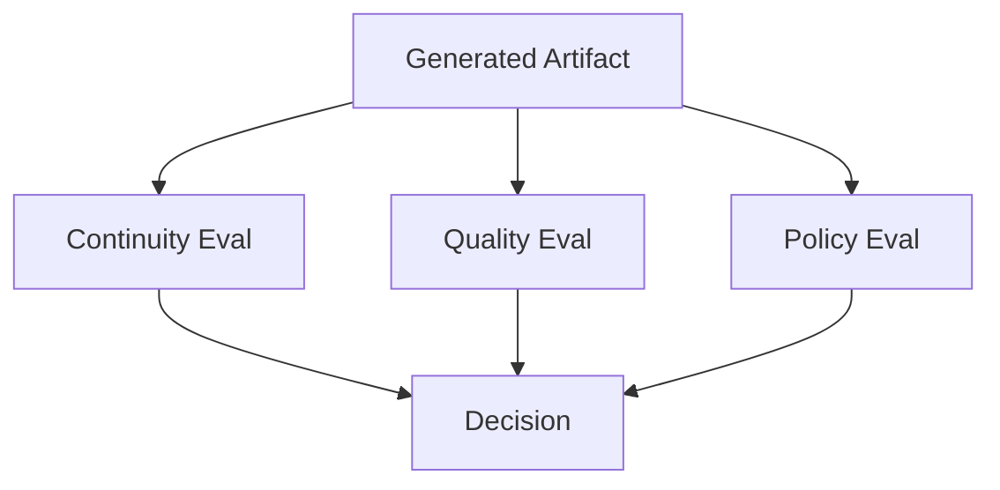

没有这一层，系统很难扩大规模。

---

## 七、R4：Persistent Scene / World State

第四阶段要逐步从“片段式资产生产”走向“持续状态化生产”。

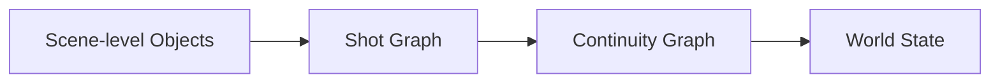

这时 Hermes 开始不仅管理任务和版本，也开始管理更持久的媒体语义状态。

---

## 八、R5：Video Agent Operating System

最终阶段，Hermes 会更接近一个真正的 video agent operating system。

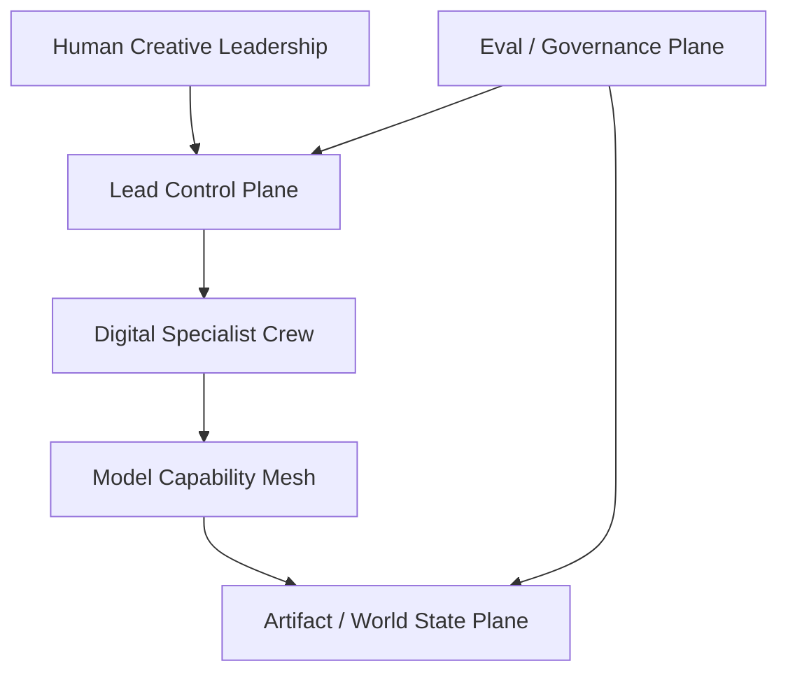

---

## 九、阶段推进的核心门槛

每一阶段都应该有自己的“升级门槛”。

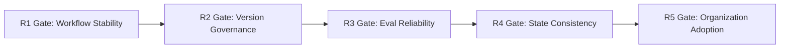

这样可以避免系统过早追逐远期目标而基础不稳。

---

## 十、路线图中的技术原则

再强调一次，路线图推进时应坚持几条原则。

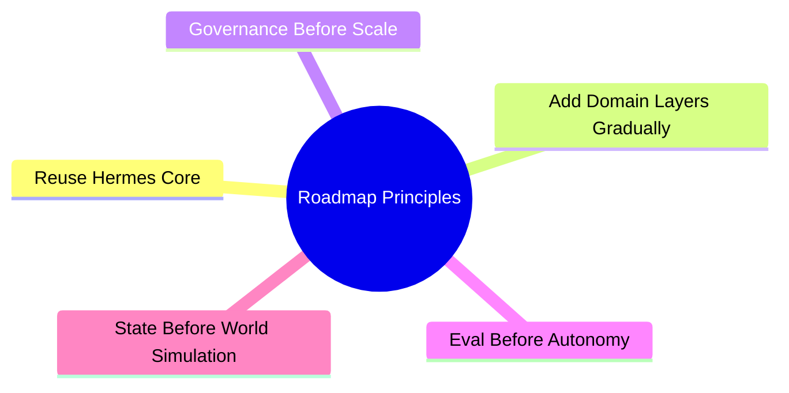

---

## 十一、总结判断

Hermes 面向 video agent 时代的最优路线，不是一步跳到全自动媒体生产，而是：

- 先把 movie workflow 做稳
- 再把多模态版本治理做起来
- 再把 eval、scene state、world state 一层层接上

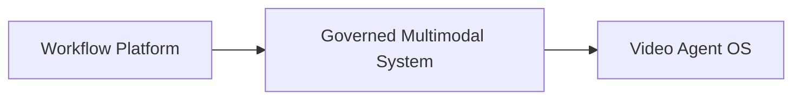

这条路线更慢一些，但更真实，也更容易走成。

---

## 相关文档

- [104-hermes-agent-future-capability-blueprint.md](./104-hermes-agent-future-capability-blueprint.md)
- [105-hermes-agent-future-reference-architecture.md](./105-hermes-agent-future-reference-architecture.md)
- [106-video-foundation-models-future-evolution.md](./106-video-foundation-models-future-evolution.md)
- [108-video-models-and-agents-convergence.md](./108-video-models-and-agents-convergence.md)
- [111-video-agents-risk-evals-and-governance.md](./111-video-agents-risk-evals-and-governance.md)
- [118-program-governance-roadmap-and-operating-metrics.md](./118-program-governance-roadmap-and-operating-metrics.md)
