# 111. Video Agents 的风险、评测与治理

## 这篇文档回答什么问题

一旦进入 video agent 时代，系统能力会上升，风险也会同步上升。

本篇重点回答：

1. video agents 最核心的风险是什么。
2. 应该怎样设计评测体系。
3. 应该怎样把治理变成运行时的一部分。

---

## 一、Video Agent 风险不是单一风险，而是复合风险

video agents 同时叠加了：

- agent 风险
- 多模态生成风险
- 资产治理风险
- 组织流程风险

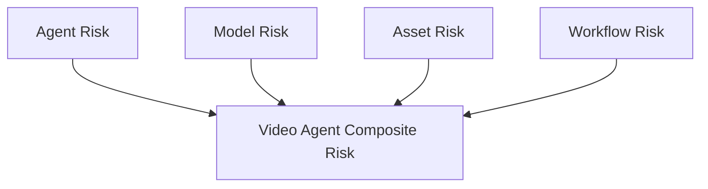

---

## 二、最关键的风险分组

可以把核心风险先分成六类。

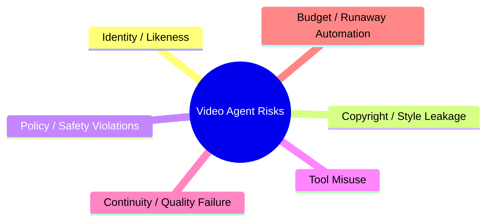

这六类几乎覆盖了 video agent 进入真实生产时最常见的高风险面。

---

## 三、身份与肖像风险

当系统能生成更稳定的人物、声音与镜头时，identity 风险会显著上升。

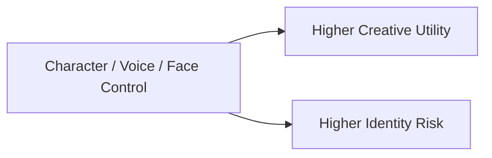

因此治理层应特别关注：

- likeness consent
- talent approval
- reference restrictions
- release authorization

---

## 四、版权与风格风险

在电影语境中，风险不只来自直接侵权，也来自风格边界不清。

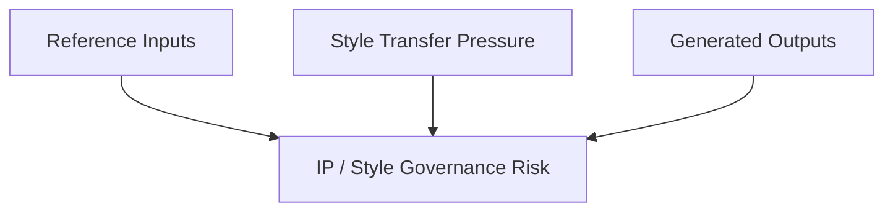

这要求系统对：

- 输入引用
- 允许的参考范围
- 输出用途
- 发布级别

做更细治理。

---

## 五、agent 工具滥用风险

一旦 agent 可以访问文件、浏览器、终端、外部系统，风险就不只停留在内容层。

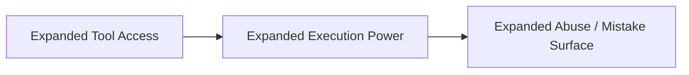

公开的 agent 产品与政策也已经明显把 computer use、长时任务和恶意使用防护当作重点。

---

## 六、质量与连续性风险

Video agent 即使没有违规，也可能生成“流程上不可用”的结果。

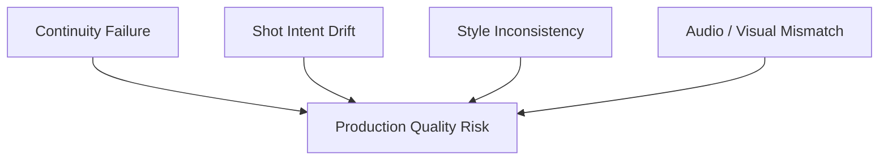

所以“安全”不等于“可用”，需要独立的 production eval。

---

## 七、评测体系必须至少分三层

Video agent 的评测不能只测模型，也不能只测工作流。

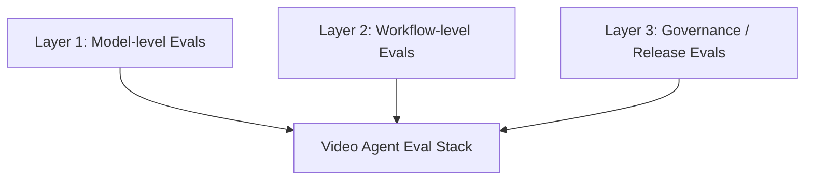

分别负责：

- 模型层：生成质量、控制能力、稳定性
- 工作流层：对象流转、版本清晰度、人工干预点
- 治理层：权限、留痕、审批、合规、发布边界

---

## 八、运行时治理应内嵌到主链路

治理不能只在上线前做一次审查，而应嵌入主链路。

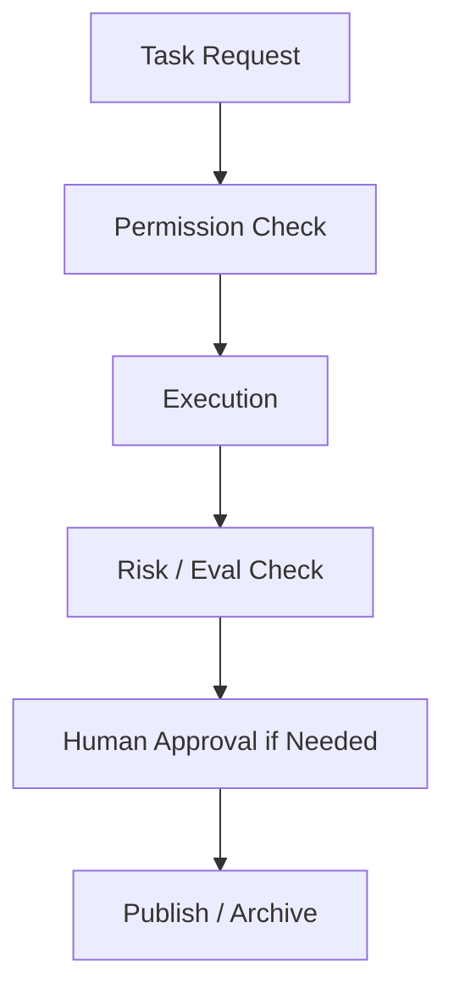

这是 video agent 与普通创作工具的关键区别。

---

## 九、最推荐的治理机制

对 Hermes movie mode 来说，最推荐的治理机制有五类。

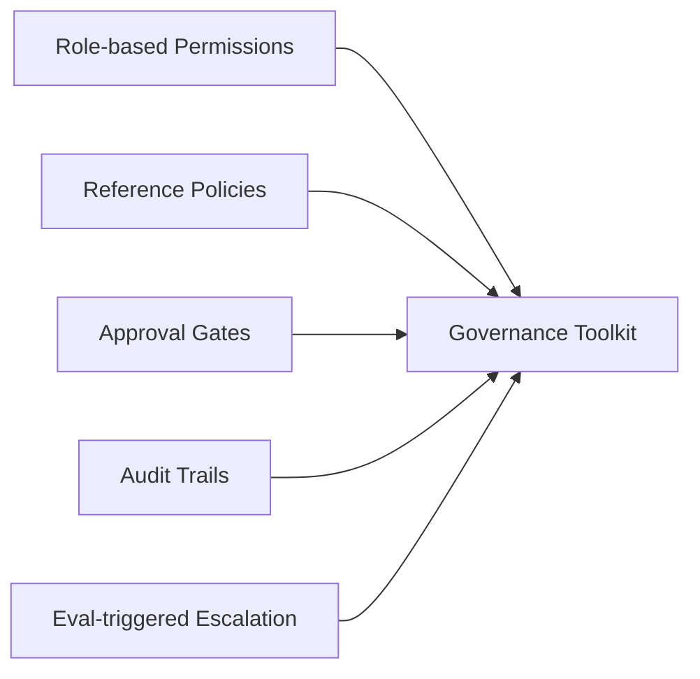

这五类机制比一个笼统的“安全开关”有效得多。

---

## 十、组织层面的治理同样重要

只有技术治理，没有组织治理，也很难落地。

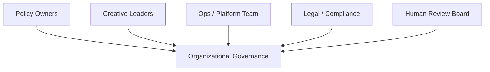

这意味着 video agent 时代的治理，不只是工程问题，也是运营问题。

---

## 十一、总结判断

Video agent 时代真正可行的路径，不是“能力先上，治理再补”，而是：

- 风险识别先行
- eval stack 随系统一起建设
- 治理直接嵌入运行时

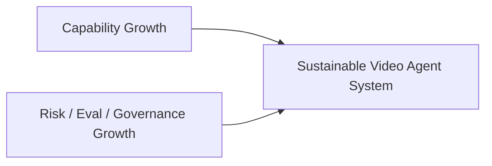

只有这样，Hermes 才可能从 movie mode 继续走向真正可控的 video agent operating system。

---

## 相关文档

- [88-security-permissions-and-audit.md](./88-security-permissions-and-audit.md)
- [105-hermes-agent-future-reference-architecture.md](./105-hermes-agent-future-reference-architecture.md)
- [108-video-models-and-agents-convergence.md](./108-video-models-and-agents-convergence.md)
- [110-hermes-agent-roadmap-for-video-agent-era.md](./110-hermes-agent-roadmap-for-video-agent-era.md)
- [118-program-governance-roadmap-and-operating-metrics.md](./118-program-governance-roadmap-and-operating-metrics.md)
