# 112. AI Coding 与多智能体交付计划

## 这篇文档回答什么问题

前面的文档已经把 movie mode 的业务蓝图、对象系统、治理体系和未来路线写清楚了。接下来要回答一个更落地的问题：

**如果真的开始研发，应该怎样用 AI coding 与多智能体交付方式，把 movie mode 一步步做出来。**

本篇重点回答：

1. 研发交付模型应该怎样设计。
2. 多智能体在研发阶段应该如何分工。
3. PR、测试、评审、交付应该怎样串起来。

---

## 一、AI coding 不是“让一个 agent 写完全部代码”，而是建立一条更高吞吐的交付链

最重要的判断是：

- 不要把 AI coding 理解成单个万能 coder
- 要把它理解成一条更高并发的 delivery pipeline

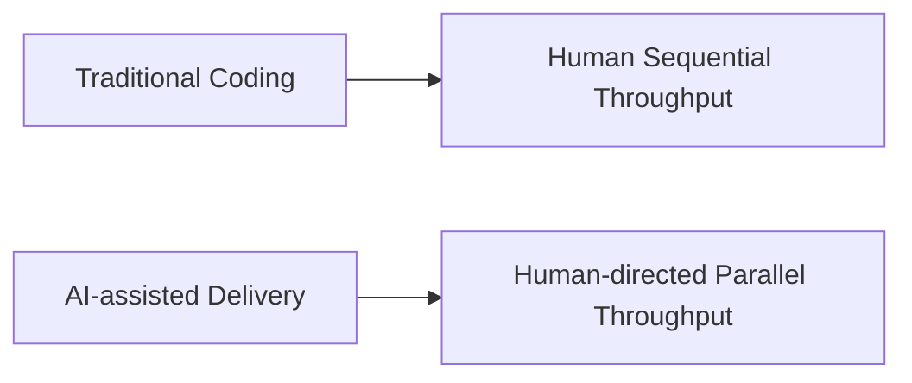

在 movie mode 里，这尤其重要，因为需求跨：

- agent runtime
- state
- tools
- artifacts
- governance

单线程推进会很慢。

---

## 二、多智能体交付的基本角色

研发阶段至少应有五类角色。

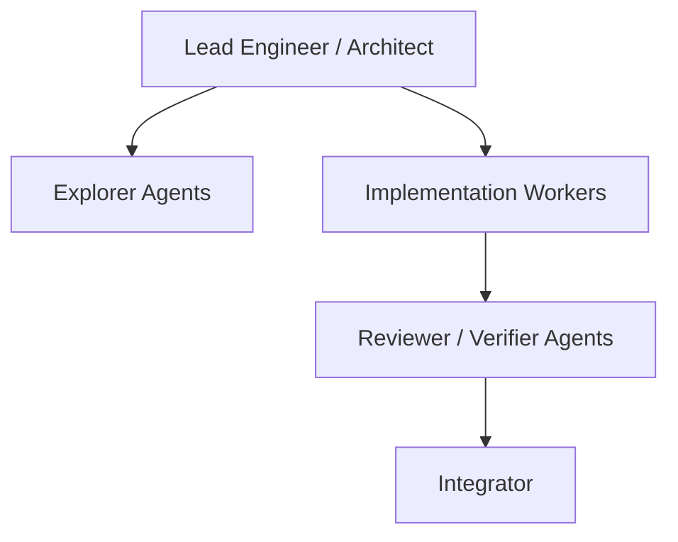

对应关系可以理解成：

- Lead Engineer：定义边界、分配切片、做最终判断
- Explorer：读代码、找入口、提方案
- Worker：实现具体模块
- Reviewer：查回归、查接口破坏、查测试缺口
- Integrator：合并、补缝、收口

---

## 三、最推荐的工作切片方式

交付切片不应按“人头”切，而应按“责任边界”切。

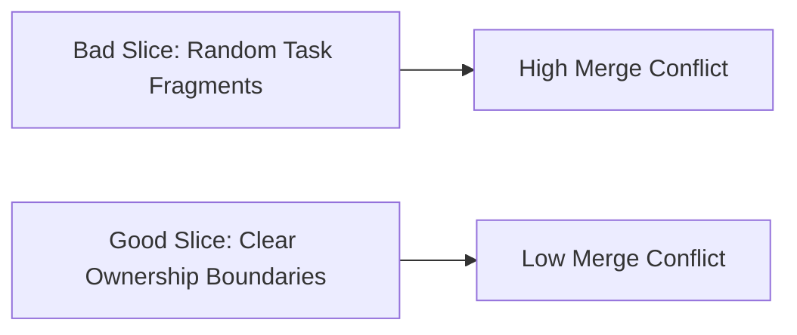

最适合的切法通常是：

- 按模块
- 按对象系统
- 按工具集
- 按接口层
- 按测试层

对 movie mode 来说，一个典型切片可以是：

- `MovieThreadState`
- movie tool registry
- subagent registry
- artifact packaging
- approval workflow

---

## 四、交付计划的推荐阶段

可以把研发交付拆成五段。

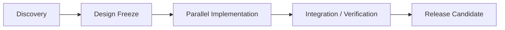

每段分别解决：

- Discovery：入口和依赖
- Design Freeze：接口和边界
- Parallel Implementation：并行编码
- Integration / Verification：联调和补测试
- Release Candidate：验收和发布

---

## 五、Discovery 阶段的目标

Discovery 不是泛泛调研，而是输出结构化交付图。

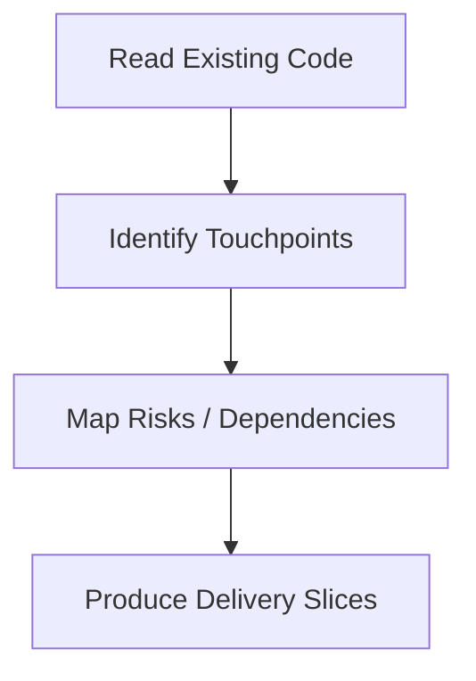

对 Hermes movie mode，Discovery 的重点应聚焦：

- `run_agent.py`
- `model_tools.py`
- `toolsets.py`
- `tools/delegate_tool.py`
- `gateway/session.py`
- `hermes_state.py`
- `agent/trajectory.py`

---

## 六、Design Freeze 阶段的核心产物

在真正并行实现前，至少要冻结三样东西。

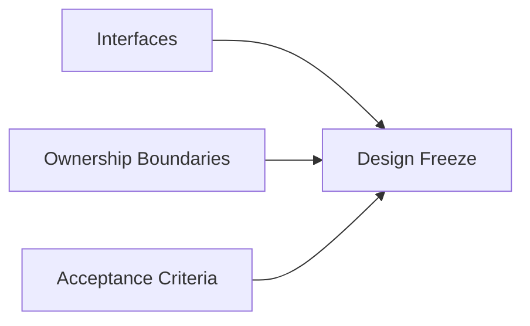

如果这一步没做好，多智能体并行很容易变成：

- 重复实现
- 来回返工
- 相互覆盖

---

## 七、并行实现的推荐组织方式

并行阶段最适合使用“主控 + 多工位”的方式。

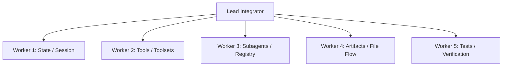

这种方式的优点是：

- 写入边界清楚
- 并发收益大
- 更容易及时收口

---

## 八、PR 切片策略

不要等待“大而全”的 movie branch 一次性完成。

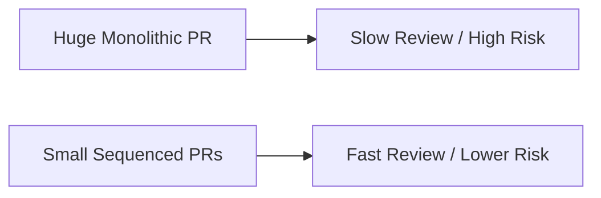

更推荐的 PR 序列是：

1. state / object skeleton
2. registry / config plumbing
3. tool wiring
4. subagent wiring
5. artifact / review plumbing
6. tests and docs

---

## 九、测试与验证策略

AI coding 不是减少测试，而是更需要层次化验证。

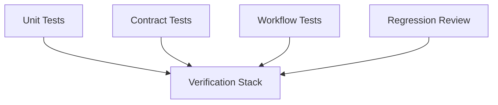

对 movie mode，最关键的验证层包括：

- 状态迁移是否正确
- tool schema / dispatch 是否正确
- delegation 是否保持上下文边界
- artifact 输出是否稳定

---

## 十、交付中的人机关系

AI coding 的最佳模式，不是“人不看”，而是“人做导演，agent 做执行队列”。

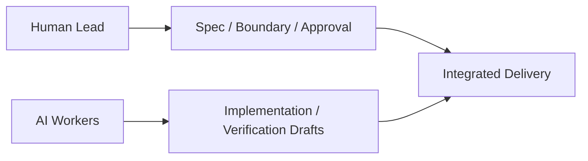

也就是说：

- 人类控制方向与边界
- agents 提供吞吐量
- 最终由集成人负责系统一致性

---

## 十一、推荐的 movie mode 第一批交付包

如果只做第一批，最推荐的交付包是：

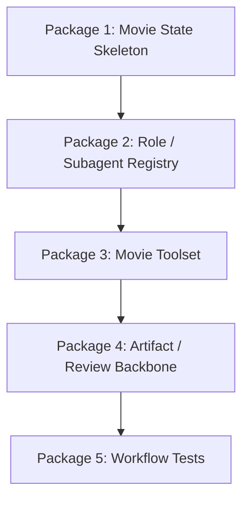

这比一开始就追求复杂视频生成更稳。

---

## 十二、总结判断

AI coding 与多智能体交付计划的关键，不是“让更多 agent 一起写”，而是：

- 切片清楚
- 边界清楚
- 验收清楚
- 集成清楚

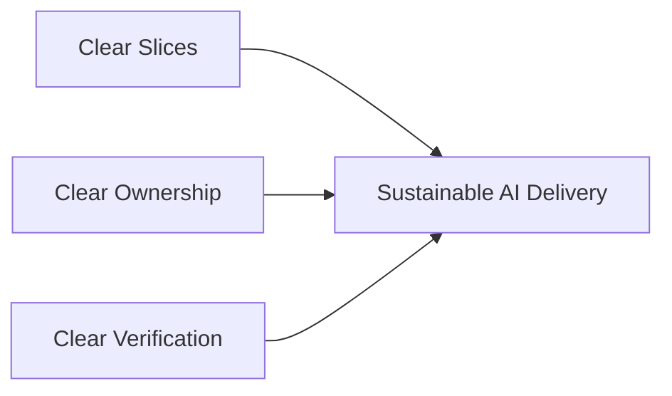

只有这样，movie mode 的研发才会从概念文档真正走向可持续交付。

---

## 相关文档

- [71-lead-agent-transformation-plan.md](./71-lead-agent-transformation-plan.md)
- [75-movie-tools-design.md](./75-movie-tools-design.md)
- [77-movie-factory-design.md](./77-movie-factory-design.md)
- [81-mvp-scope-definition.md](./81-mvp-scope-definition.md)
- [113-human-team-and-ai-team-organization-design.md](./113-human-team-and-ai-team-organization-design.md)
- [114-ai-engineering-factory-and-collaboration-mode.md](./114-ai-engineering-factory-and-collaboration-mode.md)
- [115-human-ai-collaboration-playbook.md](./115-human-ai-collaboration-playbook.md)
