# 113. 人类团队与 AI 团队组织设计

## 这篇文档回答什么问题

当 Hermes movie mode 真正进入开发和试点阶段，组织问题会立刻出现：

**人类团队和 AI 团队应该怎样编组，才能既提高速度，又不失控。**

本篇重点回答：

1. 人类团队与 AI 团队的边界是什么。
2. 怎样设计双团队协作结构。
3. 决策、审批、升级链应该如何安排。

---

## 一、最重要的原则：AI 团队不是人类团队的镜像替代物

AI 团队的职责不是把所有人类岗位复制一遍，而是补足吞吐、分析和执行能力。

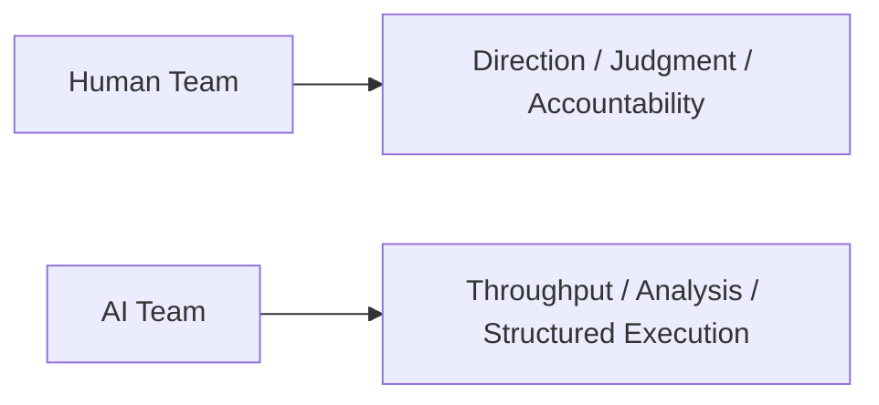

两者不是竞争关系，而是能力结构不同。

---

## 二、推荐的双团队分层

最稳妥的组织方式，是做四层分工。

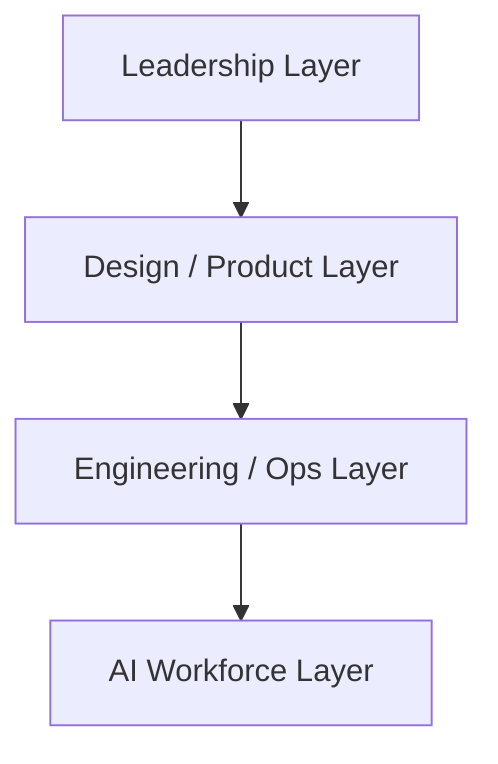

其中：

- Leadership Layer：目标、优先级、资源、风险承担
- Design / Product Layer：方案、对象、流程、验收
- Engineering / Ops Layer：实现、运行、运维、上线
- AI Workforce Layer：分析、编码、整理、回归、文档

---

## 三、推荐的人类核心角色

即使大量使用 AI，人类侧仍应保留明确核心岗位。

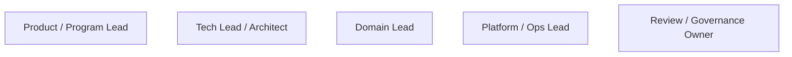

这些角色的作用分别是：

- Product / Program Lead：决定做什么
- Tech Lead：决定怎么做
- Domain Lead：保证电影语义正确
- Platform / Ops Lead：保证能运行
- Governance Owner：保证能控制

---

## 四、推荐的 AI 团队角色

AI 团队也应有明确分工，而不是一个笼统的“AI 助手池”。

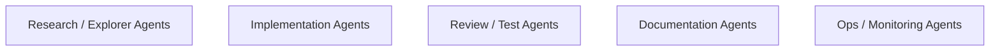

这样做的好处是：

- 提示词与职责更稳定
- 指标更好量化
- 协作关系更清晰

---

## 五、最推荐的组织关系

人类团队与 AI 团队之间，最好的关系是“人类主管 AI 班组”。

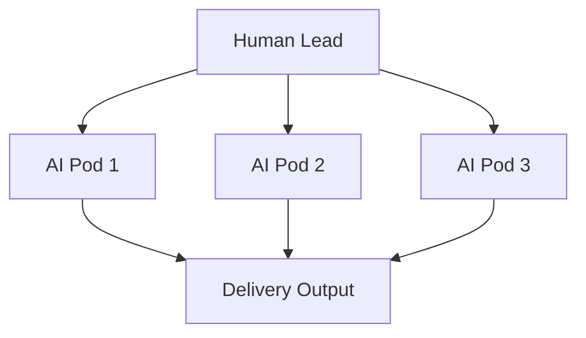

这和传统组织里“经理带专业小组”更接近，而不是“大家一起对着一个 AI”。

---

## 六、决策权限边界

要避免组织混乱，必须清楚哪些事由谁拍板。

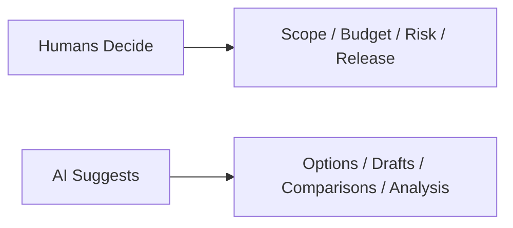

一个简单原则是：

- AI 可以提建议、起草、比较、模拟
- 人类负责优先级、取舍、发布与责任承担

---

## 七、升级链设计

组织一旦进入复杂协作，升级链必须明确。

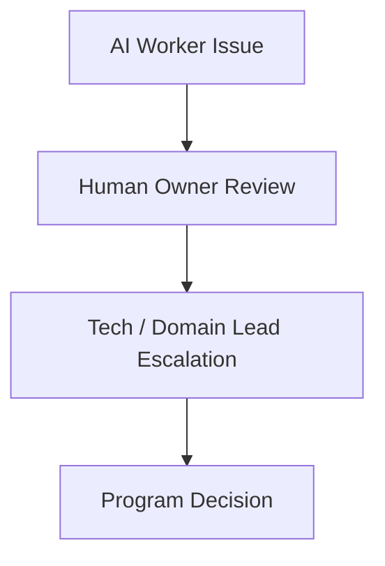

如果没有升级链，就会出现：

- 小问题卡死
- 责任不清
- 风险扩大

---

## 八、最推荐的 pod 结构

在执行层，最适合的是按主题形成 pod。

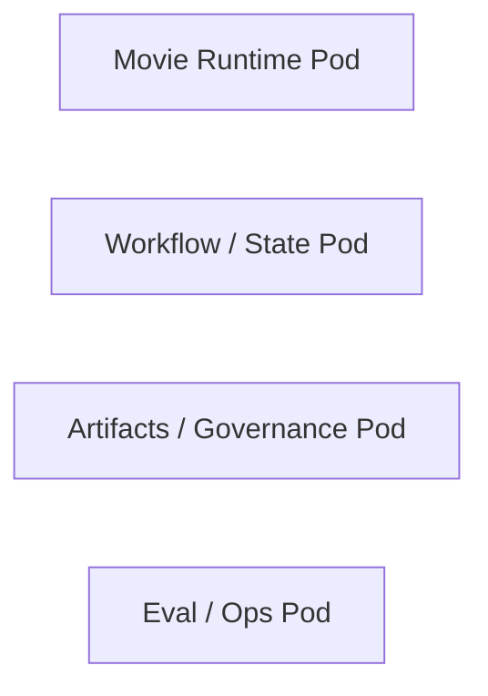

每个 pod 都可以是：

- 1 名人类 owner
- 若干 AI workers
- 1 个 reviewer / verifier

---

## 九、组织协作节奏

双团队协作不应只有临时沟通，而应有固定节奏。

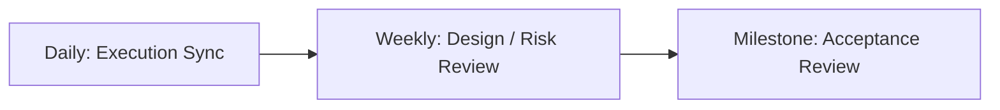

这样可以把：

- 进度
- 风险
- 质量
- 方向

分别在不同层级被处理。

---

## 十、组织健康度的判断标准

一个好的人机双团队，不应只看速度。

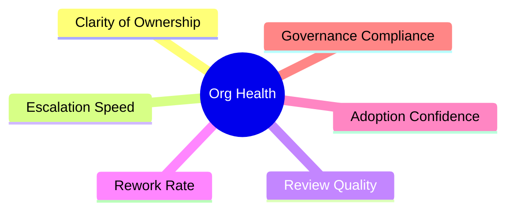

这些指标比“AI 生成了多少”更能说明组织是否健康。

---

## 十一、总结判断

人类团队与 AI 团队的最佳关系，不是替代关系，而是：

**人类做方向、边界和责任承担，AI 做吞吐、执行和结构化分析。**

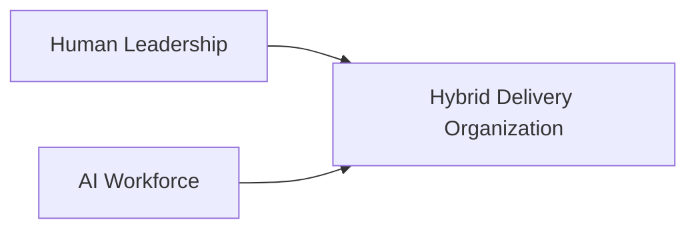

只有在这个前提下，Hermes movie mode 才可能从单个产品实验，演进成长期可运行的组织能力。

---

## 相关文档

- [86-team-organization-and-role-allocation.md](./86-team-organization-and-role-allocation.md)
- [112-ai-coding-and-multi-agent-delivery-plan.md](./112-ai-coding-and-multi-agent-delivery-plan.md)
- [114-ai-engineering-factory-and-collaboration-mode.md](./114-ai-engineering-factory-and-collaboration-mode.md)
- [115-human-ai-collaboration-playbook.md](./115-human-ai-collaboration-playbook.md)
- [118-program-governance-roadmap-and-operating-metrics.md](./118-program-governance-roadmap-and-operating-metrics.md)
