# 114. AI Engineering Factory 与协作模式

## 这篇文档回答什么问题

当人类团队和 AI 团队开始稳定协作后，下一步要回答：

**怎样把这种协作从“零散搭配”升级成一个 AI engineering factory。**

本篇重点回答：

1. 什么叫 AI engineering factory。
2. 工厂式协作与普通协作有什么区别。
3. 应该设计哪些 collaboration mode。

---

## 一、AI engineering factory 的本质

这里说的 factory，不是流水线僵化管理，而是指：

- 输入稳定
- 角色清晰
- 交接清楚
- 输出可验证

的工程交付系统。

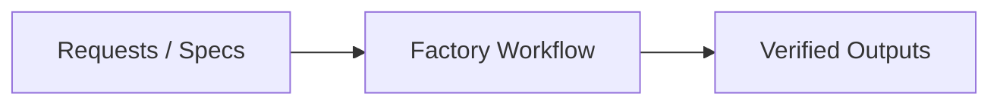

它的重点不是“自动化越多越好”，而是“交付越可预测越好”。

---

## 二、factory 与普通协作的区别

普通协作常常高度依赖个人状态，factory 更强调制度化。

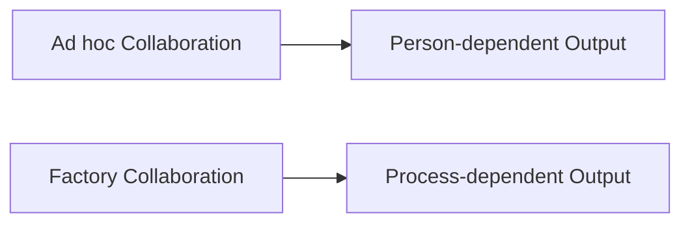

对 movie mode 来说，这非常重要，因为后续角色会越来越多。

---

## 三、factory 的基本结构

一个完整的 engineering factory 至少应有五段。

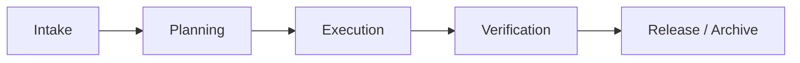

这五段分别对应：

- Intake：接需求
- Planning：切片和分工
- Execution：实现与产出
- Verification：测试、评审、治理检查
- Release / Archive：发布与沉淀

---

## 四、推荐的 collaboration mode

协作模式不应只有一种。最少应有四种模式。

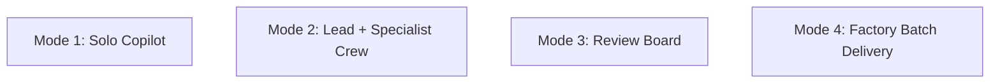

不同模式适合不同阶段。

---

## 五、Mode 1：Solo Copilot

这是最轻量的模式。

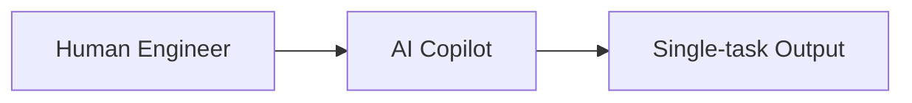

适合：

- 小修小补
- 单文件重构
- 文档补充
- 快速验证想法

不适合：

- 大规模并行交付
- 复杂模块拆分

---

## 六、Mode 2：Lead + Specialist Crew

这是最适合 movie mode 主体研发的模式。

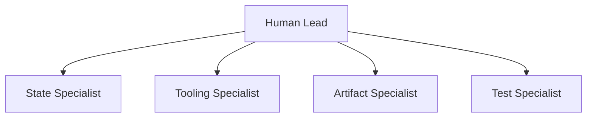

特点是：

- 有主控
- 有分工
- 有收口

---

## 七、Mode 3：Review Board

当系统进入高风险或高影响变更时，应切到 Review Board 模式。

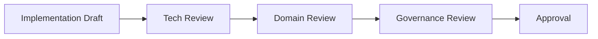

这个模式适合：

- workflow 变更
- approval 规则变更
- state schema 变更
- 高风险模型接入

---

## 八、Mode 4：Factory Batch Delivery

当交付进入项目制推进时，最适合 batch 模式。

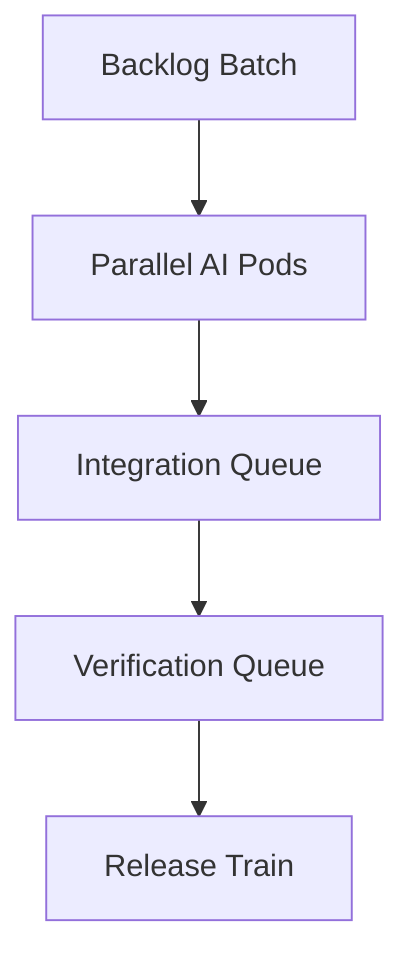

这种方式适合：

- 多模块同时推进
- 周期性交付
- 阶段性验收

---

## 九、factory 的输入输出契约

没有输入输出契约，factory 就会退化成混乱协作。

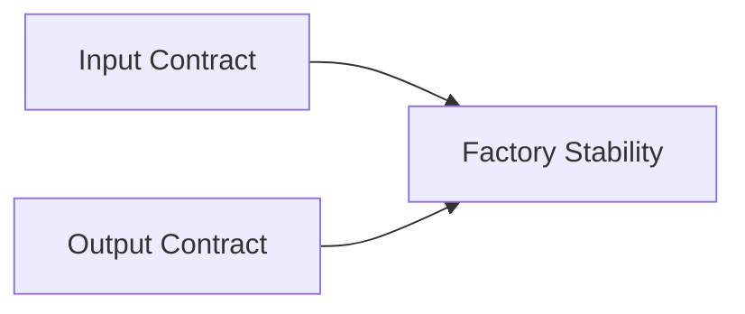

输入契约至少要包含：

- 目标
- 范围
- 边界
- 风险
- 验收标准

输出契约至少要包含：

- 代码 / 文档产物
- 测试结果
- 已知风险
- 后续建议

---

## 十、factory 的运营指标

AI engineering factory 需要自己的运营指标。

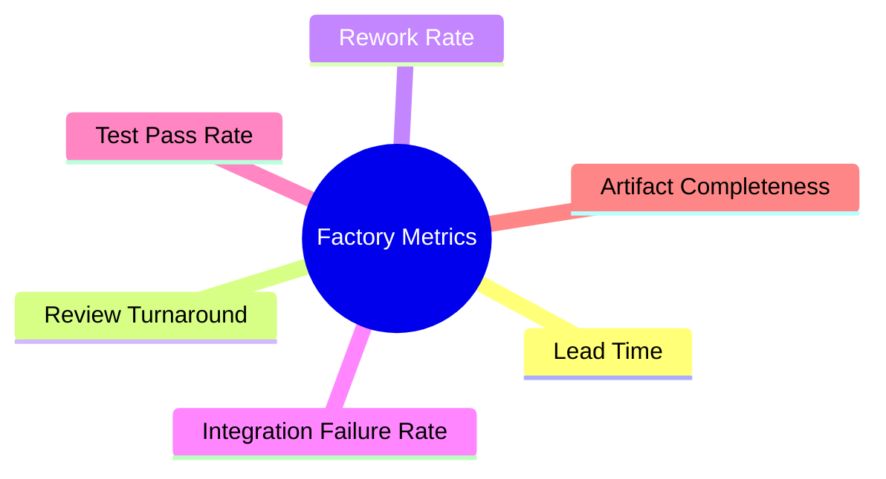

这些指标能帮助我们判断 factory 是在提速，还是只是在制造更多返工。

---

## 十一、总结判断

AI engineering factory 的核心，不是“更多 agent”，而是：

- 稳定 intake
- 清晰 mode
- 明确 handoff
- 可验证 release

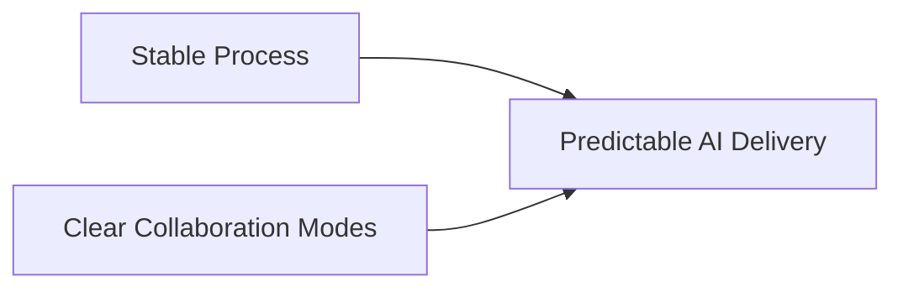

这样，movie mode 的研发才会从“会用 AI”升级成“能持续产出”。 

---

## 相关文档

- [112-ai-coding-and-multi-agent-delivery-plan.md](./112-ai-coding-and-multi-agent-delivery-plan.md)
- [113-human-team-and-ai-team-organization-design.md](./113-human-team-and-ai-team-organization-design.md)
- [115-human-ai-collaboration-playbook.md](./115-human-ai-collaboration-playbook.md)
- [116-output-management-and-agent-artifacts-system.md](./116-output-management-and-agent-artifacts-system.md)
- [117-digital-employees-expansion-framework.md](./117-digital-employees-expansion-framework.md)
