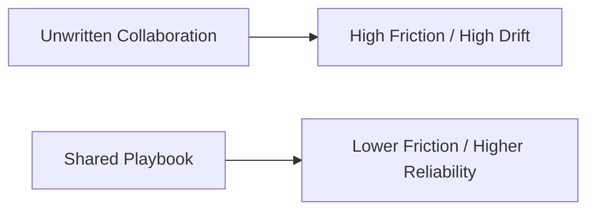
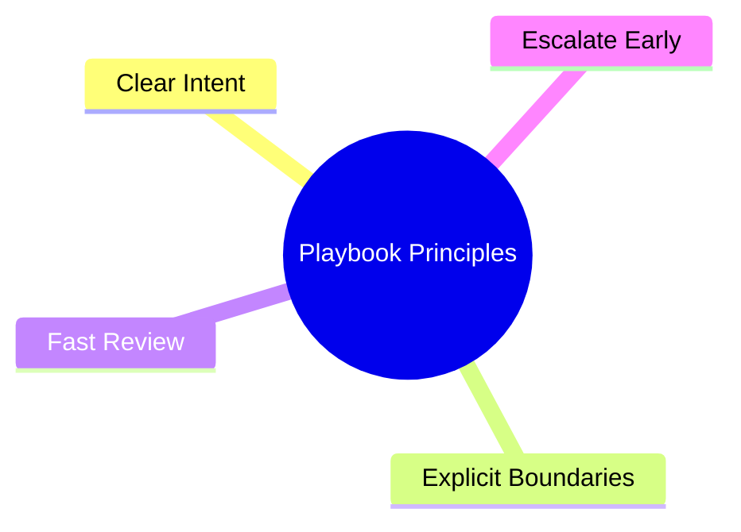
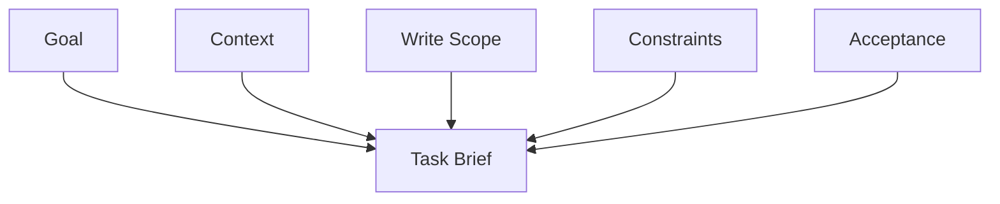
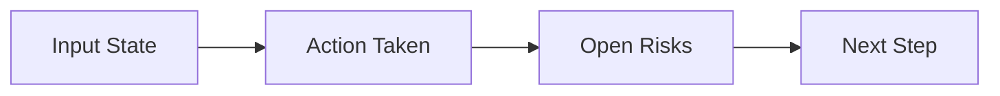
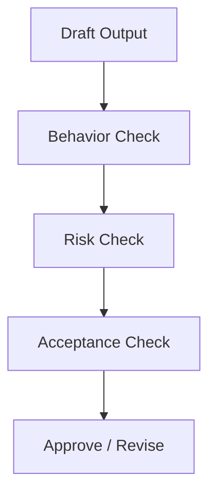
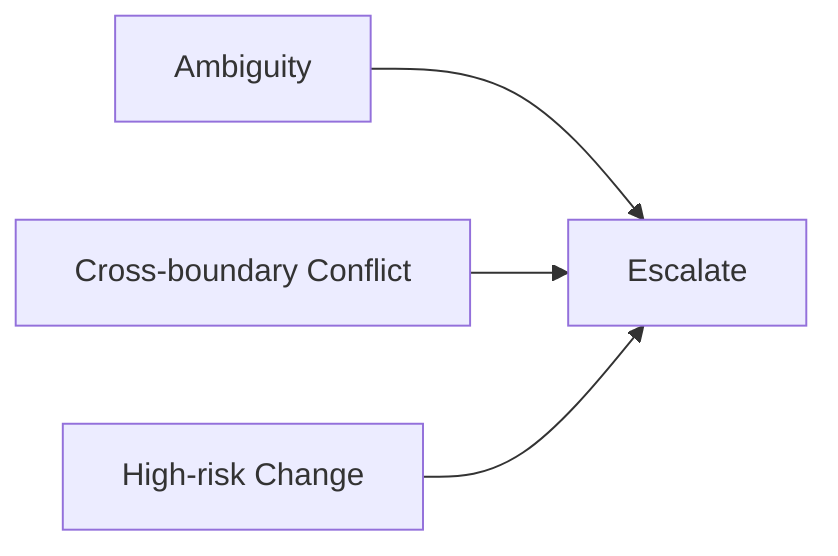
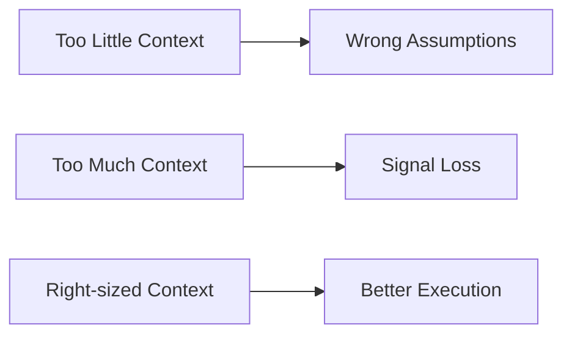
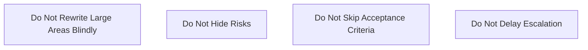

# 115. 人机协作作战手册

## 这篇文档回答什么问题

当组织结构和 engineering factory 都确定下来后，仍然会有一个现实问题：

**团队每天到底应该怎么和 AI 一起工作。**

本篇重点回答：

1. 人机协作的日常作战原则是什么。
2. briefing、handoff、review、escalation 应如何执行。
3. 怎样减少误解、返工和失控。

---

## 一、作战手册的目标

作战手册不是写愿景，而是降低每天协作的摩擦成本。

它的作用是把“会不会配合”变成“按什么方法配合”。

---

## 二、人机协作的四条基本原则

具体来说：

- Clear Intent：任务目标必须讲清
- Explicit Boundaries：明确不能动什么、必须保留什么
- Fast Review：尽量缩短反馈回路
- Escalate Early：遇到歧义和冲突不要拖

---

## 三、最推荐的任务 briefing 结构

好 briefing 能显著降低返工率。

一个高质量 briefing 至少应说明：

- 要解决什么问题
- 相关文件 / 模块
- 允许改哪些地方
- 不允许碰哪些地方
- 怎样算完成

---

## 四、handoff 的推荐格式

很多返工来自 handoff 不清楚。

不管是人交给 AI，还是 AI 交回给人，handoff 都应包含这四块。

---

## 五、review 的最小闭环

review 不应只看“改了什么”，还应看“为什么这么改、风险在哪里”。

尤其在 movie mode 这种大体系里，行为正确性比文字解释更重要。

---

## 六、什么时候应该升级

升级不应该被视为失败，而应视为正常控制机制。

最常见的升级触发点包括：

- 需求含糊且影响大
- 与别的模块边界冲突
- 会影响 state / approval / release
- 会触碰高风险工具或数据

---

## 七、协作中的信息密度控制

信息太少会误解，信息太多也会淹没重点。

所以手册里应鼓励：

- 给足关键上下文
- 不堆无关历史
- 明确当前轮要做的事

---

## 八、最推荐的协作节奏

日常协作最好用短周期回路。

短周期的好处是：

- 早暴露误解
- 早暴露边界问题
- 降低大返工

---

## 九、作战手册中的禁止事项

除了推荐动作，也应有禁区。

这些禁区对多人机协作尤其关键。

---

## 十、总结判断

人机协作作战手册的价值，不在于把流程写复杂，而在于把每天反复发生的协作摩擦标准化处理。

它是 AI 工程组织真正能跑起来的日常基础设施。

---

## 相关文档

- [112-ai-coding-and-multi-agent-delivery-plan.md](./112-ai-coding-and-multi-agent-delivery-plan.md)
- [113-human-team-and-ai-team-organization-design.md](./113-human-team-and-ai-team-organization-design.md)
- [114-ai-engineering-factory-and-collaboration-mode.md](./114-ai-engineering-factory-and-collaboration-mode.md)
- [116-output-management-and-agent-artifacts-system.md](./116-output-management-and-agent-artifacts-system.md)
- [118-program-governance-roadmap-and-operating-metrics.md](./118-program-governance-roadmap-and-operating-metrics.md)
