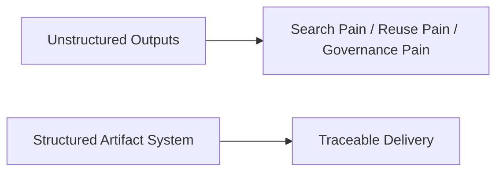
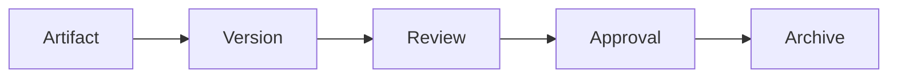
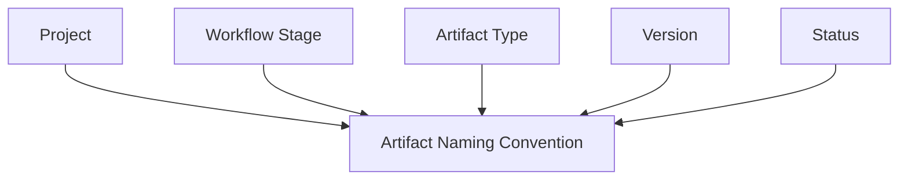
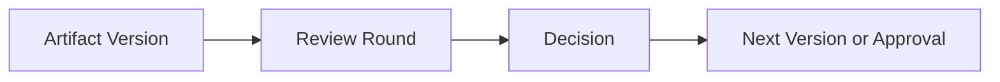
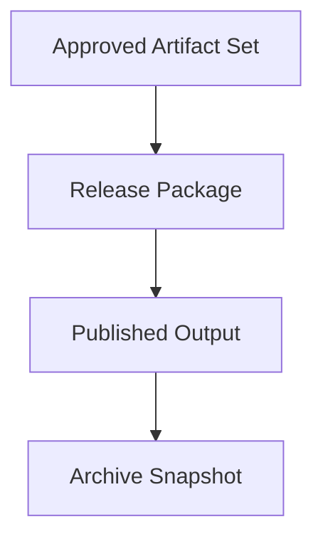
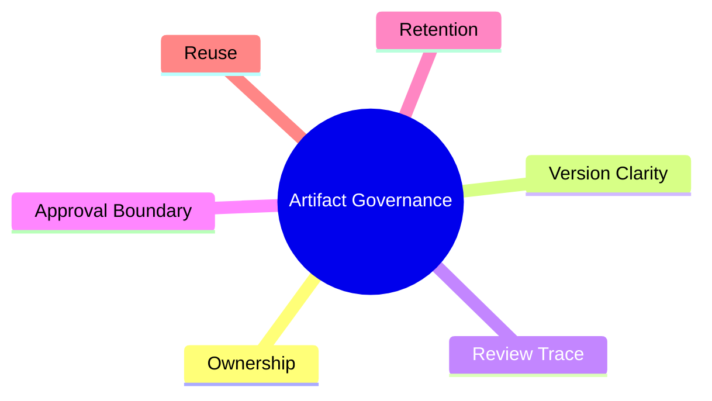

# 116. 输出管理与 Agent 产物系统

## 这篇文档回答什么问题

一旦引入大量 agent，输出会迅速爆炸。于是必须回答：

**怎样管理 agent 生成的文档、代码、日志、版本包和交付物。**

本篇重点回答：

1. 产物系统应如何分类。
2. 版本、归档和发布应如何组织。
3. 为什么 output management 是长期扩展的关键地基。

---

## 一、没有产物系统，AI 交付很快会失控

如果只有聊天记录，没有结构化产物系统，团队很快会失去可追溯性。

---

## 二、最推荐的产物分类

产物至少要分成五类。

对应例子可以是：

- Planning：spec、design note、task brief
- Execution：代码改动、脚本、生成资产
- Verification：测试结果、review note、eval report
- Release：release package、approval record、archive snapshot
- Knowledge：playbook、template、retrospective

---

## 三、产物系统的核心对象

系统里最重要的不是文件本身，而是围绕文件的对象关系。

只有把这些对象接起来，产物才有治理意义。

---

## 四、最推荐的文件流

一个健康的产物流应该是逐步收束的。

这比“所有东西都放在同一个目录里”更适合长期协作。

---

## 五、命名与目录约定

命名和目录不是小事，它直接决定未来能否检索与复用。

至少应让一个文件名或元数据能回答：

- 它属于哪个项目
- 它处于哪个阶段
- 它是什么类型
- 它是什么版本
- 它当前状态是什么

---

## 六、review 与产物系统的关系

review 不应漂浮在聊天里，而应附着到产物上。

这样团队才能回答：

- 这个版本为什么被接受
- 为什么被打回
- 改动是如何收敛的

---

## 七、发布与归档

发布不是复制文件，归档也不是简单备份。

发布解决“当前生效的是什么”，归档解决“历史上发生过什么”。

---

## 八、产物系统与 workspace 的关系

workspace 不应只是临时工作区，还应成为产物生命周期的一部分。

这样 Hermes 的文件流、状态流和审计流才会对齐。

---

## 九、最关键的治理点

产物系统真正要解决的是治理，而不是整理文件。

这些点决定了系统是否能走向组织级使用。

---

## 十、总结判断

输出管理与 agent 产物系统的关键，不在于“保存了多少文件”，而在于：

- 能不能追溯
- 能不能发布
- 能不能归档
- 能不能复用

这是 movie mode 从实验走向长期运行的基础设施之一。

---

## 相关文档

- [70-artifact-version-and-archive-system.md](./70-artifact-version-and-archive-system.md)
- [79-workspace-artifacts-and-file-flow.md](./79-workspace-artifacts-and-file-flow.md)
- [87-data-and-asset-governance.md](./87-data-and-asset-governance.md)
- [114-ai-engineering-factory-and-collaboration-mode.md](./114-ai-engineering-factory-and-collaboration-mode.md)
- [118-program-governance-roadmap-and-operating-metrics.md](./118-program-governance-roadmap-and-operating-metrics.md)
