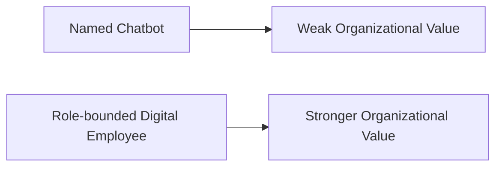
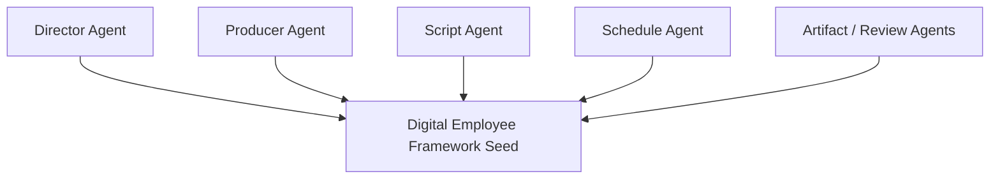
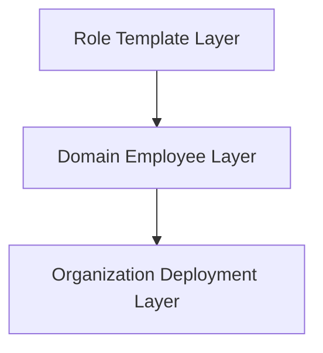
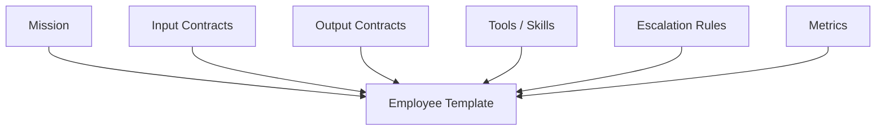
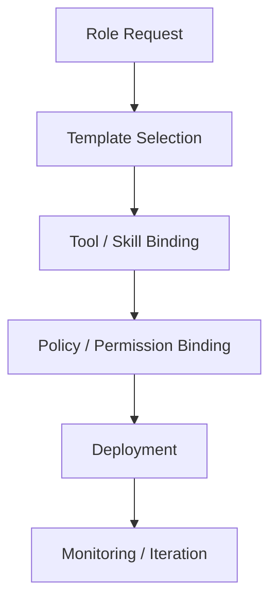
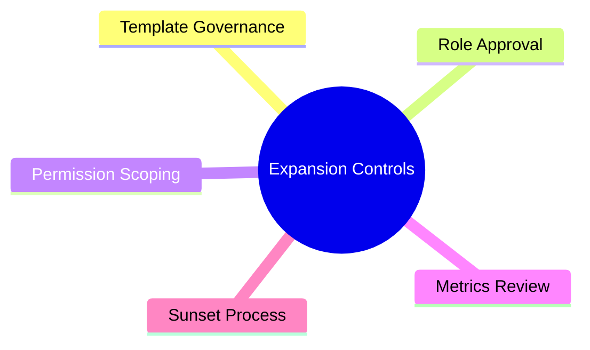

# 117. 数字员工扩展框架

## 这篇文档回答什么问题

当 movie mode 的角色系统开始稳定后，下一步会自然出现一个问题：

**这些 agent 能否从电影角色，扩展成更广义的数字员工体系。**

本篇重点回答：

1. 什么叫数字员工扩展框架。
2. 如何从 movie roles 扩展到更广的岗位体系。
3. 扩展时最需要控制的风险是什么。

---

## 一、数字员工不是“更换皮肤的 chatbot”

数字员工的关键，不是有一个职位名字，而是有：

- 明确职责
- 清晰边界
- 稳定输入
- 稳定输出
- 可衡量绩效

---

## 二、movie roles 是数字员工的优质起点

电影制作天然就是一个强分工、高协同的行业，这使它非常适合作为数字员工框架的起点。

因为这些角色本来就有清晰的：

- 输入
- 输出
- 协作边界
- 升级路径

---

## 三、扩展框架的三层结构

最稳妥的扩展方式，是用三层模型。

分别含义是：

- Role Template Layer：抽象角色模板
- Domain Employee Layer：电影、研发、运营等领域员工
- Organization Deployment Layer：具体组织里的实例化部署

---

## 四、角色模板应该包含什么

每个数字员工模板都应至少定义六个字段。

如果缺少这些字段，数字员工就很难稳定复用。

---

## 五、从 movie 扩展到其他岗位的路径

扩展不应突然跳到所有部门，而应循序渐进。

也就是说：

- 先在电影制作域验证
- 再扩到创意运营
- 再扩到研发与项目管理
- 最后扩到更广的企业岗位

---

## 六、数字员工工厂

一旦角色扩展加快，就需要一个“员工工厂”。

这其实是 role factory 在组织层的延伸。

---

## 七、最关键的扩展风险

数字员工扩展最大的风险不是“能力太弱”，而是“边界太乱”。

常见问题包括：

- 多个数字员工职责重叠
- 没有人类 owner
- 权限配置不一致
- 绩效无法衡量

---

## 八、推荐的扩展控制机制

尤其要注意：

- 不是每个角色都应永久存在
- 有些数字员工应阶段性启用
- 有些角色需要定期下线或合并

---

## 九、数字员工的成熟度

可以把成熟度分成四档。

Hermes 的机会在于从 M2 走向 M4。

---

## 十、总结判断

数字员工扩展框架的关键，不是多造几个 agent 名字，而是：

- 模板化角色
- 可治理部署
- 可衡量运行
- 可收缩可扩展

如果这套框架做稳，movie mode 就不只是电影平台，也会成为更广义数字组织系统的试验田。

---

## 相关文档

- [77-movie-factory-design.md](./77-movie-factory-design.md)
- [113-human-team-and-ai-team-organization-design.md](./113-human-team-and-ai-team-organization-design.md)
- [114-ai-engineering-factory-and-collaboration-mode.md](./114-ai-engineering-factory-and-collaboration-mode.md)
- [118-program-governance-roadmap-and-operating-metrics.md](./118-program-governance-roadmap-and-operating-metrics.md)
