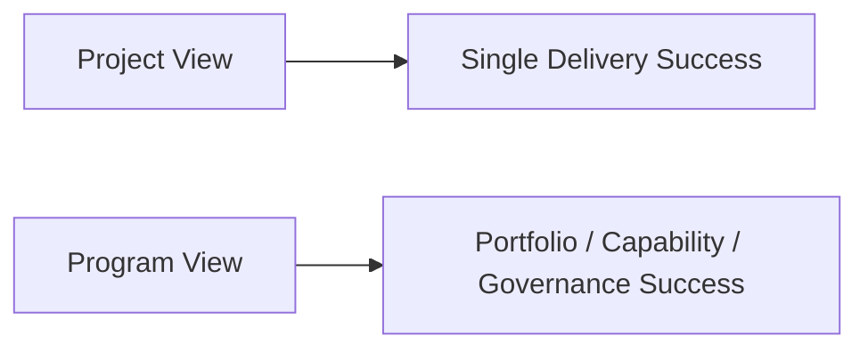
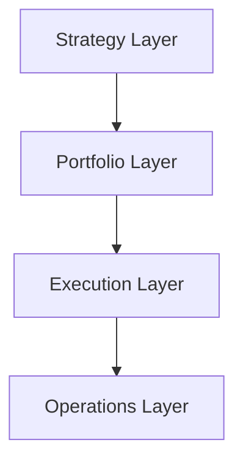
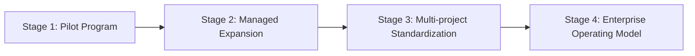
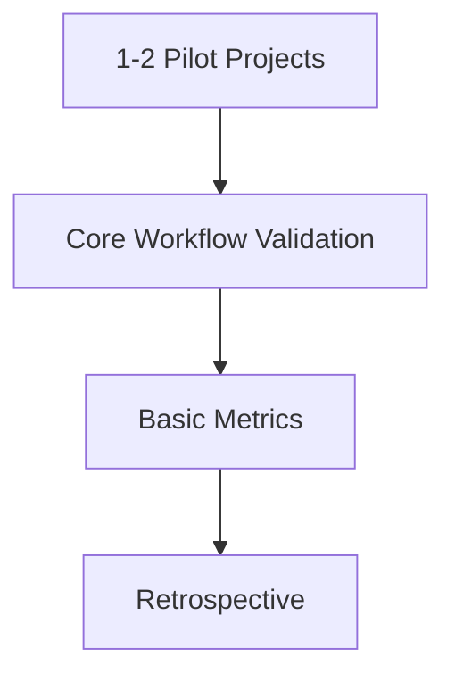
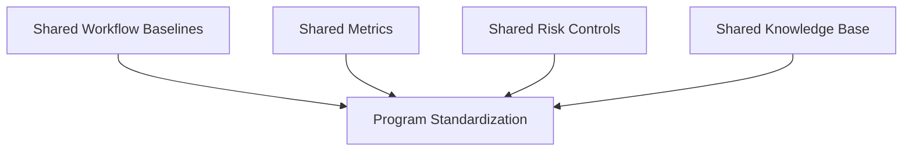
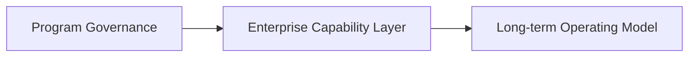
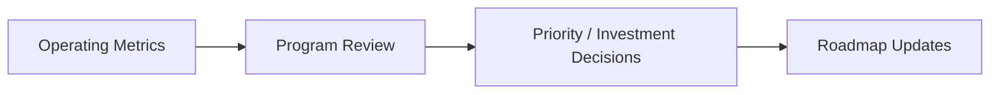
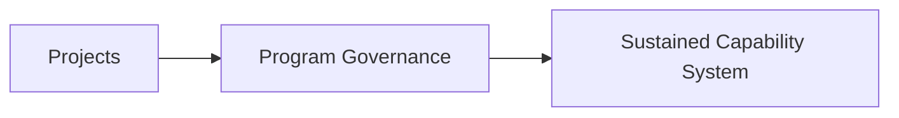

# 118. 项目群治理路线图与运营指标

## 这篇文档回答什么问题

到了最后一篇，我们要把单项目、单角色、单条工作流的设计，上升到项目群和长期运营层。

本篇重点回答：

1. 项目群治理路线图应如何设计。
2. 哪些 operating metrics 最值得长期追踪。
3. 怎样把 movie mode 从一个项目做成一个持续 program。

---

## 一、program 视角和 project 视角不同

project 关注单次交付，program 关注长期组合价值。

如果只看 project，不足以支撑长期 rollout。

---

## 二、项目群治理需要四个层级

一个成熟的项目群治理，至少要有四层。

分别负责：

- Strategy：目标、投资方向、能力优先级
- Portfolio：项目组合、资源分配、风险平衡
- Execution：里程碑、依赖、验收
- Operations：指标、监控、改进闭环

---

## 三、推荐的 program 路线图

项目群不应一开始就全铺开，而应分阶段。

这条路线和前面 movie / video agent 路线图是对应的。

---

## 四、Stage 1：Pilot Program

第一阶段重点是验证“能不能跑”。

此阶段应更关注：

- adoption
- 流程稳定性
- 关键风险暴露

---

## 五、Stage 2：Managed Expansion

第二阶段重点是验证“能不能复制”。

这时最重要的是标准化：

- 模板
- 角色
- artifact 规范
- 审批机制

---

## 六、Stage 3：Multi-project Standardization

第三阶段要建立项目群级的可比较性。

没有这些，项目之间就很难互相学习。

---

## 七、Stage 4：Enterprise Operating Model

第四阶段，movie mode 不再只是试点工具，而成为组织 operating model 的一部分。

这时治理、指标、权限、审计都必须企业化。

---

## 八、最关键的运营指标

项目群治理应至少持续追踪五类指标。

可以进一步展开为：

- Delivery：lead time、review turnaround、release frequency
- Quality：rework rate、defect escape、workflow failure rate
- Governance：approval latency、audit completeness、policy exceptions
- Adoption：active teams、repeat usage、satisfaction
- Reuse：template reuse、playbook reuse、artifact reuse

---

## 九、指标与决策的关系

指标不应只是汇报用，而应直接反向驱动决策。

如果指标不进入决策环，就会变成装饰品。

---

## 十、最推荐的治理节奏

项目群治理也需要节奏化运转。

不同节奏分别解决：

- Weekly：运行问题
- Monthly：资源与风险
- Quarterly：路线与投资

---

## 十一、总结判断

项目群治理路线图与运营指标的意义，在于让 Hermes movie mode 从“很多不错的文档和试点”，真正变成一个：

- 可复制
- 可衡量
- 可治理
- 可持续演进

的长期 program。

这也是整个 movie 文档体系最后要落到的地方。

---

## 相关文档

- [89-metrics-and-roi.md](./89-metrics-and-roi.md)
- [90-enterprise-rollout-roadmap.md](./90-enterprise-rollout-roadmap.md)
- [111-video-agents-risk-evals-and-governance.md](./111-video-agents-risk-evals-and-governance.md)
- [113-human-team-and-ai-team-organization-design.md](./113-human-team-and-ai-team-organization-design.md)
- [117-digital-employees-expansion-framework.md](./117-digital-employees-expansion-framework.md)
