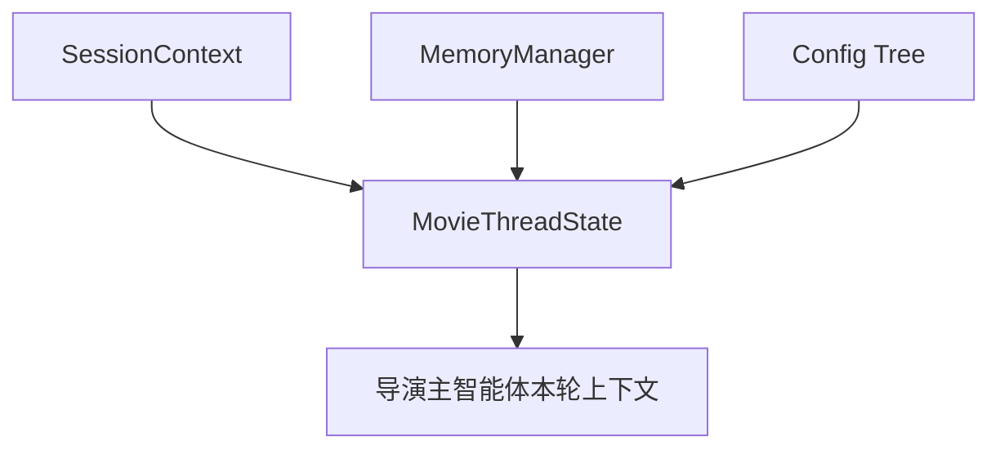
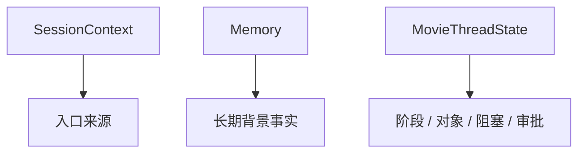
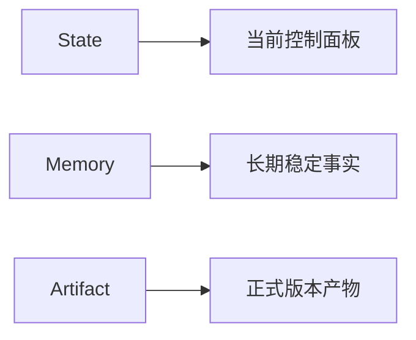
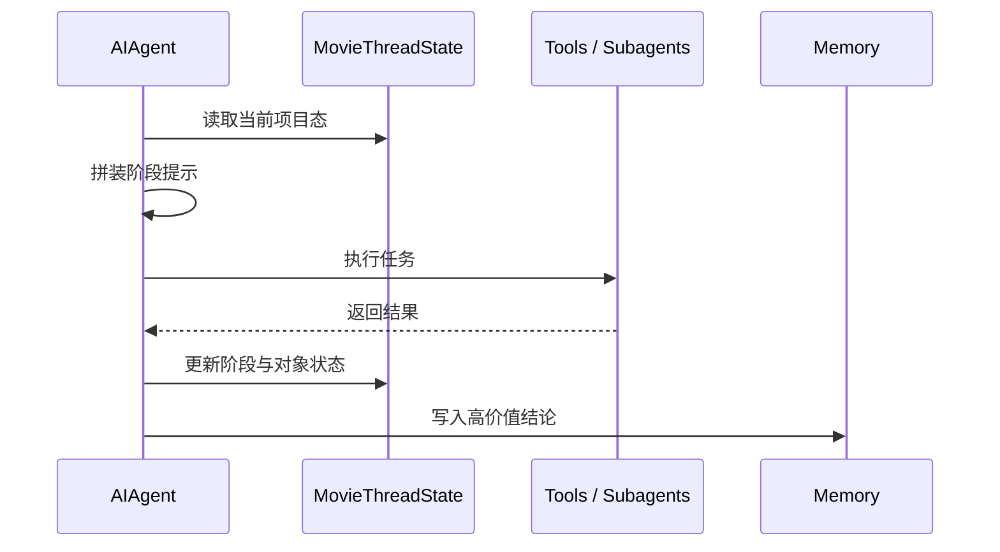

# 12. 源码映射：项目状态、记忆和配置应该怎么接到现有系统上

## 这篇文档回答什么问题

电影平台能不能稳定运行，很大程度上取决于三件事：

- 项目状态放在哪里
- 长期记忆如何控制
- movie 相关配置应该挂在哪里

本篇聚焦当前仓库中最适合承接这三类能力的入口。

---

## 一、先说结论

在当前 Hermes 仓库里，电影项目态最合适的落点不是单一文件，而是三层组合：

- 会话上下文层：`gateway/session.py`
- 记忆层：`agent/memory_manager.py`
- 配置层：`hermes_cli/config.py`

未来的 `MovieThreadState` 应该建立在这三层之上，而不是与它们完全脱节。

---

## 二、当前“状态”最接近的承接点：`gateway/session.py`

`gateway/session.py` 当前提供了：

- `SessionSource`
- `SessionContext`
- `build_session_context_prompt()`

这说明 Hermes 已经有“会话来自哪里、当前上下文是什么”的正式模型。

虽然这还不是电影项目状态，但它非常适合承接 movie 方向的上层字段，例如：

- 当前项目 ID
- 当前项目阶段
- 当前协作线程关联的对象集合
- 当前会话的角色视角

也就是说，`SessionContext` 更像电影项目态的外层入口。

---

## 三、当前“长期连续性”最关键的承接点：`agent/memory_manager.py`

`MemoryManager` 当前负责：

- 聚合 memory provider
- 生成 memory system prompt block
- 在 turn 前预取背景信息
- 在 turn 后同步结果

这说明它非常适合承接 movie 的“长期稳定事实”。

### 适合放进 movie memory 的内容

- 导演风格偏好
- 项目长期目标
- 已锁定的关键约束
- 跨阶段仍有效的关键决策

### 不适合直接写入 memory 的内容

- 某个对象的全部细节字段
- 临时草稿
- 很容易失效的执行态细节

这些更适合放进正式 movie state 或 artifact。

---

## 四、为什么还需要新增 `MovieThreadState`

虽然当前有 `SessionContext` 和 memory，但两者都不足以直接承担电影项目控制面板。

原因是：

- `SessionContext` 更偏会话来源和入口上下文
- memory 更偏长期背景和可回忆事实

而电影项目态还需要承接：

- 当前阶段
- 当前活跃对象
- 当前阻塞
- 当前待审批项
- 当前角色激活集
- 当前版本指针

这些内容更适合作为新增的 `MovieThreadState` 或 `MovieProjectState` 来管理。

---

## 五、配置层的最佳入口：`hermes_cli/config.py`

`hermes_cli/config.py` 当前已经有：

- `DEFAULT_CONFIG`
- `OPTIONAL_ENV_VARS`
- 配置迁移逻辑
- `get_hermes_home()` 体系

这非常适合承接 movie 方向的配置扩展。

### 推荐新增的 movie 配置项

例如可以增加：

- `movie.enabled`
- `movie.default_project_root`
- `movie.default_phase`
- `movie.roles.enabled`
- `movie.roles.default_toolsets`
- `movie.memory.policy`
- `movie.approval.required_for_phase_transition`

这样比散落在环境变量或 prompt 里更可维护。

---

## 六、profile 与多项目隔离的价值

Hermes 现有 profile 体系和 `get_hermes_home()` 语义，对电影项目特别有价值。

因为它天生适合隔离：

- 不同团队
- 不同项目
- 不同实验环境
- 不同配置策略

这意味着未来 movie 平台甚至可以利用现有 profile 机制，为不同电影项目提供相对隔离的工作空间与配置。

---

## 七、状态、记忆与 artifact 的分工建议

为了避免系统混乱，建议三者严格分工。

## 1. State

保存当前控制面板信息，例如：

- 当前阶段
- 当前锁定版本
- 待审批项
- 活跃风险

## 2. Memory

保存长期有价值、跨轮和跨阶段都值得记住的背景事实。

## 3. Artifact

保存正式产物，例如：

- 剧本版本
- breakdown
- 预算
- 排期
- 镜头计划
- review note

这样才能避免“什么都写进 memory”或“什么都只留在聊天里”。

---

## 八、状态装载的推荐时机

从 runtime 视角，状态最适合在每轮开始前装载，然后在关键工具执行后更新。

推荐流程：

1. turn 开始时加载 `MovieThreadState`
2. 生成本轮阶段摘要和约束提示
3. 执行工具或子智能体任务
4. 关键对象变更后更新 state
5. 高价值结论再选择性写入 memory

这和当前 `run_agent.py` 的生命周期是兼容的。

---

## 九、结论

movie 平台的状态与配置扩展，最合理的路线不是单点替换，而是：

- 用 `gateway/session.py` 承接会话级上下文
- 用 `agent/memory_manager.py` 承接长期项目记忆
- 用 `hermes_cli/config.py` 承接 movie 配置树
- 另外新增 `MovieThreadState` 作为真正的项目控制面板

这样既能复用当前 Hermes 的成熟机制，又能给电影项目建立稳定的正式状态层。

---

## 相关文档

- [02-current-project-mapping.md](./02-current-project-mapping.md)
- [10-source-mapping-agent-runtime.md](./10-source-mapping-agent-runtime.md)
- [62-movie-thread-state-design.md](./62-movie-thread-state-design.md)
- [74-thread-state-extension-plan.md](./74-thread-state-extension-plan.md)
- [78-custom-agent-configuration-system.md](./78-custom-agent-configuration-system.md)
