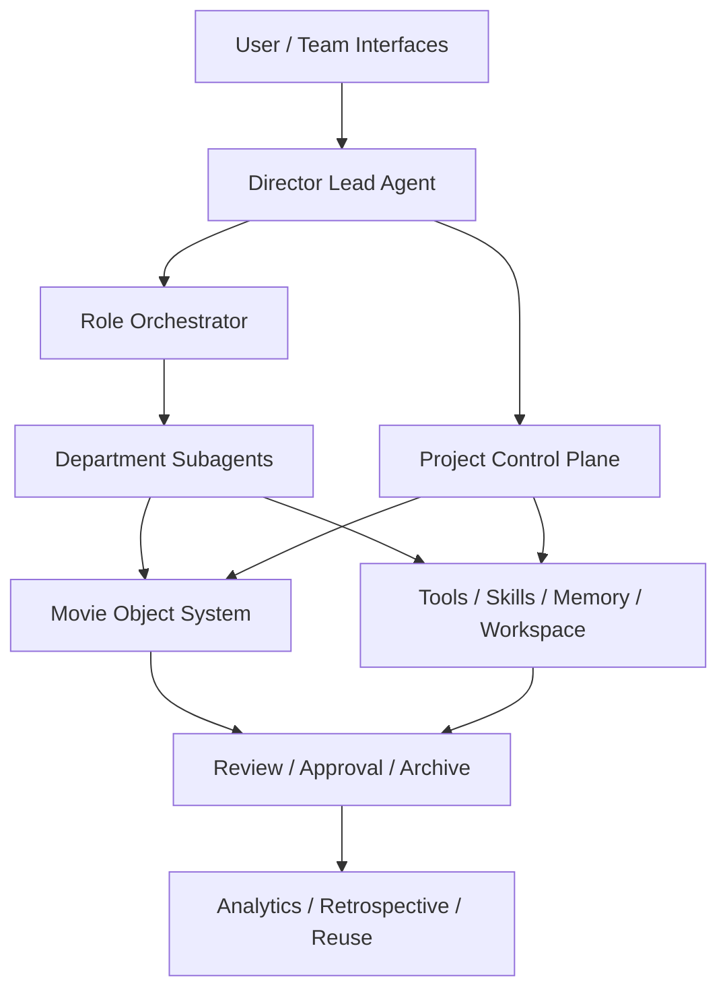
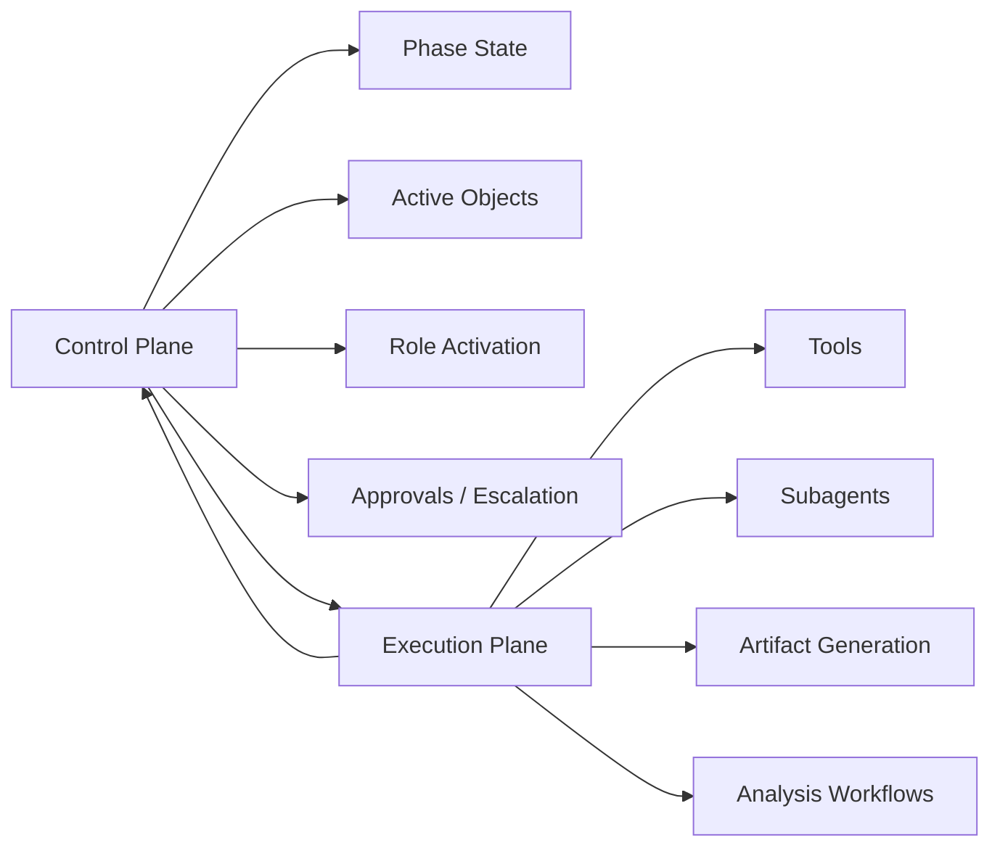
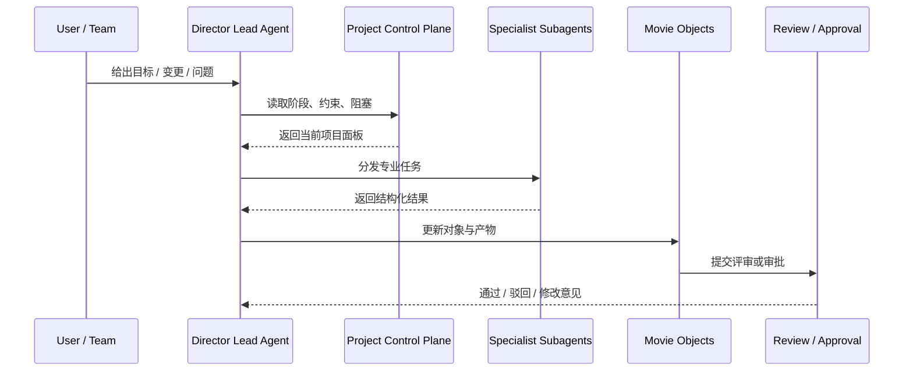
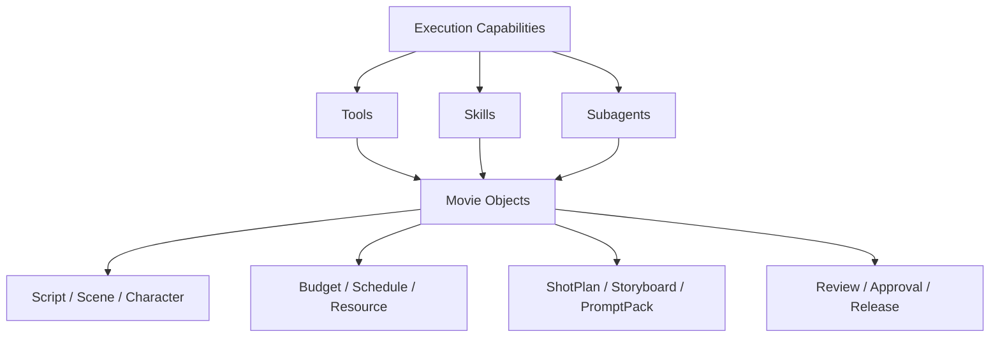
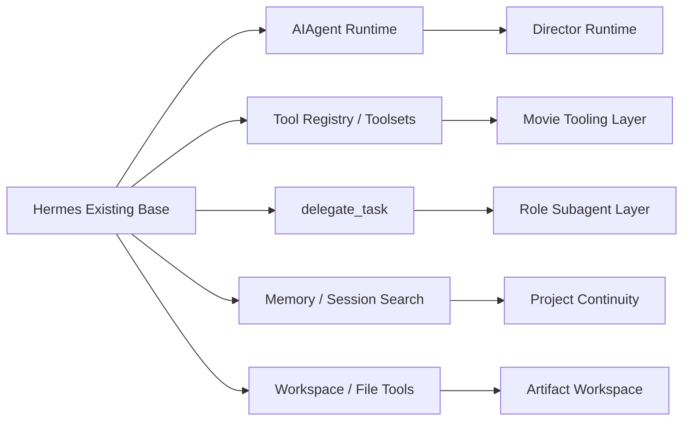
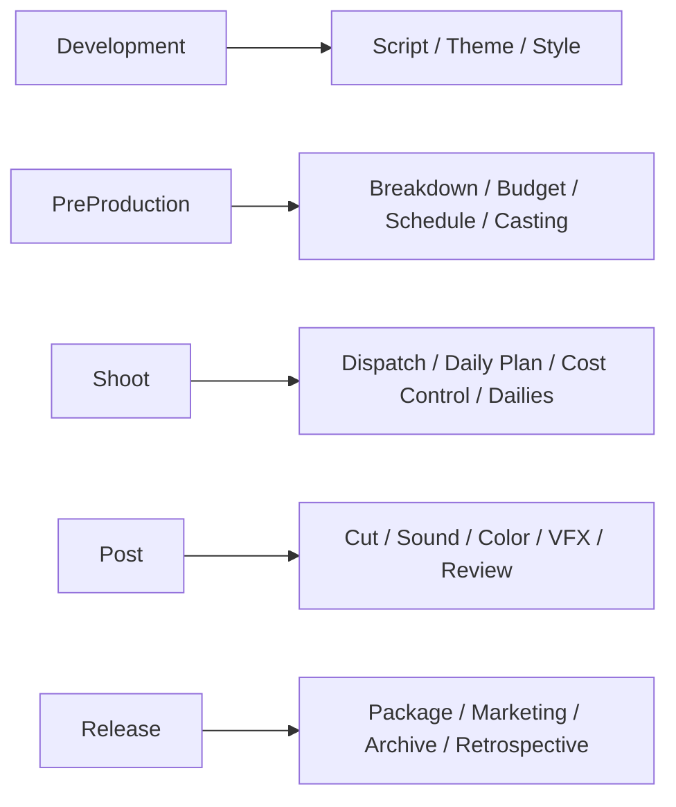

# 13. 系统蓝图：Movie Director Agent 平台级设计稿

## 这篇文档回答什么问题

前面的文档已经讲清楚目标、角色、对象和源码入口。本篇进一步把它们收敛成一张平台级蓝图，回答三个问题：

1. 电影导演智能体平台的核心层次到底如何组合。
2. 哪些是控制面，哪些是执行面，哪些是治理面。
3. Hermes Agent 当前底座在蓝图中处于什么位置。

---

## 一、平台的总蓝图

Movie Director Agent 平台不应被理解成单一 agent，而应被理解成一个围绕电影项目运行的操作系统。

从蓝图上看，它至少由六块构成：

- 导演主控
- 角色编排
- 项目控制面
- 电影对象系统
- 执行能力层
- 治理与沉淀层

---

## 二、控制面与执行面的区别

很多系统一开始就把“状态、对象、执行、审批”混在一起，最终会变得很难维护。更清晰的做法是，把平台拆成控制面和执行面。

### 控制面

控制面负责：

- 当前阶段判断
- 项目约束维护
- 活跃对象管理
- 角色激活
- 审批门禁
- 风险升级

### 执行面

执行面负责：

- 生成草案
- 分析剧本
- 输出预算和排期候选
- 产生镜头计划和分镜说明
- 写入文档与产物

这两者必须双向协作，但边界要清楚。

---

## 三、蓝图中的核心运行链

一个电影项目从请求到正式产物，建议按下面这条链运行。

---

## 四、建议的子系统清单

如果把蓝图再拆细，建议至少有下面这些子系统。

## 1. Director Runtime

职责：

- 对外作为主对话与总调度入口
- 选择工具与角色
- 维护本轮高优先级目标

## 2. Role Registry

职责：

- 注册电影角色
- 声明默认 toolset、skill、输入输出契约
- 定义适用阶段和权限边界

## 3. Movie Project State

职责：

- 存储当前阶段、阻塞、风险、审批和活跃对象
- 为主智能体提供控制面视图

## 4. Movie Object Store

职责：

- 保存正式对象及版本
- 把对象关系连接起来

## 5. Artifact Workspace

职责：

- 保存剧本、breakdown、预算、排期、镜头计划、review note 等文件

## 6. Review & Governance

职责：

- 评审、审批、锁定、归档

## 7. Knowledge & Analytics

职责：

- 复盘
- 指标
- 可复用模板资产

---

## 五、电影对象与执行能力的关系

对象系统是平台骨架，执行能力则是肌肉。没有对象，执行会散；没有执行，对象会空。

---

## 六、Hermes 在蓝图中的承接位置

Hermes 当前底座并不是全部蓝图，但它已经覆盖了其中最关键的运行骨架。

Hermes 还没有完整覆盖的，主要是：

- Movie Project State
- Movie Object Store
- Review / Approval 正式治理层
- 角色注册表

---

## 七、平台的阶段化激活模型

同一套蓝图在不同阶段，激活的子系统侧重点不同。

这意味着蓝图是统一的，但系统行为要按阶段切换。

---

## 八、结论

Movie Director Agent 平台的蓝图，本质上是：

- 用导演主智能体做项目大脑
- 用角色编排系统驱动专业协作
- 用项目控制面和对象系统维持正式状态
- 用工具、技能、工作区执行真实工作
- 用评审、审批和归档形成治理闭环

Hermes 当前已经拥有其中相当大的一段骨架，因此这张蓝图是可渐进实现的，而不是空想。

---

## 相关文档

- [03-target-architecture.md](./03-target-architecture.md)
- [14-implementation-draft.md](./14-implementation-draft.md)
- [15-a-code-design-draft.md](./15-a-code-design-draft.md)
- [61-project-object-system-overview.md](./61-project-object-system-overview.md)
- [105-hermes-agent-future-reference-architecture.md](./105-hermes-agent-future-reference-architecture.md)
