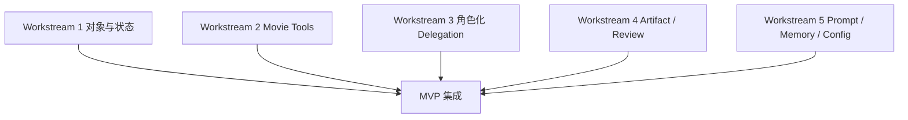
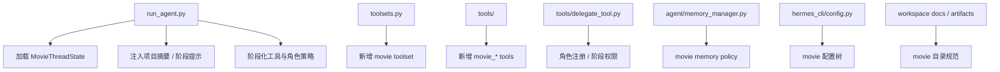
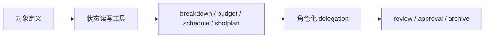
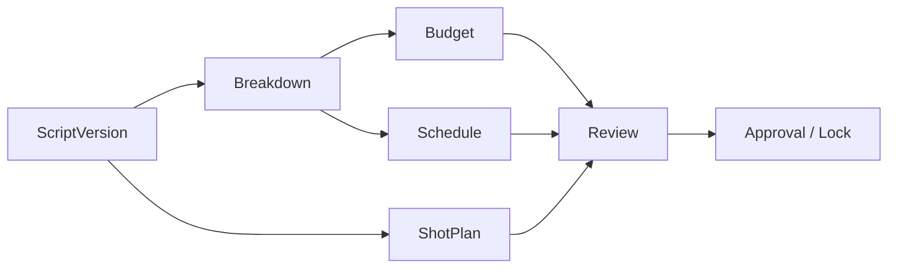

# 14. 实施草案：从当前仓库出发如何逐步落系统

## 这篇文档回答什么问题

系统蓝图有了，下一步要回答的是“怎么在当前仓库里做出来”。

本篇不是最终代码设计，而是一个偏工程实施的草案，回答：

1. 哪些工作流可以先做。
2. 哪些代码入口适合扩展。
3. 怎样在不推翻 Hermes 现有结构的前提下逐步落地。

---

## 一、总体实施策略

建议采用“先叠层，后抽象”的策略。

也就是说：

- 第一阶段先把 movie 能力叠加到现有 runtime、tools、delegation、memory、workspace 上
- 第二阶段在能力稳定后，再逐步抽出 movie 专属模块

---

## 二、建议的实施工作流

推荐把实施拆成五条并行但有依赖的工作流。

### Workstream 1：对象与状态

目标：

- 建立 `MovieProject`、`MovieThreadState`
- 定义 script / scene / breakdown / budget / schedule / shotplan 的基础对象

### Workstream 2：Movie Tools

目标：

- 做项目态读写工具
- 做 breakdown、预算、排期、镜头计划等核心工具

### Workstream 3：角色化 Delegation

目标：

- 在现有 `delegate_task` 上加电影角色注册表和阶段激活规则

### Workstream 4：Artifact / Review

目标：

- 建目录结构
- 定义 review / approval / archive 的基础流程

### Workstream 5：Prompt / Memory / Config

目标：

- 给主智能体注入 movie 项目摘要
- 管理记忆策略
- 增加 movie 配置树

---

## 三、当前仓库的建议改动区域

下面是一份偏实施视角的代码触点图。

---

## 四、实施顺序建议

虽然有五条工作流，但为了降低集成风险，仍建议按下面的顺序推进。

1. 先定义对象和状态。
2. 再做读写状态的工具。
3. 再做基于对象的专业工具。
4. 再把角色委派拉起来。
5. 最后补审批、评审和归档。

---

## 五、为什么第一版不要先做数据库重构

这是实施中一个很关键的取舍点。

第一版更适合：

- 用结构化 Markdown / YAML / JSON 存对象
- 用 workspace 目录表达 artifact 体系
- 用轻量 loader 将状态装入 runtime

而不适合一开始就：

- 设计很重的数据库 schema
- 做复杂迁移系统
- 过早建立服务化架构

原因是对象语义本身还会变化，过早固化存储结构，成本通常更高。

---

## 六、MVP 的建议实施闭环

MVP 建议收敛到“前期制作闭环”。

这条链一旦跑通，就说明平台已经不只是想法，而是开始具备正式项目运行能力。

---

## 七、实施中的组织建议

如果是多人协作推进，建议把工作分成三类角色：

- 架构与对象建模
- runtime / tools / delegation 工程实现
- 文档与流程模板沉淀

这样能避免所有人都在同一文件堆改，降低混乱。

---

## 八、结论

从实施角度看，最重要的不是一次把电影平台全部做完，而是：

- 先用最少的对象和工具跑通第一条正式工作链
- 尽量复用 Hermes 现有 runtime、tool registry、delegation 和 workspace
- 在跑通之后，再逐步把 movie 能力抽象成稳定模块

这条路线既现实，也最符合当前仓库的结构特点。

---

## 相关文档

- [13-system-blueprint.md](./13-system-blueprint.md)
- [15-a-code-design-draft.md](./15-a-code-design-draft.md)
- [17-c-first-code-drop-plan.md](./17-c-first-code-drop-plan.md)
- [19-solution-2-mvp-implementation-path.md](./19-solution-2-mvp-implementation-path.md)
- [81-mvp-scope-definition.md](./81-mvp-scope-definition.md)
