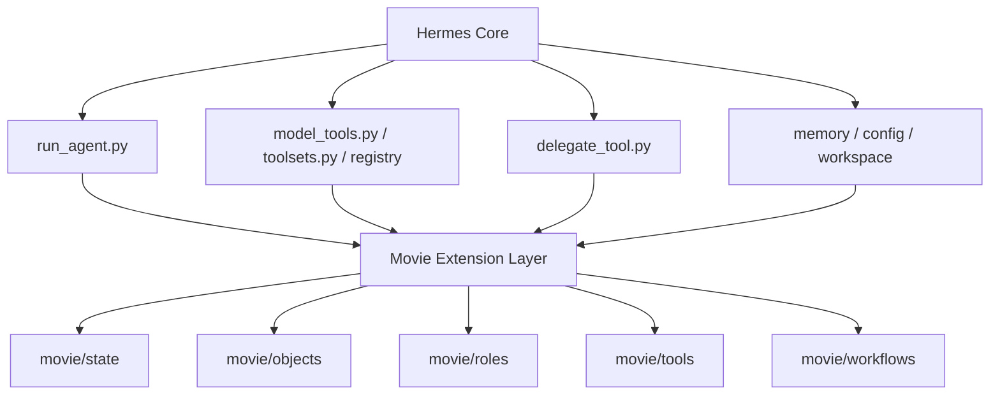
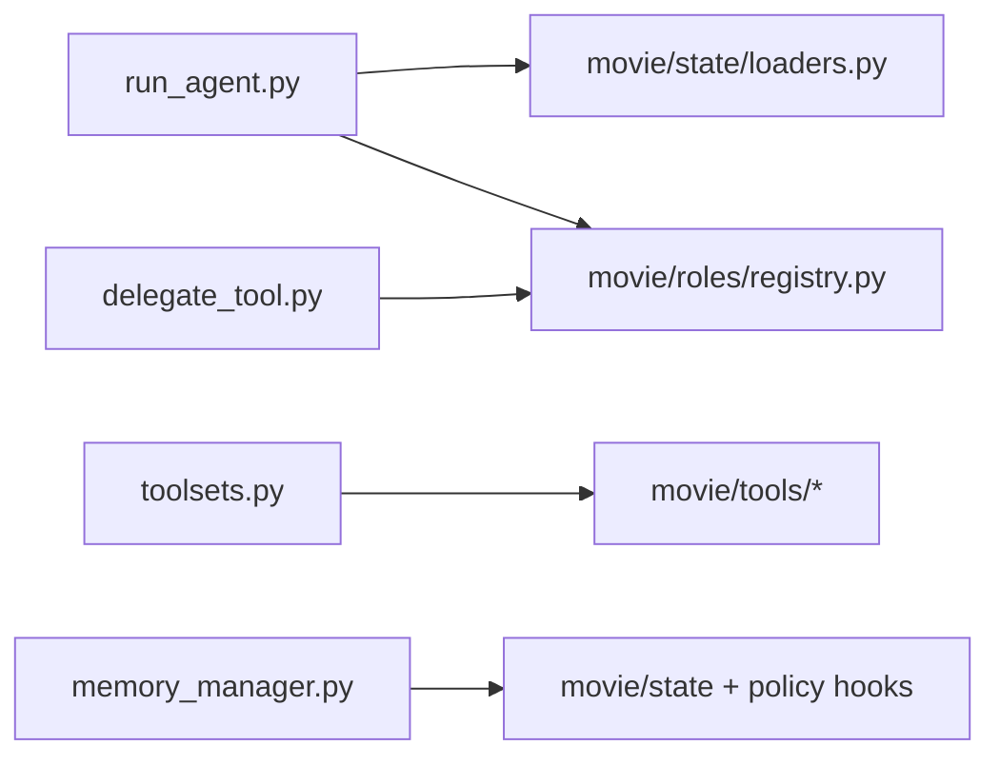
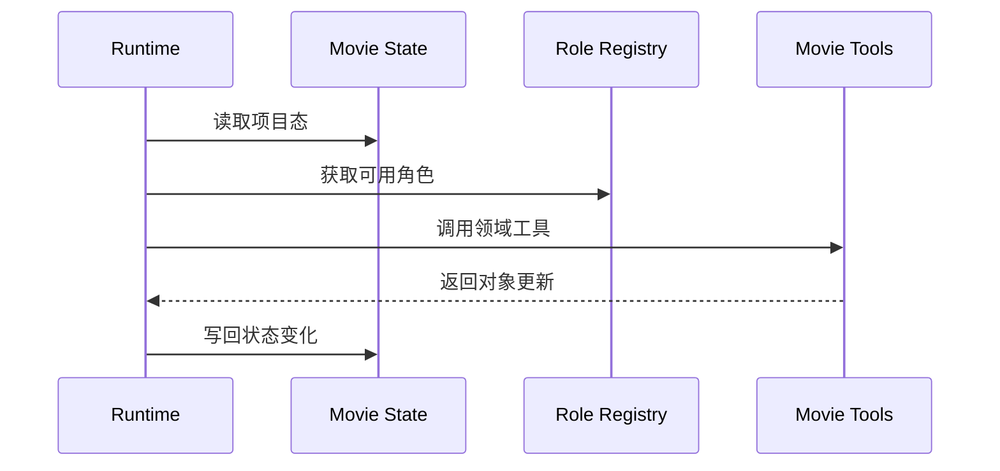

# 15. A 组：代码级设计草案

## 这篇文档回答什么问题

这一篇专门从代码组织角度，给出 movie 扩展的第一版设计草案。重点不是精确类名，而是：

- 哪些模块应该新增
- 哪些模块应该扩展
- 代码职责如何划分

---

## 一、建议的 movie 代码分层

建议在现有仓库中逐步形成一组 movie 相关模块，但不要破坏 Hermes 主骨架。



---

## 二、建议新增的模块包

下面是一个建议性的模块结构。

```text
movie/
  state/
    movie_project_state.py
    movie_thread_state.py
    loaders.py
  objects/
    project.py
    script.py
    scene.py
    budget.py
    schedule.py
    shotplan.py
    review.py
  roles/
    registry.py
    role_defs.py
    role_prompting.py
  tools/
    project_state_tool.py
    script_breakdown_tool.py
    budget_tool.py
    schedule_tool.py
    shotplan_tool.py
    review_tool.py
  workflows/
    phase_machine.py
    approvals.py
    artifact_flow.py
```

这不是要求一次性全建齐，而是给未来模块边界一个方向。

---

## 三、各层职责建议

### 1. `movie/state`

职责：

- 提供 runtime 级项目态对象
- 负责状态加载、保存、合并和最小校验

### 2. `movie/objects`

职责：

- 定义正式领域对象
- 提供版本、状态、依赖关系语义

### 3. `movie/roles`

职责：

- 管理电影角色注册表
- 角色默认 toolset、skill、prompt 注入

### 4. `movie/tools`

职责：

- 承载领域工具
- 通过现有 registry 注册

### 5. `movie/workflows`

职责：

- 定义阶段切换、审批和 artifact 流

---

## 四、与现有 Hermes 文件的关系

这套 movie 代码层不应该替代现有 Hermes 核心，而是挂接在它之上。



---

## 五、几个关键对象的代码语义建议

### 1. `MovieThreadState`

建议职责：

- 当前阶段
- 活跃对象 ID
- 当前阻塞
- pending approvals
- 活跃角色

### 2. `RoleDefinition`

建议职责：

- `role_name`
- `description`
- `default_toolsets`
- `default_skills`
- `allowed_object_types`
- `active_phases`

### 3. `ApprovalRecord`

建议职责：

- `target_type`
- `target_id`
- `status`
- `reviewers`
- `findings`
- `decision_summary`

---

## 六、运行时接入点建议

从代码设计角度看，最重要的接入点是三处。

### 1. Turn 开始前

加载 `MovieThreadState` 与当前项目摘要。

### 2. Tool / Delegation 执行中

根据阶段和角色决定允许的能力范围。

### 3. Turn 结束后

将关键对象变更和审批结果同步回状态与 artifact。



---

## 七、第一阶段避免的代码误区

建议避免：

- 在 `run_agent.py` 中写死全部 movie 业务逻辑
- 在 `delegate_tool.py` 中硬编码所有电影角色内容
- 让对象定义和文件序列化耦合得太死
- 让 memory 承担正式状态存储职责

---

## 八、结论

A 组代码级设计草案的核心思想是：

- Hermes Core 继续做通用运行骨架
- Movie Extension Layer 承担电影领域语义
- 通过清晰模块边界，把状态、对象、角色、工具和工作流分开

这样后续无论是继续写文档还是开始写代码，都更不容易失控。

---

## 相关文档

- [14-implementation-draft.md](./14-implementation-draft.md)
- [16-b-interfaces-and-data-contracts.md](./16-b-interfaces-and-data-contracts.md)
- [71-lead-agent-transformation-plan.md](./71-lead-agent-transformation-plan.md)
- [74-thread-state-extension-plan.md](./74-thread-state-extension-plan.md)
- [77-movie-factory-design.md](./77-movie-factory-design.md)
