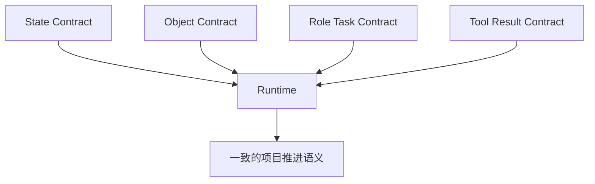
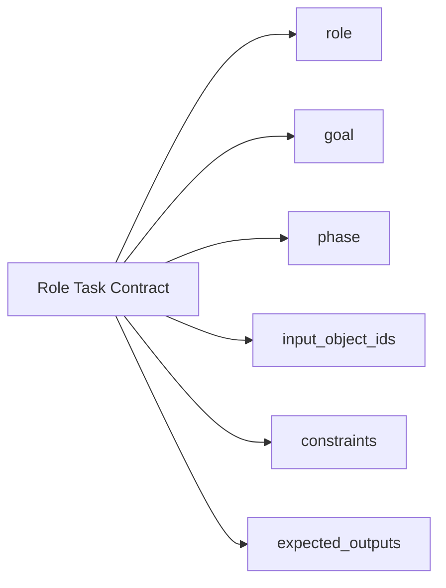
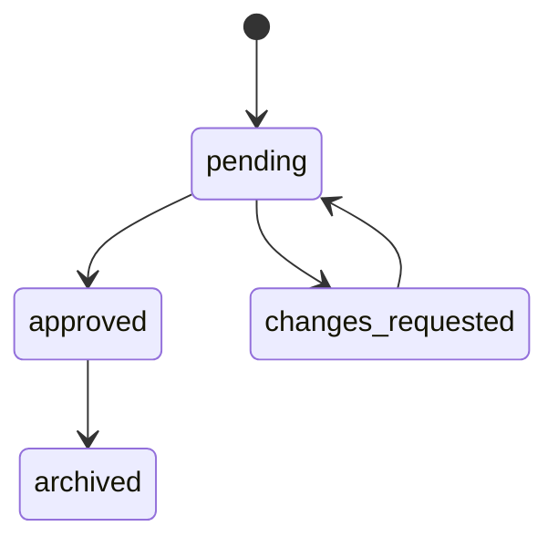
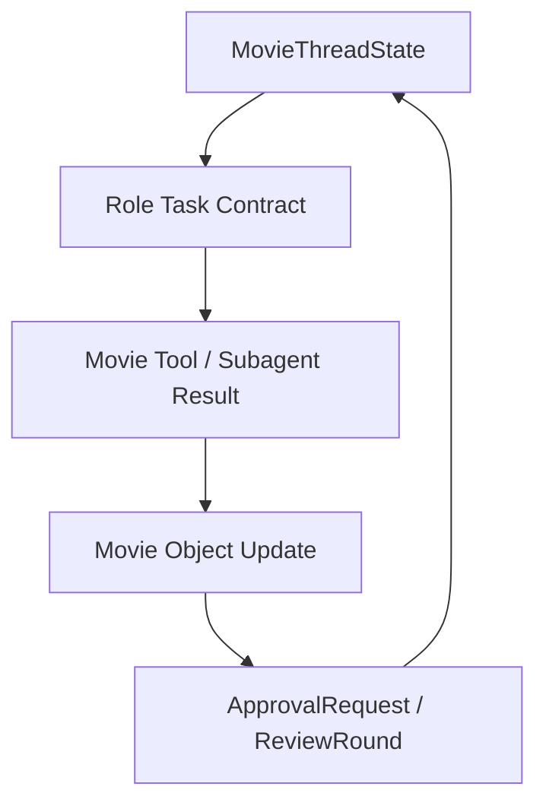

# 16. B 组：接口与数据契约草案

## 这篇文档回答什么问题

如果 A 组解决的是模块结构，那么 B 组解决的是模块之间怎么说话。

本篇重点是：

- 关键对象的数据契约应该长什么样
- 角色委派时的输入输出接口应该怎样定义
- 工具返回结果如何尽量结构化

---

## 一、为什么必须先定义契约

如果没有契约，系统很容易出现三个问题：

- 子智能体输出风格飘忽
- 工具结果难以合并
- 状态更新没有统一入口

因此，哪怕第一版没有完整类型系统，也应该先定义“约定格式”。

---

## 二、建议的核心契约面

建议至少有四类契约：

1. 项目状态契约
2. 电影对象契约
3. 角色任务契约
4. 工具结果契约



---

## 三、项目状态契约示意

下面是一份建议性的 `MovieThreadState` 结构示意。

```json
{
  "project_id": "movie_proj_001",
  "current_phase": "pre_production",
  "active_object_ids": [
    "script_v3",
    "breakdown_v1",
    "budget_v1"
  ],
  "pending_approvals": [
    "approval_budget_v1"
  ],
  "active_roles": [
    "director_lead",
    "script_analyst",
    "budget_planner",
    "schedule_planner"
  ],
  "blocked_items": [],
  "active_risks": [
    "location_not_locked"
  ],
  "latest_decisions": [
    "script_v3 selected as current working version"
  ]
}
```

---

## 四、电影对象契约示意

### 1. ScriptVersion

```json
{
  "type": "ScriptVersion",
  "id": "script_v3",
  "version_label": "v3",
  "status": "draft",
  "source_path": "movie/scripts/script-v3.md",
  "change_summary": "tightened act 2 pacing",
  "scene_ids": ["scene_001", "scene_002"],
  "review_status": "pending"
}
```

### 2. Budget

```json
{
  "type": "Budget",
  "id": "budget_v1",
  "version_label": "v1",
  "status": "draft",
  "topline_total": 12000000,
  "department_lines": [],
  "assumptions": [
    "20-day shoot"
  ],
  "risks": [
    "night exterior cost variance"
  ]
}
```

### 3. ShotPlan

```json
{
  "type": "ShotPlan",
  "id": "shotplan_scene_001_v1",
  "scene_id": "scene_001",
  "creative_goal": "establish emotional isolation",
  "shots": [],
  "style_notes": [
    "slow push-in",
    "cool palette"
  ],
  "status": "draft"
}
```

---

## 五、角色任务契约示意

角色委派时，建议不要只传一段自然语言，而是尽可能形成结构化任务包。

```json
{
  "role": "budget_planner",
  "goal": "Draft a first-pass budget based on the current breakdown.",
  "phase": "pre_production",
  "input_object_ids": [
    "script_v3",
    "breakdown_v1"
  ],
  "constraints": [
    "keep topline under 12M",
    "preserve night exterior sequence if possible"
  ],
  "expected_outputs": [
    "BudgetDraft",
    "RiskSummary"
  ]
}
```



---

## 六、工具结果契约示意

Movie tools 最好统一返回一个相似的包裹结构。

```json
{
  "success": true,
  "updated_objects": [
    "budget_v1"
  ],
  "created_artifacts": [
    "movie/budget/budget-v1.md"
  ],
  "summary": "Created first-pass budget with three major risks.",
  "warnings": [
    "location estimate still preliminary"
  ]
}
```

这样主智能体在合并工具输出时会容易很多。

---

## 七、审批契约示意

```json
{
  "type": "ApprovalRequest",
  "id": "approval_budget_v1",
  "target_type": "Budget",
  "target_id": "budget_v1",
  "status": "pending",
  "reviewers": ["producer", "director"],
  "findings": [],
  "decision_summary": ""
}
```



---

## 八、契约之间的关系



这张图说明：

- 状态决定任务
- 任务产生结果
- 结果更新对象
- 对象进入审批
- 审批反过来更新状态

---

## 九、第一阶段建议

第一阶段不要求把所有契约都严格类型化，但至少应该做到：

- 有统一字段命名习惯
- 有统一的成功 / 警告 / 更新对象返回结构
- 角色任务输入尽量结构化
- 关键对象至少有 ID、version、status、artifact path

---

## 十、结论

B 组契约草案的核心不是追求完美 schema，而是给 movie 系统建立最基本的一致语言。

只要契约先统一，后面无论是工具、子智能体、审批流还是 artifact，都更容易组合成一个真正可维护的平台。

---

## 相关文档

- [15-a-code-design-draft.md](./15-a-code-design-draft.md)
- [17-c-first-code-drop-plan.md](./17-c-first-code-drop-plan.md)
- [66-review-approval-release-package-object-system.md](./66-review-approval-release-package-object-system.md)
- [72-task-tool-and-delegation-extension.md](./72-task-tool-and-delegation-extension.md)
- [75-movie-tools-design.md](./75-movie-tools-design.md)
