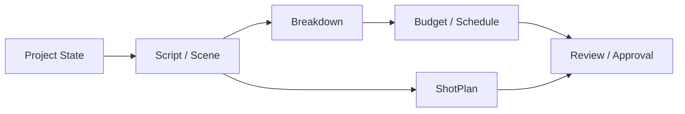
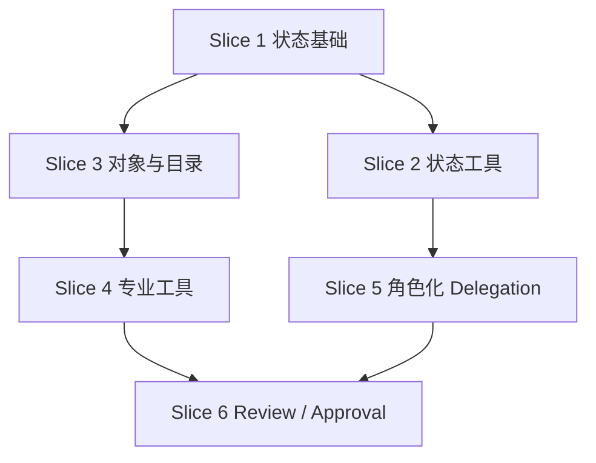
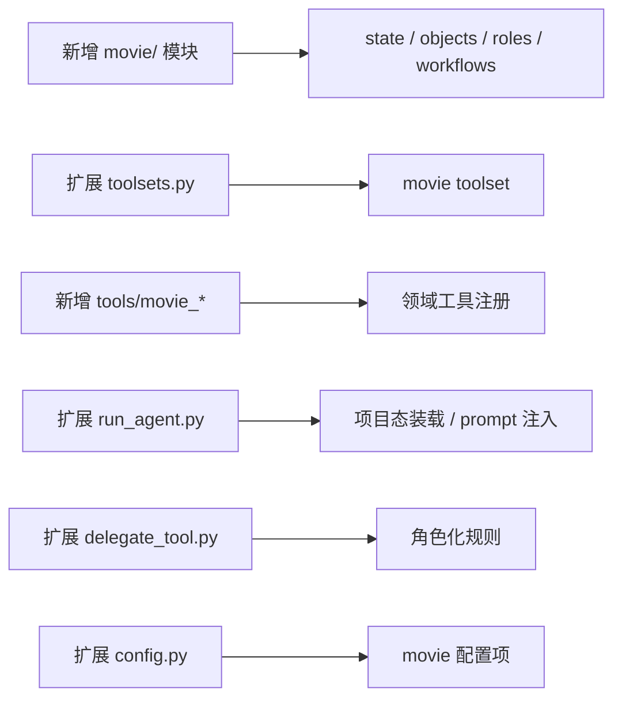

# 17. C 组：第一版代码落地方案

## 这篇文档回答什么问题

A 组给了代码结构草案，B 组给了接口和数据契约。本篇更进一步，直接回答第一版代码应该怎么拆、怎么提交、怎么降低集成风险。

---

## 一、第一版代码落地目标

第一版不追求“电影平台全部可用”，只追求跑通第一条高价值链路：

只要这条链能在 Hermes 中稳定工作，就说明 movie 扩展已经进入可用阶段。

---

## 二、推荐的首批代码切片

建议把第一版落地拆成六个切片。

### Slice 1：项目状态基础

内容：

- `MovieProject`
- `MovieThreadState`
- 基础 loader / saver

### Slice 2：movie toolset 与状态工具

内容：

- `movie_project_state`
- `movie` toolset

### Slice 3：核心对象与 artifact 目录

内容：

- Script / Scene / Breakdown / Budget / Schedule / ShotPlan 基础对象
- `movie/` 目录规范

### Slice 4：专业工具第一批

内容：

- `movie_script_breakdown`
- `movie_budget_estimate`
- `movie_schedule_plan`
- `movie_shotplan_generate`

### Slice 5：角色化 delegation

内容：

- 角色注册表
- 阶段激活规则
- 角色默认 toolset / skill

### Slice 6：review / approval 基础流程

内容：

- `movie_review_package`
- `movie_approval_update`
- 基础状态切换

---

## 三、切片依赖关系

---

## 四、建议改动文件范围

如果按最小改动原则，第一版主要会落到下面这些区域。

---

## 五、建议的 PR 切法

为了降低 review 和合并风险，建议按 PR 切分，而不是一次性大包提交。

1. PR-1：状态对象与 movie 目录规范
2. PR-2：movie toolset 与项目态工具
3. PR-3：核心对象与四个专业工具
4. PR-4：角色注册表与 delegation 扩展
5. PR-5：review / approval 流程

这样每个 PR 都能单独 review，也便于回退。

---

## 六、第一版完成标准

建议把完成标准定义得非常具体。

### 功能完成标准

- 可以载入一个 movie 项目状态
- 可以读取当前 script / scene 集合
- 可以生成 breakdown、budget、schedule、shotplan 草稿
- 可以调用至少 3 个电影角色子智能体
- 可以提交一次基础 review / approval

### 工程完成标准

- 新增能力不破坏现有 Hermes 运行路径
- toolset 选择仍通过现有 `model_tools.py`
- delegation 仍通过现有 `delegate_task`
- state / artifacts 有稳定目录与格式

---

## 七、第一版不应该做什么

第一版明确不建议做：

- 复杂 UI 工作台
- 视频生成编排引擎
- 大规模企业权限模型
- 全阶段全岗位覆盖

这些都应该放到后续阶段。

---

## 八、建议的验证路径

第一版完成后，建议用一个真实但小型的虚拟项目跑验收。

如果这条验收链稳定，就说明第一版代码落地是成功的。

---

## 九、结论

C 组第一版代码落地方案的关键，不是堆很多功能，而是把最核心的一条制作链打透。

只要：

- 状态有了
- 对象有了
- 工具有了
- 角色委派有了
- 审批能闭环

Hermes 就已经开始从通用多智能体系统，长成电影导演智能体平台。

---

## 相关文档

- [14-implementation-draft.md](./14-implementation-draft.md)
- [16-b-interfaces-and-data-contracts.md](./16-b-interfaces-and-data-contracts.md)
- [19-solution-2-mvp-implementation-path.md](./19-solution-2-mvp-implementation-path.md)
- [81-mvp-scope-definition.md](./81-mvp-scope-definition.md)
- [112-ai-coding-and-multi-agent-delivery-plan.md](./112-ai-coding-and-multi-agent-delivery-plan.md)
