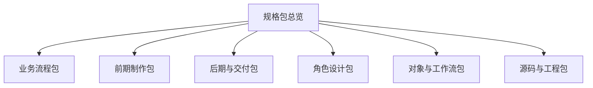

# 18. 方案 1：可直接开发的 Markdown 细稿集合

## 这篇文档回答什么问题

如果前几篇更偏系统设计，这一篇更偏“怎么把接下来几十篇细稿组织成可直接开发的文档包”。

核心目标是：把零散的主题拆成几个可以连续推进的 Markdown 细稿包。

---

## 一、方案 1 的思想

方案 1 不急着先写代码，而是先把文档设计稿做成一套高度可执行的规格说明。

这种方式特别适合：

- 前期概念还在收敛
- 多角色协作，需要先统一术语
- 希望先把系统边界讲清楚

---

## 二、推荐的细稿包分组

建议把后续的 50+ 文档分成六个包。

### 1. 业务流程包

典型文档：

- 21
- 22
- 23
- 24
- 37
- 40
- 51

### 2. 前期制作包

典型文档：

- 25
- 26
- 27
- 28
- 29
- 30
- 31
- 32
- 33
- 34
- 35
- 36

### 3. 后期与交付包

典型文档：

- 45
- 46
- 47
- 48
- 49
- 50

### 4. 角色设计包

典型文档：

- 52 到 60

### 5. 对象与工作流包

典型文档：

- 61 到 70

### 6. 源码与工程包

典型文档：

- 71 到 80

---

## 三、每篇细稿建议的统一结构

为了让后续文档更好写、更好读，建议每篇都遵守统一模板。

1. 这篇文档回答什么问题
2. 业务现实或系统现实
3. 在导演智能体平台中的角色
4. 对象、状态、角色、工具映射
5. Mermaid 图表
6. MVP 落地建议
7. 后续扩展方向

---

## 四、为什么方案 1 对当前阶段有价值

它最大的价值是先把“复杂系统的语言”统一。

这对于电影平台这种跨创作、跨生产、跨工程的系统尤其重要。

---

## 五、方案 1 的风险

它也有明显风险：

- 文档可能写得很全，但代码推进慢
- 如果不及时回到代码，会形成“设计繁荣、实现滞后”
- 多个细稿之间可能出现术语漂移

所以方案 1 更适合作为：

- 写代码前的强预研阶段
- 或代码推进中的并行规格补全阶段

---

## 六、推荐的使用方式

更推荐把方案 1 与后面的 MVP 实现路径结合使用。

也就是说，方案 1 不应单独悬空，而应与实现节奏相互校正。

---

## 七、下一步最该写哪些细稿

如果沿方案 1 继续推进，建议优先写：

1. 21 到 24
2. 25 到 30
3. 52 到 57
4. 61 到 68
5. 71 到 76

这是最容易形成“设计和工程互相支持”的顺序。

---

## 八、结论

方案 1 的核心，是把 Movie Director Agent 的后续设计拆成一套真正可执行的规格文档集合。

它不是为了写更多文档，而是为了让：

- 业务
- 架构
- 工程
- 实施

在进入大规模实现前先站到同一张地图上。

---

## 相关文档

- [14-implementation-draft.md](./14-implementation-draft.md)
- [19-solution-2-mvp-implementation-path.md](./19-solution-2-mvp-implementation-path.md)
- [20-master-plan-50-docs.md](./20-master-plan-50-docs.md)
- [81-mvp-scope-definition.md](./81-mvp-scope-definition.md)
- [README.md](./README.md)
