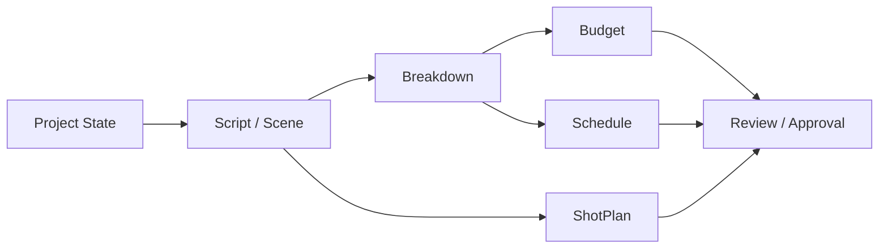
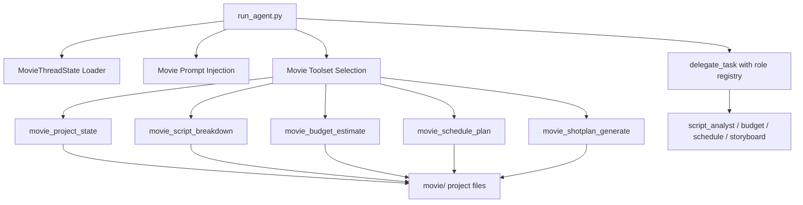
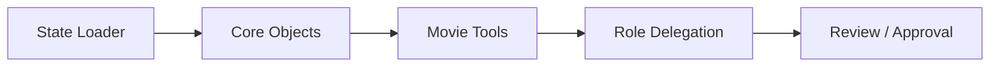
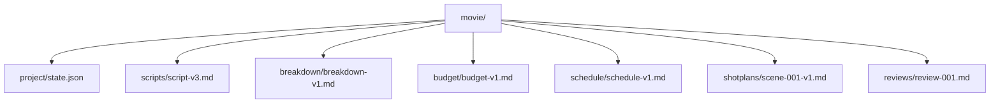

# 19. 方案 2：最小 MVP 实现路径与模块关系图

## 这篇文档回答什么问题

如果方案 1 偏规格化，方案 2 就偏执行化。

本篇只关心一个问题：在不做重型重构的前提下，怎么最快把 Movie Director Agent 的最小 MVP 做出来。

---

## 一、MVP 的最小目标

MVP 不是完整电影平台，而是“前期制作可跑通”。

只要这一条链在 Hermes 里能稳定运行，就足以证明方案方向正确。

---

## 二、最小模块关系图

---

## 三、最小实现路径

建议按四步走。

### Step 1：让项目状态可加载

目标：

- 有 `MovieThreadState`
- 能从 workspace 读取项目状态
- 主智能体能知道当前 phase 和 active objects

### Step 2：让核心对象能被产出

目标：

- script / scene / breakdown / budget / schedule / shotplan 有基础格式

### Step 3：让主智能体能调用电影工具和角色

目标：

- 新增 movie tools
- 用 delegation 调 script、budget、schedule、storyboard 角色

### Step 4：让结果可进入 review / approval

目标：

- 有最基础的 pending / approved / changes requested 流程

---

## 四、实现依赖关系

---

## 五、建议优先复用的 Hermes 能力

MVP 之所以可行，是因为它不需要从零搭所有系统。

### 直接复用

- `AIAgent`
- `model_tools.py`
- `tools/registry.py`
- `toolsets.py`
- `delegate_task`
- `memory_manager.py`
- `file_tools.py`

### 新增但尽量轻量

- `MovieThreadState`
- 电影对象定义
- role registry
- 5 到 7 个 movie tools

---

## 六、MVP 的目录与产物建议

尽量让每个关键对象都落到正式文件，而不是只存在消息流里。

---

## 七、MVP 完成后的下一步

当 MVP 跑通后，再考虑按下面顺序扩展。

这保证系统是沿着真实生产流程成长的，而不是随机扩功能。

---

## 八、方案 2 的优点与代价

### 优点

- 快
- 复用高
- 最容易形成真实可运行演示

### 代价

- 第一版结构可能不够优雅
- 后续需要再抽象模块边界
- 某些对象语义可能要二次整理

因此方案 2 很适合作为：

- 先做出最小可用系统
- 再反向校正设计

---

## 九、结论

方案 2 的核心不是“少做”，而是“先做最有证明力的一条链”。

对于当前 Hermes 仓库，最小 MVP 实现路径就是：

- 先把状态和对象接进 runtime
- 再把电影工具和角色委派接起来
- 最后用 review / approval 把前期制作闭环锁住

这条路线是当前最现实的工程切入点。

---

## 相关文档

- [17-c-first-code-drop-plan.md](./17-c-first-code-drop-plan.md)
- [18-solution-1-detailed-md-drafts.md](./18-solution-1-detailed-md-drafts.md)
- [24-hermes-agent-transformation-roadmap.md](./24-hermes-agent-transformation-roadmap.md)
- [81-mvp-scope-definition.md](./81-mvp-scope-definition.md)
- [112-ai-coding-and-multi-agent-delivery-plan.md](./112-ai-coding-and-multi-agent-delivery-plan.md)
