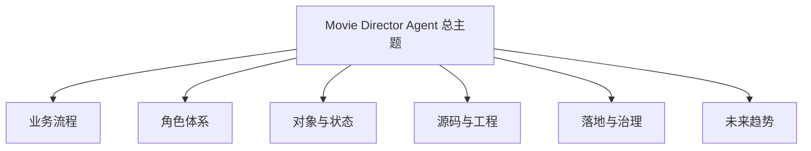
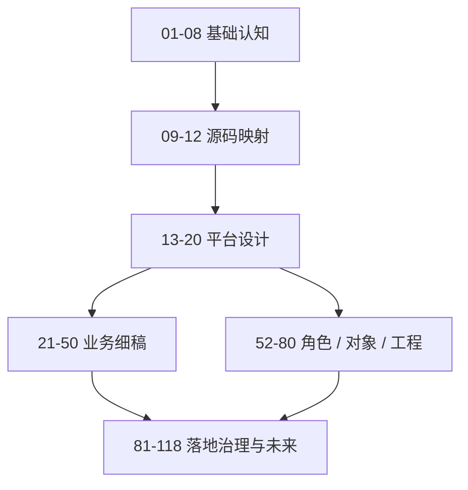

# 20. 50+ 文档总规划：如何把整套 Movie 体系写成一张地图

## 这篇文档回答什么问题

Movie 目录不是一篇大文档，而是一整套知识地图。本篇要回答的是：

1. 为什么需要 50+ 文档，而不是一篇总方案。
2. 这些文档应该如何分组。
3. 哪些文档适合先写，哪些可以后写。

---

## 一、为什么要拆成 50+ 文档

这个主题天然跨越多个维度：

- 电影业务流程
- 智能体角色设计
- 对象与工作流建模
- 源码与工程改造
- 落地治理与 ROI
- 未来模型与行业变化

如果全部塞进一篇文档，读者会很难定位，也很难维护。

---

## 二、50+ 文档的一级分组建议

建议至少按十组理解这套文档。

1. 基础认知组
2. 源码映射组
3. 平台设计组
4. 传统电影流程组
5. 前期制作组
6. 后期与发行组
7. 角色设计组
8. 对象与工作流组
9. 工程研发组
10. 试点与治理组

---

## 三、当前已完成的起步文档

目前已经完成或在推进的是最基础的起步层：

- 01 到 12
- 13 到 20

它们共同承担的是“先把地图骨架搭起来”。

---

## 四、建议的优先书写顺序

如果不是一次写完全部，建议按下面顺序推进。

### 第一优先级

- 01 到 20
- 21 到 24
- 25 到 30

### 第二优先级

- 31 到 36
- 37 到 44
- 45 到 50

### 第三优先级

- 52 到 80

### 第四优先级

- 81 到 118

---

## 五、每组文档解决什么问题

### 基础认知组：01-08

解决：

- 系统是什么
- 为什么从 Hermes 出发
- 目标架构、阶段、角色、对象、路线图是什么

### 源码映射组：09-12

解决：

- 当前仓库哪些文件能承接 movie 能力

### 平台设计组：13-20

解决：

- 系统蓝图
- 实施草案
- 代码设计、接口契约、首版落地
- 文档和 MVP 的双路径推进方式

### 传统电影流程组：21-24

解决：

- 真实电影工业流程如何运行
- 如何映射到 agent 平台

### 前期制作组：25-36

解决：

- 锁稿、breakdown、预算、排期、选角、勘景、分镜等前期主工作链

### 拍摄与后期组：37-50

解决：

- 拍摄现场执行、dailies、后期版本、发行和交付

### 角色设计组：52-60

解决：

- 导演主智能体和各专业子智能体的职责与边界

### 对象与工作流组：61-70

解决：

- 项目对象系统、状态机、审批与归档

### 工程研发组：71-80

解决：

- Hermes 代码级扩展、movie tools、movie skills、factory、观测与评估

### 试点与治理组：81-118

解决：

- MVP、试点、组织、数据治理、安全、ROI、企业级推广、未来技术趋势

---

## 六、推荐的文档间依赖图

---

## 七、这套文档如何服务代码实现

最理想的状态不是“文档在一边，代码在一边”，而是两者形成闭环。

这对 Movie 目录尤其重要，因为它本来就是一个跨业务、跨技术、跨治理的复杂系统。

---

## 八、一个实际可执行的写作推进法

如果后续继续写文档，建议按“主题簇”推进，而不是按数字机械推进。

例如：

1. 先写 21 到 30，做完整前期制作包。
2. 再写 52 到 60，做角色包。
3. 再写 61 到 70，做对象与 workflow 包。
4. 最后再写 71 到 80，做工程包。

这样更有利于形成“可读的一组文档”，而不是零散编号。

---

## 九、结论

20 号文档的意义，不是重复 README，而是把整个 Movie 目录看作一套分层知识系统。

它帮助我们理解：

- 为什么要拆成这么多文档
- 哪些应该先写
- 哪些依赖哪些
- 文档如何反向支撑代码实现

这张地图一旦明确，后续无论是继续补文档还是开始做代码，方向都会清楚很多。

---

## 相关文档

- [13-system-blueprint.md](./13-system-blueprint.md)
- [19-solution-2-mvp-implementation-path.md](./19-solution-2-mvp-implementation-path.md)
- [24-hermes-agent-transformation-roadmap.md](./24-hermes-agent-transformation-roadmap.md)
- [81-mvp-scope-definition.md](./81-mvp-scope-definition.md)
- [README.md](./README.md)
