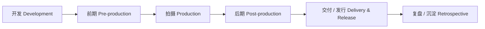
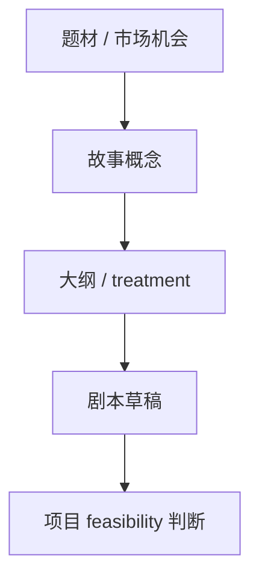
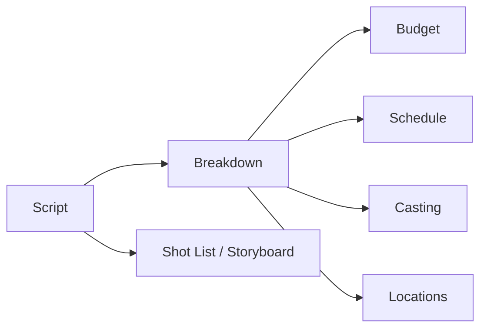
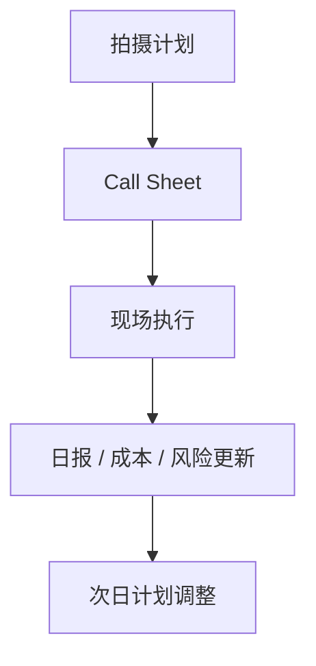
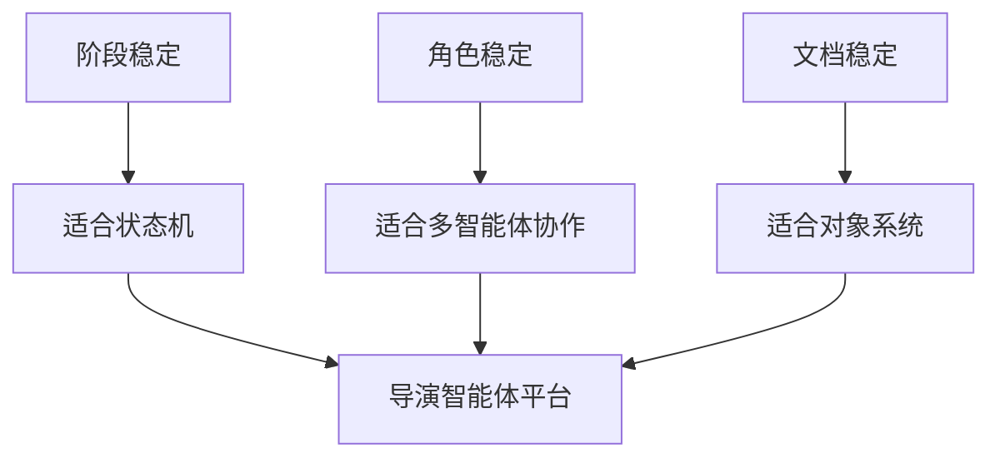

# 21. 传统电影制作全流程总览

## 这篇文档回答什么问题

如果不先理解传统电影工业是怎么运转的，就很容易把导演智能体平台设计成“会写点电影文本的 AI 工具”。

本篇的目标是先把传统电影制作的真实全流程讲清楚，回答：

1. 一部电影从立项到交付，通常经历哪些阶段。
2. 每个阶段的核心目标、核心文档、核心决策是什么。
3. 为什么这些流程天然适合被映射成智能体平台。

---

## 一、传统电影制作不是线性创作，而是阶段化生产

传统电影制作既是艺术创作，也是高度组织化的项目管理过程。

每个阶段都对应：

- 不同的负责人
- 不同的文档产物
- 不同的成本结构
- 不同的审批重点

因此，这天然就是一个适合被“阶段状态机 + 角色协作 + 对象治理”建模的系统。

---

## 二、开发阶段：决定要拍什么

开发阶段的核心不是执行，而是定义方向。

### 主要目标

- 题材和受众定位
- 故事 premise、logline 和主题方向
- 预算带宽和市场想象空间
- 主创方向与项目 feasibility

### 常见产物

- logline
- treatment
- 大纲
- 剧本草稿
- 风格参考
- 初步融资或包装说明

### 核心决策

- 这个项目值不值得进入前期
- 剧本是否继续开发
- 项目规模是小成本、中成本还是重工业项目

---

## 三、前期阶段：决定怎么拍

前期制作是电影工业最关键的组织化阶段。

### 主要目标

- 剧本逐步稳定
- 把剧本拆成可执行任务
- 做预算、排期、选角、勘景、服化道、摄影方案、分镜方案

### 常见产物

- 锁稿候选剧本
- breakdown sheet
- budget
- stripboard / shooting schedule
- casting list
- location list
- shot list
- storyboard / lookbook

### 核心决策

- 哪些场景可执行，哪些要调整
- 资源如何配置
- 哪些镜头和场景是非拍不可的创作核心

---

## 四、拍摄阶段：决定当天怎么完成

拍摄阶段的核心不是“继续想方案”，而是把前期方案转成每天可执行的组织与决策。

### 主要目标

- 保证每天完成关键镜头
- 在时间、资源和创作质量之间平衡
- 快速处理现场变化

### 常见产物

- call sheet
- daily progress report
- camera report / sound report
- dailies notes
- cost report

### 核心决策

- 今天拍什么、先拍什么
- 哪些镜头必须保住
- 哪些问题需要升级给导演、制片或执行制片

---

## 五、后期阶段：决定哪个版本成立

后期阶段的核心是版本管理和质量收敛。

### 主要目标

- 剪辑节奏和叙事成立
- 声音、音乐、调色、VFX 逐步完成
- 审核、评审和反馈流形成闭环

### 常见产物

- assembly cut
- rough cut
- fine cut
- picture lock
- ADR list
- VFX shot status
- color review notes

### 核心决策

- 当前 cut 是否继续改
- 哪个问题优先返工
- 何时 picture lock

---

## 六、交付与发行阶段：决定如何正式出厂

这个阶段不只是“做完了”，而是正式交付。

### 主要目标

- 确认最终交付包
- 完成合规、技术和发行需求
- 组织宣传物料和渠道版本

### 常见产物

- final master
- DCP / 平台交付文件
- 宣发物料
- 字幕 / 海报 / trailer 版本

### 核心决策

- 哪个版本是正式发行版本
- 交付格式和渠道版本是否齐全

---

## 七、为什么这些流程适合做成智能体平台

传统流程看似复杂，但恰恰很适合系统化，因为它有非常稳定的结构：

- 有明确阶段
- 有明确角色
- 有明确文档对象
- 有明确升级与审批

---

## 八、对后续设计的启发

这一篇最大的启发是：

- 导演智能体不是取代电影工业流程，而是把流程数字化、对象化、智能化
- 真正要建模的不是“灵感”，而是“项目如何被推进”

因此，后续文档会继续回答：

- 这些岗位如何组织
- 这些文档如何映射到智能体对象
- Hermes 如何渐进式承接这些流程

---

## 九、结论

传统电影制作的本质，是一条从故事开发到正式交付的阶段化生产链。

它不是松散创作集合，而是一个天然适合被建模成：

- 阶段状态机
- 多角色协同网络
- 正式对象系统
- 审批与交付流程

的复杂项目系统。这也是导演智能体平台成立的现实基础。

---

## 相关文档

- [22-non-ai-filmmaking-organization.md](./22-non-ai-filmmaking-organization.md)
- [23-mapping-traditional-process-to-agent-platform.md](./23-mapping-traditional-process-to-agent-platform.md)
- [24-hermes-agent-transformation-roadmap.md](./24-hermes-agent-transformation-roadmap.md)
- [37-principal-photography-operations.md](./37-principal-photography-operations.md)
- [45-editing-workflow-and-versioning.md](./45-editing-workflow-and-versioning.md)
- [99-hermes-agent-ai-film-operating-system-overview.md](./99-hermes-agent-ai-film-operating-system-overview.md)
