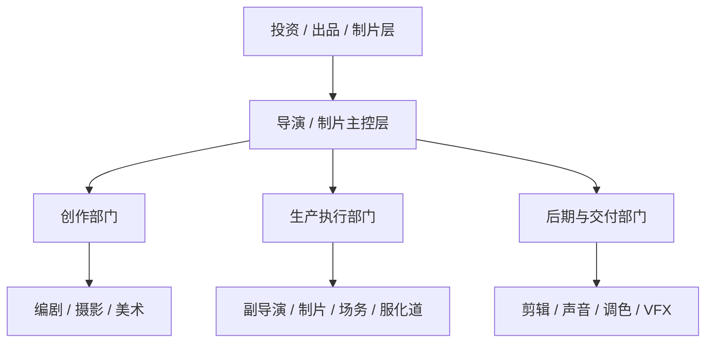
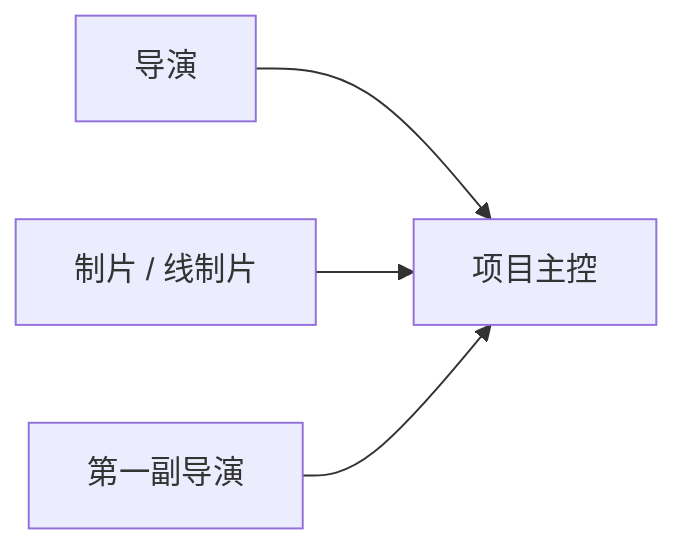
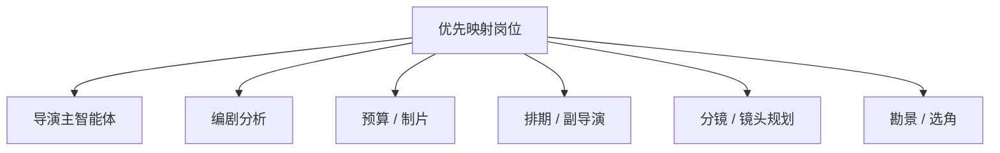

# 22. 无 AI 电影制作的组织结构

## 这篇文档回答什么问题

要把电影流程映射到导演智能体平台，先要看清楚没有 AI 时，电影团队到底是如何组织的。

本篇重点回答：

1. 传统电影剧组有哪些核心岗位。
2. 这些岗位之间如何协作。
3. 哪些岗位更适合被映射成导演主智能体，哪些更适合被映射成专业子智能体。

---

## 一、传统电影剧组的组织不是平铺结构

电影项目不是所有人同时和导演直接对话，而是一个分层组织。

这说明电影平台不应该设计成“几十个 agent 平级乱跑”，而应更像一个分层组织系统。

---

## 二、最核心的主控岗位

### 1. 导演

职责：

- 负责创作方向和最终表达
- 决定镜头、表演、节奏和整体风格
- 在冲突和取舍中做最终判断

### 2. 制片 / 执行制片 / 线制片

职责：

- 把创作目标转成现实可执行方案
- 控制成本、资源和组织节奏
- 协调部门和解决阻塞

### 3. 第一副导演

职责：

- 负责拍摄执行调度
- 把排期转成现场执行秩序

这三个岗位通常构成项目主控中枢。

---

## 三、创作部门

### 常见岗位

- 编剧
- 摄影指导
- 美术指导
- 服装设计
- 化妆造型
- 分镜或视觉开发

### 共同特点

- 都围绕“作品表达”提供专业视角
- 往往需要结合导演意图来工作
- 很多输出最终会变成正式文档、镜头、设计稿或风格参考

这类角色很适合未来映射成“高专业度子智能体”。

---

## 四、生产执行部门

### 常见岗位

- 执行制片
- 线制片
- 副导演组
- 场务组
- 制片组
- 器材、交通、现场协调

### 共同特点

- 更强调资源、时间、执行纪律
- 和预算、排期、现场风险高度耦合
- 需要大量结构化信息和决策升级链

这类角色很适合映射成“执行型和调度型子智能体”。

---

## 五、后期与交付部门

### 常见岗位

- 剪辑
- 声音设计 / 混录
- 作曲
- 调色
- VFX 制片 / VFX Supervisor
- 交付与发行协调

### 共同特点

- 强依赖版本管理
- 强依赖 review feedback
- 强依赖正式锁定节点

这类角色未来适合映射成“版本和评审驱动型子智能体”。

---

## 六、传统组织里的信息流

剧组的核心难点之一，是信息不是自然一致流动的，而是分层传递、不断损耗的。

这也正是导演智能体平台的价值来源之一：让意图、对象和状态在多个部门之间维持一致。

---

## 七、哪些岗位最适合先映射为智能体

第一阶段不必追求“全剧组数字化”，更适合先映射那些：

- 文档化程度高
- 决策结构相对清晰
- 与对象系统联系紧密

的岗位。

### 建议优先映射

- 导演主智能体
- 编剧分析智能体
- 预算智能体
- 排期 / 副导演智能体
- 分镜 / 镜头规划智能体
- 勘景或选角智能体

---

## 八、哪些岗位不适合第一阶段就重度映射

以下岗位虽然重要，但第一阶段不一定适合做深度 agent 化：

- 全部现场工种
- 高度依赖设备实时输入的岗位
- 强依赖专用软件深度集成的岗位

不是因为它们不重要，而是因为第一阶段更应先把对象、流程和主协同链跑通。

---

## 九、对导演智能体平台的启发

传统组织结构给导演智能体平台三点重要启发：

1. 平台必须有明确主控层。
2. 子智能体应按部门职能分化，而不是按随机任务分化。
3. 审批和升级链必须明确，不然系统会失控。

---

## 十、结论

无 AI 电影制作的组织结构，本质上是一套：

- 主控岗位
- 专业部门
- 执行链路
- 评审和升级链

共同构成的分层协作系统。

这套结构不是导演智能体平台要推翻的东西，而是平台最应该尊重和数字化映射的现实基础。

---

## 相关文档

- [21-traditional-filmmaking-overview.md](./21-traditional-filmmaking-overview.md)
- [23-mapping-traditional-process-to-agent-platform.md](./23-mapping-traditional-process-to-agent-platform.md)
- [52-director-lead-agent-design.md](./52-director-lead-agent-design.md)
- [53-producer-subagent-design.md](./53-producer-subagent-design.md)
- [86-team-organization-and-role-allocation.md](./86-team-organization-and-role-allocation.md)
