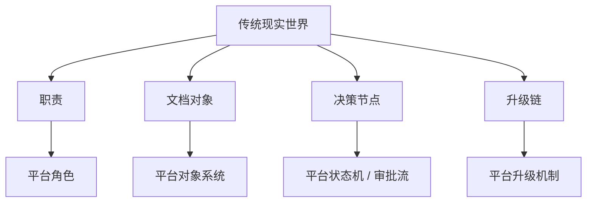
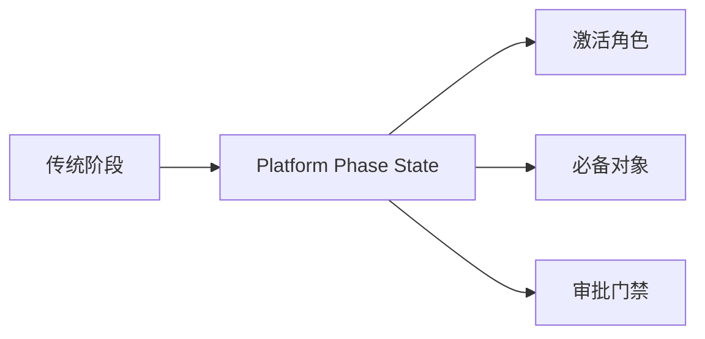
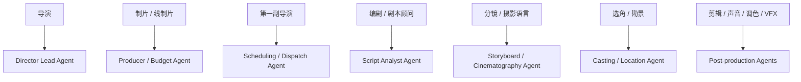
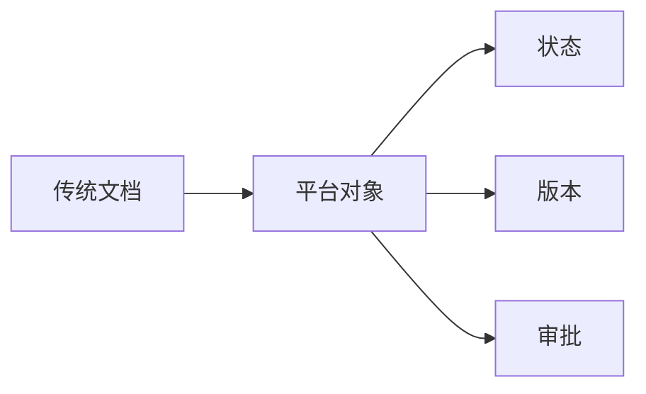
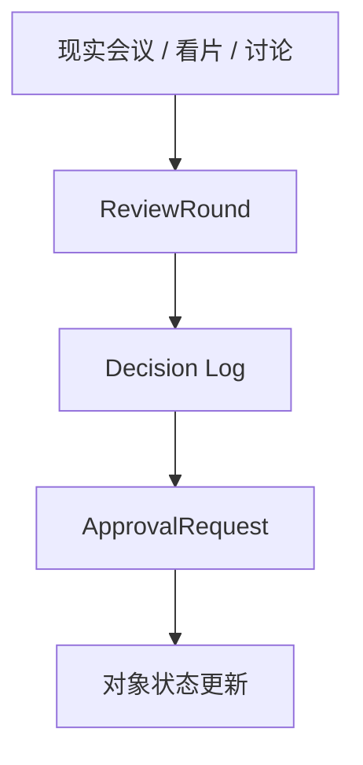
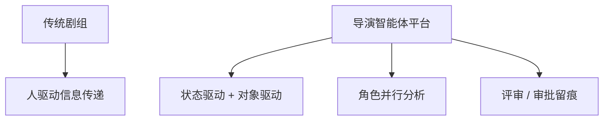

# 23. 从传统电影流程到导演智能体平台的映射

## 这篇文档回答什么问题

前两篇已经讲了：

- 传统电影流程如何推进
- 传统剧组如何组织

这一篇进一步回答：这些传统流程和岗位，应该怎样一一映射成导演智能体平台里的对象、角色、工具和工作流。

---

## 一、映射的基本原则

做映射时，不建议把现实世界岗位简单复制成几十个 agent 名字，而应该先看四个层面：

- 现实中的职责
- 现实中的文档对象
- 现实中的决策节点
- 现实中的升级链

---

## 二、阶段映射

### 传统阶段

- 开发
- 前期
- 拍摄
- 后期
- 发行

### 平台映射

- phase state
- active roles
- required artifacts
- gate conditions

这说明电影平台首先要做的，是把“阶段”从口头概念变成正式状态。

---

## 三、岗位映射

传统剧组里的不同岗位，建议映射成不同层级的 agent。

这里的关键不是角色名称，而是角色边界是否清晰。

---

## 四、文档对象映射

传统电影工业中的大量文档，本质上就是平台对象系统的现实原型。

| 传统文档 | 平台对象 |
|------|------|
| 剧本版本 | `ScriptVersion` |
| breakdown 表 | `BreakdownSheet` |
| 预算表 | `Budget` |
| stripboard / shooting schedule | `Schedule` |
| shot list | `ShotPlan` |
| 分镜 / lookbook | `StoryboardSet` / `Moodboard` |
| 审片意见 | `ReviewRound` |
| 批准记录 | `ApprovalRequest` |

---

## 五、会议与决策映射

现实电影流程中，很多关键节点都通过会议和审批达成，例如：

- 剧本讨论会
- 预算会
- 技术预演会
- dailies review
- post review

在平台中，它们应当被映射成：

- review rounds
- approval requests
- decision logs

这能避免“所有重要决策都散落在聊天里”。

---

## 六、升级链映射

现实剧组中，很多问题不是直接解决的，而是升级给更高层判断。

例如：

- 场地无法满足拍摄需求
- 夜戏成本过高
- 关键演员档期冲突
- 后期版本迟迟不能锁定

平台中应映射为：

- risk items
- blocked items
- escalation flow

---

## 七、传统流程与智能体平台最大的区别

导演智能体平台不是简单电子化剧组，而是在保留现实结构的基础上，增强四件事：

- 信息连续性
- 对象化管理
- 多角色并行分析
- 决策留痕与可回溯

---

## 八、对 Hermes 的直接启发

从映射角度看，Hermes 需要承接四类新增能力：

1. 角色注册表
2. 电影对象系统
3. 阶段状态机
4. review / approval / escalation 治理链

换句话说，Hermes 当前强在 runtime 和 tools，而电影化扩展要补的是“项目控制面”。

---

## 九、结论

从传统电影流程到导演智能体平台的映射，不是“岗位名称照搬”，而是把现实中的：

- 阶段
- 岗位
- 文档
- 决策
- 升级链

统一翻译成平台里的：

- phase state
- agent roles
- movie objects
- review / approval
- escalation flow

这才是后续所有细化设计和工程实现的桥。

---

## 相关文档

- [21-traditional-filmmaking-overview.md](./21-traditional-filmmaking-overview.md)
- [22-non-ai-filmmaking-organization.md](./22-non-ai-filmmaking-organization.md)
- [24-hermes-agent-transformation-roadmap.md](./24-hermes-agent-transformation-roadmap.md)
- [52-director-lead-agent-design.md](./52-director-lead-agent-design.md)
- [61-project-object-system-overview.md](./61-project-object-system-overview.md)
