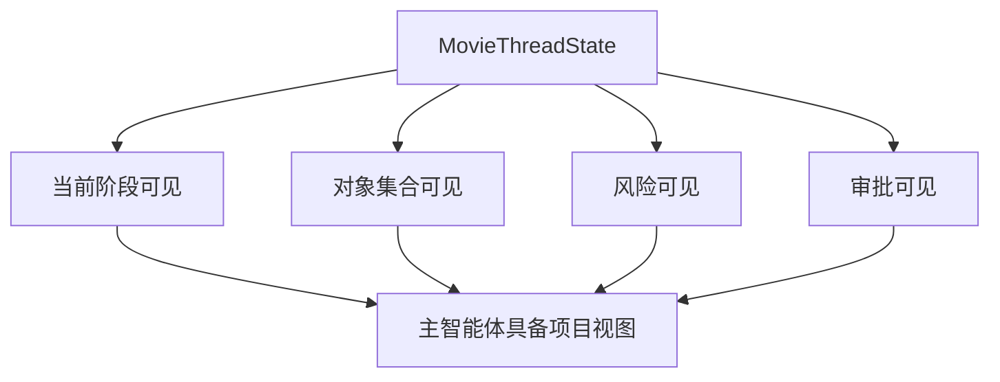
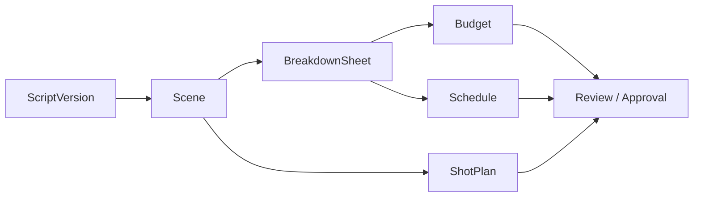
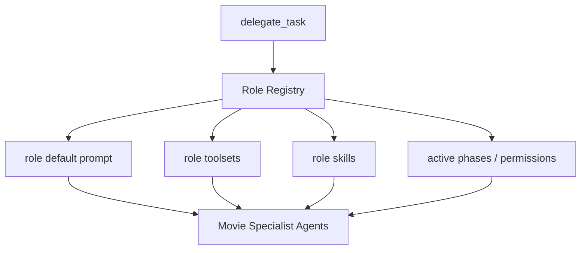
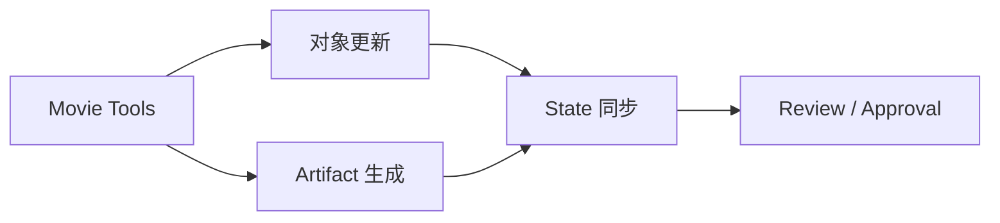
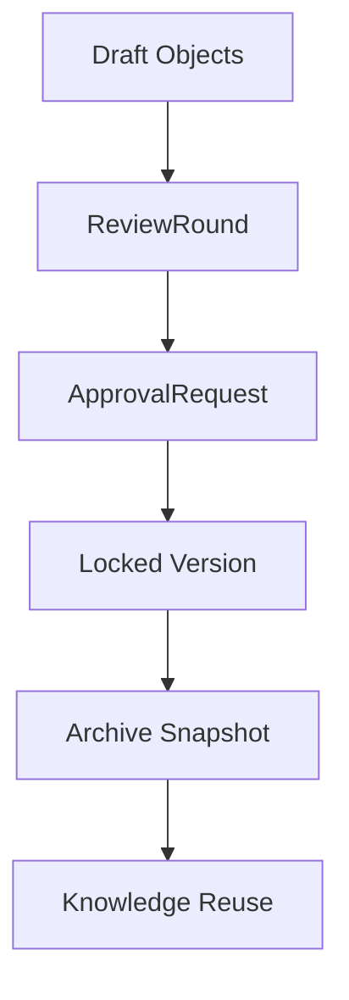
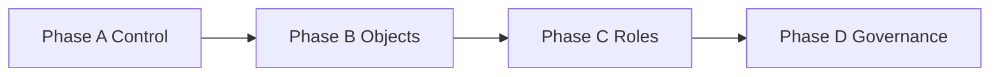
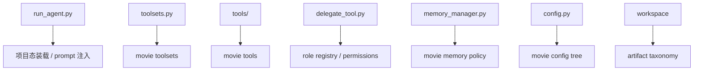

# 24. Hermes Agent 电影化改造路线图

## 这篇文档回答什么问题

前面 21 到 23 已经把传统电影工业流程、岗位和文档映射到了平台层。

这一篇要进一步回答：

1. Hermes Agent 应该按什么顺序完成电影化改造。
2. 哪些能力是“先补控制面”，哪些是“再补执行面”。
3. 如何从通用多智能体系统，逐步变成电影制作系统。

---

## 一、总体改造逻辑

改造路线不应该从“做更多生成工具”开始，而应该从“让 Hermes 具备电影项目控制能力”开始。

---

## 二、第一阶段：先建立项目控制面

第一阶段最重要的不是生成内容，而是建立控制面。

### 核心工作

- `MovieThreadState`
- phase state
- active objects
- pending approvals
- blocked items / risks

### 为什么先做这个

因为没有控制面，后面的角色、工具和文档都会散。

---

## 三、第二阶段：建立电影对象链

有了控制面后，下一步就是把核心对象正式化。

### 优先对象

- ScriptVersion
- Scene
- BreakdownSheet
- Budget
- Schedule
- ShotPlan
- ReviewRound

### 目标

- 让主智能体和子智能体不再只围绕自然语言，而是围绕正式对象工作

---

## 四、第三阶段：让 delegation 变成角色系统

Hermes 已经有 `delegate_task`，但还不是电影角色系统。

这一阶段的目标是：

- 给角色建立注册表
- 建立默认 toolset 和 skill
- 建立阶段激活与权限规则

---

## 五、第四阶段：建立 movie tools 与工作区产物流

角色只是思考者，真正的系统还需要能落正式产物。

### 这一阶段建议补齐

- movie_project_state
- movie_script_breakdown
- movie_budget_estimate
- movie_schedule_plan
- movie_shotplan_generate
- review / approval 工具

并让所有关键输出进入正式 workspace 目录。

---

## 六、第五阶段：建立治理闭环

当对象、角色和工具都到位后，最后缺的是正式治理。

### 需要补的能力

- review rounds
- approval state
- escalation flow
- archive snapshots
- retrospective capture

---

## 七、建议的改造阶段划分

可以更工程化地把它拆成 4 个阶段。

### Phase A：Project Control

- MovieThreadState
- phase gating
- prompt 注入

### Phase B：Objectified Pre-production

- script / scene / breakdown / budget / schedule / shotplan

### Phase C：Role-driven Collaboration

- role registry
- specialist agents
- structured outputs

### Phase D：Governed Production Platform

- review / approval / escalation / archive

---

## 八、每个阶段对 Hermes 代码的主要触点

---

## 九、为什么这是渐进式改造而不是重写

Hermes 已经有：

- 主智能体运行时
- 工具分发系统
- 子智能体委派
- memory 和 session continuity
- 文件与工作区能力

因此，电影化改造更像是“补电影领域控制面”，而不是“重做 AI agent”。

这也是这条路线最现实的地方。

---

## 十、结论

Hermes Agent 的电影化改造路线图可以概括成一句话：

**先让 Hermes 看见电影项目，再让它操作电影对象，再让它调度电影角色，最后让它具备电影工业所需的治理闭环。**

只要按这个顺序推进，系统就会从通用工作流底座，逐步长成一个真正面向电影生产的导演智能体平台。

---

## 相关文档

- [03-target-architecture.md](./03-target-architecture.md)
- [13-system-blueprint.md](./13-system-blueprint.md)
- [61-project-object-system-overview.md](./61-project-object-system-overview.md)
- [71-lead-agent-transformation-plan.md](./71-lead-agent-transformation-plan.md)
- [81-mvp-scope-definition.md](./81-mvp-scope-definition.md)
- [103-hermes-agent-movie-integration-strategy-summary.md](./103-hermes-agent-movie-integration-strategy-summary.md)
