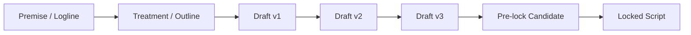
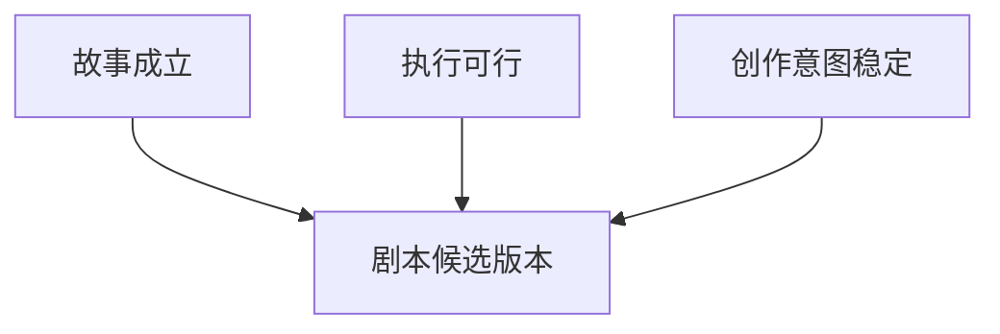
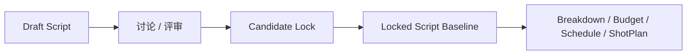
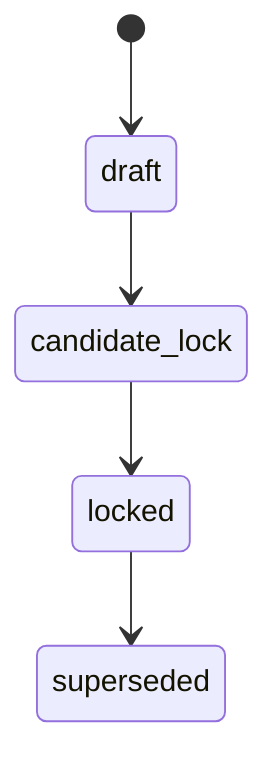
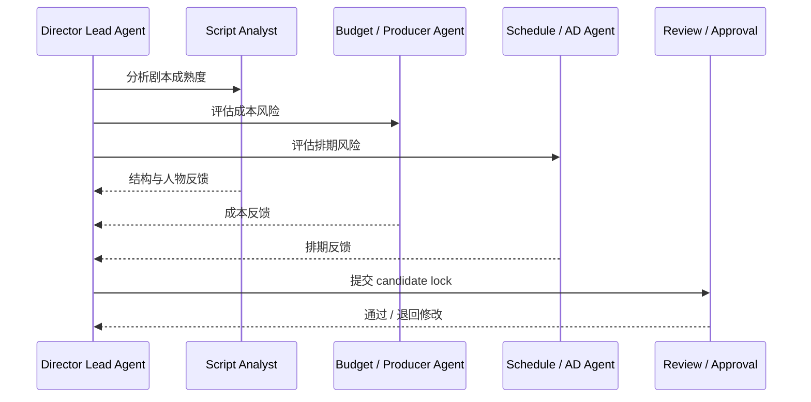

# 25. 剧本开发与锁稿

## 这篇文档回答什么问题

电影前期制作的第一条主链，永远从剧本开始。但现实里，剧本并不是“写完就结束”，而是一个不断开发、不断收敛、最终锁定的过程。

本篇重点回答：

1. 剧本开发在传统电影项目里是如何推进的。
2. 什么叫“锁稿”，什么情况下不该锁。
3. 在导演智能体平台里，剧本版本和锁稿应该如何建模。

---

## 一、剧本开发不是单次写作，而是版本收敛过程

一部电影进入前期时，通常不是从一个完全稳定的剧本开始，而是经历多个版本的迭代。

在这个过程中，变化可能来自：

- 故事结构调整
- 角色动机与关系重写
- 预算约束带来的场景删改
- 排期和制作难度带来的执行性调整
- 导演风格与镜头语言需求的再定义

因此，剧本开发本质上是创作目标与执行约束不断对齐的过程。

---

## 二、剧本开发阶段的主要目标

### 1. 把故事讲顺

解决：

- 主题是否清晰
- 人物弧线是否成立
- 叙事节奏是否有效

### 2. 把项目做实

解决：

- 这部片大概需要多大规模
- 有没有明显不可执行的段落
- 哪些场景是高成本 / 高风险点

### 3. 把创作意图稳定下来

解决：

- 哪些戏是不可牺牲的核心表达
- 哪些内容可以根据预算和排期调整

---

## 三、什么是“锁稿”

锁稿不意味着永远不能再改，而意味着：

- 当前项目正式进入以该版本为基线的生产组织
- downstream 的 breakdown、预算、排期、分镜、勘景等都以它为准
- 后续任何改动都必须被视为“变更”，而不是随手编辑

所以锁稿更像一个治理节点，而不是文学完成节点。

---

## 四、什么时候不该锁稿

有些项目为了推进进度，会过早锁稿，但这通常会把问题转嫁给后续部门。

以下情况不建议锁稿：

- 核心人物弧线还不稳定
- 高成本场景还没有 feasibility 判断
- 关键场景数量和规模波动过大
- 导演、制片和执行团队对项目规模认知不一致

---

## 五、传统剧组里谁参与锁稿

现实里锁稿并不是编剧一个人的决定，通常至少涉及：

- 导演
- 编剧
- 制片 / 线制片
- 副导演或执行团队
- 有时还包括摄影、美术、VFX 等关键部门

这意味着在导演智能体平台里，锁稿也不应是单智能体单方面状态切换，而应走 review / approval 流。

---

## 六、在导演智能体平台中的对象映射

剧本开发与锁稿，建议至少映射成以下对象和状态。

### 核心对象

- `ScriptVersion`
- `Scene`
- `Character`
- `ReviewRound`
- `ApprovalRequest`

### 核心状态

- `draft`
- `candidate_lock`
- `locked`
- `superseded`

---

## 七、剧本锁稿在平台里的工作流

建议工作流如下：

1. 编剧分析角色和场景结构。
2. 预算与排期角色给出执行风险反馈。
3. 导演主智能体整合意见。
4. 形成 candidate lock。
5. 经 review / approval 后切换为 locked。

---

## 八、对 Hermes 的直接实现启发

在 Hermes 里，剧本开发与锁稿最值得优先补的能力有：

- `ScriptVersion` 对象定义
- 剧本版本 artifact 目录
- 剧本评审与 candidate lock 状态
- 锁稿后的 downstream 依赖提示

换句话说，锁稿不只是文档状态，而是整个前期生产链的基线切换。

---

## 九、结论

剧本开发与锁稿，是电影前期制作中最重要的治理起点。

在导演智能体平台里，它应被看作：

- 一个版本收敛过程
- 一个跨角色评审过程
- 一个 downstream 生产链正式启用的基线节点

只有把“锁稿”建成正式对象状态与审批动作，后面的 breakdown、预算、排期和分镜才真正有稳定基础。

---

## 相关文档

- [26-script-breakdown-and-breakdown-sheet.md](./26-script-breakdown-and-breakdown-sheet.md)
- [27-budgeting-and-line-producer-view.md](./27-budgeting-and-line-producer-view.md)
- [33-text-storyboard-and-shot-list.md](./33-text-storyboard-and-shot-list.md)
- [63-script-scene-character-object-system.md](./63-script-scene-character-object-system.md)
- [66-review-approval-release-package-object-system.md](./66-review-approval-release-package-object-system.md)
- [81-mvp-scope-definition.md](./81-mvp-scope-definition.md)
