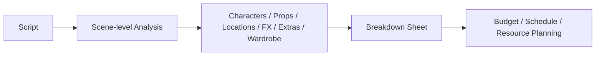
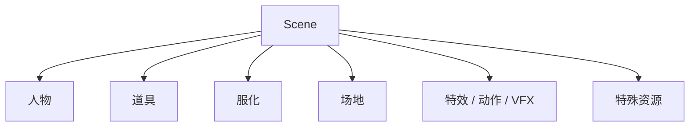
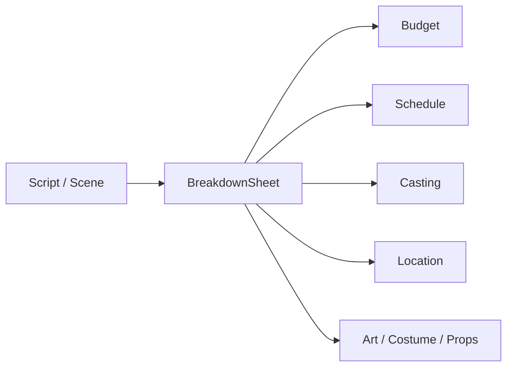
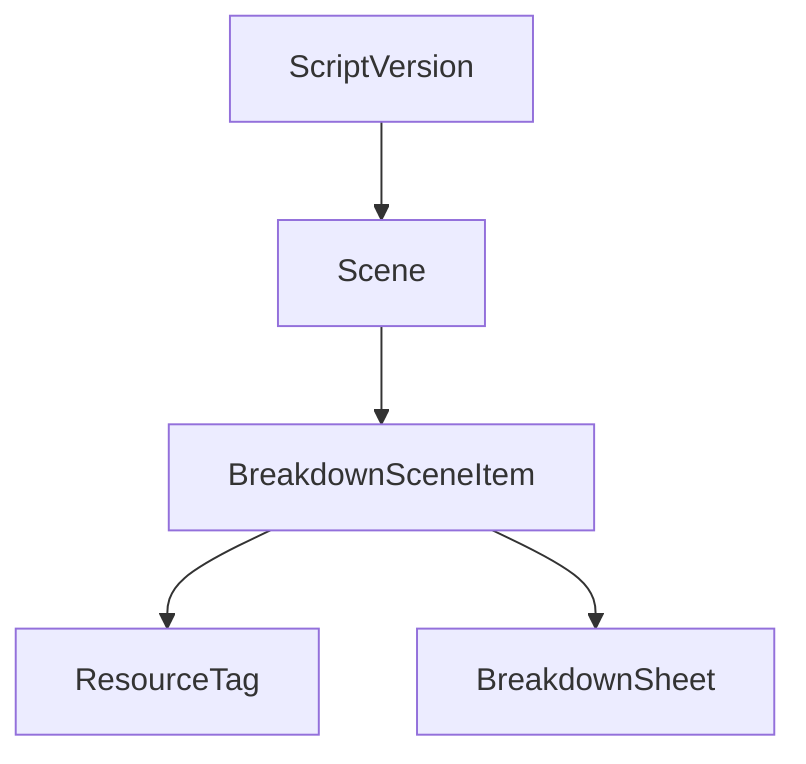
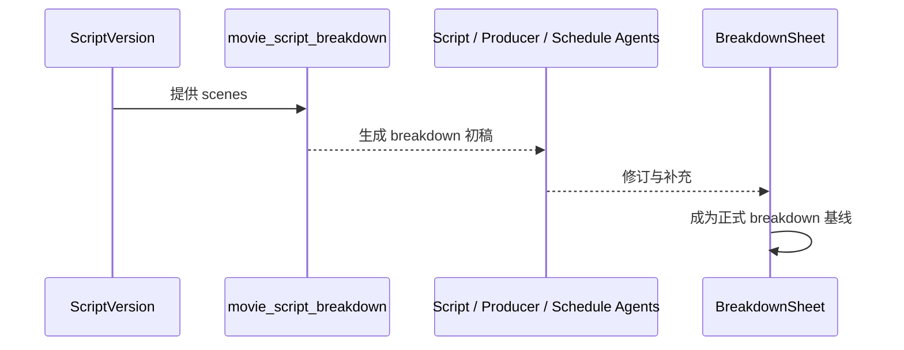
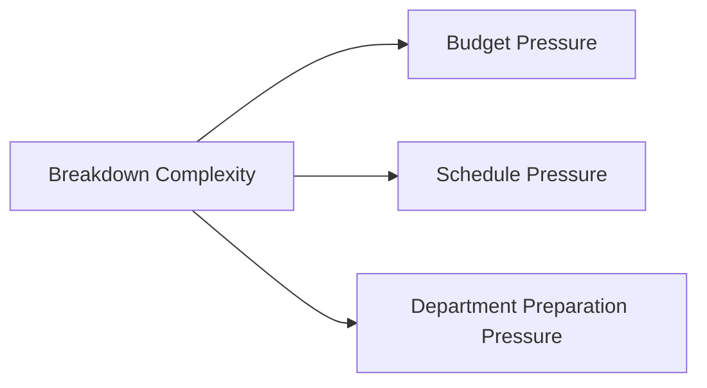

# 26. 剧本拆解与 Breakdown Sheet

## 这篇文档回答什么问题

剧本锁到一定程度后，真正把创作文本变成生产计划的第一步，就是 breakdown。

本篇重点回答：

1. 剧本拆解在传统电影项目里到底在做什么。
2. Breakdown sheet 为什么是前期最关键的桥梁文档。
3. 在导演智能体平台里，breakdown 应该如何变成对象和工具。

---

## 一、什么是 breakdown

Breakdown 的本质，是把剧本从“叙事文本”转成“生产要素集合”。

也就是说，breakdown 回答的不是“这段戏好不好”，而是：

- 这一场戏要动用哪些资源
- 哪些是特殊需求
- 哪些会影响成本和排期

---

## 二、传统 breakdown 会拆什么

不同项目会有差异，但常见拆解维度包括：

- 场景编号
- 内外景 / 日夜戏
- 出场角色
- 群演
- 道具
- 服装 / 化妆
- 特殊效果 / 特技
- 车辆 / 动物 / 武器
- 场地要求
- VFX 或特殊制作需求

---

## 三、为什么 breakdown 是前期主桥梁

Breakdown 是前期制作里最关键的桥梁对象之一，因为它同时连接：

- 创作文本
- 制作资源
- 成本测算
- 排期组织

如果 breakdown 不准，后面所有环节都会偏。

---

## 四、传统 breakdown 的实际难点

现实里 breakdown 并不是简单打标签，它有几个难点：

### 1. 文本语义到生产语义的翻译

剧本里一句轻描淡写的话，可能意味着复杂特效、大量群演或重型调度。

### 2. 不同部门对同一场景的关注点不同

- 制片关心成本
- 副导演关心拍摄组织
- 美术关心场景搭建
- 摄影关心光线与机位条件

### 3. 剧本改动会引发 breakdown 连锁变化

所以 breakdown 必须和 script version 强绑定。

---

## 五、Breakdown Sheet 在平台中的对象映射

建议把 breakdown 至少建成以下对象关系。

### 核心对象

- `BreakdownSheet`
- `BreakdownSceneItem`
- `ResourceTag`
- `Scene`

### 建议字段

- `scene_id`
- `script_version_id`
- `location_type`
- `day_night`
- `characters`
- `props`
- `costume_notes`
- `special_effects`
- `vfx_needs`
- `resource_tags`
- `complexity_score`

---

## 六、平台里的 breakdown 工作流

建议工作流如下：

1. 从锁定中的 script version 读取 scene。
2. `movie_script_breakdown` 工具生成 breakdown 初稿。
3. Script Analyst、Producer、Scheduling 等角色补充和修订。
4. 输出正式 `BreakdownSheet`。
5. 进入 budget 和 schedule 流程。

---

## 七、对预算和排期的直接影响

Breakdown 之所以重要，是因为它会直接决定：

- 哪些场景成本高
- 哪些场景需要特殊资源
- 哪些场景适合集中拍
- 哪些场景是高风险拍摄单元

---

## 八、对 Hermes 的直接实现启发

在 Hermes 里，breakdown 这条链建议优先补：

- `movie_script_breakdown` 工具
- `BreakdownSheet` 对象和 artifact 文件
- scene 到 resource tags 的统一语义
- 版本绑定：breakdown 必须指向具体 script version

没有这一层，预算和排期工具会变得非常漂。

---

## 九、结论

Breakdown sheet 是电影前期制作中最关键的桥梁文档之一。

它的意义不是“辅助阅读剧本”，而是把剧本正式翻译成可执行生产对象。

在导演智能体平台里，breakdown 应被建成：

- 与 script version 强绑定的正式对象
- 预算和排期的上游输入
- 多角色协同修订的核心中间层

只有把 breakdown 做实，前期制作系统才真正开始成立。

---

## 相关文档

- [25-script-development-and-lock.md](./25-script-development-and-lock.md)
- [27-budgeting-and-line-producer-view.md](./27-budgeting-and-line-producer-view.md)
- [28-scheduling-and-first-ad-view.md](./28-scheduling-and-first-ad-view.md)
- [64-budget-schedule-resource-object-system.md](./64-budget-schedule-resource-object-system.md)
- [81-mvp-scope-definition.md](./81-mvp-scope-definition.md)
