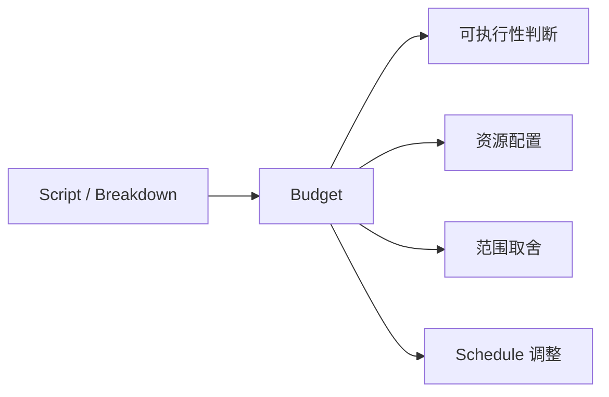
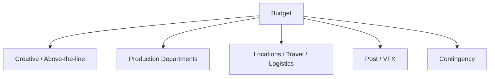
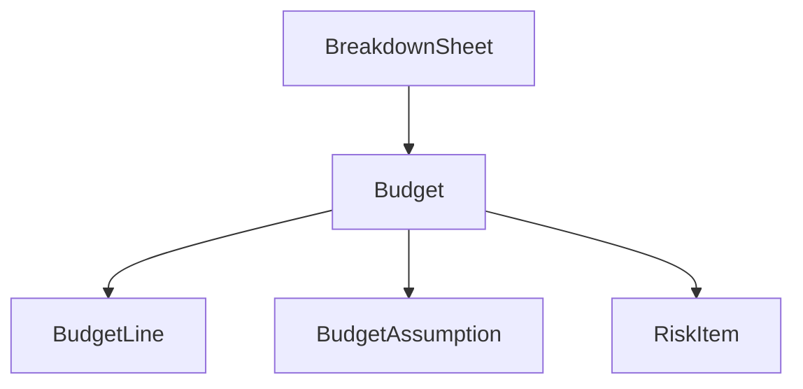
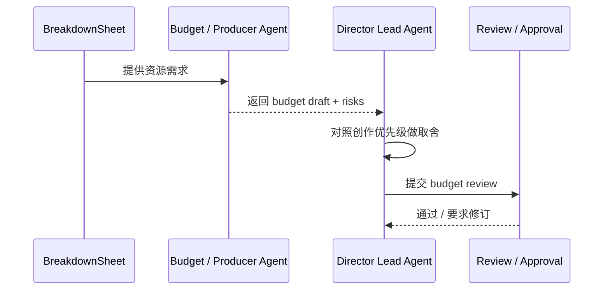
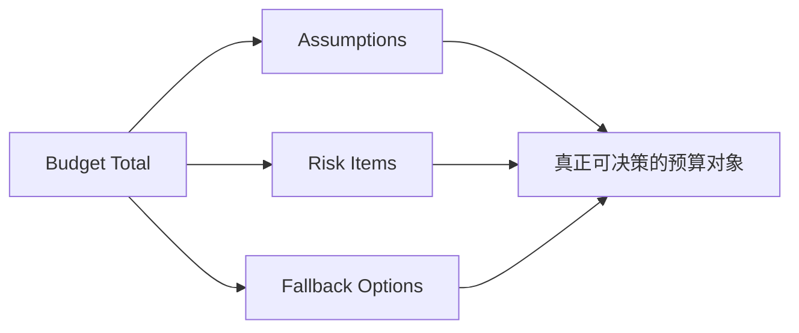

# 27. 预算与 Line Producer 视角

## 这篇文档回答什么问题

剧本和 breakdown 做完，并不代表项目就能拍。下一步必须回答的是：拍得起吗，怎么拍得起。

本篇重点回答：

1. 传统电影预算在前期制作中的真实作用。
2. Line Producer / 制片视角到底关心什么。
3. 在导演智能体平台里，预算应该如何从 breakdown 长出来，并进入治理链。

---

## 一、预算不是财务表，而是项目现实边界

传统电影项目里，预算不是拍完之后才算账，而是在前期就决定大量创作和执行边界。

预算真正回答的是：

- 哪些场景能保留
- 哪些资源可以上
- 哪些创作设想需要降级或换实现方式

---

## 二、Line Producer 视角和导演视角有什么不同

导演更关心表达是否成立，Line Producer 更关心表达如何在现实条件下成立。

### 导演关心

- 哪些戏不能丢
- 哪种风格最对
- 哪些镜头和场景是作品核心

### Line Producer 关心

- 资源是否足够
- 哪些戏成本异常高
- 哪些安排会导致拍摄效率大幅下降
- 哪些方案虽好但会拖垮整体项目

这两种视角不是对立，而是必须被系统化对齐。

---

## 三、预算通常从哪里长出来

预算不是凭空估的，而是沿着下面这条链生成：

这意味着，预算永远依赖：

- 剧本版本
- breakdown 准确度
- 部门需求是否明确
- 拍摄规模假设是否清楚

---

## 四、预算的主要结构

不同制片体系会有差别，但预算通常会拆成多个部门条线，例如：

- Above-the-line
- 摄影与灯光
- 美术与搭景
- 服化道
- 演员与群演
- 交通与住宿
- 场地
- 设备
- 后期与 VFX
- 不可预见费 / contingency

---

## 五、预算在平台中的对象映射

建议把预算至少建模成：

- `Budget`
- `BudgetLine`
- `BudgetAssumption`
- `RiskItem`

### 建议字段

- `budget_id`
- `version_label`
- `script_version_id`
- `breakdown_id`
- `topline_total`
- `department_lines`
- `assumptions`
- `risks`
- `status`

---

## 六、预算工作流建议

在导演智能体平台里，预算工作流建议如下：

1. 从 breakdown 读取资源需求。
2. 由 Budget / Producer Agent 形成 budget draft。
3. 导演主智能体检查哪些创作核心受到影响。
4. 进行 review / revision。
5. 预算进入 candidate approval 或正式基线。

---

## 七、预算不只是数字，还要有假设和风险

预算如果只有数字总额，价值是很低的。真正有用的预算必须附带：

- 关键假设
- 高风险条目
- 波动来源
- 可替代方案

---

## 八、对 Hermes 的直接实现启发

在 Hermes 中，预算视角最值得优先补的能力有：

- `movie_budget_estimate`
- `Budget` artifact 文件
- assumption / risk 统一字段
- 导演主智能体对预算与创作优先级的冲突整合

这也是 Producer / Budget Agent 最适合优先实现的原因之一。

---

## 九、结论

预算在电影项目前期不是附属表格，而是把创作愿景翻译成现实边界的核心对象。

在导演智能体平台里，预算应被理解成：

- 由 breakdown 驱动的正式对象
- 附带假设和风险的决策材料
- 导演和制片共同博弈与对齐的核心节点

只有这样，预算才真正进入项目治理闭环，而不是停留在“算个大概费用”。

---

## 相关文档

- [26-script-breakdown-and-breakdown-sheet.md](./26-script-breakdown-and-breakdown-sheet.md)
- [28-scheduling-and-first-ad-view.md](./28-scheduling-and-first-ad-view.md)
- [53-producer-subagent-design.md](./53-producer-subagent-design.md)
- [56-budget-subagent-design.md](./56-budget-subagent-design.md)
- [64-budget-schedule-resource-object-system.md](./64-budget-schedule-resource-object-system.md)
