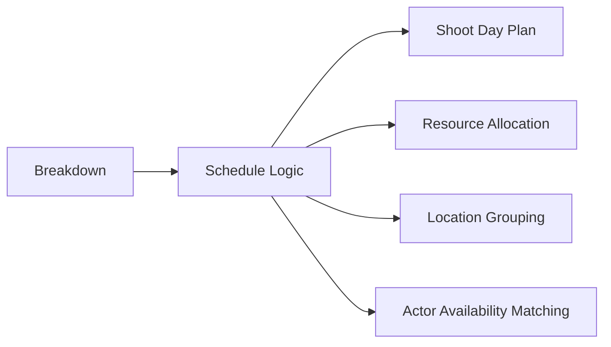
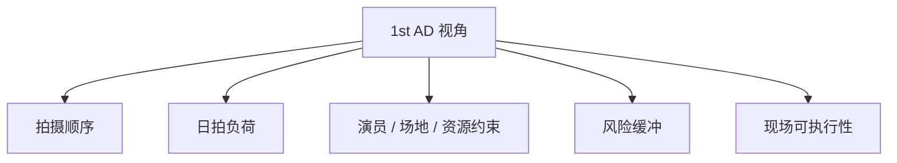
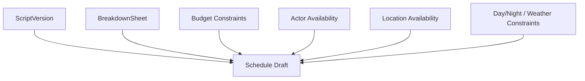
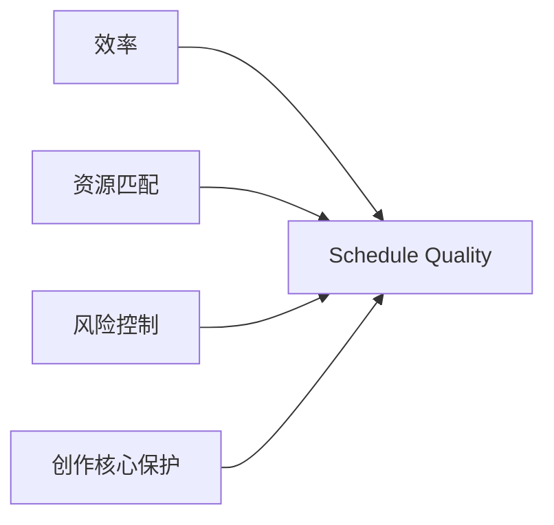
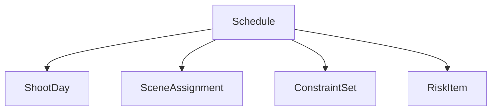
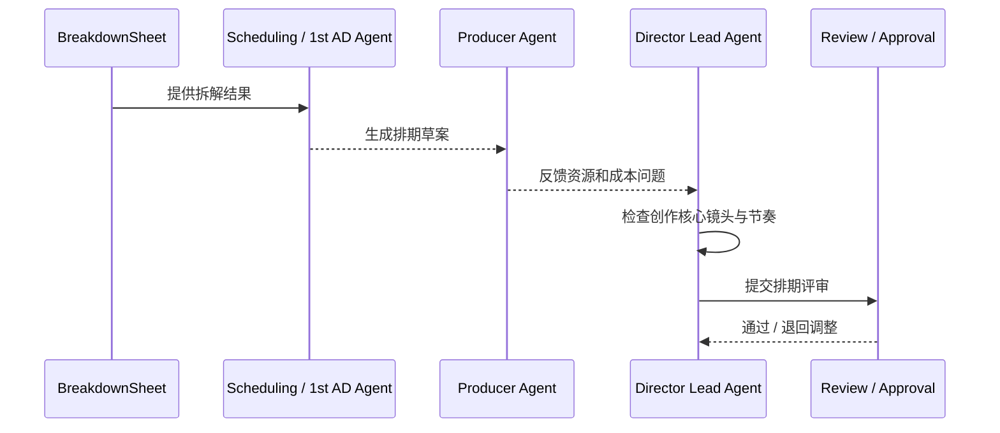
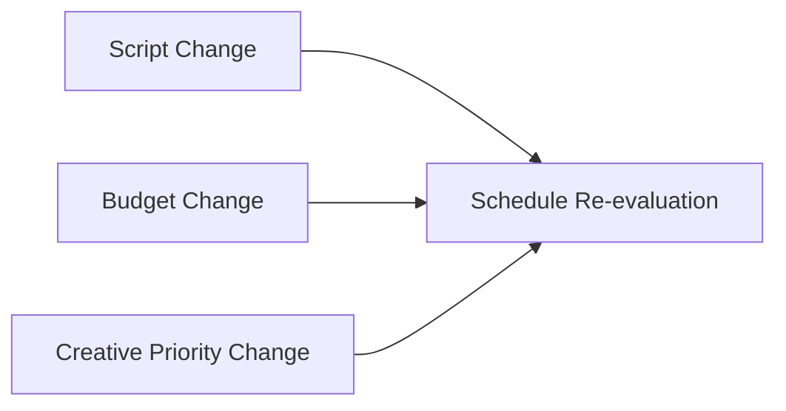
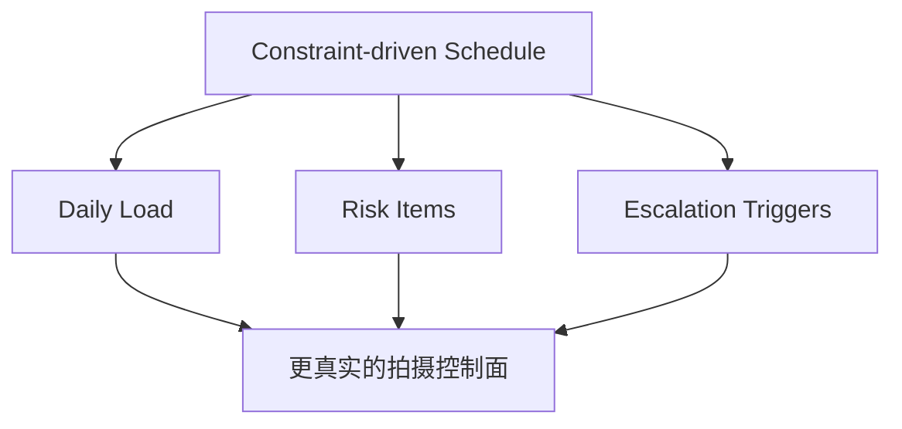

# 28. 排期与第一副导演视角

## 这篇文档回答什么问题

预算解决的是“拍不拍得起”，排期解决的是“拍不拍得成”。

本篇重点回答：

1. 排期在传统电影制作中的真实作用是什么。
2. 第一副导演视角到底在管理什么。
3. 在导演智能体平台里，schedule 应该如何成为正式对象与工作流控制器。

---

## 一、排期不是日历，而是生产组织逻辑

很多人把拍摄排期理解成把场景塞进日期，但真实世界里的排期是对资源、地点、演员、天气和执行效率的综合优化。

---

## 二、第一副导演视角关心什么

导演关心的是“怎么拍最对”，第一副导演更关心的是“怎么组织拍摄让项目不失控”。

### 第一副导演通常关心

- 每天的工作量是否现实
- 场景切换成本是否过高
- 演员和场地是否能按时到位
- 特殊戏是否需要更长准备时间
- 哪些安排会拖慢整组效率

---

## 三、排期通常从什么输入长出来

排期通常依赖：

- script version
- breakdown
- budget constraints
- actor availability
- location availability
- day/night grouping
- weather or setup constraints

---

## 四、传统排期的真实目标

优秀排期不只是“最短天数”，而是在多个目标之间取平衡：

- 尽量减少场地切换
- 尽量减少演员碎片档期浪费
- 尽量把复杂场景留给充分准备的日子
- 尽量控制 overtime 和不可预见风险

---

## 五、排期在平台中的对象映射

建议把排期至少建模成：

- `Schedule`
- `ShootDay`
- `SceneAssignment`
- `ConstraintSet`
- `RiskItem`

### 建议字段

- `schedule_id`
- `version_label`
- `breakdown_id`
- `shoot_days`
- `scene_order`
- `resource_constraints`
- `location_constraints`
- `actor_constraints`
- `status`

---

## 六、排期工作流建议

在导演智能体平台里，排期建议工作流如下：

1. 从 breakdown 读入 scene-level production facts。
2. Scheduling / 1st AD Agent 生成 schedule draft。
3. Producer Agent 检查成本和资源影响。
4. Director Lead Agent 检查创作核心是否受损。
5. 进入 review / approval。

---

## 七、为什么排期必须和预算、剧本一起看

排期单看是没有意义的，因为：

- 剧本一改，scene order 和资源需求就可能变
- 预算一紧，拍摄天数和复杂场景组织就要变
- 导演创作优先级一变，排期策略也会变

这说明 schedule 不是孤立对象，而是前期制作的核心协调对象。

---

## 八、第一副导演视角对平台设计的启发

第一副导演视角非常适合引导平台补以下能力：

- 约束驱动而不是只按理想顺序排戏
- 日拍负荷和复杂度评分
- blocked / risk items 的显式维护
- escalation 给导演和制片的判断链

---

## 九、对 Hermes 的直接实现启发

在 Hermes 中，排期视角最值得优先补的能力有：

- `movie_schedule_plan`
- `Schedule` 和 `ShootDay` 对象
- 基础 constraint schema
- Producer / Director / Scheduling 三方协同 review

这也是为什么 Scheduling / 1st AD Agent 应该成为第一批优先落地角色之一。

---

## 十、结论

排期在电影项目前期不是辅助表，而是组织现实生产秩序的核心对象。

在导演智能体平台里，它应被理解成：

- 由 breakdown 和资源约束驱动的正式对象
- 导演、制片和副导演共同协作的决策面板
- 后续 call sheet、daily plan、现场执行系统的上游基线

只有把 schedule 正式对象化，电影平台才真正接近“可执行生产系统”。

---

## 相关文档

- [26-script-breakdown-and-breakdown-sheet.md](./26-script-breakdown-and-breakdown-sheet.md)
- [27-budgeting-and-line-producer-view.md](./27-budgeting-and-line-producer-view.md)
- [38-call-sheet-and-daily-plan.md](./38-call-sheet-and-daily-plan.md)
- [57-scheduling-subagent-design.md](./57-scheduling-subagent-design.md)
- [64-budget-schedule-resource-object-system.md](./64-budget-schedule-resource-object-system.md)
