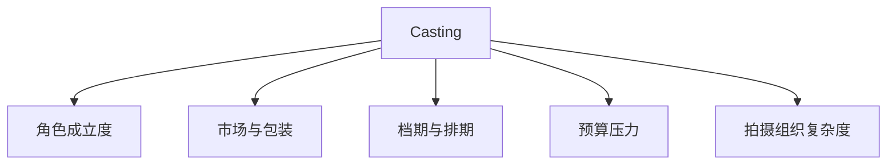
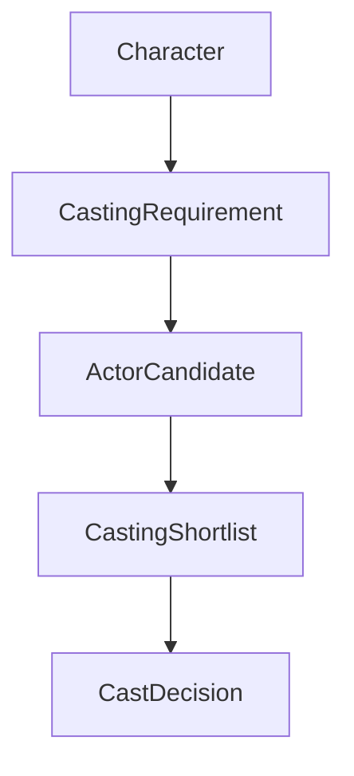
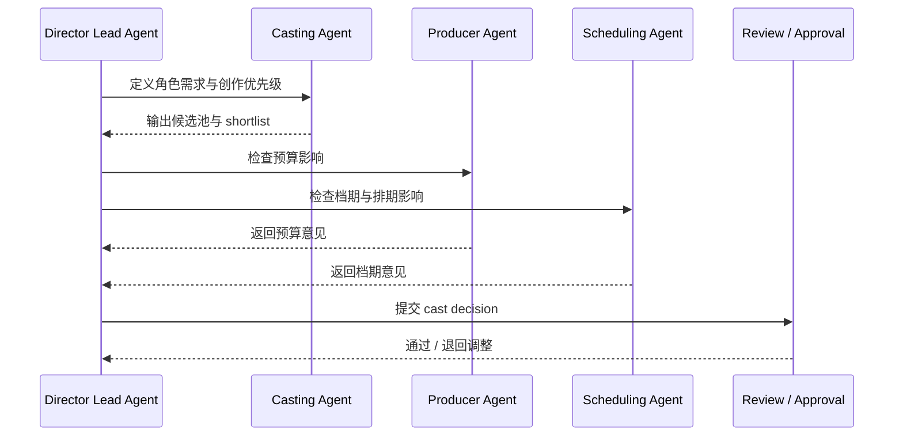
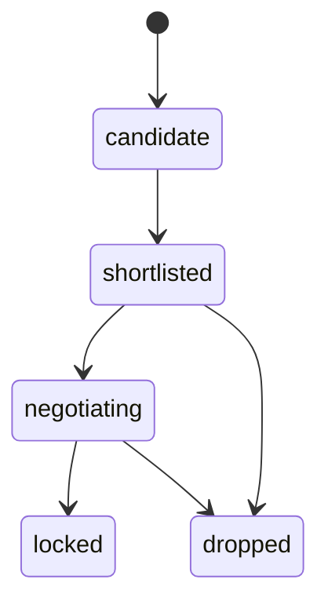
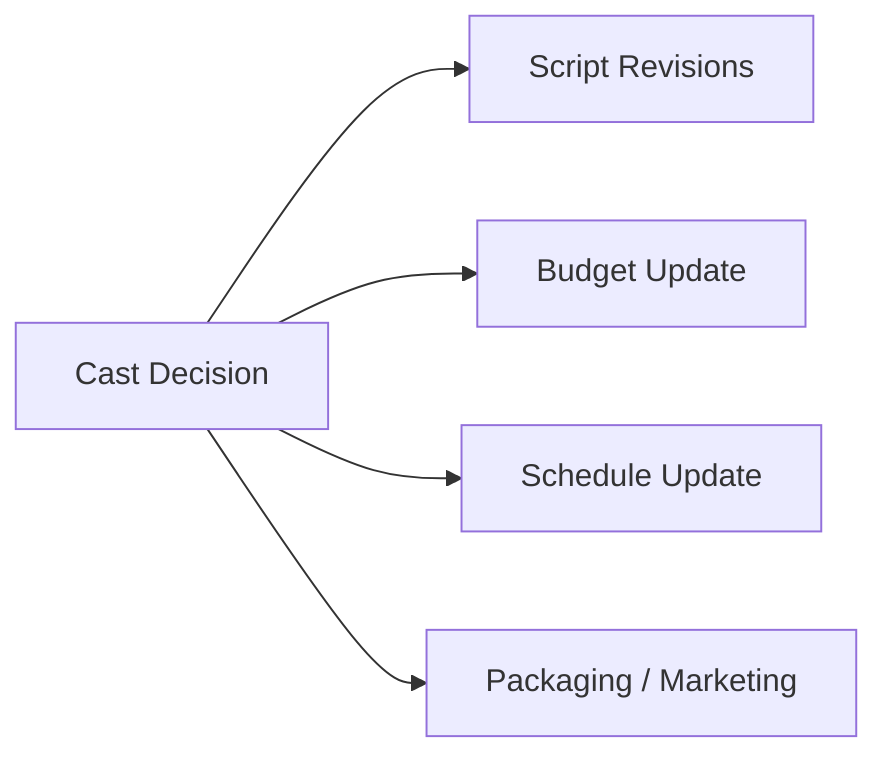

# 29. 选角与演员管理

## 这篇文档回答什么问题

前期制作走到剧本、breakdown、预算和排期之后，下一步最容易变成项目成败分水岭的，就是选角。

本篇重点回答：

1. 传统电影选角到底在解决什么问题。
2. 演员管理为什么不只是“找个合适的人”。
3. 在导演智能体平台里，casting 应该如何映射成对象、角色和工作流。

---

## 一、选角不是审美偏好，而是项目核心变量

很多项目把选角理解成创作偏好问题，但现实里，选角同时影响：

- 角色成立度
- 市场预期
- 档期可行性
- 预算结构
- 拍摄组织复杂度

这意味着 casting 不是孤立决策，而是创作与生产同时耦合的前期核心对象。

---

## 二、传统选角流程通常怎么走

传统电影项目里的选角通常会经过多个阶段：

不同规模的项目复杂度不同，但核心逻辑类似：

- 先定义角色需求
- 再筛候选
- 再结合实际条件收敛

---

## 三、传统选角真正的难点

### 1. 角色匹配不只是外形或表演能力

还包括：

- 角色年龄与气质
- 角色关系化学反应
- 影片整体风格是否匹配

### 2. 演员管理是动态约束问题

演员一旦进入 shortlist，就会牵扯：

- 档期
- 预算
- 合约
- 宣发价值
- 与其他演员搭配的兼容性

### 3. 选角会反向影响剧本和排期

有时为了匹配演员现实条件，剧本、拍摄顺序和人物设置都要调整。

---

## 四、Casting 在平台中的对象映射

建议将选角至少建模成以下对象：

- `Character`
- `CastingRequirement`
- `ActorCandidate`
- `CastingShortlist`
- `CastDecision`

### 建议字段

#### `CastingRequirement`

- `character_id`
- `age_range`
- `temperament`
- `performance_requirements`
- `market_expectation`
- `availability_constraints`

#### `ActorCandidate`

- `candidate_id`
- `name`
- `fit_summary`
- `schedule_constraints`
- `budget_band`
- `chemistry_notes`

---

## 五、平台里的 casting 工作流建议

选角工作流不应只是“罗列候选名单”，而应是一条正式决策链。

---

## 六、演员管理为什么要进入状态系统

一旦演员进入 shortlist 或锁定状态，平台就应该显式维护：

- 当前候选状态
- 档期风险
- 预算风险
- 是否已锁定
- 是否影响拍摄顺序

这说明 casting 不是一次性文档，而是动态状态对象。

---

## 七、Casting 对前期其他链路的影响

选角会直接影响：

- 剧本改写
- 预算
- 排期
- 市场策略

---

## 八、对导演智能体平台和 Hermes 的启发

在导演智能体平台里，casting 角色最适合做成：

- 高专业度但强依赖结构化输入的子智能体
- 与 budget / schedule 强耦合的评审对象

对 Hermes 来说，最值得优先补的能力包括：

- `CastingRequirement` / `ActorCandidate` 对象
- casting shortlist artifact
- 与 schedule / budget 的联动 review
- cast 锁定状态

---

## 九、结论

选角在电影前期不是附属流程，而是创作、预算、排期和市场预期的交汇点。

在导演智能体平台里，它应被理解成：

- 一个正式对象链
- 一个状态驱动决策过程
- 一个需要跨角色协同 review 的核心节点

只有这样，casting 才能真正进入项目控制面，而不只是停留在“候选人列表”。

---

## 相关文档

- [30-location-scouting-and-lock.md](./30-location-scouting-and-lock.md)
- [31-art-costume-props-collaboration.md](./31-art-costume-props-collaboration.md)
- [58-casting-subagent-design.md](./58-casting-subagent-design.md)
- [63-script-scene-character-object-system.md](./63-script-scene-character-object-system.md)
- [64-budget-schedule-resource-object-system.md](./64-budget-schedule-resource-object-system.md)
