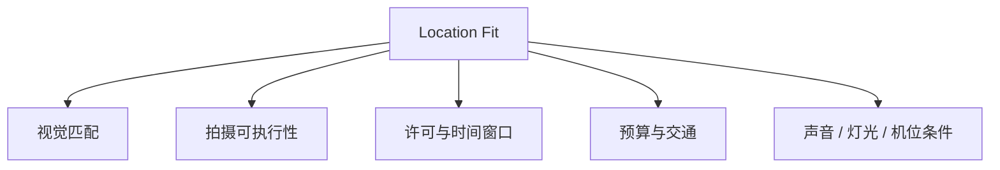
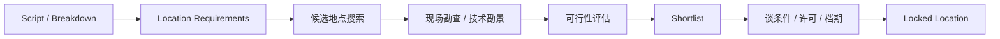
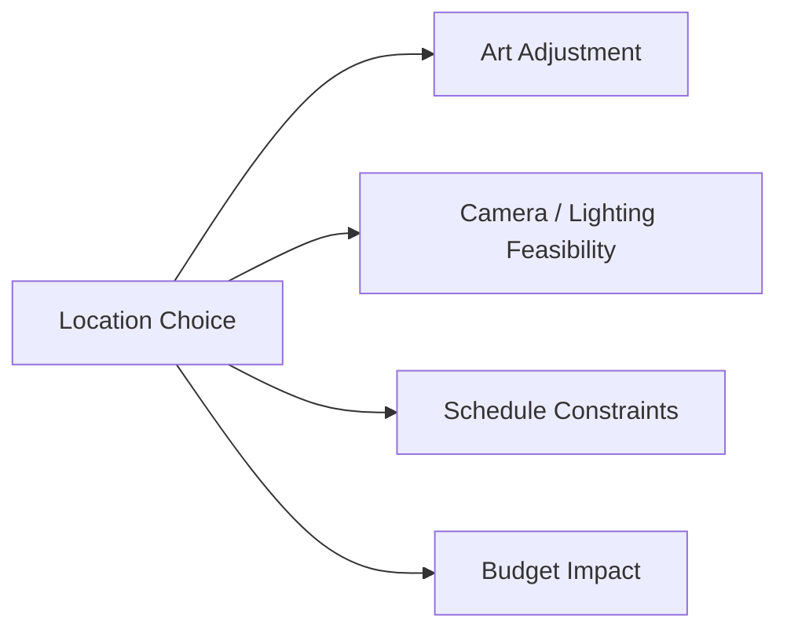
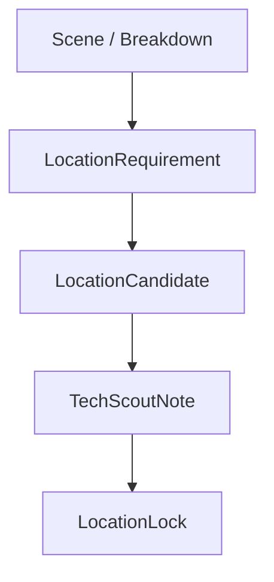
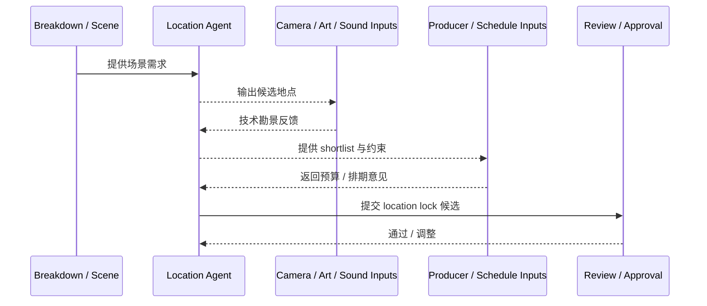
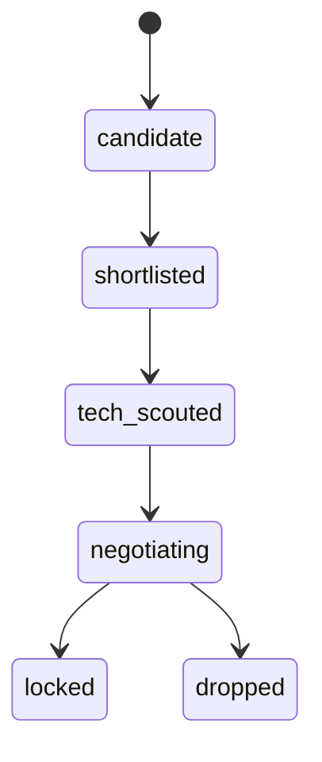
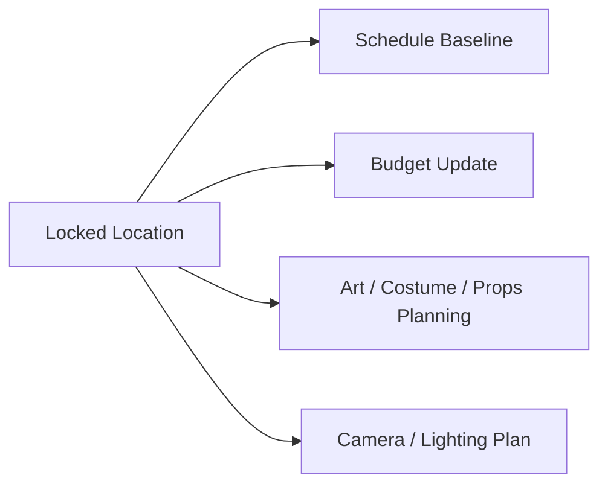

# 30. 勘景与场地锁定

## 这篇文档回答什么问题

前期制作里，location 往往是最容易被低估、但又最容易把预算、排期和美术方案全部拖偏的变量之一。

本篇重点回答：

1. 传统勘景在电影制作中到底承担什么作用。
2. 为什么“找到场地”和“锁定场地”是两件不同的事。
3. 在导演智能体平台里，location 应如何成为正式对象与审批节点。

---

## 一、勘景不是找漂亮地方，而是找可执行空间

在现实中，一个场地是否合适，不只看视觉风格，还要看：

- 是否符合剧本和导演意图
- 是否能容纳机位、灯光、声音、调度
- 是否允许拍摄时间和拍摄方式
- 是否影响预算和交通组织

---

## 二、传统勘景流程通常怎么走

可以看到，锁定场地远不只是找到一个视觉上相近的地方。

---

## 三、传统勘景的核心难点

### 1. 文本空间和真实空间之间往往有落差

剧本里的“旧厂房”“小巷”“高档餐厅”，并不意味着现实里能轻易找到符合需求的空间。

### 2. 场地适配是多部门问题

- 导演看表达
- 摄影看机位和光线
- 美术看改造空间
- 声音看环境噪音
- 制片看成本和许可

### 3. 场地锁定会反向影响预算和排期

一个场地一旦难进、难控或交通成本高，排期和预算都会被改变。

---

## 四、Location 在平台中的对象映射

建议至少建模以下对象：

- `LocationRequirement`
- `LocationCandidate`
- `TechScoutNote`
- `LocationLock`

### 建议字段

#### `LocationRequirement`

- `scene_ids`
- `visual_requirements`
- `logistics_requirements`
- `sound_constraints`
- `lighting_constraints`
- `access_constraints`

#### `LocationCandidate`

- `candidate_id`
- `fit_summary`
- `cost_estimate`
- `availability`
- `permit_risk`
- `travel_impact`

---

## 五、平台里的 location 工作流建议

这比“简单列几个地点供挑选”更接近真实项目流程。

---

## 六、场地锁定为什么必须是正式状态

在现实里，很多项目卡在“以为确定了，但其实没锁”。

因此平台里必须区分：

- candidate
- shortlisted
- tech_scouted
- negotiating
- locked

只有进入 locked，后续 schedule、art、camera、transport 才能把它视为正式基线。

---

## 七、Location 对前期其他系统的影响

这说明勘景和场地锁定不是局部流程，而是整个前期协作面的一部分。

---

## 八、对导演智能体平台和 Hermes 的启发

对平台而言，location 最重要的不是“搜索能力”，而是“正式锁定和多部门评审能力”。

对 Hermes 而言，优先可补的能力包括：

- `LocationRequirement` / `LocationCandidate` 对象
- tech scout notes artifact
- location lock 审批状态
- 与 budget / schedule / camera / art 的联动更新

---

## 九、结论

勘景与场地锁定，是前期制作中把剧本空间翻译成真实拍摄空间的关键链路。

在导演智能体平台里，它应被理解成：

- 一个多部门协同决策过程
- 一个正式状态对象链
- 一个会直接影响预算、排期、美术和摄影策略的上游变量

只有把 location 正式对象化和锁定化，前期制作系统才真正具备现实执行基础。

---

## 相关文档

- [28-scheduling-and-first-ad-view.md](./28-scheduling-and-first-ad-view.md)
- [29-casting-and-actor-management.md](./29-casting-and-actor-management.md)
- [31-art-costume-props-collaboration.md](./31-art-costume-props-collaboration.md)
- [59-location-subagent-design.md](./59-location-subagent-design.md)
- [64-budget-schedule-resource-object-system.md](./64-budget-schedule-resource-object-system.md)
