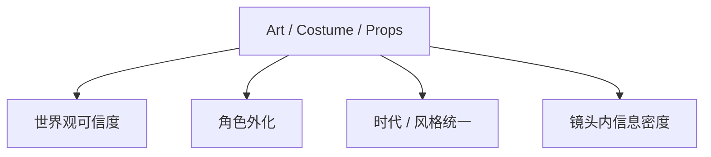
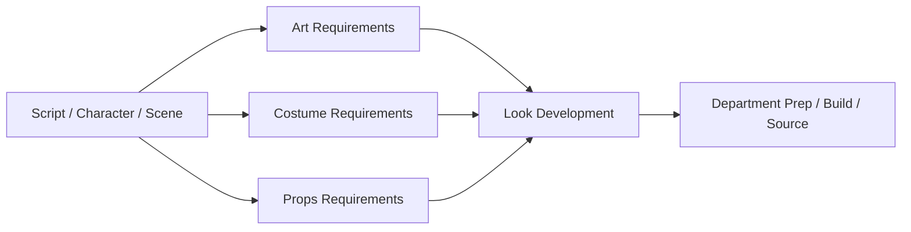
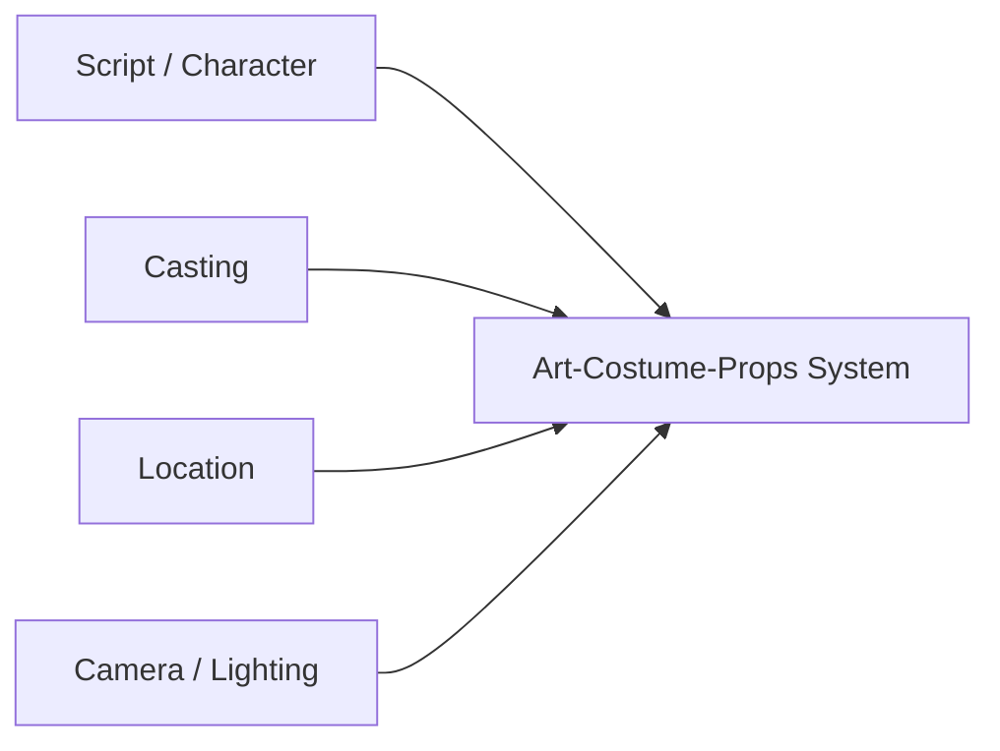
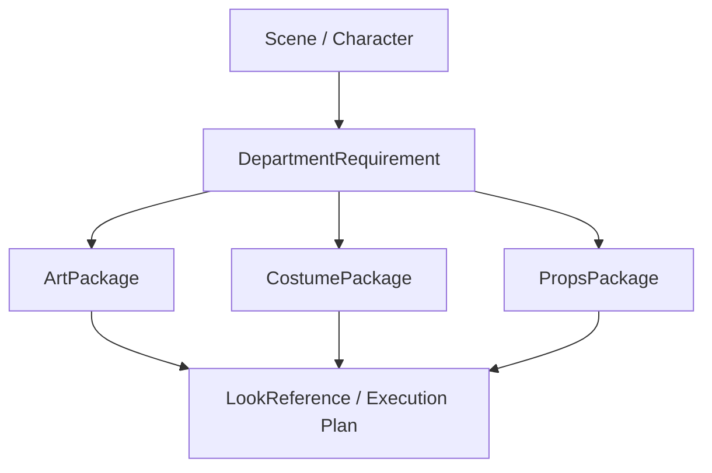
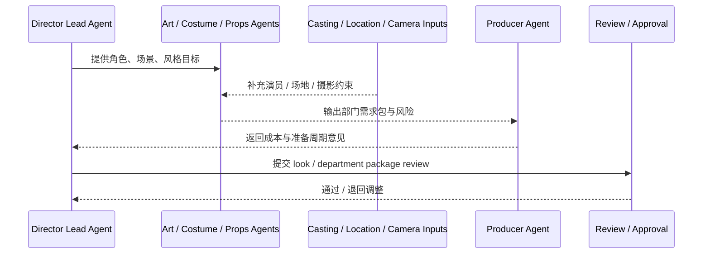
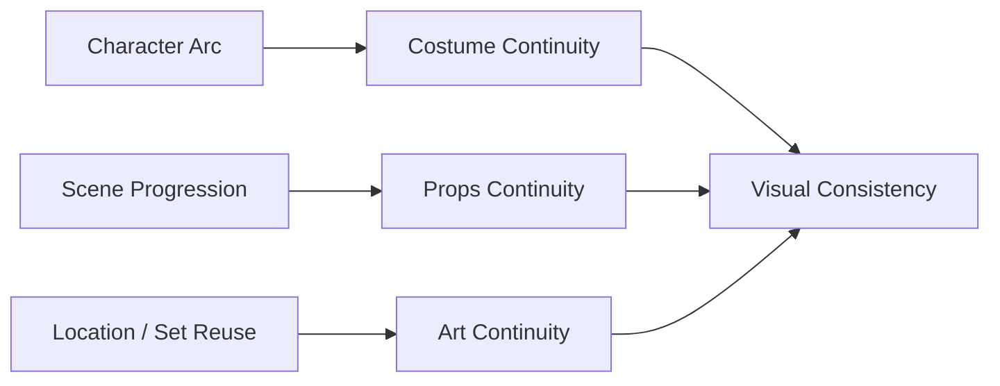
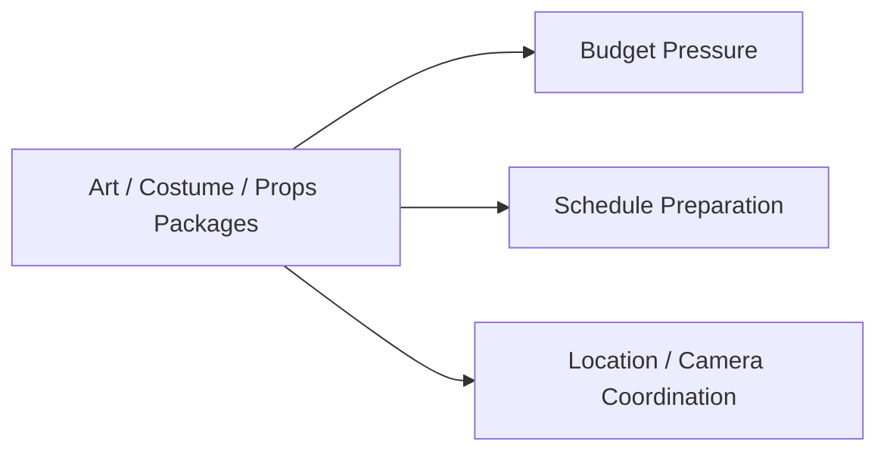

# 31. 美术、服装、道具协同

## 这篇文档回答什么问题

电影前期一旦进入执行组织阶段，最容易变成“碎任务堆”的，就是美术、服装、道具这几个部门。

本篇重点回答：

1. 为什么 art / costume / props 在传统电影项目里必须协同，而不能分开看。
2. 它们和剧本、场地、摄影、演员之间是怎样耦合的。
3. 在导演智能体平台里，这组部门应该如何对象化和协同化。

---

## 一、这不是三个孤立部门，而是一组共同塑造画面现实的系统

美术、服装、道具共同决定观众看到的“画面世界是否可信且统一”。

因此它们更适合被看作一个协同面，而不是三个分散表格。

---

## 二、传统协同链是怎样的

这条链说明：

- 剧本和角色是上游
- 风格统一是中游
- 实际制作准备是下游

---

## 三、为什么这组协同特别容易出问题

### 1. 各自看起来是局部最优，合起来却可能不统一

例如：

- 服装很好看，但和场景色调冲突
- 道具准确，但和人物身份不匹配
- 美术设计成立，但超出预算或搭景周期

### 2. 它们高度依赖剧本、演员和场地

- 场景换了，布景方案可能要变
- 演员定了，服装剪裁和角色外化会变
- 摄影方案变了，道具和材质选择也可能要变

---

## 四、平台中的对象映射建议

建议至少建模以下对象：

- `ArtPackage`
- `CostumePackage`
- `PropsPackage`
- `LookReference`
- `DepartmentRequirement`

### 建议字段

#### `DepartmentRequirement`

- `scene_ids`
- `character_ids`
- `style_notes`
- `continuity_notes`
- `budget_sensitivity`

#### `ArtPackage / CostumePackage / PropsPackage`

- `version`
- `scope`
- `reference_images_or_notes`
- `build_or_source_status`
- `open_risks`

---

## 五、平台里的协同工作流建议

---

## 六、为什么这组协同必须和 continuity 绑定

美术、服装、道具不只是设计一次，还必须维护持续一致性。

如果没有 continuity 视角，后续拍摄和后期会出现大量返工。

---

## 七、与预算和排期的关系

这几个部门的方案一旦定下来，会直接影响：

- build / sourcing 周期
- 特定物件或服装的制作成本
- 是否需要提前进场搭建
- 是否影响拍摄顺序

---

## 八、对导演智能体平台和 Hermes 的启发

对平台来说，这组部门最值得建模的不是“生成好看的图”，而是：

- 需求包
- 风格统一
- continuity
- 预算和准备周期风险

对 Hermes 来说，优先可补的能力包括：

- `ArtPackage` / `CostumePackage` / `PropsPackage`
- look reference 与 requirement artifact
- 与 casting / location / camera 的联动 review

---

## 九、结论

美术、服装、道具在电影前期不是平行的小任务，而是一组共同塑造世界观、角色外化和视觉统一性的协同系统。

在导演智能体平台里，它们应被理解成：

- 与 scene / character 强绑定的对象群
- 与 casting、location、camera 强耦合的跨部门协同面
- 需要 continuity 和风险管理的正式准备链

只有把这组部门看成协同系统，而不是零散任务，平台才会真正接近真实电影前期组织。

---

## 相关文档

- [29-casting-and-actor-management.md](./29-casting-and-actor-management.md)
- [30-location-scouting-and-lock.md](./30-location-scouting-and-lock.md)
- [32-cinematography-lighting-vfx-preproduction.md](./32-cinematography-lighting-vfx-preproduction.md)
- [35-style-reference-analysis-and-unification.md](./35-style-reference-analysis-and-unification.md)
- [65-shotplan-storyboard-promptpack-object-system.md](./65-shotplan-storyboard-promptpack-object-system.md)
